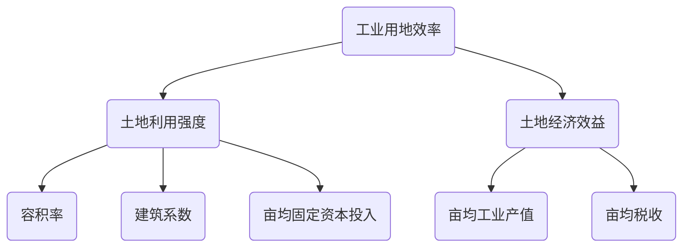

```markdown
1 # 01、注释
  2 
  3 - 通用写法、使用HTML注释
  4 ```html
  5 <!-- HTML的注释 -->
  6 ```
  7 <!-- 这是HTML注释，看不见吧 -->
  8 
  9 ---
 10 
 11 # 02、标题
 12 
 13 # 级别1
 14 ## 级别2
 15 ### 级别3
 16 #### 级别4
 17 ##### 级别5
 18 ###### 级别6
 19 
 20 ---
 21 
 22 # 03、引用
 23 
 24 > 常常用来引用其他的资料
 25 
 26 > 曹植.《洛神赋》
 27 > 彷佛兮若轻云之蔽月，飘飘兮若流风之回雪
 28 ---
 29 
 30 # 04、粗体斜体
 31 
 32 *这会是 斜体 的文字*
 33 _这会是 斜体 的文字_
 34 
 35 **这会是 粗体 的文字**
 36 __这会是 粗体 的文字__
 37 
 38 _可以 **组合** 使用粗体 和 斜体符号_
 39 
 40 ~~文字将会被横线删除~~
 41 
 42 ---
 43 
 44 # 05、列表
 45 
 46 ## 1、无序列表
 47 * 安徽省
 48     * 合肥市
 49     * 铜陵市
 50     * 淮南市
 51 - 江苏省
 52     + 南京市
 53     + 苏州市
 54 
 55 ## 2、有序列表
 56 1. 浙江省
 57     1.1. 杭州市
 58     1.2. 宁波市
 59 2. 湖北省
 60     2.1. 武汉市
 61     2.2. 荆州市
 62 
 63 ---
 64 
 65 # 06、分隔线
 66 
 67 ***
 68 ___
 69 ---
 70 
 71 # 07、代码块
 72 
 73 ```java
 74 class Person {
 75     public void static main() {
 76         System.out.println("小前端也会服务端编程");
 77     }
 78 }
 79 ```
 80 
 81 <!-- highlight   语法高亮 -->
 82 ```javascript{highlight=2-6}
 83 var programmer = {
 84     name : '尤JJ',
 85     gender : '女',
 86     work: function() {
 87         console.log('废寝忘食');
 88     }
 89 }
 90 ```
 91 
 92 ---
 93 
 94 # 08、链接
 95 
 96 [百度](https://www.baidu.com)
 97 
 98 ---
 99 
100 # 09、任务列表
101 
102 - [x] 吃饭
103 - [ ] 睡觉
104 - [x] 搬砖
105 
106 ---
107 
108 # 10、表格
109 
110 <!--
111     :---:   居中
112     :-----  居左
113     ------: 居右
114 -->
115 |序号   |姓名   |性别   |薪资   |
116 |:---:|:-----|:---:|------:|
117 |1      |武JC   |男     |987.65|
118 |2      |尤JJ   |女     |123.45|
119 
120 ---
```

**Markdown中也可以绘制图表，以绘制流程图 和 序列图为例**

```
# 01、绘制流程图
```

<!-- 基于flowchart.js绘制 -->

~~~flow
```flow
start=>start: 项目启动
end=>end: 项目结束
opt1=>operation: 需求分析
condition=>condition: 需求评审
opt3=>operation: 编码实现

start->opt1(right)->condition
condition(yes,right)->opt3
condition(no)->end
opt3->end
```
~~~

```sequence
title: 日常交流
Boy->Girl: 钥匙、伞、早饭
Note right of Girl: 心烦意乱...
Girl-->Boy: 不关你事儿
Boy->>Girl: 别久坐，多喝水
```

```php
代码段
```

https://segmentfault.com/a/1190000006247465

https://zhuanlan.zhihu.com/p/28468233


\```mermaid 

graph TD A(工业用地效率)-->B1(土地利用强度) A-->B2(土地经济效益) B1-->C1(容积率) B1-->C2(建筑系数) B1-->C3(亩均固定资本投入) B2-->D1(亩均工业产值) B2-->D2(亩均税收) 




###### [Draw Diagrams With Markdown](https://support.typora.io/Draw-Diagrams-With-Markdown/)

