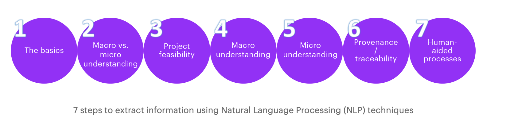

4 components

- Any ner methods 

- ner disease chemical

- gender bias and nlp general 

- gender bias and any ner bias method

- embedding* 

  
  
  
  
   
  
  

- Excel paper — relationship 
- group paper 
  - 30 references 

- spreadsheet nmbers 
- 500

https://github.com/flairNLP/flair/tree/master/resources/docs

http://alanakbik.github.io

0. Only word embedding 
1. We want to train directly on the CDR dataset using a LSTM with just pre-trained **pubmed embedddings** (no pretraining on a different dataset).
2. **Train/test** the same model on other **chemical datasets**: **CDR**, CEMP, CHEBI, CHEMDNER, CRAFT, CRAFT_V4, etc (edited) 
3. Test other models (LSTM + pubmed embeddings + flair mebeddings), (LSTM + pubmed + transformer/BERT embeddings).
4. Test both strict and "partial" **evaluation**
5. Record performance of models on each dataset

https://huggingface.co/transformers/pretrained_models.html

I'm thinking about something after we finish our initial results, but we may want to add something else to strengthen the paper in terms of results. Specifically, our dataset relies on templates (or "fake data") to measure bias. I think this is a great set of experiments. But, some reviewers may want more. So, I have been thinking how can we measure bias on real social data without predicting gender (which is sometimes ethically problematic)? I think the answer is to use self reports on reddit! **fixed typos** (edited) 

I found this subreddit: https://www.reddit.com/r/AskDocs/

**[Medical Questions • r/AskDocs](https://www.reddit.com/r/AskDocs/)**

Having a medical issue? Ask a doctor or medical professional on Reddit! All flaired medical professionals on this subreddit are verified by the...

People self disclose gender, e.g., "I [32M] have been taking Tylenol for....". After finishing our current experiments, we can try to manually annotate a subset of the data for evaluation. Here is a perfect example with chemicals "melatonin supplements" and "NyQuil" in the text: https://www.reddit.com/r/AskDocs/comments/l0i68g/is_it_okay_for_me_29f_to_take_melatonin/ (edited) 

**[Is it okay for me [29F\] to take melatonin supplements every night?](https://www.reddit.com/r/AskDocs/comments/l0i68g/is_it_okay_for_me_29f_to_take_melatonin/)**

Is it okay to take melatonin supplements every night? Maybe a weird question. My husband and I have an awful sleep schedule due to him working...

**We can discuss next week.**

https://www.analyticsvidhya.com/blog/2019/02/flair-nlp-library-python/

insheet using /Users/hxwh/Downloads/bf3c1597972bdf41.csv

sum _all

correlate at sale xt dltt ni cshr fatb xopr xad rdip

gen roa = ni/at

 gen advertising_intensity = XAD/SALE

Charles Wu is also a good source with UTSA Libraries

sum at sale xt dltt ni cshr fatb xopr xad rdip

  : total assets; total sales; total expenses; long-term debt; net income; total sales; total shareholder equity; property plant and equipment (PP&E); and total operating expenses. Try to obtain advertising expenses and R&D expenses.  

The idea is could we "**read**" the papers using NLP methods and **fill out the data statement information in the form** above from papers that release new datasets: (edited) 

e.g.,:

https://www.aclweb.org/anthology/2020.lrec-1.180.pdf

https://www.aclweb.org/anthology/2020.lrec-1.181.pdf

https://www.aclweb.org/anthology/2020.lrec-1.186.pdf

Then, the information could be listed in an easy-to-find fashion on a website.

##### Simple Mathematical Word Problems Solving with Deep Learning

https://web.stanford.edu/class/archive/cs/cs224n/cs224n.1194/reports/custom/15843468.pdf

People use their knowledge to solve extensive mathematical problem every day in real life. Mathematical problems are often **stated in words in different scenarios**, thus requiring problem solvers to **extract information** from the text and **formulate in mathematical language** to get the problem’s answer. We delved into simple algebra math problems and experimented with different deep learning model including bidirectional GRU seq2seq models and its variants, as well as Transformer. Experiments show that transformer outputs the baseline RNN model in this task, for its ability to set up valid equations coherent to the mathematical logics

I am interested in probebility problems

Challenge: semantic gap between the mathematical expressions and language logic

Our works involves the four main steps. 

First, we preprocess our datasets. 

Second, three different models are built, including a bidirectional LSTM (encoder)-LSTM (decoder) attention (i.e. BiLLAtt) model, a bidirectional GRU (encoder)-LSTM (decoder) attention (i.e. BiGLAtt) model, and a transformer model. 

Third, we tune some hyperparameters. 

Last, we carried out qualitative analysis of our generated outputs to study the behavior of our model.

Baseline

https://link.springer.com/chapter/10.1007/978-981-15-0936-0_46

#### The Gap of Semantic Parsing: A Survey on Automatic Math Word Problem Solvers

https://arxiv.org/pdf/1808.07290.pdf

##### Biomedical Natural Language Processing Workshop (BioNLP)

https://www.aclweb.org/anthology/venues/bionlp/

#### How Search Engines like Google Retrieve Results: Introduction to Information Extraction using Python and spaCy

https://www.analyticsvidhya.com/blog/2019/09/introduction-information-extraction-python-spacy/

https://www.accenture.com/us-en/blogs/search-and-content-analytics-blog/natural-language-processing-techniques	

