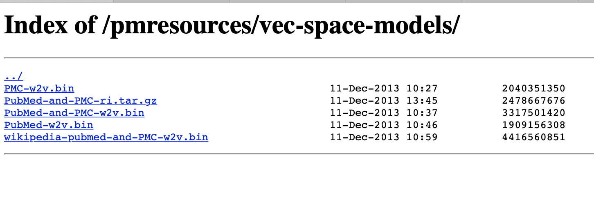
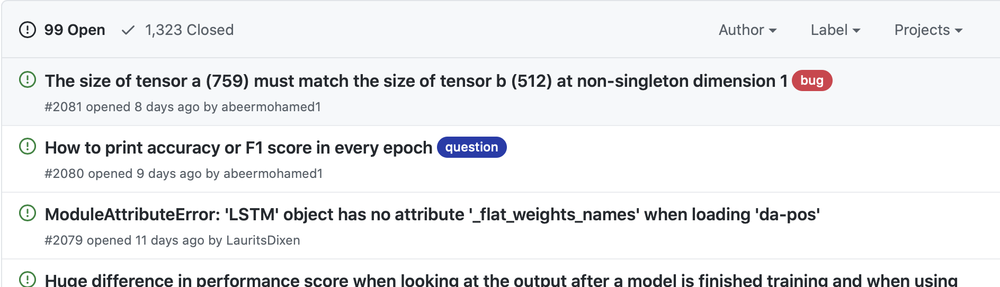
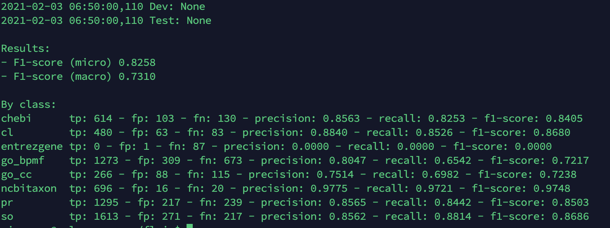

```python
#check gpu usage
nvidia-smi
# run only word embedding
# save cdr_only_wd_em
CUDA_VISIBLE_DEVICES=0 python model_only_word_ebd.py
CUDA_VISIBLE_DEVICES=2 python model_flair_pubmed.py
CUDA_VISIBLE_DEVICES=1 python model_bert.py
CUDA_VISIBLE_DEVICES=0 python model_only_bert.py
CUDA_VISIBLE_DEVICES=0 python

#evaluation
CUDA_VISIBLE_DEVICES=1 python model_evaluation_bert.py
CUDA_VISIBLE_DEVICES=1 python model_evaluation_flair.py
CUDA_VISIBLE_DEVICES=2 python model_evaluation_word.py
CUDA_VISIBLE_DEVICES=2 python model_evaluation_only_bert.py

#prdiction
CUDA_VISIBLE_DEVICES=2 python model_word_prediction_ch.py
CUDA_VISIBLE_DEVICES=2 python
```

```python
#prediction 
CUDA_VISIBLE_DEVICES=0 nohup python model_word_prediction_ch.py > word_chemical_prediction_name_2010.out 2>&1
CUDA_VISIBLE_DEVICES=0 nohup python model_word_prediction_ch.py > word_chemical_prediction_name_1880.out 2>&1
CUDA_VISIBLE_DEVICES=0 nohup python model_word_prediction_ch.py > word_chemical_prediction_name_1890.out 2>&1
CUDA_VISIBLE_DEVICES=1 nohup python model_word_prediction_ch.py > word_chemical_prediction_name_1900.out 2>&1
CUDA_VISIBLE_DEVICES=1 nohup python model_word_prediction_ch.py > word_chemical_prediction_name_1910.out 2>&1
CUDA_VISIBLE_DEVICES=1 nohup python model_word_prediction_ch.py > word_chemical_prediction_name_1920.out 2>&1
CUDA_VISIBLE_DEVICES=2 nohup python model_word_prediction_ch.py > word_chemical_prediction_name_1930.out 2>&1
CUDA_VISIBLE_DEVICES=2 nohup python model_word_prediction_ch.py > word_chemical_prediction_name_1940.out 2>&1
CUDA_VISIBLE_DEVICES=2 nohup python model_word_prediction_ch.py > word_chemical_prediction_name_1950.out 2>&1
CUDA_VISIBLE_DEVICES=3 nohup python model_word_prediction_ch.py > word_chemical_prediction_name_1960.out 2>&1
CUDA_VISIBLE_DEVICES=3 nohup python model_word_prediction_ch.py > word_chemical_prediction_name_1970.out 2>&1
CUDA_VISIBLE_DEVICES=3 nohup python model_word_prediction_ch.py > word_chemical_prediction_name_1980.out 2>&1
CUDA_VISIBLE_DEVICES=0 nohup python model_word_prediction_ch.py > word_chemical_prediction_name_1990.out 2>&1
CUDA_VISIBLE_DEVICES=0 nohup python model_word_prediction_ch.py > word_chemical_prediction_name_2000.out 2>&1


```

```python
#prediction 

CUDA_VISIBLE_DEVICES=0 nohup python model_bert_prediction_ch.py > bert_chemical_prediction_name_1880.out 2>&1
CUDA_VISIBLE_DEVICES=0 nohup python model_bert_prediction_ch.py > bert_chemical_prediction_name_1890.out 2>&1
CUDA_VISIBLE_DEVICES=1 nohup python model_bert_prediction_ch.py > bert_chemical_prediction_name_1900.out 2>&1
CUDA_VISIBLE_DEVICES=1 nohup python model_bert_prediction_ch.py > bert_chemical_prediction_name_1910.out 2>&1
CUDA_VISIBLE_DEVICES=1 nohup python model_bert_prediction_ch.py > bert_chemical_prediction_name_1920.out 2>&1
CUDA_VISIBLE_DEVICES=2 nohup python model_bert_prediction_ch.py > bert_chemical_prediction_name_1930.out 2>&1
CUDA_VISIBLE_DEVICES=2 nohup python model_bert_prediction_ch.py > bert_chemical_prediction_name_1940.out 2>&1
CUDA_VISIBLE_DEVICES=2 nohup python model_bert_prediction_ch.py > bert_chemical_prediction_name_1950.out 2>&1
CUDA_VISIBLE_DEVICES=3 nohup python model_bert_prediction_ch.py > bert_chemical_prediction_name_1960.out 2>&1
CUDA_VISIBLE_DEVICES=3 nohup python model_bert_prediction_ch.py > bert_chemical_prediction_name_1970.out 2>&1
CUDA_VISIBLE_DEVICES=3 nohup python model_bert_prediction_ch.py > bert_chemical_prediction_name_1980.out 2>&1
CUDA_VISIBLE_DEVICES=0 nohup python model_bert_prediction_ch.py > bert_chemical_prediction_name_1990.out 2>&1
CUDA_VISIBLE_DEVICES=0 nohup python model_bert_prediction_ch.py > bert_chemical_prediction_name_2000.out 2>&1
CUDA_VISIBLE_DEVICES=1 nohup python model_bert_prediction_ch.py > bert_chemical_prediction_name_2010.out 2>&1


```


```python
# **Train/test** the same model on other **chemical datasets**: **CDR**, CEMP, CHEBI, CHEMDNER, CRAFT, CRAFT_V4, etc (edited) 

CUDA_VISIBLE_DEVICES=2 python model_CEMP_word.py #trian
CUDA_VISIBLE_DEVICES=2 python model_evaluation_CEMP_word.py #test
CUDA_VISIBLE_DEVICES=3 python model_CHEBI_word.py #????


```


### How can I evaluate the best-model or final-model using model.evaluate()

https://github.com/flairNLP/flair/issues/1105


# Object-oriented programming

https://www.py4e.com/html3/14-objects


我的问题启动慢


https://pubmed.ncbi.nlm.nih.gov/?term=lung+cancer


We observed that the pre-trained scispaCy model (*en_ner_bc5cdr_md*) [8] was trained on BC5CDR [11]corpus for recognizing two entities (Disease and Chemical) that overlap with our custom four entities. The BC5CDR corpus consists of 1500 PubMed articles with 4409 annotated chemicals, 5818 diseases and 3116 chemical-disease interactions [20].

As the model was already trained on medical data, we used it as a base model and applied transfer learning and retrained it using our in-house annotated data. Similar to the blank models, we trained 5 models (for 100 iterations with dropout rate=0.2) while increasing the training data from 50% to 100% of the available training data. The performance of the trained models was evaluated on the standard test data.


BioBERT: a pre-trained biomedical language representation model for biomedical text mining


**3.3. EXPERIMENTS**


**Index of /pmresources/vec-space-models/**



http://evexdb.org/pmresources/vec-space-models/


#### **Multilingual Twitter Corpus and Baselines for Evaluating Demographic Bias in Hate Speech Recognition**

https://www.aclweb.org/anthology/2020.lrec-1.180.pdf

Compared with gender bias 




https://github.com.cnpmjs.org/flairNLP/flair/issues


#### Concept annotation in the CRAFT corpus



https://bmcbioinformatics.biomedcentral.com/articles/10.1186/1471-2105-13-161


```python
CURL_CA_BUNDLE="" python model_ CHEMDNER_word.py

CUDA_VISIBLE_DEVICES=0 CURL_CA_BUNDLE="" python model_CEMP_word.py
model_CHEMDNER_word.py
```

