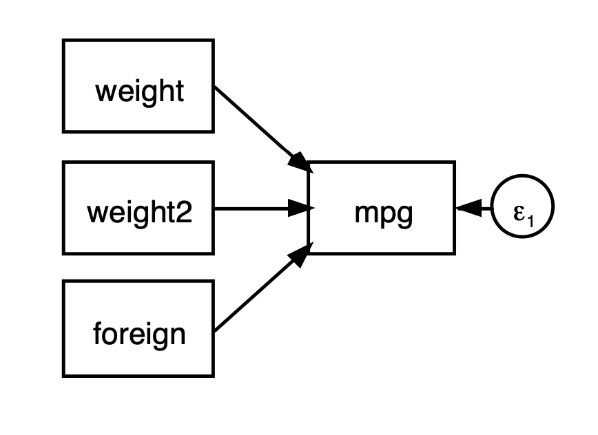
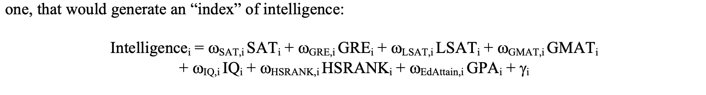
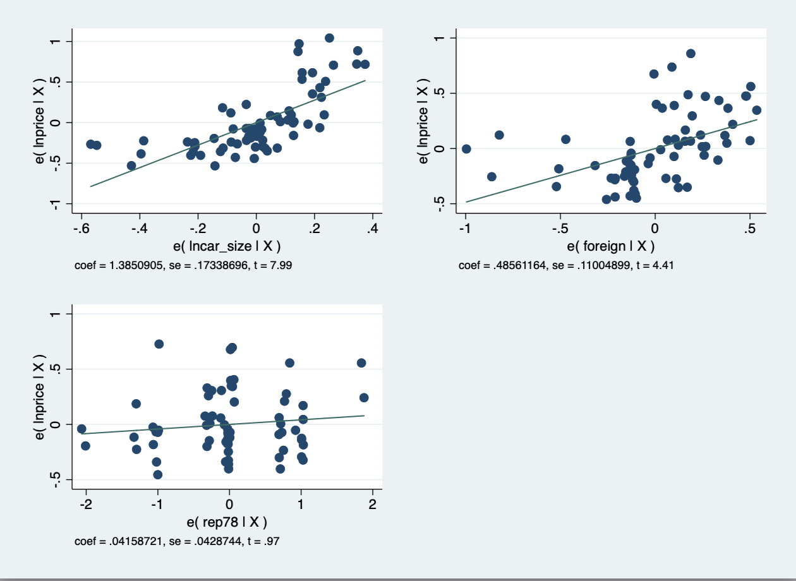
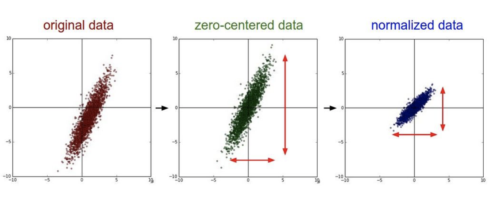

#### **HW:** Within STATA, go to example datasets. Use auto.dta. 

Present summary statistics using the appropriate table based on your discipline’s top tier journal. That is, provide the means, standard deviation and correlations (include Max and Min). Discuss any concerns using only the **summary statistics.**

#####       -  Generate ln(price). Call it lnprice

#####        - Generate a car_size variable (use factor command in STATA). Base it on weight, length and trunk). 

#####        - Then, generate ln(car_size). Call it lncar_size




http://fmwww.bc.edu/EC-C/S2017/8823/ECON8823.S2016.nn15.slides.pdf


#### [Latent variables](https://www.theanalysisfactor.com/four-types-sem/) are often called factors, especially in the context of [factor analysis](https://www.theanalysisfactor.com/factor-analysis-1-introduction/).

The challenge with a latent variable is that it does not have a metric since it is an unobserved-hypothetical variable. In other words, it has no units.

Confirmatory Factor Analysis allows us to give a specific metric to the latent variable that makes sense. There are two approaches that we usually follow.

- One approach is to essentially produce a standardized solution so that all variables are measured in standard deviation units. This can be done by constraining the variance of the latent variable to one. The downside of this approach is that we no longer have a non-standardized metric that could be given to this latent (unobserved) variable.

- Another approach is to make a reference item from the group of items that make up the latent variable. Then we compare all the other items of this latent variable with the reference item. This reference item has a fixed loading for ease of comparison purposes. The value of the loading of this reference items is one.

  

CFA made me think, at the beginning, of a full “targeted” EFA. Basically, you only estimate the paths that link each indicator (aka [observed variable](https://www.theanalysisfactor.com/what-is-a-latent-variable/)) to their corresponding factor (aka [latent variable](https://www.theanalysisfactor.com/what-is-a-latent-variable/)). https://www.theanalysisfactor.com/four-types-sem/

- A rule of thumb is that variables that have factor loadings <|0.7| are dropped.


https://www.stata.com/features/structural-equation-modeling/

```python
#Generating an index

The predict post-analysis command calculates the regression coefficients using all the variables that were included in the regression.
If you look back to the varimax output, it appears that cutoff of 0.50 may be appropriate. Using this criteria, let’s calculate indices with only the requisite variables. 

For the “Internet promotion” factor, we’ll use v1 – v5. For the Internet avoidance factor, we will use v7 – v 12.

# Pulling it all together...
# For a factor analysis, here are the usual steps:
1. Choose an appropriate factor analytic technique (factor, pca, etc.).
2. Run the test.
3. Choose a rotation, if appropriate (varimax or promax, or both).
4. Determine which factors to retain using the Kaiser or scree test (use greigen for the scree graph).
5. Determine which variables are loaded on which retained factors.
6. Test the groupings using Cronbach’s α.
7. Generate indices using predict.

# ref https://www.albany.edu/faculty/kretheme/PAD705/SupportMat/FactorAnalysisTheory.pdf

# Data management: How to create a new variable that is calculated from other variables	
# https://www.datacamp.com/community/tutorials/introduction-factor-analysis
```



https://www.albany.edu/faculty/kretheme/PAD705/SupportMat/FactorAnalysisTheory.pdf


Using the following regression, where:

- DV = lnprice; IVs = lncar_size, foreign rep78
- Test for outliers and multicollinearity. Convince yourself that it exists or does not exist.
- Run the following regressions with and without robust errors. Explain the differences.
- Try robust regression (rreg), quantile regression (qreg) or can you use OLS?
- Discuss the differences.





```python
# loading data
sysuse auto.dta, clear
ssc install asdoc, replace
asdoc sum if weight > 3500, stat(N mean sd skewness kurtosis)
asdoc sum, stat(N mean sd skewness kurtosis)

generate lweight = ln(weight)

asdoc sum weight lweight, stat(N mean sd skewness kurtosis)

regress price weight foreign mpg
regress price lweight foreign mpg

```


We can obtain the first two components by typing

```
predict car_size
```


##### What is the difference between a factor score and a linear prediction of a latent variable? 




Here are some properties that can help you when interpreting a standard deviation:

- The standard deviation can never be a negative number, due to the way it’s calculated and the fact that it measures a distance (distances are never negative numbers).
- The smallest possible value for the standard deviation is 0, and that happens only in contrived situations where every single number in the data set is exactly the same (no deviation).
- The standard deviation is affected by outliers (extremely low or extremely high numbers in the data set). That’s because the standard deviation is based on the distance from the *mean.*And remember, the mean is also affected by outliers.
- The standard deviation has the same units as the original data.