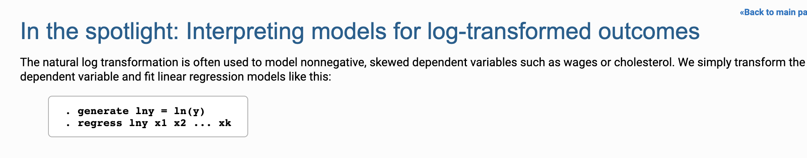

[How to Check Frequency Distribution and ... - CDC](https://www.google.com/url?sa=t&rct=j&q=&esrc=s&source=web&cd=&cad=rja&uact=8&ved=2ahUKEwiXldbnjMnuAhUMHXAKHdb2B3wQFjAFegQICxAC&url=https%3A%2F%2Fwww.cdc.gov%2Fnchs%2Ftutorials%2FNhanes%2FNHANESAnalyses%2FDescriptiveStatistics%2FTask1c.htm&usg=AOvVaw0DfW4O1BSNUd0A35TPxovw)

data 

https://wrds-www.wharton.upenn.edu/

[summarize var, detail](https://stats.idre.ucla.edu/stata/output/descriptive-statistics-using-the-summarize-command/)

##  SKEWNESS

*Skewness* is a *measure* of the departure of the distribution of a random variable

calculate **skewness** and **kurtosis** that can be used to test the normality of a given data set. normality tests are used to determine whether a data set is modeled for normal distribution. **[[link]](https://help.gooddata.com/doc/en/reporting-and-dashboards/maql-analytical-query-language/maql-expression-reference/aggregation-functions/statistical-functions/predictive-statistical-use-cases/normality-testing-skewness-and-kurtosis)**

- Graphical methods include the histogram and normality plot
- Statistically, two numerical measures of shape – *skewness* and *excess kurtosis* – can be used to test for normality. **If skewness is not close to zero, then your data set is not normally distributed.**
  - If skewness is less than -1 or greater than 1, the distribution is highly skewed.
  - If skewness is between -1 and -0.5 or between 0.5 and 1, the distribution is moderately skewed.
  - If skewness is between -0.5 and 0.5, the distribution is approximately symmetric.

##### ::The null and alternative hypotheses for the normality test are:: 

- **Null hypothesis**: The data follows a normal distribution.

- **Alternative hypothesis**: The data does not follow a normal distribution.

Skewness is a measure of the asymmetry of the probability distribution of a random variable about its mean. It represents the amount and direction of skew.

##  KURTOSIS

Kurtosis tells you the height and sharpness of the central peak, relative to that of a standard bell curve.

 

Error in the stat( N mean Skewness ) option!
**only the following statistics are allowed**
N sd mean semean median count sum range min max var cv skewness kurtosis iqr p1 p5 p10 p25 p50 p75 p90 p95 p99 tstat

https://zhuanlan.zhihu.com/p/47910987

https://blog.csdn.net/arlionn/article/details/83500601

https://stats.idre.ucla.edu/stata/faq/how-can-i-access-information-stored-after-i-run-a-command-in-stata-returned-results/

https://towardsdatascience.com/testing-for-normality-using-skewness-and-kurtosis-afd61be860

https://brownmath.com/stat/shape.htm

https://www.projectguru.in/normality-test-stata/

https://datalya.com/blog/business-statistics/what-is-skewness-of-a-probability-distribution

https://help.gooddata.com/doc/en/reporting-and-dashboards/maql-analytical-query-language/maql-expression-reference/aggregation-functions/statistical-functions/predictive-statistical-use-cases/normality-testing-skewness-and-kurtosis

https://www.stata.com/stata-news/news34-2/spotlight/

https://www.princeton.edu/~otorres/DataPrep101.pdf

# The Basics: Linear Regression

https://towardsdatascience.com/the-basics-linear-regression-2fc9f5124687

# Solving Arithmetic Mathematical Word Problems: A Review and Recent Advancements

https://www.researchgate.net/publication/325047683_Solving_Arithmetic_Mathematical_Word_Problems_A_Review_and_Recent_Advancements

# How Search Engines like Google Retrieve Results: Introduction to Information Extraction using Python and spaCy

https://www.analyticsvidhya.com/blog/2019/09/introduction-information-extraction-python-spacy/

#### STATA教程之	：Tabout

http://yansong.org/2019/01/07/tabout/

Information Search 

https://lib.utsa.edu/about/staff-directory/natasha-arguello

https://lib.utsa.edu/about/staff-directory/natasha-arguello