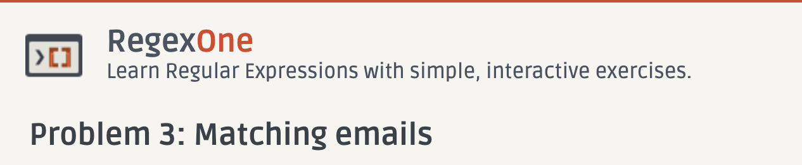
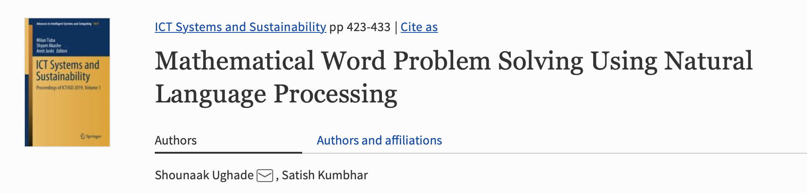
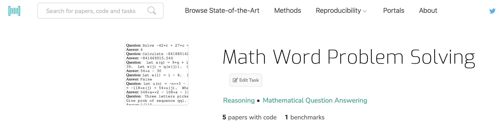
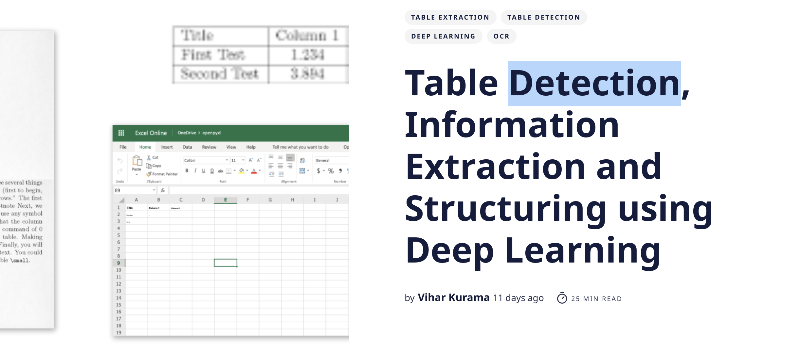

https://regexone.com/problem/matching_emails?

##### Probability and Statistics for Bioinformatics and Genetics

http://www.ams.jhu.edu/~dan/550.435/notes/COURSENOTES435.pdf

Project Proposal 

#### Using neural networks to solve advanced mathematics equations

https://ai.facebook.com/blog/using-neural-networks-to-solve-advanced-mathematics-equations/

#### Deep Neural Solver for Math Word Problems

https://ai.tencent.com/ailab/media/publications/Yan_Wang-EMNLP2017-Deep_Neural_Solver_for_Math_Word_Problems.pdf

#### Template-Based Math Word Problem Solvers with Recursive Neural Networks

https://ojs.aaai.org//index.php/AAAI/article/view/4697

#### NLP & Numeracy (Pt 1) — Calculators for Natural Language

https://towardsdatascience.com/transformers-numeracy-pt-1-calculators-for-natural-language-e09a471c5ebe

Part 1 (this article):

- Does numeracy in NLP matter?
- Why can’t we just use a calculator?
- What is numeracy in NLP?
- How to measure NLP numeracy?
- What can we do about it?

[Part 2](https://medium.com/@mihail.dungarov/nlp-numeracy-pt-2-embeddings-language-models-and-calculators-615a346737c2): How to be good at math if you are a Transformer:

- Numeracy and Embeddings
- Language Models and Numeracy
- Calculators for Natural Language

https://paperswithcode.com/task/math-word-problem-solving/codeless

#### Solving and answering arithmetic and algebraic problems using natural language processing

https://patents.google.com/patent/US9460075B2/en

#### 8 common examples of natural language processing and their impact on communication

https://www.tableau.com/learn/articles/natural-language-processing-examples

In developing this practice, we draw on analogous practices from the fields of psychology and medicine that require some stan- dardized information about the populations stud- ied

Though the construct of data statements applies more broadly, in this paper we focus specifically on data state- ments for NLP systems.

 Data statements should be included in most writing on NLP including: 

- papers presenting new datasets, 

- papers reporting experimental work with datasets, and 

- documentation for NLP systems. 
- help us as a field engage with the ethical issues of *exclusion*, 
- *overgeneralization*, and 
- *underexposure* 
- *generalizability* and 
- *reproducibility*

Discuss why NLP needs data statements

how data statements can mitigate bias and use the technique of **“value scenarios”** to envision potential effects of their adoption.

The idea is could we "read" the papers using NLP methods and fill out the data statement information in the form above from papers that release new datasets. 

#### Hands-on NLP Project: A Comprehensive Guide to Information Extraction using Python

An Automated Approach On Generating Macro-Economic Sentiment Index Through Central Bank Documents

https://www.imperial.ac.uk/media/imperial-college/faculty-of-natural-sciences/department-of-mathematics/math-finance/Xia_Ruizhe_01201752.pdf

# The Model Statement

explore the  mathematical formulation of a wide array of algorithms as well as explore aspects of the scientific method and machine learning with expert support and guidance.

My project focused on popular natural language processing (NLP) techniques, specifically around word embeddings. I found it most interesting diving into the mathematical formulation of these algorithms. In particular the Word2Vec algorithm, it builds a numerical vector representation of a word, based on the probability of finding words that tend to surround it.

This implementation was fascinating as it suggests that the algorithm can easily be applied to not only text, but to any **scenario** an **event** is surrounded by other **events**. This representation as a vector may reveal relationship that are otherwise not obvious and can allow us to locate similar events.

I have always found it extremely fascinating **how formulas derived to model physical phenomena can be applied in abstract to information in order to reveal truly astonishing insights**. This project helped me to develop a new-found appreciation for all the astonishing **mathematicians, statisticians and physicists** that have produced the formulas that I am now lucky enough to play with. It is truly exciting to be alive in an era where so many fascinating discoveries, formula and algorithms are so widely accessible.

The field of data science/machine learning is at an exciting phase of its evolution, and I am lucky enough to be a part of it at the beginning of my career. I hope in the coming years to continually learn and follow my passionate **exploration of the mathematics behind the algorithms**. I am optimistic about the field’s near future and plan to follow this passion into the area of smart cities focusing on the design of systems to improve our quality of life.

Algorithms are used for calculation, data processing, and automated reasoning.”

https://nanonets.com/blog/table-extraction-deep-learning/

#### Explorations into the Use of Word Embedding in Math Search and Math Semantics

https://link.springer.com/chapter/10.1007/978-3-030-23250-4_20

#### Math-word embedding in math search and semantic extraction

As math text consists of natural text as well as math expressions that exhibit linear and contextual correlation characteristics that are very similar to those of natural sentences, word embedding applies to math text much as it does to natural text. 

https://link.springer.com/article/10.1007/s11192-020-03502-9

In this paper, we provide an exploratory investigation of the effectiveness and use of word embedding in MLP and MKM through different perspectives. First, we train word2vec models on the DLMF and arXiv with slightly different approaches for embedding math. Since the DLMF is primarily a handbook of mathematical equations, it does not provide extensive textual content. We will show that the DLMF trained model is appropriate to discover mathematical term similarities and term analogies, and to generate query expansions. We hypothesize that the arXiv trained models are beneficial to extract definiens, i.e., textual descriptive phrases for math terms. We examine the possible reasons why the word embedding models, trained on the arXiv dataset, does not present valuable results for this task. Besides, we discuss some of the reasons that we believe thwart the progress in MathIR in the direction of machine learning. In summary, we focus on five tasks (i) term similarity, (ii) math analogies, (iii) concept modeling, (iv) query expansion, and (v) knowledge extraction.

The paper is organized as follows. Next section offers a survey of the foundations and prior work related to word and math embedding. 

The "[Mathematical Information Retrieval](https://link.springer.com/article/10.1007/s11192-020-03502-9#Sec5)" section presents our experiments on the DLMF trained model: term similarity, math analogies, concept modeling, and query expansion. In the section "[Semantic Knowledge Extraction](https://link.springer.com/article/10.1007/s11192-020-03502-9#Sec11)" we explore the arXiv trained model for knowledge extraction of mathematical terms. The "[Overcoming Issues of Knowledge Extraction](https://link.springer.com/article/10.1007/s11192-020-03502-9#Sec15)" section discusses potential concepts we believe are necessary to overcome the limitations of ML and DL algorithms in MLP/MKM/MathIR tasks. Finally, the last section presents our conclusions and outlines future directions.

https://link.springer.com/article/10.1007/s11192-020-03502-9

#### Using NLP-based Text Mining to Gather Patient Insights from Social Media at Roche

https://www.linguamatics.com/blog/using-nlp-based-text-mining-gather-patient-insights-social-media-roche