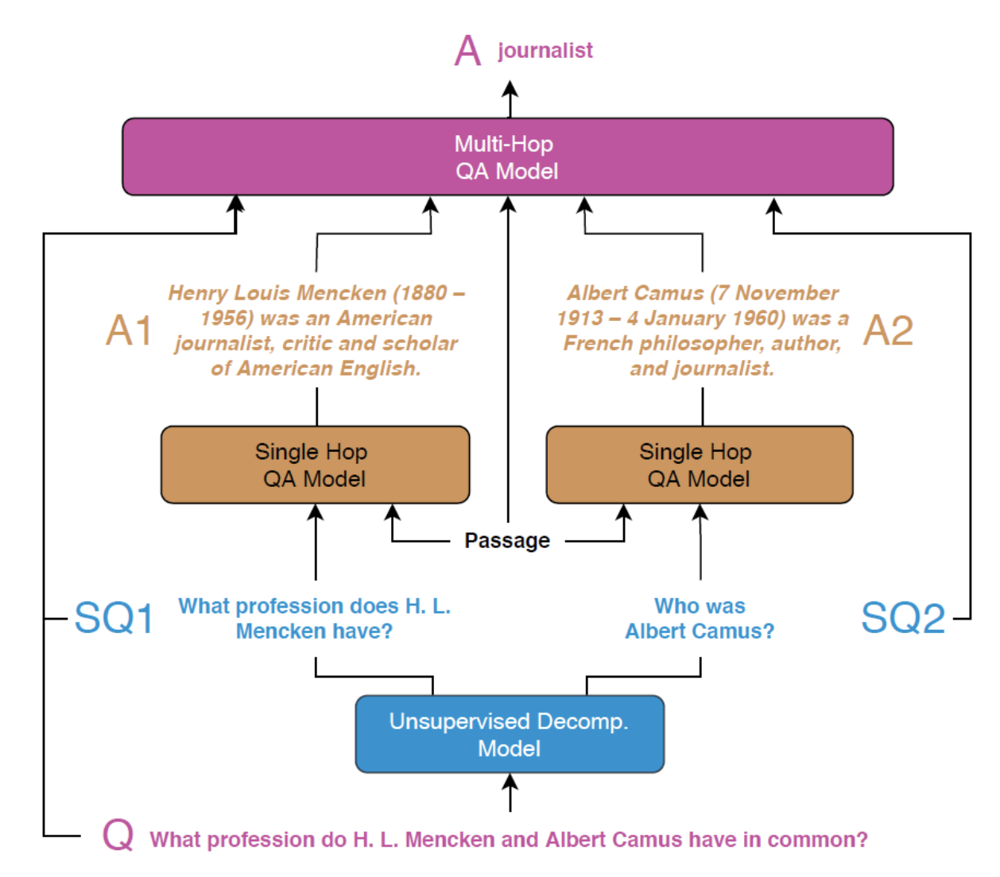
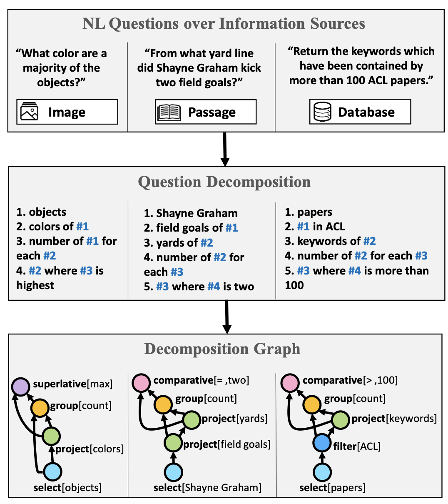

- **Project proposal.** and literature review. Students will **propose** the research question to be **examined**, **motivate** its rationale as an interesting question worth asking, and assess its potential to contribute new knowledge by situating it within related **literature** in the scientific community. (2 pages; 5 sources)

### Project proposal. and literature review. 

 

- see besides problem definition, 
- motivation, and 
- literature review?
- Data exploration/description, 
- definition of planned methodology for experiments?

 

Hi Ian, the description on Blackboard gives a basic idea: **Project proposal and literature review.** Students will propose the research question to be examined, motivate its rationale as an interesting question worth asking, and assess its **potential to contribute new knowledge by situating it within related literature in the scientific community**. (2 pages; 5 sources).

- The "new knowledge" and "research question" description is 
  - where you can provide some information about 
  - what you plan to do, 
  - how you plan to do it, and 
  - the data you plan to use.

 

##### eah, it will depend on the field. The final writeup at the end of the course will have the following sections:

-  Introduction

-  Related Work

- Data (Sometimes combined with the Results section)

- Method

- Results

- Discussion

- Conclusion

  

If code is available, and you want a lightweight class-project-level way of using these dataset, 

**it would be interesting to see how these perform on health-related questions.** 

There are alot of medical QA dataset: https://github.com/abachaa/MedQuAD. So, testing how semantic parsing works on them could be useful, moreover, I don't think it has been done before (but, you would need to check). This may require some manual annotation, but maybe not a lot. (edited) 

**[abachaa/MedQuAD](https://github.com/abachaa/MedQuAD)**

Medical Question Answering Dataset of 47,457 QA pairs created from 12 NIH websites - abachaa/MedQuAD

# medical domain

**从易到难，针对复杂问题的无监督式问题分解方法**	

https://www.linkresearcher.com/theses/f710f291-6a24-48c5-b11d-bcce754ad30e

#### **Project proposal and literature review.** 

##### Students will propose the research question to be examined, 

##### motivate its rationale as an interesting question worth asking, 

##### and assess its potential to contribute new knowledge by situating it within related literature in the scientific community. (2 pages; 5 sources).

Dataset 

Break is a question understanding dataset, aimed at training models to reason over complex questions. It features 83,978 natural language questions, annotated with a new meaning representation, Question Decomposition Meaning Representation (QDMR) [1]. Each example has the natural question along with its QDMR representation. Break contains human composed questions, sampled from [10 leading question-answering benchmarks](https://allenai.github.io/Break/#question-answering-datasets) over text, images and databases. This dataset was created by a team of [NLP researchers](https://allenai.github.io/Break/#authors) at [Tel Aviv University](https://www.tau-nlp.org/) and [Allen Institute for AI](https://allenai.org/).

Question-Answering Datasets

The Break dataset contains questions from the following 10 datasets:

- **Semantic Parsing**: [Academic](https://github.com/jkkummerfeld/text2sql-data), [ATIS](https://github.com/jkkummerfeld/text2sql-data), [GeoQuery](https://github.com/jkkummerfeld/text2sql-data), [Spider](https://yale-lily.github.io/spider)
- **Visual Question Answering**: [CLEVR-humans](https://cs.stanford.edu/people/jcjohns/clevr/), [NLVR2](http://lil.nlp.cornell.edu/nlvr/)
- **Reading Comprehension (and KB-QA)**: [ComQA](http://qa.mpi-inf.mpg.de/comqa/), [ComplexWebQuestions](https://www.tau-nlp.org/compwebq), [DROP](https://allennlp.org/drop), [HotpotQA](https://hotpotqa.github.io/)

We are interested in [MedQuAD](https://github.com/abachaa/MedQuAD)

answering complex natural language questions in multiple contexts.

answer simple nlp question

### Representing the Meaning of Questions

Thinking how to represent the meaning of complex questions, we considered three key features:

- Capturing the sequence of computation steps for answering the question
- Capturing the meaning of a question, regardless of its context (text, image, DB)
- Expressing the formalism in natural language, making it easy to annotate by non-experts

We introduce Question Decomposition Meaning Representation (QDMR), inspired by DB query languages and by semantic parsing. In QDMR, complex questions are expressed through sub-questions (operators) that can be executed in sequence to answer the original question. Each QDMR operator either selects a set of entities, retrieves information about their attributes, or aggregates information over entities. Basically, we apply the intuition from DB query languages also to questions over images and text. By abstracting away a question’s context, QDMR allows in principle to query *multiple sources* for the same question. A system could potentially answer *“Name the political parties of the most densely populated country”*, by first returning *“the most densely populated country”* using a DB query, then *“the political parties of #1”* using a QA model for text.

### 以倒叙形式写 literiture review

### Yeah, I think working on a model for one of those tasks could be interesting. You may need to focus on one component. Basically, these are **semantic parsing tasks**, so they will require some sort of seq2seq framework---assuming neural network-based methods. 

### If code is available, and you want a lightweight class-project-level way of using these dataset, it would be interesting to see how these perform on health-related questions. There are alot of medical QA dataset: https://github.com/abachaa/MedQuAD. So, testing how semantic parsing works on them could be useful, moreover, I don't think it has been done before (but, you would need to check). This may require some manual annotation, but maybe not a lot.

 QDMR in two setups. First, we regard the task of open-domain QA over multi-hop questions from the HOTPOTQA dataset.

 in semantic parsing. We use BREAK to train a neural QDMR parser that maps questions into QDMR representations, based on a sequence-to-sequence model with copying (Gu et al., 2016). 	

Showing how QDMR can be used to improve open-domain question answering (§5), as well as alleviate the burden of annotating logical forms in semantic parsing

There has been a lot of work recently on answering complex natural language questions (QA) in multiple contexts. For example, the figure below shows three questions against a text paragraph, an image and a relational database (DB). While these questions represent separate QA tasks (*reading comprehension*, *visual question answering*, *semantic parsing*), they all require the same operations, such as fact chaining and counting. Current models often ignore the fact that questions share structure, regardless of their particular QA task. []??? Thus, understanding the language of complex questions is being learned from scratch for each task!

This highlights the importance of **question understanding**, as a standalone language understanding task. To test whether a model understands a question, we focus on question decomposition. This ability, to compose and decompose questions, is a core part of human language [1] and allows us to tackle previously unseen problems. Training our models to decompose complex questions should bring us one step closer to solving tasks that require multi-step reasoning (where we do not have substantial amounts of data).

Representing the Meaning of Questions

The representation of meaning of questions features

- Capturing the ***sequence of computation steps\*** for answering the question
- Capturing the meaning of a question, ***regardless of its context\*** (text, image, DB)
- Expressing the formalism in ***natural language\***, making it easy to annotate by non-experts

We introduce Question Decomposition Meaning Representation (QDMR), inspired by DB query languages and by semantic parsing. In QDMR, complex questions are expressed through sub-questions (operators) that can be executed in sequence to answer the original question. Each QDMR operator either selects a set of entities, retrieves information about their attributes, or aggregates information over entities. Basically, we apply the intuition from DB query languages also to questions over images and text. By abstracting away a question’s context, QDMR allows in principle to query multiple sources for the same question. A system could potentially answer *“Name the political parties of the most densely populated country”*, by first returning *“the most densely populated country”* using a DB query, then *“the political parties of #1”* using a QA model for text. 

Below are two examples of questions (over DB and images) with their respective QDMR representations. Note how the references to previous decomposition steps allow us to represent QDMR as a directed-acyclic-graph.
For the full description of the QDMR formalism please refer to [our paper](https://allenai.github.io/Break/#paper).

QDMR serves as the formalism for creating Break, a dataset aimed at probing question understanding models.

Break is aimed at building systems that parse natural questions into their respective QDMR representations. 

Our research has shown that multi-hop QA models, using Break decompositions, greatly outperform a strong BERT-based baseline, which does not. Additionally, we provide [neural QDMR parsing models](https://allenai.github.io/Break/#leaderboard), trained on Break, that beat a rule-based baseline that employs dependency parsing and coreference resolution.

#### What is HotpotQA? https://hotpotqa.github.io

HotpotQA is a question answering dataset featuring natural, multi-hop questions, with strong supervision for supporting facts to enable more explainable question answering systems. It is collected by a team of NLP researchers at [Carnegie Mellon University](https://www.cs.cmu.edu/), [Stanford University](https://nlp.stanford.edu/), and [Université de Montréal](https://diro.umontreal.ca/accueil/).

Question Collection

Questions in BREAK were randomly sampled from ten QA datasets over the following tasks (Table 3):

- Semantic Parsing: Mapping natural language utterances into formal queries, to be executed on a target KB (Price, 1990; Zelle and Mooney, 1996; Li and Jagadish, 2014; Yu et al., 2018).
- Reading Comprehension (RC): Questions that require understanding of a text passage by reasoning over multiple sentences (Talmor and Berant, 2018; Yang et al., 2018; Dua et al., 2019; Abujabal et al., 2019).
- Visual Question Answering (VQA): Questions over images that require both visual and numerical reasoning skills (Johnson et al., 2017; Suhr et al., 2019).

to see how these perform on health-related questions. There are alot of medical QA dataset: https://github.com/abachaa/MedQuAD. So, testing how semantic parsing works on them could be useful, moreover, I don't think it has been done before (but, you would need to check). This may require some manual annotation, but maybe not a lot.

- # Question Answering

- https://www.paperdigest.org/2020/04/recent-papers-on-question-answering/

Question answering (QA) tasks often contain many complex questions that are difficult to answer directly, and these questions usually need to search multiple paragraphs of text to find the answer. In this paper, we aim to propose an unsupervised problem decomposition method: the complex problem is decomposed into several simple problems, and then the answers of these simple problems are provided to the complex problems as context to help the model answer the complex problems. Using this strategy, we can achieve significant results on **hotpotqa**, especially for the out-of-domain problems.

**问答中的复杂问题**

The research of question answering system has a long history. In recent years, the emergence of all kinds of data sets has higher and higher requirements for question answering system. For example, hotpotqa requires the system to search for clues in multiple discontinuous texts, and organize these clues in logical order to form answers. This kind of question and answer form that requires multiple answers to "jump" is called "Multi-Hop QA", or simply called complex problem.

It is often unrealistic for the model to answer these questions directly, but a simple idea is that the complex question can be decomposed into several simple sub questions that can be answered by the model, and then these sub questions and their answers can be provided to the model as context, and then the complex questions can be answered, which can greatly reduce the difficulty of answering complex questions directly.

For example, the following figure is an example. To answer a complex question, we first split it into two simple questions (or "single jump question answering"), and then answer the complex question itself, which is much easier.

In this paper, we present a novel question decomposition framework capable of handling both decomposition types, built on top of the BREAK QA system for Jeopardy!i. 

Now, the question is how to get a simple sub-problem. This paper adopts an unsupervised problem decomposition method

\1.  首先以抽取的方式构建一个“伪分解”数据集；

\2.  利用构建的“伪分解”数据集和原来的复杂问题数据集训练一个序列到序列模型；  

\3.  使用序列到序列模型生成子问题。

以上问题分解步骤完全是无监督的，因而避免了大量的人工标注。

Finally, this paper tests the effect of this method on hotpotqa and achieves remarkable results. In general, the contributions of this paper are as follows: A completely unsupervised problem decomposition method is proposed, which can effectively decompose a complex problem into several simple subproblems;
The experiment of hotpotqa shows that this method is very close to the strong supervision method;
This method can achieve good results in all kinds of complex problems, which shows that this method has strong versatility.

https://www.linkresearcher.com/theses/f710f291-6a24-48c5-b11d-bcce754ad30e

## QA Model Training

### Seq2Seq Decomposition Training 

BART

QDMR for Open-domain QA

BREAKRC Algorithm 1 describes the BREAKRC model which uses high-level QDMR structures for answering open-domain multi-hop questions.

QDMR for Semantic Parsing

QDMRs can be mapped to *pseudo-logical forms* with high preci- sion (93.1%) by extracting formal operators and arguments from their steps. The pseudo-logical form differs from an executable query in the lack of grounding of its arguments (entities and rela- tions) in KB constants. 

### Related Work

##### Question decomposition, 

Recent work on QA through question decomposition has focused mostly on single modalities (Gupta and Lewis, 2018; Guo et al., 2019; Min et al., 2019b). QA using neural modular networks has been suggested for both KBs and images by Andreas et al. (2016) and Hu et al. (2017). Question decomposition over text was proposed by Talmor and Berant (2018), however over a much more limited set of questions than in BREAK. Iyyer et al. (2017) have also decomposed questions to create a “sequential question answering” task. Their annotators viewed a web table and performed actions over it to retrieve

Instead of representing general language, QDMR represents questions, which are important for QA systems, and for probing models for reasoning.

Questions over different sources share a similar compositional structure. Natural language questions from multiple sources (top) are annotated with the QDMR formalism (middle) and deterministically mapped into a pseudo-formal language (bottom).

This ability, to compose and decompose questions, lies at the heart of human language (Pelletier, 1994) and allows us to tackle previously unseen problems. 

Final answer list 

- Solving parallel decomposable questions
  - Recognizing independent subquestions

- Question Decomposition Formalism