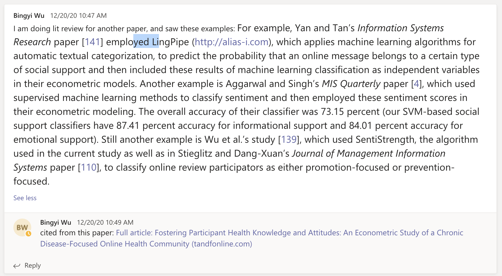

- What are the literature topics should we review? And who will review what? 

- NLP Power - hate speech/trolling/distanced language 
- Social Power 
- Economic Power 
- BSM - Blockchain-based Social Media 

- Digital Wellbeing on Social Media 

#### They establish five main categories to classify measurement approaches for social medial influence. 

 (i) similarity-based approaches, (ii) graphical-based approaches, (iii) sentiment analysis tools, (iv) influencers’ retrieval techniques, and (v) machine learning approaches. 

##### Sentiment analysis tools