### [Graph-to-Tree Learning for Solving Math Word Problems](https://www.aclweb.org/anthology/2020.acl-main.362.pdf)

Ref [人工智能解数学题技术总结](https://www.mathgeeker.com/2018/04/28/auto-mathsolver-0/)

The seq2seq model https://ai.tencent.com/ailab/media/publications/Yan_Wang-EMNLP2017-Deep_Neural_Solver_for_Math_Word_Problems.pdf

[让人工智能解数学题，可能没你想象的那么简单](https://www.msra.cn/zh-cn/news/features/computer-problem-solving-system-20170228)

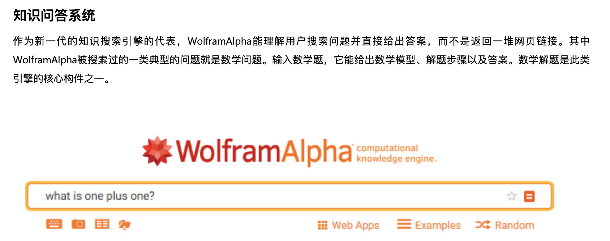

https://www.dm-ai.cn/news/厉害了！类人解题黑科技，k12教育规模化应用的新/

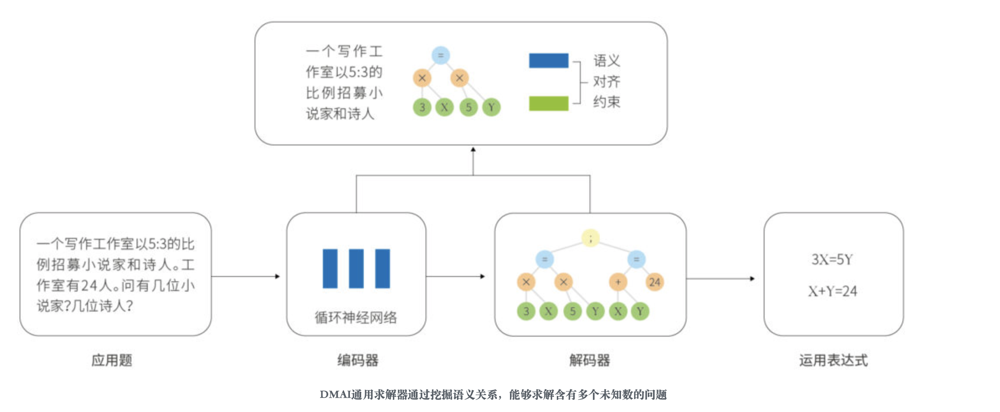

#### Graphs Neural Networks in NLP

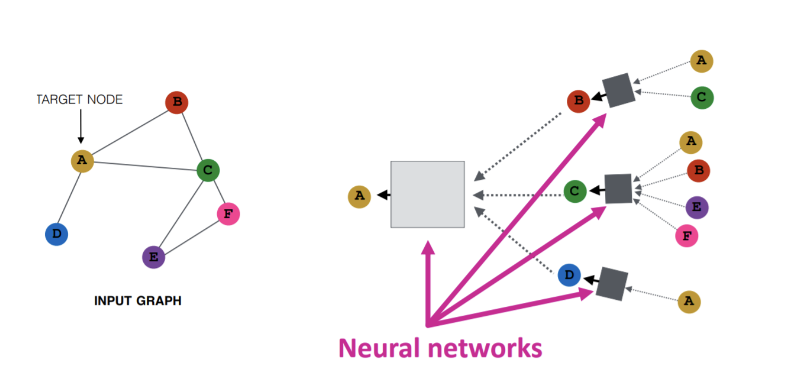

#### An Introduction to Graph Neural Network(GNN) For Analysing Structured Data

https://towardsdatascience.com/an-introduction-to-graph-neural-network-gnn-for-analysing-structured-data-afce79f4cfdc

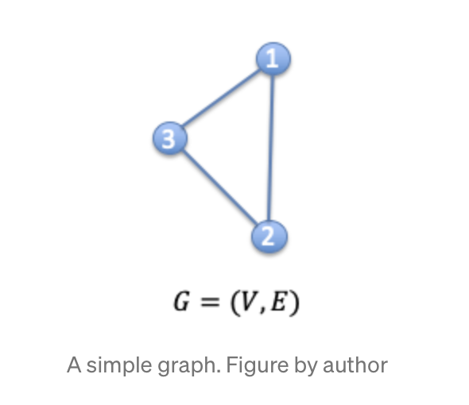

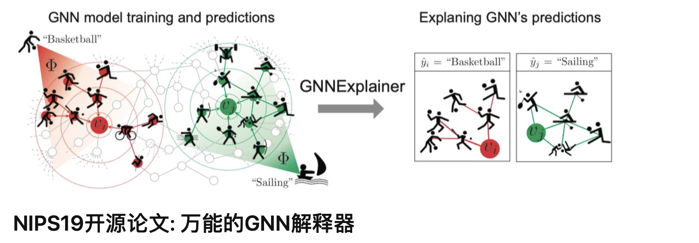

https://zhuanlan.zhihu.com/p/98762741

#### GCAN: Graph-aware Co-Attention Networks for Explainable Fake News Detection on Social Media

https://www.aclweb.org/anthology/2020.acl-main.48.pdf

#### Integrating Semantic and Structural Information with Graph Convolutional Network for Controversy Detection

https://www.aclweb.org/anthology/2020.acl-main.49.pdf

#### A Graph Auto-encoder Model of Derivational Morphology

https://www.aclweb.org/anthology/2020.acl-main.106.pdf

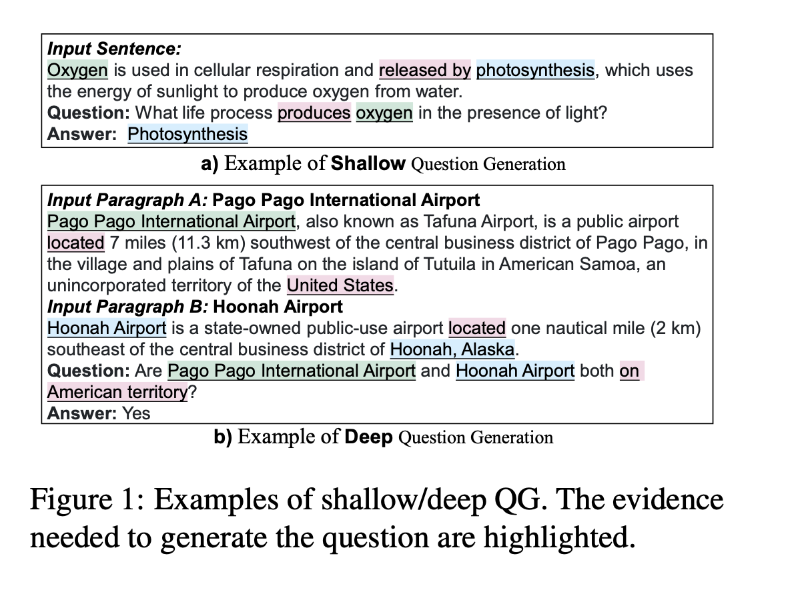

https://www.aclweb.org/anthology/2020.acl-main.135.pdf

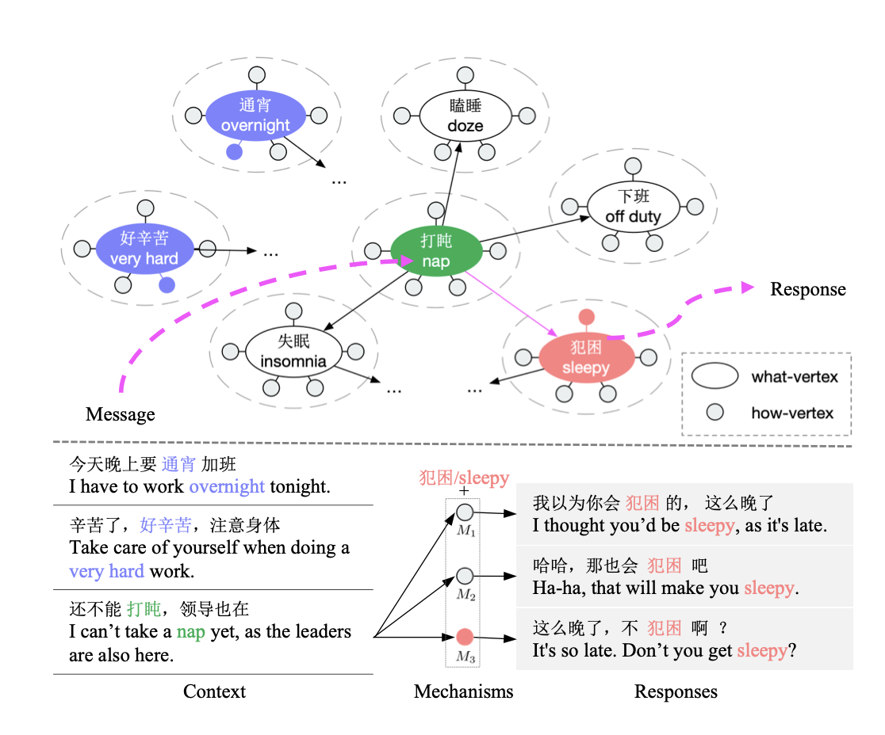

https://www.aclweb.org/anthology/2020.acl-main.166.pdf

​	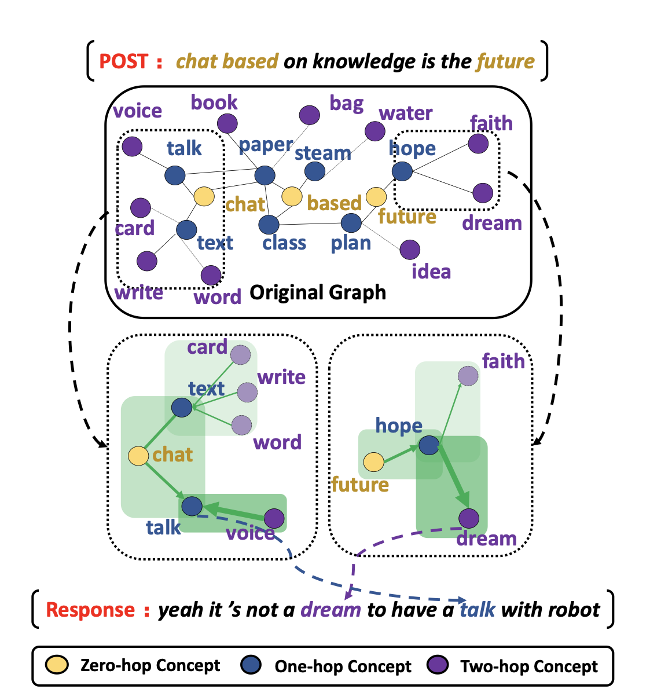

https://www.aclweb.org/anthology/2020.acl-main.184.pdf

#### Can We Predict *New* Facts with Open Knowledge Graph Embeddings? A Benchmark for Open Link Prediction

https://www.aclweb.org/anthology/2020.acl-main.209.pdf

#### Graph Neural News Recommendation with Unsupervised Preference Disentanglement

https://www.aclweb.org/anthology/2020.acl-main.392.pdf

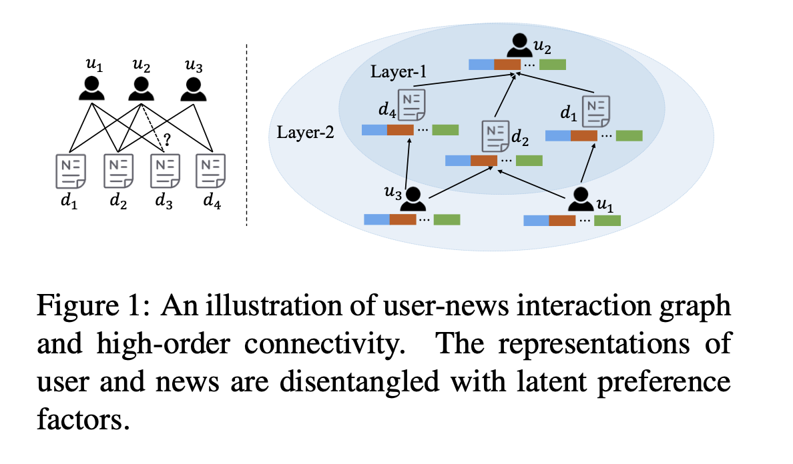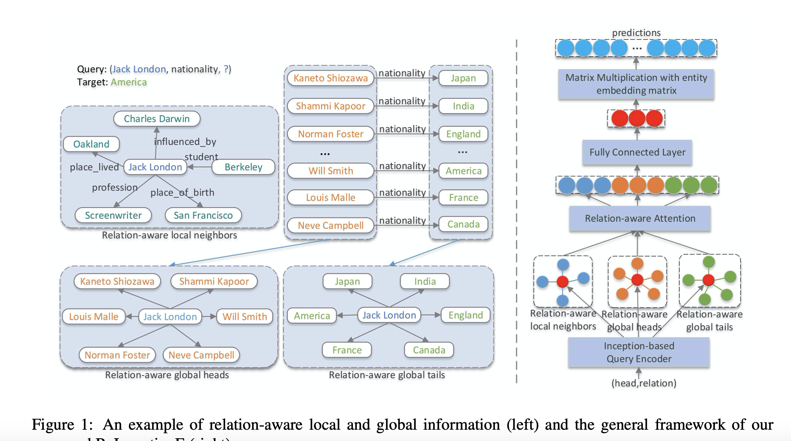

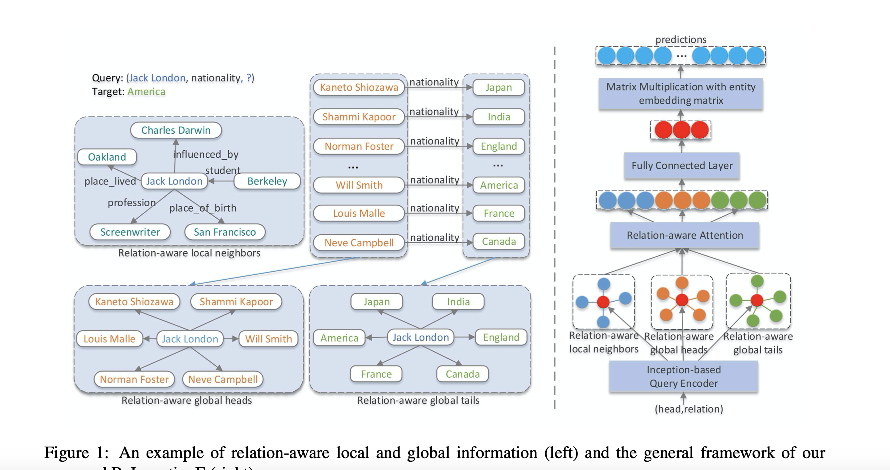

https://www.aclweb.org/anthology/2020.acl-main.526.pdf

#### Leveraging Graph to Improve Abstractive Multi-Document Summarization

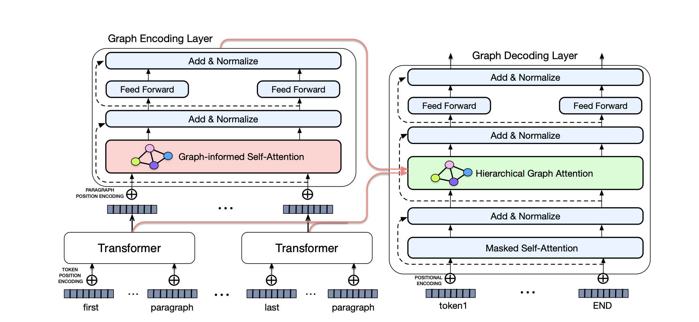

https://www.aclweb.org/anthology/2020.acl-main.555.pdf

#### Connecting Embeddings for Knowledge Graph Entity Typing

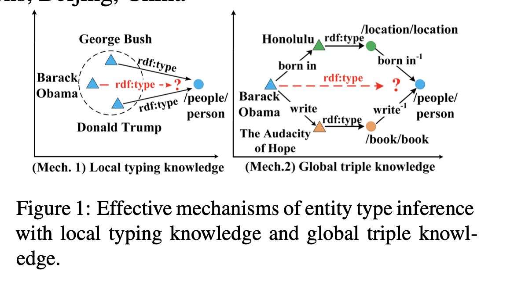

https://www.aclweb.org/anthology/2020.acl-main.572.pdf

#### Bipartite Flat-Graph Network for Nested Named Entity Recognition

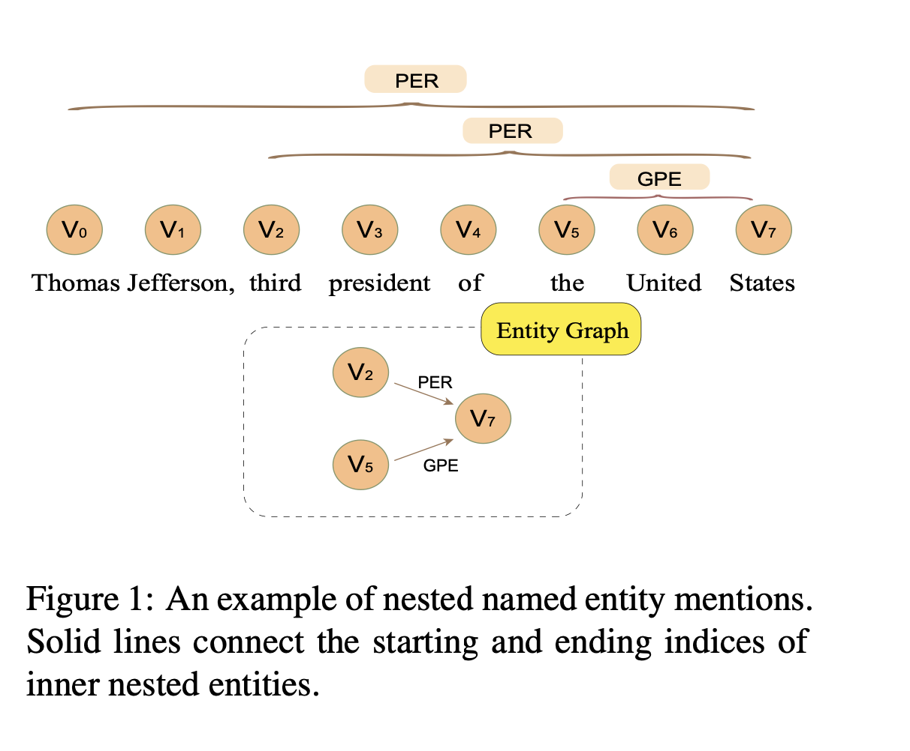

https://www.aclweb.org/anthology/2020.acl-main.571.pdf

#### ICLR2021放榜~6篇SOTA GNN论文推荐

https://swarma.org/?p=23334

数学解题需要通过逻辑推理生成解题公式;计算机需要具有一定有关现实世界的常识去理解自然语言里面一些隐式的指代，也就是我们常说的“常识”。 
　　以上三点是计算机解读数学题所面临的三大主要障碍。总的来说，给出一道数学题文字描述，系统需要涵盖三大部分：自然语言理解，语义表达和映射以及数学推理得出解决公式和答案。 
　　下图列出了目前较为常见的数学解题系统：

### What is Graph Neural Networks (GNNs)?

##### GNNs was first proposed in [33]. GNNs is a type of deep learning method that focuses on capturing the dependence of graphs using the relations between nodes in the graphs. Graph analysis focuses on node classification, link prediction, and clustering. GNNs can retain a state that can represent information from its neighbourhood with defined depth. 

For a GNN, the input is each node represented by its features and related nodes and the output is a state embedding that contains information about the neighbourhood for each node. This state embedding can be used for many tasks, of which one of them is to predict the node label. The learning algorithm is based on gradient-descent. There are few limitations of GNNs:

- 主要是在seq2seq架构上做了改进，用树结构的decoder来生成抽象语法树(也可简单理解为表达式树)。并且利用栈结构辅助，能够清楚的知道下一次要生成的token是什么，还有什么时候可以停止解码。
  - Encoder部分就是一个Bi-LSTM
  - **Decoding生成token的判断过程如下：**
  - 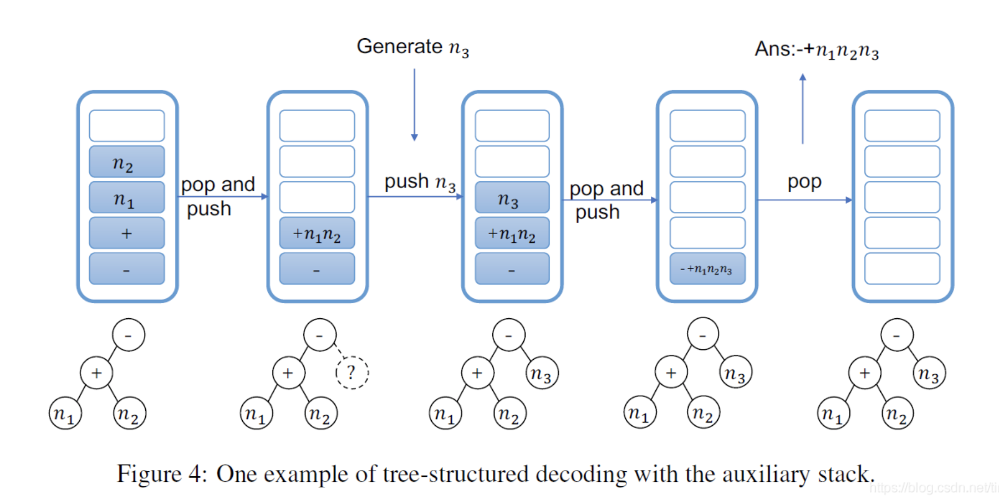
  - 

#### Translating a Math Word Problem to an Expression Tree

https://arxiv.org/pdf/1811.05632.pdf

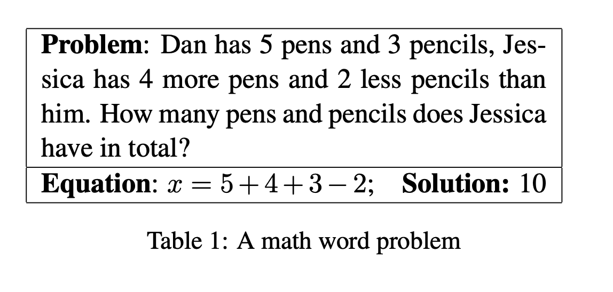

- SEQ2SEQ Framework

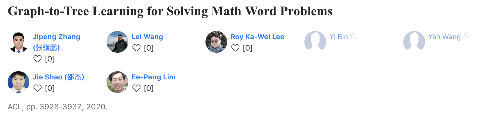

https://www.aminer.cn/pub/5ec49a639fced0a24b4de7ee/graph-to-tree-learning-for-solving-math-word-problems

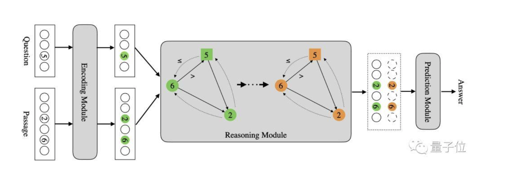

https://www.qbitai.com/2019/10/8067.html

**b**