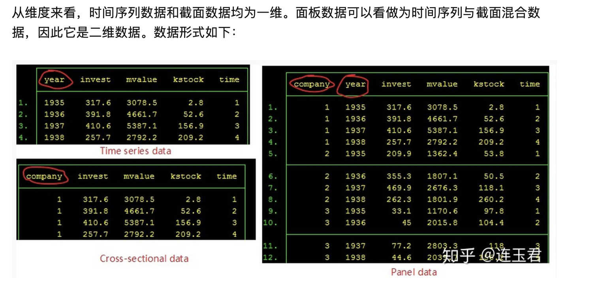
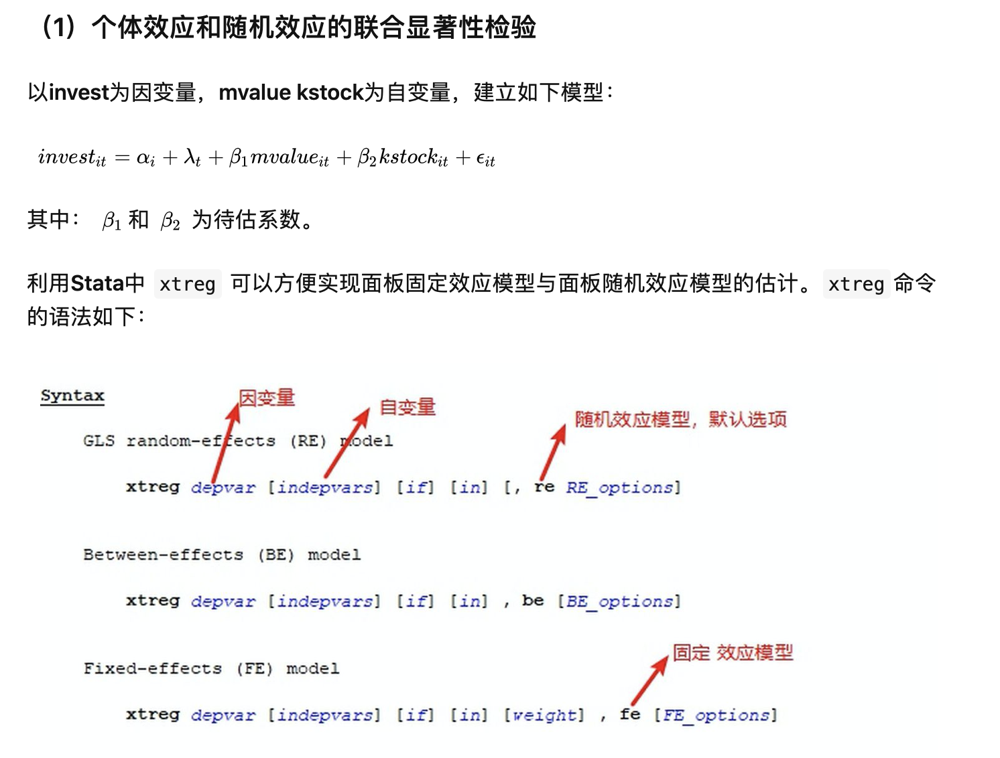
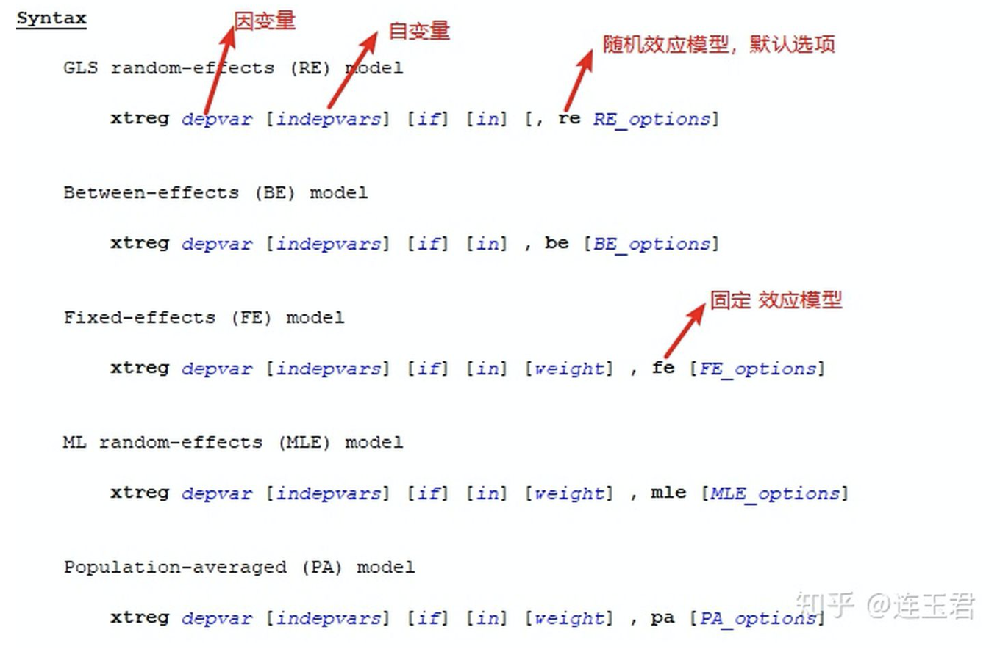
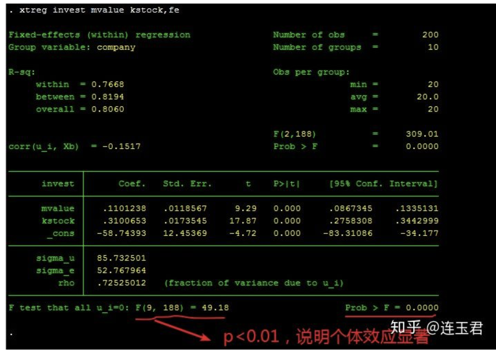
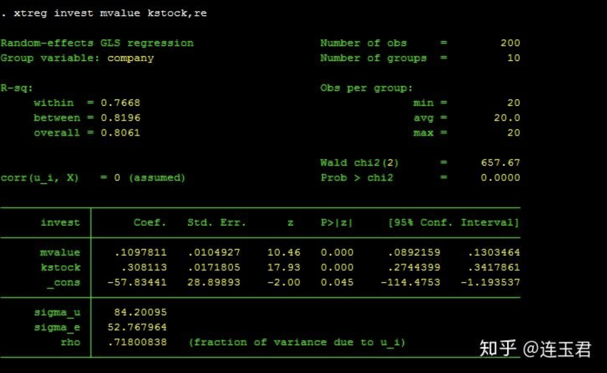
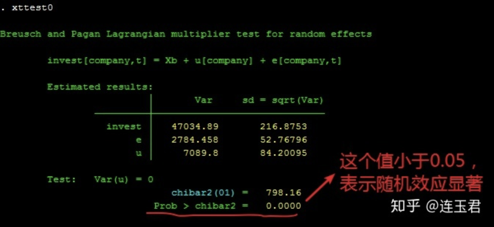

http://econometricstutorial.com/2015/03/panel-data-on-stata-fe-re/

xtset id time [,delta()] 

表示id是截面变量，time是时间变量，[]中的部分是可选项，表示时间变量可以不连续，如每隔3天取一个样本就是delta（3）

常见的数据形式有时间序列数据( Time series data )，截面数据( Cross-sectional data )和面板数据( Panel data )。



例如，欲研究影响企业利润的决定因素，我们认为企业规模 (截面维度)和技术进步(时间维度)是两个重要的因素。截面数据仅能研究企业规模对企业利润的影响程度，时间序列数据仅能研究技术进步对企业利润的影响，而面板数据同时考虑了截面和时间两个维度 (从哪个维度看都好看)，可以同时研究企业规模和技术进步对企业利润的影响。

正因为面板数据所具有的独特优势，许多模型从截面数据扩展到面板数据框架下。通过 `findit panel data` 命令可以发现目前Stata已有许多相关面板数据模型命令，包括(不限于)：

`xtreg` :普通面板数据模型，包括固定效应与随机效应


```
reghdfe: 多维固定效应模型 
xtabond/xtdpdsys/xtabond2/xtdpdqml/xtlsdvc：动态面板数据模型 
spxtregress/xsmle: 空间面板数据模型 
xthreg:面板门限模型 
xtqreg/qregpd/xtrifreg: 面板分位数模型 
xtunitroot: 面板单位根检验 
xtcointtest/ xtpedroni/xtwest: 面板协整检验 
sfpanel: 面板随机前沿模型 
xtpmg/xtmg：非平稳异质面板模型
```


##### 读取数据与面板数据设定

```
webuse grunfeld,clear //利用webuse从网络读取数据
list in 1/10          // 显示该数据集的前10行
xtset company year,yearly //设置面板数据格式，利用 Stata 中`xt`开头的命令，必须用该命令进行设置。yearly表示年度数据，详细参考 `help xtset`
```


#### 本部分内容安排如下：

（1）个体效应和随机效应的联合显著性检验，以判别是否需要利用面板数据模型；

（2）若表明需用面板数据模型，利用**Hausman**统计量选择固定效应模型或随机效应模型更优；

（3）考虑到一般的**Hausman**检验在异方差和自相关情况下失效风险问题，对异方差，序列相关进行检验，以说明是否需要利用其它方法进行选择；

（4）针对一般的**Hausman**检验统计量可能为负值且对在异方差和序列相关情况不稳健问题，对**稳健 Hausman 检验**，修正的 **Hausman**统计量, **基于过度识别检验的Wald统计量法**，**Mundlak’s (1978)法**，**基于 bootstrap法的hausman检验**等方法的**Stata**实现进行讲解。

（5）在选定固定效应模型或随机效应模型后，依据误差项结构（异方差，序列相关，截面相依）以及不同面板结构（「大 T 小 N」，「大 N 小 T 」）， 介绍相应的参数估计命令。




```stata
xtreg invest mvalue kstock,fe //fe表示固定效应;若同时包括时期虚拟变量，
xtreg invest mvalue kstock i.year,fe，利用 testparm 检验
```



```text
xtreg invest mvalue kstock,re //re表示随机效应
```




```text
xttest0  //检验随机效应是否显著，需要运行随机效应模型后使用
```




#### **3）异方差和序列相关检验**

前文已经说明，当模型误差项存在序列相关或异方差时，此时经典的Hausman 检验不在适用，下面我们进行序列相关和异方差检验。

**序列相关检验**

