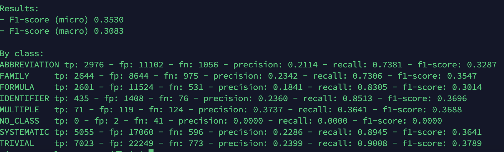

1gutO4zb6PuS0Vo7WVNwXAXGWCxFKKxh8GSKOe-GvJc4


```
miner = Miner(
    # ...
    sheet=GoogleSheet('1gutO4zb6PuS0Vo7WVNwXAXGWCxFKKxh8GSKOe-GvJc4', '/Users/hxwh/PycharmProjects/Model Fairness/Minetorch/theta-strata-283109-d8e86fc15085.json')
    
    # ...
)

miner.train()
```


Else, with BERT embeddings, you should experiment with fine-tuning by setting the fine_tune parameter to True:

```
bert_embedding = TransformerWordEmbeddings('bert-base-multilingual-cased', fine_tune=True)
```

You can specify the same thing with FlairEmbeddings:

```shell
CUDA_VISIBLE_DEVICES=3 python model_CHEMDNER_bert.py
CUDA_VISIBLE_DEVICES=2 python model_evaluation_CHEMDNER_bert.py
CUDA_VISIBLE_DEVICES=1 python model_evaluation_CHEMDNER.py

 bash test.sh
```


### CHEMDNER, 30605 train + 30693 dev + 198466 test sentences


Baseline model: 

```python
# 4. initialize sequence tagger
# embedding 
tagger: SequenceTagger = SequenceTagger(
	hidden_size=256,
	embeddings=embeddings,
	tag_dictionary=tag_dictionary,
	tag_type="ner",
	use_crf=True,
	locked_dropout=0.5,
	rnn_layers = 1 
)

# 5. initialize trainer
# algorithm
trainer: ModelTrainer = ModelTrainer(tagger, corpus)
trainer.train(
	base_path="taggers/CHEMDNER",
	train_with_dev=False,
	max_epochs=30,
	learning_rate=0.1,
	mini_batch_size=32,
	checkpoint=True
)
```


how to record training time


| NO.    | CHEMDNER Model  | Tunning Hyperparameter | Model Performance |
| :----- | :-------------: | ---------------------- | ----------------- |
| test 1 | embedding_types | word                   |                   |
|        | SequenceTagger  | rnn_layers = 3         |                   |
|        |  ModelTrainer   |                        |                   |
| test 2 | embedding_types | Bert, fine_tune        |                   |
|        | SequenceTagger  |                        |                   |
|        |  ModelTrainer   |                        |                   |
| test 3 | embedding_types | Word                   |                   |
|        | SequenceTagger  |                        |                   |
|        |  ModelTrainer   | optimizer = Adam       |                   |

| NO.    | CHEMDNER Model  | Tunning Hyperparameter | Model Performance |
| :----- | :-------------: | ---------------------- | ----------------- |
| test 4 | embedding_types | word + Flair           |                   |
|        | SequenceTagger  | rnn_layers = 3         |                   |
|        |  ModelTrainer   |                        |                   |
| test 5 | embedding_types | Bert, fine_tune        |                   |
|        | SequenceTagger  |                        |                   |
|        |  ModelTrainer   |                        |                   |
| test 6 | embedding_types | Word                   |                   |
|        | SequenceTagger  |                        |                   |
|        |  ModelTrainer   | optimizer = Adam       |                   |


##### Test 1


##### test 2 

same dataset??? 

### Question Section


### word


 Corpus: "Corpus: 30605 train + 30693 dev + 198466 test sentences"





