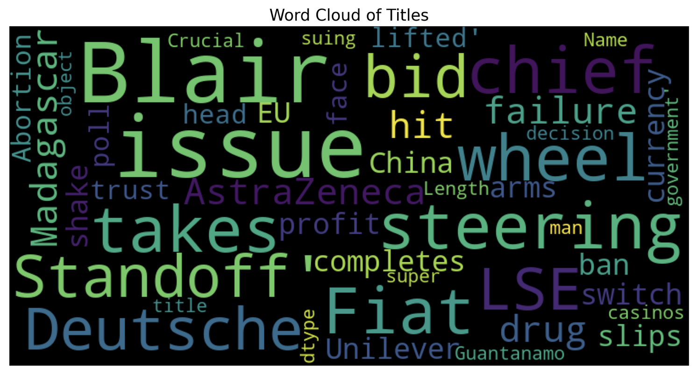
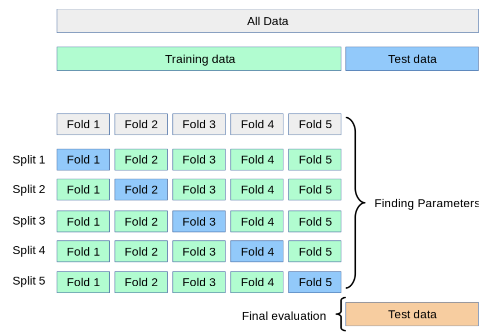
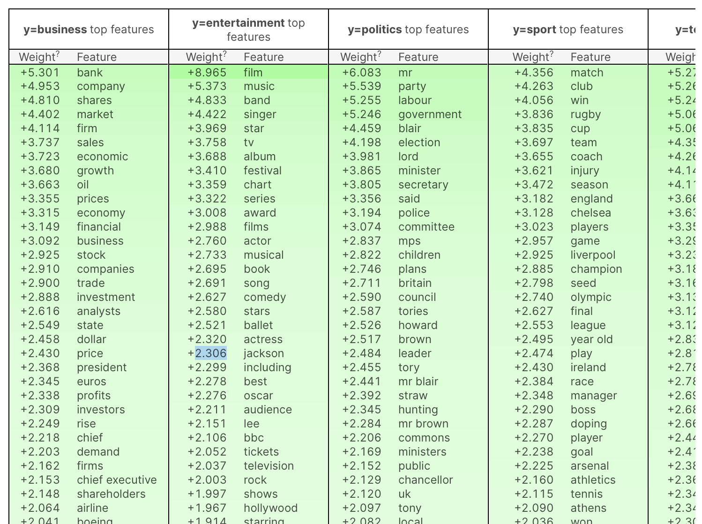
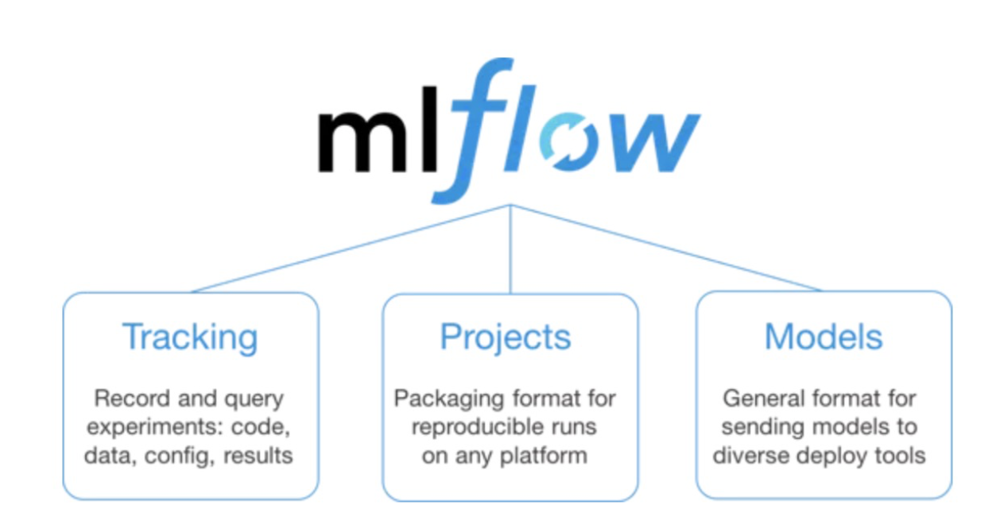
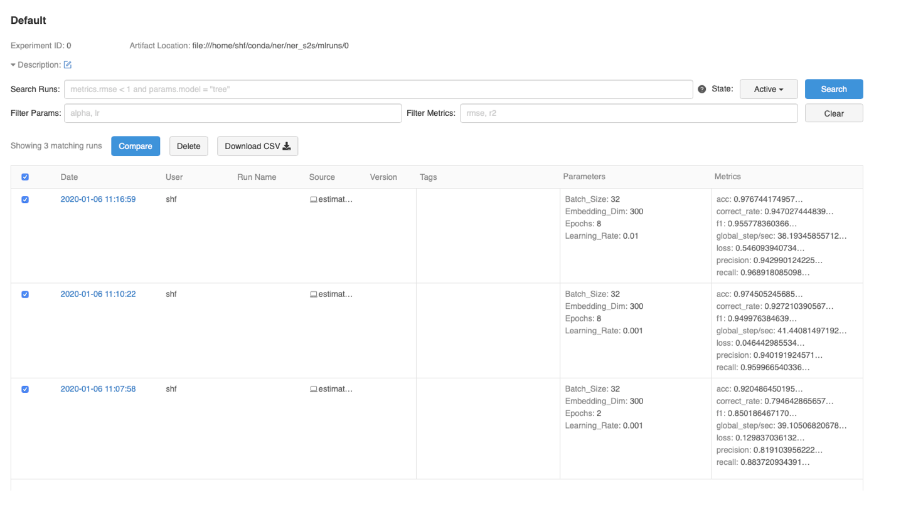

切片


公共方法 range

数据序列 

化简代码

nonlocal 

为了减少重复写代码，我们可以这样做，重新定义一个新的函数：专门处理日志 ，日志处理完之后再执行真正的业务代码


不定长参数？？？


**dict 什么意思

use_logging 就是一个装饰器，它一个普通的函数，它把执行真正业务逻辑的函数 func 包裹在其中，看起来像 foo 被 use_logging 装饰了一样，use_logging 返回的也是一个函数，这个函数的名字叫 wrapper。

*args，**kwargs


常见的内置装饰器有三种，@property、@staticmethod、`@classmethod`

Yaml 自动化测试


### How would you compare NLP libraries Spacy vs Flair ?


```
from flair.visual.training_curves import Plotter
plotter = Plotter()
plotter.plot_training_curves('classify/model/loss.tsv')
```


```
from flair.nn import Model

model = TextClassifier.load("classify/model/final-model.pt")

```

```
result = model.predict(corpus.test)
y_test = []
y_pred = []
for r in result:
    y_test.append(r.labels[0].value)
    y_pred.append(r.labels[1].value)
```

```
from sklearn.metrics import confusion_matrix, ConfusionMatrixDisplay

labels = label_dict.get_items()
cm = confusion_matrix(y_true=y_test, y_pred=y_pred, labels=labels, normalize='true')
cm_display = ConfusionMatrixDisplay(cm, display_labels=labels).plot()	
```




```
from wordcloud import WordCloud, STOPWORDS

# Thanks : https://www.kaggle.com/aashita/word-clouds-of-various-shapes ##
def plot_wordcloud(text, mask=None, max_words=200, max_font_size=100, figure_size=(24.0,16.0), 
                   title = None, title_size=40, image_color=False):
    stopwords = set(STOPWORDS)
    more_stopwords = {'one', 'br', 'Po', 'th', 'sayi', 'fo', 'Unknown'}
    stopwords = stopwords.union(more_stopwords)

    wordcloud = WordCloud(background_color='black',
                    stopwords = stopwords,
                    max_words = max_words,
                    max_font_size = max_font_size, 
                    random_state = 42,
                    width=800, 
                    height=400,
                    mask = mask)
    wordcloud.generate(str(text))
    
    plt.figure(figsize=figure_size)
    if image_color:
        image_colors = ImageColorGenerator(mask);
        plt.imshow(wordcloud.recolor(color_func=image_colors), interpolation="bilinear");
        plt.title(title, fontdict={'size': title_size,  
                                  'verticalalignment': 'bottom'})
    else:
        plt.imshow(wordcloud);
        plt.title(title, fontdict={'size': title_size, 'color': 'black', 
                                  'verticalalignment': 'bottom'})
    plt.axis('off');
    plt.tight_layout() 
```

```
plot_wordcloud(df["title"], title="Word Cloud of Titles")
```


### Hyper-Parameter Tuning

By partitioning the available data into three sets, we drastically reduce the number of samples which can be used for learning the model, and the results can depend on a particular random choice for the pair of (train, validation) sets. A solution to this problem is a procedure called cross-validation (CV for short). A test set should still be held out for final evaluation, but the validation set is no longer needed when doing CV. In the basic approach, called k-fold CV, the training set is split into k smaller sets (other approaches are described below, but generally follow the same principles). The following procedure is followed for each of the k “folds”:

- A model is trained using of the folds as training data;
- the resulting model is validated on the remaining part of the data (i.e., it is used as a test set to compute a performance measure such as accuracy).

The performance measure reported by k-fold cross-validation is then the average of the values computed in the loop. This approach can be computationally expensive, but does not waste too much data.


### VALIDATION

#### Cross Validation

The simplest way to use cross-validation is to call the cross_val_score helper function on the estimator and the dataset.

**StratifiedKFold** is a variation of KFold. First, StratifiedKFold shuffles your data, after that splits the data into n_splits parts and Done. Now, it will use each part as a test set. Note that it only and always shuffles data one time before splitting.StratifiedKFold is a variation of KFold. First, StratifiedKFold shuffles your data, after that splits the data into n_splits parts and Done. Now, it will use each part as a test set. Note that it only and always shuffles data one time before splitting.



### INTERPRETATION

ELI5 is a Python package which helps to debug machine learning classifiers and explain their predictions.

There are two main ways to look at a classification or a regression model:

1. inspect model parameters and try to figure out how the model works globally;
2. inspect an individual prediction of a model, try to figure out why the model makes the decision it makes.

For (1) ELI5 provides eli5.show_weights() function;

for (2) it provides eli5.show_prediction() function.

```
eli5.show_weights(estimator=logit, 
                  feature_names= text_transformer.get_feature_names(),top=(50, 5))
```




### AutoSearch

运行所需的所有参数配置统一放在yaml文件中,一个合理配置的yaml文件，是成功完成搜索任务的前提。

#### yaml文件配置样例 

https://support.huaweicloud.com/engineers-modelarts/modelarts_23_0155.html

```yaml
general:
  gpu_per_instance: 1

search_space:
  - type: discrete
    params:
      - name: resnet50
        values: ["1-11111111-2111121111-211111", "1-1112-1111111111121-11111112111", "1-11111121-12-11111211", "11-111112-112-11111211", "1-1-111111112-11212", "1-1-1-2112112", "1-111211-1111112-21111111", "1-1111111111-21112112-11111","1-111111111112-121111111121-11","11-211-121-11111121", "111-2111-211111-211"]

search_algorithm:
  type: grid_search
  reward_attr: mean_accuracy

scheduler:
  type: FIFOScheduler
```

[自动化搜索作业简介](https://support.huaweicloud.com/engineers-modelarts/modelarts_23_0151.html)中介绍的四种使用场景，对于NAS、超参和自动数据增强这三种场景，在使用上的区别主要就是搜索空间与搜索算法不同。 定义一个搜索超参的搜索空间，再选择一个适合超参的算法，就可以做一次超参搜索。同样，定义一个搜索网络结构的搜索空间，再选择一个适合网络结构搜索的算法，就可以做一个NAS搜索。而对于多元搜索，就是在一次任务中提交多个配置文件，系统则会依次根据yaml文件来完成多元搜索。

#### 搜索空间配置

搜索空间通常包含多个变量，每个变量有各自的类型（离散型、连续性）和取值范围。yaml是按这种方式来抽象的，配置示例如下所示。

```yaml
search_space:
  - params:
    - type: discrete_param
      name: filter_size
      values: [3, 5, 7]
    - type: discrete_param
      name: activation
      values: [relu, sigmoid]
    - type: continuous_param
      name: blocks
      start: 2
      stop: 4
      num: 3
    - type: continuous_param
      name: learning_rate
      start: -1
      stop: -5
      num: 5
      base: 10
```

### search_algorithm


```python
# serialize model to YAML
with open("model.yaml", "w") as yaml_file:
    yaml_file.write(model_yaml)
```


Cloud AutoML（https://cloud.google.com/automl）是一套机器学习产品，通过利用 Google 最先进的元学习、迁移学习和神经架构搜索技术，使机器学习专业知识有限的开发人员也能根据业务需求训练高质量模型。Cloud AutoML 主要提供以下 3 个领域的 AutoML 服务：图像分类、文本分类以及机器翻译。在图像分类领域，谷歌提供了大量标注良好的人类图像供开发者使用，同时提供了标注工具允许开发者自行对图像进行标注。


### How To Structure Your PyTorch Project		

https://towardsdatascience.com/how-to-structure-your-pytorch-project-89310b8b2da9

https://gist.github.com/ferrine/89d739e80712f5549e44b2c2435979ef

https://www.shuzhiduo.com/A/o75NYGKXJW/


### 第13章 用序列化保存模型

- 使用JSON格式保存模型
- 使用YAML格式保存模型


## Log Analysis

https://zhuanlan.zhihu.com/p/67686187	




本文选取了Facebook的FBLearner（未开源），Databricks开源的MLFlow，以及Google开源的Kubeflow进行整理。

#### 一个最简单的workflow代码

从hive table拿数据 --> 数据清洗和模型实验等准备步骤 --> 准备production data table并从FBLearner UI中选取 --> 设置使用常用模型（FB家有很多模版比如最常用的Gradient Boosted Decision Trees），或者自己的模型pipeline，设置参数等 --> 点击训练 -->（超参训练） --> 生成模型artifact，大多时候ready for deployment可以一键部署，有的模型需要写C++代码部署（也是FB的一大特色，其他地方比较少见）--> 查看模型performance如ROC curve等。此外也支持多个模型相比较，在tracking这点上FBLearner是做得相当好的。





```
import fitlog

fitlog.commit(__file__)
"""
Your training code
"""
fitlog.finish()
```


`&`用来建立锚点（`defaults`），`<<`表示合并到当前数据，`*`用来引用锚点。


2、load_all()生成一个迭代器 


如果string或文件包含几块yaml文档，你可以使用yaml.load_all来解析全部的文档。

```
import yaml
f = '''
---
name: James
age: 20
---
name: Lily
age: 19
'''
y = yaml.load_all(f)
for data in y:
    print(data)
```

```python
{'name': 'James', 'age': 20}
{'name': 'Lily', 'age': 19}
```

```python
import yaml
aproject = {'name': 'Silenthand Olleander',
            'race': 'Human',
            'traits': ['ONE_HAND', 'ONE_EYE']
            }
f = open(r'E:\AutomaticTest\Test_Framework\config\config.yml','w')
print(yaml.dump(aproject，f))
```

```yaml
name: Silenthand Olleander
race: Human
```

yaml.dump_all()将多个段输出到一个文件中

```python
import yaml

obj1 = {"name": "James", "age": 20}
obj2 = ["Lily", 19]

with open(r'E:\AutomaticTest\Test_Framework\config\config.yml', 'w') as f:
    yaml.dump_all([obj1, obj2], f)
```

```yaml
{age: 20, name: James}
--- [Lily, 19]	
```


8、分段 
在同一个yaml文件中，可以用 — 来分段，这样可以将多个文档写在一个文件中

```yaml
---
name: James
age: 20
---
name: Lily
age: 19
```

构造器(constructors)、表示器(representers)、解析器(resolvers ) 

```
import yaml
class Person(yaml.YAMLObject):
    yaml_tag = '!person'

    def __init__(self, name, age):
        self.name = name
        self.age = age

    def __repr__(self):
        return '%s(name=%s, age=%d)' % (self.__class__.__name__, self.name, self.age)

james = Person('James', 20)

print (yaml.dump(james))  # Python对象实例转为yaml

lily = yaml.load('!person {name: Lily, age: 19}')

print (lily)  # yaml转为Python对象实例
```

https://blog.csdn.net/lmj19851117/article/details/78843486