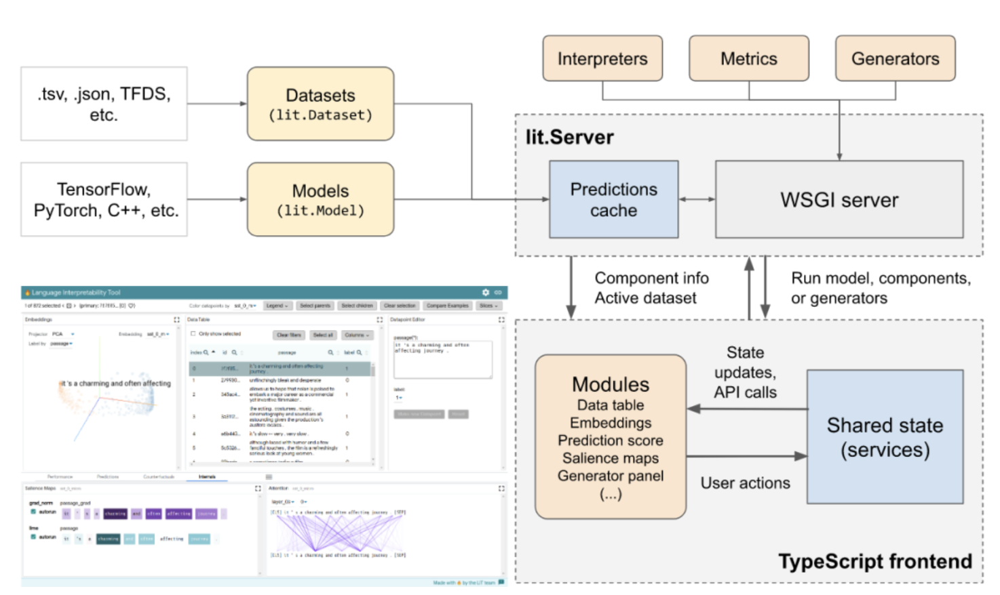

Train the model 

### python 获取当前目录和文件

https://www.jianshu.com/p/5a0415c1dab2

https://www.jianshu.com/p/bfa29141437e

### 第 5 章 自然语言处理

5.1 如何用Python做情感分析？ https://bookdown.org/wshuyi/dive-into-data-science-practically/nlp-in-python.html

https://www.jianshu.com/users/b4c5c6997170/liked_notes

### 谷歌开源NLP模型可视化工具LIT，模型训练不再「黑箱」

https://www.jiqizhixin.com/articles/2020-08-26-6

- 论文地址：https://arxiv.org/pdf/2008.05122.pdf
- 项目地址：https://github.com/PAIR-code/lit

