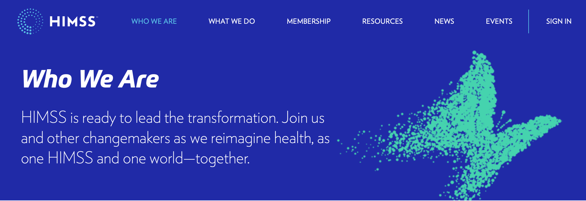
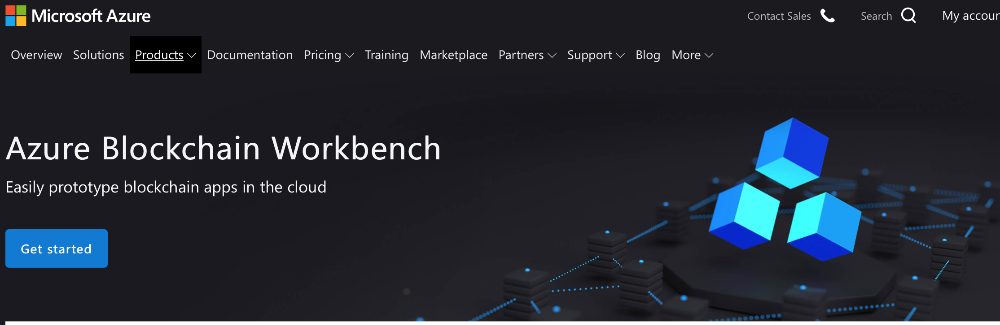

### [MART: Memory-Augmented Recurrent Transformer for Coherent Video Paragraph Captioning](https://www.aclweb.org/anthology/2020.acl-main.233.pdf)

[Auto-Encoding Scene Graphs for Image Captioning](https://openaccess.thecvf.com/content_CVPR_2019/papers/Yang_Auto-Encoding_Scene_Graphs_for_Image_Captioning_CVPR_2019_paper.pdf)

Video Description: [A Survey of Methods, Datasets and Evaluation Metrics](https://arxiv.org/pdf/1806.00186.pdf)

[Scene Graph Representation and Learning](https://cs.stanford.edu/people/ranjaykrishna/sgrl/index.html)

Images are more than a collection of objects or attributes，they represent a web of relationships among interconnected objects. 

[Graph Embeddings — The Summary](https://towardsdatascience.com/graph-embeddings-the-summary-cc6075aba007)

Social networks are large graphs of people that follow each other, biologists use graphs of protein interactions. They try to predict new friendships in social media, while biologists predict the protein’s functional labels. Mathematical and statistical operations on the graphs are limited and applying machine learning methods directly to graphs is challenging.  In this situation, embeddings appear as a reasonable solution.

What are graph embeddings?

Graph embeddings are the transformation of property graphs to a vector or a set of vectors. Embedding should capture the graph topology, vertex-to-vertex relationship, and other relevant information about graphs,...

https://www.youtube.com/watch?v=ERibwqs9p38

[Word2Vec Tutorial - The Skip-Gram Model](http://mccormickml.com/2016/04/19/word2vec-tutorial-the-skip-gram-model/)

Day365

https://ryanong.co.uk/2020/04/12/day-103-nlp-research-papers-utilizing-bert-for-aspect-based-sentiment-analysis-via-constructing-auxiliary-sentence/

Task 3 – [Dense-Captioning Events in Videos](http://activity-net.org/challenges/2019/tasks/anet_captioning.html)

###### [Abstract](https://cs.stanford.edu/people/ranjaykrishna/densevid/)

Most natural videos contain numerous events. For example, in a video of a “man playing a piano”, the video might also contain “another man dancing” or “a crowd clapping”. We introduce the task of dense-captioning events, which involves both detecting and describing events in a video. We propose a new model that is able to identify all events in a single pass of the video while simultaneously describing the detected events with natural language. Our model introduces a variant of an existing proposal module that is designed to capture both short as well as long events that span minutes. To capture the dependencies between the events in a video, our model introduces a new captioning module that uses contextual information from past and future events to jointly describe all events. We also introduce ActivityNet Captions, a large-scale benchmark for dense-captioning events. ActivityNet Captions contains 20k videos amounting to 849 video hours with 100k total descriptions, each with its unique start and end time. Finally, we report performances of our model for dense-captioning events, video retrieval and localization.

MART: Memory-Augmented Recurrent Transformer for Coherent Video Paragraph Captioning [Github](https://github.com/jayleicn/recurrent-transformer)

CVPR 2019视频描述（video caption）相关论文[总结](https://blog.csdn.net/sinat_35177634/article/details/89601950)

Video-Grounded Dialogues with Pretrained [Generation Language Models](https://www.aclweb.org/anthology/2020.acl-main.518.pdf)

Interesting paper regarding https://zhuanlan.zhihu.com/p/72008914

[Augmenting Self-attention with Persistent Memory](https://arxiv.org/abs/1907.01470)

a feed-forward layer and a self-attention layer->allows the network to capture long term dependencies and are often regarded as the key ingredient in the success of Transformers

we augment the self-attention layers with persistent memory vectors that play a similar role as the feed-forward layer. 

###### Analyzing Verbal and Nonverbal Features for Predicting [Group Performance](https://arxiv.org/abs/1907.01369)

[NLP每日论文速递[07.03]](https://zhuanlan.zhihu.com/p/72008914) https://www.zhihu.com/people/arxivdaily

###### [Covid-Transformer](https://arxiv.org/abs/2009.03947): Detecting Trending Topics on Twitter Using Universal Sentence Encoder

The novel corona-virus disease (also known as COVID-19) has led to a pandemic, impacting more than 200 countries across the globe. With its global impact, COVID-19 has become a major concern of people almost everywhere, and therefore there are a large number of tweets coming out from every corner of the world, about COVID-19 related topics. In this work, we try to **analyze the tweets and detect the trending topics and major concerns of people on Twitter**, which can enable us to better understand the situation, and devise better planning. More specifically we propose a model based on the universal sentence encoder to detect the main topics of Tweets in recent months. We used universal sentence encoder in order to derive the semantic representation and the similarity of tweets. We then used the **sentence similarity and their embeddings**, and **feed them to K-means clustering algorithm to group similar tweets** (in semantic sense). After that, the cluster summary is obtained using a text summarization algorithm based on deep learning, which can uncover the underlying topics of each cluster. 

###### Quantifying the Effects of COVID-19 on [Mental Health Support Forums](https://arxiv.org/abs/2009.04008)

disease outbreaks is likely to have a profound effect on mental health. Understanding its impact can inform strategies for mitigating negative consequences.In this work, we seek to better understand the effects of COVID-19 on mental health by examining discussions within mental health support communities on Reddit.

###### Exploiting Multi-Modal Features From Pre-trained Networks for [Alzheimer's Dementia Recognition](https://arxiv.org/abs/2009.04070)

pre-trained networks to recognize desease with a small dataset provided by the ADReSS Challenge at INTERSPEECH 2020(acoustic and textual data)

###### ==Danish Stance Classification and [Rumour Resolution](https://arxiv.org/abs/1907.01304)==

*这篇文章与Presentation 1 特别像*

The Internet is rife with flourishing rumours that spread through microblogs and social media. Recent work has shown that analysing the stance of the crowd towards a rumour is a good indicator for its veracity. One state-of-the-art system uses an LSTM neural network to automatically classify stance for posts on Twitter by considering the context of a whole branch, while another, more simple Decision Tree classifier, performs at least as well by performing careful feature engineering. One approach to predict the veracity of a rumour is to use stance as the only feature for a Hidden Markov Model (HMM).

###### ==[Constructing large scale biomedical knowledge bases](https://arxiv.org/abs/1907.01417) from scratch with rapid annotation of interpretable patterns==

**Knowledge base construction** is crucial for **summarising, understanding and inferring relationships between biomedical entities**. However, for many practical applications such as **drug discovery,** the scarcity of relevant facts (e.g. **gene X is therapeutic target for disease Y**) severely limits a domain expert's ability to create a usable knowledge base, either directly or by training a relation extraction model. 
In this paper, we present a simple and effective method of **extracting new facts with a pre-specified binary relationship type from the biomedical literature**, without requiring any training data or hand-crafted rules. Our system discovers, ranks and presents the most salient patterns to domain experts in an interpretable form. By marking patterns as compatible with the desired relationship type, experts indirectly batch-annotate candidate pairs whose relationship is expressed with such patterns in the literature. Even with a complete absence of seed data, **experts are able to discover thousands of high-quality pairs with the desired relationship within minutes**. When a small number of relevant pairs do exist-even when their relationship is more general (e.g. gene X is biologically associated with disease Y) than the relationship of interest - our system leverages them in order to i) learn a better ranking of the patterns to be annotated or ii) generate weakly labelled pairs in a fully automated manner. 
We evaluate our method both intrinsically and via a downstream knowledge base completion task, and show that it is an effective way of constructing knowledge bases when few or no relevant facts are already available.

Extracting interpretable patterns， described as a hypothet- ical proposition “if P then Q”

###### [Building The LinkedIn Knowledge Graph](https://engineering.linkedin.com/blog/2016/10/building-the-linkedin-knowledge-graph)

###### **[relation-extraction-rnn](https://github.com/AnthonyMRios/relation-extraction-rnn)**

## [Anthony Rios, Ph.D.](https://business.utsa.edu/faculty/anthony-rios-ph-d/)

https://github.com/AnthonyMRios?tab=repositories

**Contextual Word Representations with BERT and Other Pre-trained Language Models**

cs224n/slides/Jacob_Devlin_BERT

https://web.stanford.edu/class/cs224n/slides/Jacob_Devlin_BERT.pdf

https://tuixue.online/visa/

ashley.wallace@utsa.edu

Application ID **AA009T88WX**

https://web.stanford.edu/class/cs224n/slides/Jacob_Devlin_BERT.pdf

https://drive.google.com/file/d/1T0agNwFhYRs5Brj2Spn0gjmSyEalA5UP/view

CS 372 Lecture

https://www.bcbstx.com/ut/coverage

###### [How GPT3 Works - Visualizations and Animations](http://jalammar.github.io/how-gpt3-works-visualizations-animations/)

###### [The Illustrated BERT, ELMo, and co. (How NLP Cracked Transfer Learning)](http://jalammar.github.io/illustrated-bert/)

###### [Understanding Sentiment Analysis in Social Media Monitoring](https://unamo.com/blog/social/sentiment-analysis-social-media-monitoring)

###### Stanford CS230: Deep Learning | Autumn 2018 | Lecture 8 - Career Advice / Reading Research Papers

https://www.youtube.com/watch?v=733m6qBH-jI

https://deeps.site/blog/2019/10/14/reading-research-papers-career-advice/

https://mp.weixin.qq.com/s/GKgwudxwUN4kvZfjeoUdEg

###  healthcare & interested in blockchain

###### [Dive into blockchain for healthcare with the HIMSS blockchain webinar](https://azure.microsoft.com/ja-jp/blog/dive-into-blockchain-for-healthcare-with-the-himss-blockchain-webinar/)

https://www.himss.org/who-we-are

https://azure.microsoft.com/en-us/features/blockchain-workbench/

https://www.thejournalofprecisionmedicine.com/the-data-powered-patient-precision-medicine-enabled-by-decentralized-identity-and-blockchain/

###### [Understanding Blockchain’s Watershed Moment Happening in Healthcare](https://www.cleardata.com/podcast/understanding-blockchain-healthcare/)

In this episode of my podcast series of CTO Talk on HealthcareNOW Radio, I had the chance to connect with David Houlding, CISSP CIPP. David is the Director of Healthcare Experiences for Microsoft Azure, and has focused much of his impressive career on privacy, security, and compliance in healthcare. 

One use case he shares that made a lot of sense to me is that of a patient getting an **x-ray at Provider XYZ**. Should Provider XYZ **store** the x-ray on their **blockchain?** **No**, says David. It’s too hard to protect and it’s too heavy for the resources blockchain would need to take on heavy data like imaging. Instead, he suggests **using the blockchain to *store the metadata about the x-ray***, and providence information such as a pointer to which provider has it, and what kind of x-ray it is. Then, when the patient goes to another provider for another x-ray, that new provider can see on the chain that they can reach out directly to Provider XYZ with a peer to peer secure request for the image.(mitigate risk.)

We also talk about compliance and why you should think about it early in the blockchain process, because although your nodes may start out local, even within one or two states, your chain can quickly grow to include regional, national, and international boundaries. At that point, data locality and sovereignty concerns come into play with GPDR and other regulations.

Is blockchain the be-all **end-all** for healthcare data sharing? No, but it is a great way to share the right data in order to speed scaling, bust silos and reduce cost. It’s absolutely showing business value in improving patient outcomes and experiences as well. You just have to do it thoughtfully, and David offers some great advice for how to approach your blockchain initiatives in this session.

[Understanding Blockchain’s Watershed Moment Happening in Healthcare](https://www.cleardata.com/podcast/understanding-blockchain-healthcare/)

so blockchain is this decentralized network there's no central node, think of blockchain as a sort of collaboration superhighway and the on ramp and off ramp for each organization is their blockchain node. This is actually a process that can run in your DMZ on prem or can run in the cloud of course Azure is one cloud that runs blockchain nodes pretty much any type of blockchain you like, well then in Azure. **These blockchain nodes are the things that connect to your enterprise system**, a blockchain really doesn't have much user interface right the interfaces the enterprise systems. Look, you could put a mobile app and some of it you can put a website in front of it but blockchain is really connecting it on the back end of the servers and so each of these **blockchain node processes** that can run in the DMZ or in the cloud, it's sitting on top of what we call a shared ledger, think of that as a copy of a type of storage it's **not really a database** it's more like a ledger **like a linear record of transactions**, and you know the different nodes of a blockchain. 

Think of this as a blockchain Island, where you know there's a defined set of organizations that are connecting to that particular blockchain Island, and they all know each other, they're all well known to each other they're all highly trusted they have a business need to know. 

but you know private consortium blockchains like we're seeing in health care, they do not have any notion of mining. And so there's no significant additional power consumption or hardware. And so the notion that blockchain is green does not apply to enterprise use of blockchain. That makes sense not. layered view of blockchain:  b2b networks across these consortiums and healthcare organizations 

Lastly, artificial intelligence and machine learning is this phenomenal opportunity to power AI and machine learning to the next level with blockchain. You know those are super data hungry, and right now most AI efforts are joining just from one organization from one side, but if we could draw data from across the consortium, we could build shared models we could collaborate on testing and test results and validation and we could do it much better as a team as a consortium of healthcare rather than each one going in a month so that's kind of the layered view opportunity around blockchain but let's I'll pause there for a moment, not just to see if you have any questions on that otherwise we can segue into the privacy, security compliance.

 you start thinking about putting big data like genomics and diagnostic imaging of blockchain. That's not a good thing for performance standpoint, or privacy, security compliance so think about your use case. And what's the middle but sufficient data to put on the blockchain and limited that like field by field, do we need this particular field on the blockchain to enable this use case if the answer's no. Leave that data in the enterprise systems, keep the PII off blockchain. Keep the pH I of blockchain wherever possible, you still need to have identifiers on blockchain but those can be opaque alone 

And that's actually a really important trust building mechanism, right, is doing that proactively sharing across the consortium helps the, the consortium members understand that, hey, everybody's got an adequate level of security everybody's compliant with regulations. We all have the same common interests around the use case the business value it just makes it easier to build trust in contrast, if there is a breach and it impacts all consortium badly that could really change and potentially destroy a blockchain collaboration, that was security. Any questions on that.

the kind of information that actually should go on the blockchain is ==high level lightweight metadata==, like what type of data exists, where does it exist like a pointer hash code to verify the integrity of the data cryptocurrencies and tokens provenance information audit information. These are great types of information to go on blockchain.==In contrast==, keep the PII off, keep the PHR like helps heavy pH I data like, especially diagnostic imaging genomics, that kind of thing. It's too heavy for blockchain even, aside from the privacy, security compliance you know blockchain remember every time you add data to that ledger it's going to be replicated around the entire blockchain network, you might start small and have a small pilot but imagine what you grow internationally and his thousands of blockchain nodes and every time somebody had something that's got to go run all of those nodes right that's a huge load. So from a performance standpoint we want to keep the blockchain data very lightweight So one example of a use case for blockchain is, you know, decentralized record location service to facilitate Health Information Exchange, you go to a provider, they take an X ray, what goes on blockchain is nothing extra itself, but metadata and X ray was taken for this patient again, social security number, date of birth etc opaque benign identifier and blockchain for that patient that can be resolved to PII off chain, but you know metadata about the X ray Was it the torso etc resolution machine, you know, **all provenance information** that appoints your had exists at XYZ health system and a hash code at that X ray to verify its **integrity** and then that's what can go on blockchain that patient goes to another provider that provider looks on the blockchain What do we know about this patient, or there's an X ray from last week to this other health system that's, we should get them to treat this patient, they can initiate a secure direct peer to peer request to that first health system to get that x ray, and that direct peer to peer request the conveyance of that **actual X ray does not need to happen via blockchain right that can happen secure direct peer to peer through a secure REST API** or otherwise, so blockchain forms this little cog in the middle that facilitates the storing of the metadata, but also the search discovery and subsequent secure direct peer to peer exchange. Does that make sense.