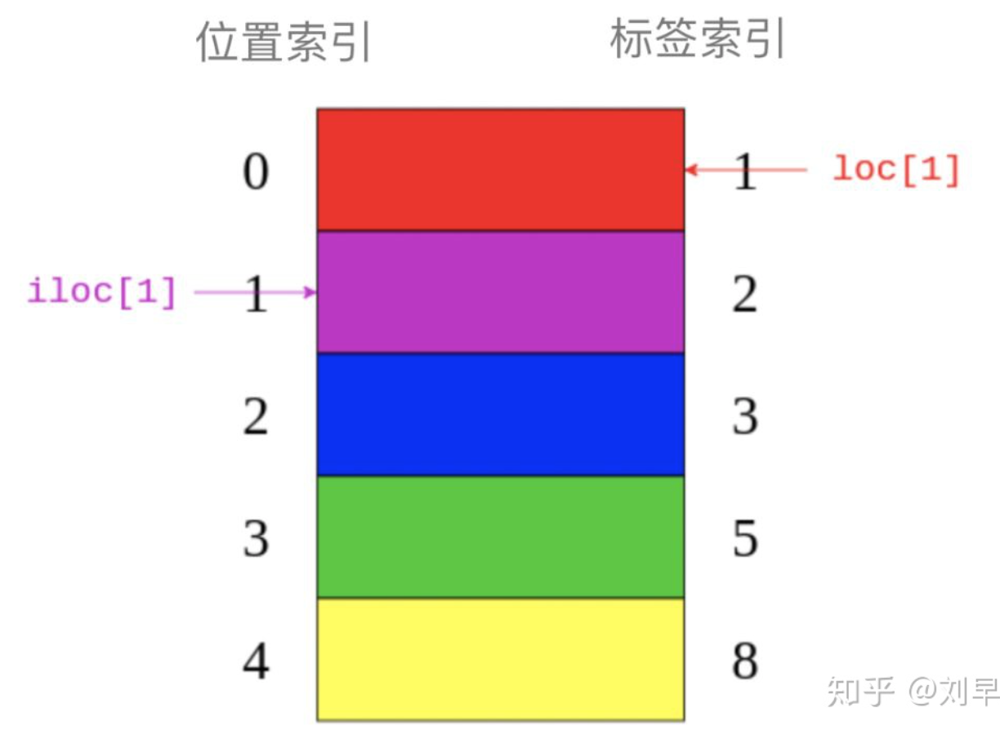

# 知识要点回顾

- ##### [Python数据分析--NumPy+Pandas基本语句](https://zhuanlan.zhihu.com/p/94267916)

- ##### [Python中list（列表）、dict（字典）、tuple（元组）、set（集合）详细介绍](https://zhuanlan.zhihu.com/p/59740559)




- ##### [Python3 List append()方法](https://www.runoob.com/python3/python3-att-list-append.html)


```python
# append() 方法用于在列表末尾添加新的对象
list1 = ['Google', 'Runoob', 'Taobao']
list1.append('Baidu')
print ("更新后的列表 : ", list1)
```