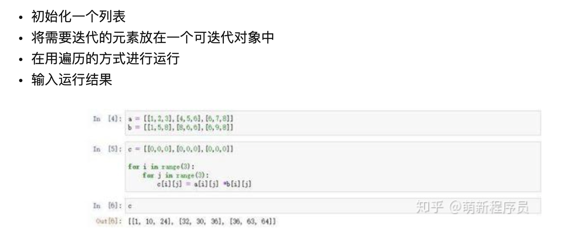
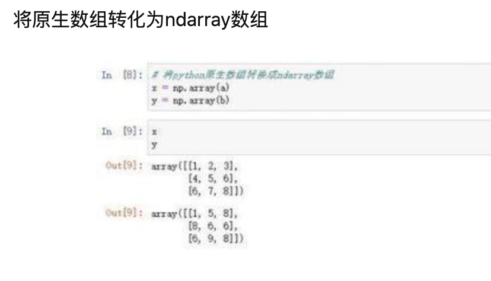
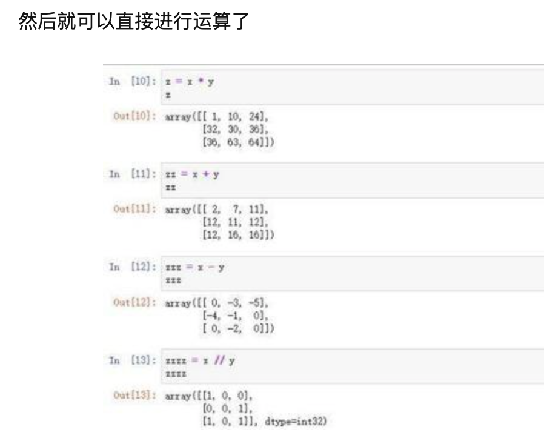
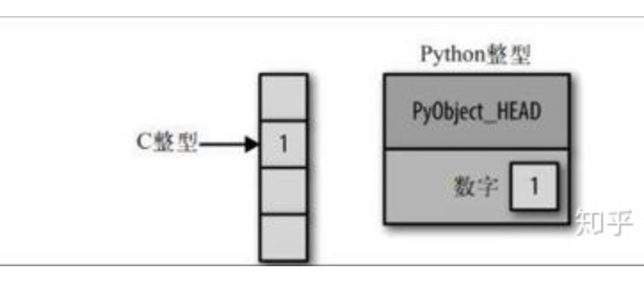
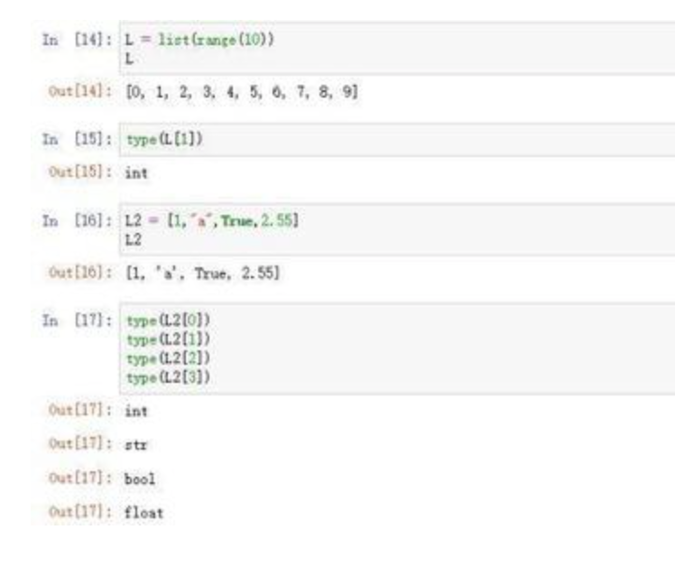
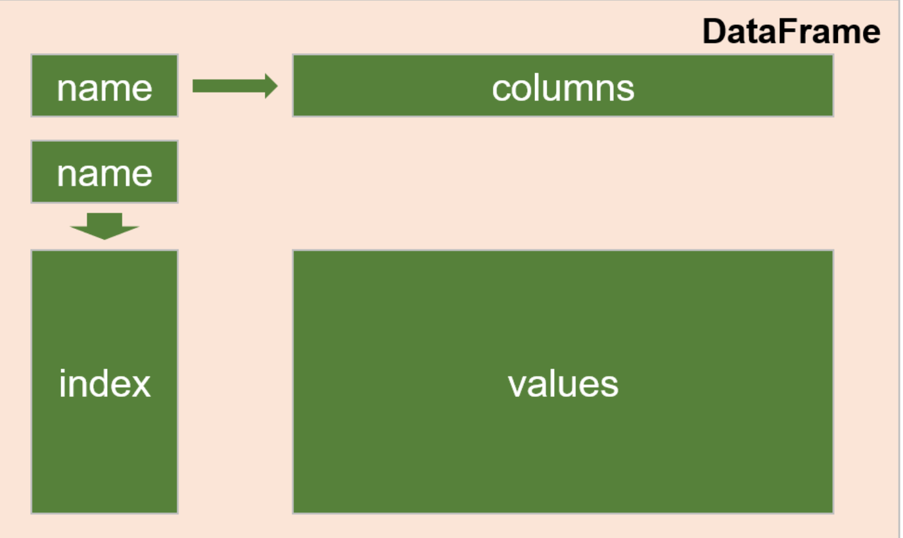
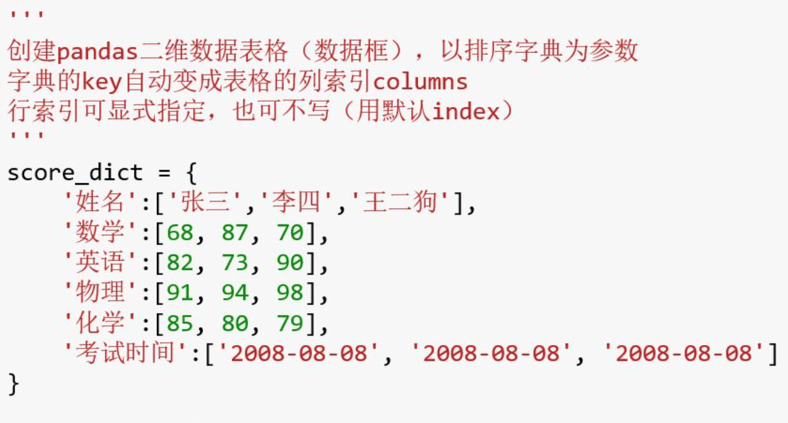
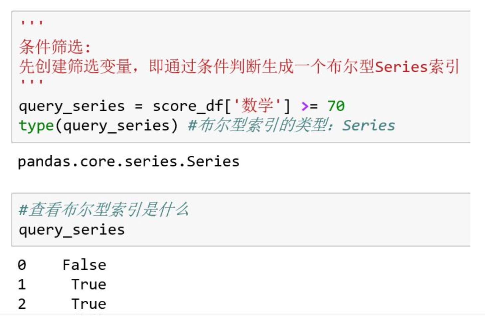

Code 

```python
# 添加环境变量，即可：
export PATH=~/miniconda3/bin:$PATH
# 选取所需的python版本：
conda create -n scispacy python=3.6.9 anaconda
# 激活新环境：
source activate scispacy
# 退出当前环境：
conda deactivate
# 列出所有环境（当前环境前面有*符号）：
conda info --envs
# 检查环境内的包：
conda list
# 安装包，不加参数name，则安装在当前环境：
conda install --name base beautifulsoup4
# 卸载包：
conda remove -n base beautifulsoup4
# 移除一个环境：
conda remove -n python3 --all
# freeze环境及安装所有：
pip freeze > requirements.txt
pip install -r requirements.txt

source ~/.bash_profile
```

###### Condo instal pandas

https://pandas.pydata.org/pandas-docs/stable/getting_started/install.html

###### [[译\]27 个Jupyter Notebook的小提示与技巧](http://liuchengxu.org/pelican-blog/jupyter-notebook-tips.html)

###### [scispacy 0.2.5](https://pypi.org/project/scispacy/)

| 149.165.168.64:2345  | Sercan   |
| -------------------- | -------- |
| 149.165.168.24:2345  | Wala     |
| 149.165.168.120:2345 | Jesus    |
| 149.165.170.45:2345  | Joseph   |
| 149.165.168.90:2345  | John     |
| 149.165.168.128:2345 | Ian      |
| 149.165.168.175:2345 | DeRail   |
| 149.165.171.116:2345 | Alexis   |
| 149.165.168.34:2345  | Xingmeng |

 passcode: utsasecureailabjupyterforyear2020


读取csv或者excel文件为DataFrame格式

```
df``=``pd.read_csv(``'D:/Program Files/example.csv'``)
```

　　excel一个表格中可能有多个sheet，sheetname可以进行选取

```
df ``=` `df.read_excel(``'D:/Program Files/example.xls'``,sheetname``=``0``)
```

　　

这两个函数分别是 读入一行数据，读入多行数据

readline()和readlines()

很清楚看到readline和**readlines**都是将数据存在一个list中，*不同的是readline的一行数据是一个list*

Python strip() 方法用于移除字符串头尾指定的字符（默认为空格或换行符）或字符序列。

```python
txt = "Google#Runoob#Taobao#Facebook"  
# 第二个参数为 1，返回两个参数列表 
x = txt.split("#", 1)  
print x
```

```
['Google', 'Runoob#Taobao#Facebook']
```


从python2.5开始，你可以避免显式地使用file.close()函数，如果采用with语句的话。如下所示：

```python
import os
os.chdir("d:\\")
with open("temp.txt") as f:
    for line in f:
        print line
```

append() 方法用于在列表末尾添加新的对象。

```python
#!/usr/bin/python3

list1 = ['Google', 'Runoob', 'Taobao']
list1.append('Baidu')
print ("更新后的列表 : ", list1)
```

```python
更新后的列表 :  ['Google', 'Runoob', 'Taobao', 'Baidu']
```

可以使用tolist()函数转化为list

```python
dimensions = food_info.shape
```

Pandas与Numpy一样，用dtype属性来显示数据类型，Pandas主要有以下几种dtype：

- object -- 代表了字符串类型
- int -- 代表了整型
- float -- 代表了浮点数类型
- datetime -- 代表了时间类型
- bool -- 代表了布尔类型

这里的套路是：首先要定义一个叫 gdp 的字典名称，DataFrame 是一个有魔法的固定词汇，数据表格的意思，也就是用它来赋值代码，输出的结果是一个表格，这可是在 python 中的表格～

强制转换 gdp 这个字典为 DataFrame 的格式，等同于 被赋值的 gdp 的 DataFrame 数据表格。我的理解啊～

```python
gdp_df=pd.DataFrame(gdp)
```

**修改行和列的标签**

这里通过 index 和 columns 的索引修改相应的内容，把黑体的内容首字母全部换成大写了。

其实就是，要是需要修改表格内的内容，要在代码行重新输入新的值，然后运行就能修改 Python 表格中的内容了。


### Pandas series

> pandas 中的 series 对象是另一个重要的数据结构
> 你可以将其视为一个一维的 DataFrame 或者一个一维数组（array）加上一个索引（index）
> 在这节课后半部分，我们将展示 series 在数据过滤和分组运算中起到作用

DataFrame 是二维的数据，Series 是一维数据，是一个数列类型。Series 可以看作是DataFrame 表格中的某一列

### 数据的选择

df [ ['column_name'] ] —— 选取列，生成 **DataFrame** 格式数据（如果只是用 [ ] 则产生一个series）；
df [ 'column_name' ] —— 选取列，生成 **Series** 格式数据；
df.column_name —— 选取列，生成 **Series** 格式数据

使用 loc 和 iloc 方法，选择行和列：
df.loc[ ] —— 使用行和列的**标签索引**选取数据
df.iloc[ ] ——使用行和列的**数值索引**选取数据


###### Numpy中的array所存放的数据类型必须全部相同

在list中的数据类型保存的是数据所存放的地址，简单的说就是指针，并非数据，这样保存一个list就太麻烦了，例如list1=[1,2,3,'a']需要4个指针和四个数据，增加了存储和消耗cpu。

**Python列表和Numpy数组的区别：**

Numpy使用==np.array==对象来处理多维数组，该对象是一个快速而灵活的大数据容器。使用Python列表可以存储一维数组，通过列表的嵌套可以实现多维数组，那么为什么还需要使用Numpy呢？Numpy是专门针对数组的操作和运算进行了设计，所以数组的存储效率和输入输出性能远优于Python中的嵌套列表，数组越大，Numpy的优势就越明显。通常Numpy数组中的所有元素的类型都是相同的，而Python列表中的元素类型是任意的，所以在通用性能方面Numpy数组不及Python列表，但在科学计算中，可以省掉很多循环语句，代码使用方面比Python列表简单的多。

Numpy matrices必须是2维的,但是 numpy arrays (ndarrays) 可以是多维的（1D，2D，3D····ND）. Matrix是Array的一个小的分支，包含于Array。所以matrix 拥有array的所有特性。

在numpy中matrix的主要优势是：相对简单的乘法运算符号。例如，a和b是两个matrices，那么a*b，就是矩阵积。

matrix 和 array 都可以通过objects后面加.T 得到其转置。但是 matrix objects 还可以在后面加 .H f得到共轭矩阵, 加 .I 得到逆矩阵。

相反的是在numpy里面arrays==**遵从逐个元素的运算**==，所以array：c 和d的c*d运算相当于matlab里面的c.*d运算。而矩阵相乘，则需要numpy里面的dot命令 。

通过下面的两条命令轻松的实现两者之间的转换：np.asmatrix和np.asarray

numpy 中的array与numpy中的matrix的最大的不同是，在做归约运算时，array的维数会发生变化，但matrix总是保持为2维。例如下面求平均值的运算.

Numpy,是python中的一个矩阵计算包,功能类似matlab的矩阵计算

numpy提供了两种基本的对象:ndarray(N-dimensional array object)和ufunc(universal function object)。Ndarray(下文统一称为数组)是存储单一数据类型的多维数组(同C语言数组直接保存数值),而ufunc则是能够对数组进行处理的函数。

Numpy和pandas有什么关系呢,numpy是做数据计算,pandas是做数据处理,pandas是在numpy的基础上,处理的类似excel和数据库的记录,比如多了index和column。

那么我们为什么要学习numpy呢,通常情况下我们获取数据的方式不同，得到的数据的各式就会多种多样，比如：文档集合、图像集合、声音片段集合等等。虽然这些数据存在明显的异构性，但将他们都处理或者看做为数字数组时，就会更易于理解和处理。举个例子：

- 声音片段：可以看作为时间和强度的一位数组
- 图像集合：可以看做存储不同区域像素值的二维数组
- 文本：可以通过各种方式处理成数值数组形式的可分析数据。

因此，学会高效的存储和操作数组是我们进行数据科学学习的绝对基础过程。虽然在某种程度上，Numpy数组与python内置的列表类型十分相似。但是随着数组在维度上不断变大，Numpy数组供了更强大的、更高效的存储和数值操作。Numpy几乎是整个python数据科学工具生态系统的核心。因此，不管我们对数据科学的哪个方面感兴趣，多花点时间去学习高效实用Numpy，都是很值得且必要的。

NumPy 数组中的元素都需要具有 **相同的数据类型** ，因此在存储器中将具有相同的大小。 **数组的元素如果也是数组** （可以是 Python 的原生 array，也可以是 ndarray）的情况下，则构成了 **多维数组** 。

NumPy 数组便于对 **大量数据** 进行 **高级数学** 和其他类型的操作。通常，这样的操作比使用Python的内置序列可能 **更有效** 和 **更少的代码** 执行。

- 越来越多的用python做数据科学和数学相关的工作者都开始使用NumPy的ndarray数组代替python原生的array数组，所以学会 Numpy 的使用是必要的 。



但是如果使用numpy实现的话,可以直接使用==矢量化==功能:
首先将导入numpy模块





==矢量化代码==有很多优点，其中包括：

- 矢量化代码更简洁易读
- 更少的代码行通常意味着更少的错误
- 该代码更接近地类似于标准数学符号（使得更容易，通常，以正确地编码数学构造）
- 矢量化导致更多的“Pythonic”代码。如果没有向量化，我们的代码将会效率很低，难以读取for循环。

---

要实现高效的数据驱动科学和计算，需要理解**数据是如何被存储和操作**的。接下来的内容，我们会对比python语言处理数组的过程，找出numpy的改进之处，这将是我们理解numpy的基础。
python用户往往是被其易用性所吸引，其中一个易用指出就在于动态输入。不同于C语言和Java，**python在引用和定义变量之前不用提前指定变量类型**。python变量的类型来源于我们所赋的值的类型。我们可以这样去理解：
在C语言中和python中，变量的存储形式如下：



直观来说，就相当于pythpn存储数据的时候，需要耗费一定的内存去存储和数据相关的信息。而这些信息是C语言的写成的，而当我们去修改变量的值时，相当于重新创建了一个变量，会在自动跑一遍C的底层代码，将数据所有信息更新，而这些底层代码很复杂，不需要我们去写，而是在python设计之初就已经全部写好，我们只要去执行变量赋值的操作就ok。这也是python好用的点之一。
那我们现在就可以看看变量赋值这个python功能背后的高效C语言的的伪代码：

 

- 一个引用计数，帮助python默默分配和处理内存以及分配和回收。
- 将变量的类型编码（type）
- 指定接下来的数据成员大小（len）
- 实际的整型值

而上述说到的除了值的额外信息

2、列表和数组的区别于联系

列表和数组都是用来存储一些列的元素的，不同点在于，**数组**这个容器要求当中的元素必须保持同一数据类型，且是**数字**，而**列**表就不一样了，可以容纳**多种**不同的数据类型。
但我们在开篇有说到，当我们将数据处理成数值时，方便计算和其他操作。这个时候，我们需要的容器只要可以存储数值就可以，使用列表则或耗费一定的空间去存储每一个元素的“其他信息”，但当所有的元素都是数值时，这种存储方式显然不够高效。
下面我们举个例子说明：



==动态数据类型==与python的array数组和Numpy的ndarray这些不可变数据类型的适用场景：

- list等可变数据类型**适用于需要不断对原始数据进行修改的场景**。修改时的操作在原始数据的本身进行
- array、ndarray这种不灵活的数据类型，**适用于我们想要保护原始数据不被修改的场景**。当对原始数组进行修改操作时，会自动新建一个数组。


###### [图解NumPy，这是理解数组最形象的一份教程了](https://www.jiqizhixin.com/articles/2019-07-12-4)

[**不自然的眨眼**](https://mp.weixin.qq.com/s?__biz=MzA3MzI4MjgzMw==&mid=2650769080&idx=2&sn=73b9eaf15c14b5cc01f84b0e2fc7c3c3&scene=21#wechat_redirect)

由于用来训练神经网络的图像数据往往是睁着眼睛的，因此 Deepfake 视频中人物的眨眼或不眨眼的方式通常是不自然的

去年，奥尔巴尼大学（University of Albany）的研究人员发表了一篇论文，提出了一种可以检测这种不自然眨眼的技术。有趣的是，这项技术使用的也是深度学习，和制作假视频的技术是一样的。研究人员发现，利用眨眼视频训练出的神经网络可以在视频中定位眨眼片段，找出非自然眨眼运动的一系列帧。结果发现，Deepfake 视频中人物的眨眼不符合正常的生理学规律，由此可以识别出哪些是原始视频，哪些是 Deepfakes 视频。

论文地址：https://arxiv.org/pdf/1806.02877.pdf

每个人都有独特的头部运动（如开始陈述事实时点头）和面部表情（如表达观点时得意得笑），但 Deepfakes 中人物的头部动作和面部表情都是原人物而非目标人物的。

基于此，加州大学伯克利分校的研究者提出了一种检测换脸的 AI 算法。其基本原理是：利用一个人的头部动作和面部表情视频训练一个神经网络，然后拿这个神经网络去检测另一个视频中的人物动作和表情是否属于这个人。模型准确率达到 92%。

- 论文地址：http://openaccess.thecvf.com/content_CVPRW_2019/papers/Media%20Forensics/Agarwal_Protecting_World_Leaders_Against_Deep_Fakes_CVPRW_2019_paper.pdf

###### [打击换脸技术滥用，谷歌发布大型数据集对抗deepfake](https://mp.weixin.qq.com/s?__biz=MzA3MzI4MjgzMw==&mid=2650771379&idx=5&sn=748c7e4678d8f1c521093c5cf8d5cedb&scene=21#wechat_redirect)

FaceForensics 基准数据集地址：https://github.com/ondyari/FaceForensics/

###### [==让UP主不再为剪视频发愁，百度等提出用AI自动截取故事片段==](https://www.jiqizhixin.com/articles/2019-11-11-3)

这是短视频盛行的时代。很多播主或 up 主生产内容的过程都是先从一段长视频截取所需的部分，再进行加工和编辑。近日百度等的 ICCV 论文提出了一种有望简化这一流程的 AI 方法，能自动帮助用户定位和截取视频中完整故事片段的起止位置。此外，他们还创建了一个供这类方法学习的数据集。

这篇论文引入了一个新问题，研究者将其称为「保留故事型长视频裁剪（story-preserving long video truncation）」，这需要算法将持续时间长的视频自动裁剪为多段有吸引力的短视频，而且其中每段短视频都包含一个不间断的故事。

论文链接：https://arxiv.org/pdf/1910.05899v1.pdf

这不同于传统的视频亮点检测或视频摘要问题，其中每段短视频都需要维持一个连贯且完整的故事，对于 YouTube、Facebook、抖音、快手等资源生产型视频分享平台而言，这种功能尤其重要。

保留故事型长视频裁剪问题的数学形式类似于时间动作定位（temporal action localization）问题。其训练数据集可以表示为：


https://www.jiqizhixin.com/articles/2019-11-11-3

###### [一文读懂「Attention is All You Need」| 附代码实现](https://www.jiqizhixin.com/articles/2018-01-10-20)


https://www.jiqizhixin.com/users/7f316f0c-8f72-4231-bb30-0eb1dd5a5660


###### [一文带你了解pandas的DataFrame](https://zhuanlan.zhihu.com/p/35592464)

https://zhuanlan.zhihu.com/p/35592464

在使用Python进行数据分析时，最常用的莫过于pandas包中的二维数据结构DataFrame（数据框），因为它可容纳不同的列数据类型，十分贴合实际应用。本文将带你走进pandas的DataFrame，来看看它到底是什么？

##### 1. 先聊聊numpy

pandas一维数据结构：Series（向量）

在创建Series向量的时候，向其传入一个array一维数组，然后可显式指定其索引index，如果不指定index，则系统默认生成整数型索引0 1 2 3……这里的索引index指的是行索引，行索引具有一个name属性，意思是index的名字，此处不懂没关系，在后面的DataFrame中也会继续讲到。下面几个图分别显示了：不指定index，指定index。

**DataFrame可以看成是由若干Series组合而成，这些Series共享同一index行索引**，列索引则包含所有Series的列名称，行索引和列索引均有name属性。

标准的DataFrame结构包含：

①数据内容部分df.values，它是一个numpy的ndarray类型

②行索引df.index，列索引df. columns

③行索引的名字df.index.name，和列索引的名字df.columns.name

结构图如下：



创建DataFrame可以将一个（有序）字典传入函数，字典的键key将自动变成数据框的列索引columns，如果不显式指定行索引index，则系统自动生成整数型行索引0 1 2 3……

创建示例：



此外，DataFrame还有一个特殊的筛选属性（条件筛选），可根据某一列满足某一条件，或整个数据框满足某一条件，然后生成一个布尔型索引，用于数据筛选。

例如：DataFrame的某一列与一个标量进行比较，生成一个布尔型Series索引，可将其传入df.loc中，筛选出满足条件的 行：




```python
baby_file = open('babynames_2010-2018.csv', 'r')
baby_csv = csv.reader(baby_file, delimiter=',')
male_names = []
female_names = []
for row in baby_csv:
    male_names.append(row[1])
    female_names.append(row[2])
baby_file.close()
```

```python
dis_file = open('diseases.txt','r')
diseases = []
for line in dis_file:
    diseases.append(line.strip())
dis_file.close()
```

```python
drug_file = open('final_drugs.txt','r')
drugs = []
for line in drug_file:
    drugs.append(line.strip())
drug_file.close()
```

