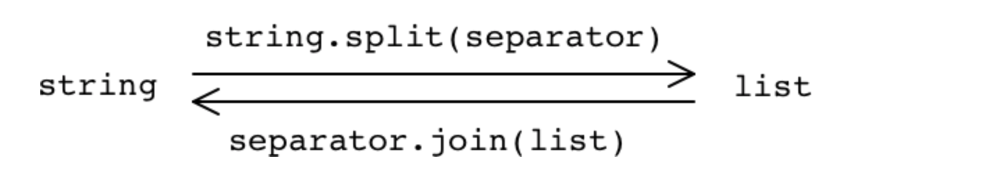
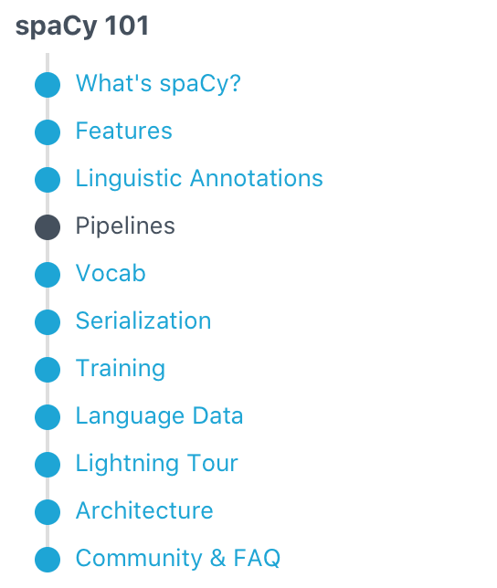

# Day 1


- ##### [集合（set）](https://www.runoob.com/python3/python3-set.html)是一个无序的不重复元素序列。

- ##### 用pandas中的DataFrame时[选取行或列](https://blog.csdn.net/wanglingli95/article/details/78887771)


- ##### [图解NumPy，这是理解数组最形象的一份教程了](https://www.jiqizhixin.com/articles/2019-07-12-4)


- ##### [Python For Data Analysis-四章第一节](http://liao.cpython.org/pda02/)


- ##### [pandas 学习 第6篇：DataFrame - 数据处理（长宽格式、透视表）](https://www.cnblogs.com/ljhdo/p/11591958.html)


- [**DataFrame的创建**](https://www.cnblogs.com/timotong/p/9678490.html)

- ##### [Python3 List append()方法](https://www.runoob.com/python3/python3-att-list-append.html)


- [using spaCy for scientific documents.](https://github.com/allenai/scispacy)

- [Healthcare NER Models Using Language Model Pretraining](https://arxiv.org/pdf/1910.11241.pdf)

- ##### [ScispaCy: Fast and Robust Models for Biomedical Natural Language Processing](https://www.groundai.com/project/scispacy-fast-and-robust-models-for-biomedical-natural-language-processing/1)


==看这里==

- http://nlp.stanford.edu/~mcclosky/personal.html)

- ##### [self-trained biomedical parsing](https://nlp.stanford.edu/~mcclosky/biomedical.html)


- ##### [Installing scispacy package](https://allenai.github.io/scispacy/)


```
pip install scispacy
pip install <Model URL>
```

##### [Using-scispaCy-for-Named-Entity-Recognition](https://github.com/akash-kaul/Using-scispaCy-for-Named-Entity-Recognition)

##### [Using-scispaCy-for-Named-Entity-Recognition](https://github.com/akash-kaul/Using-scispaCy-for-Named-Entity-Recognition)/**scispaCyNER.ipynb**

https://github.com/akash-kaul/Using-scispaCy-for-Named-Entity-Recognition/blob/master/scispaCyNER.ipynb

##### [Using scispaCy for Named-Entity Recognition (Part 1)](https://towardsdatascience.com/using-scispacy-for-named-entity-recognition-785389e7918d)

##### [Automating News Content Analysis: An Application to Gender Bias and Readability](http://proceedings.mlr.press/v11/ali10a/ali10a.pdf) 

[Gender Bias in Natural Language Processing](https://www.aclweb.org/anthology/W19-38.pdf)


##### [Spacy - Convert Token type into list](https://stackoverflow.com/questions/53118666/spacy-convert-token-type-into-list)



More details: http://www.tulane.edu/~howard/NLP/listtoken.html

I want to make all elements in list with str type for iteration. Expected output -

```python
li = ['India', 'Australia', 'Brazil']
for i in li:
    print(type(i))
```

```python
import spacy
nlp = spacy.load('en_core_web_sm')
t = (u"India Australia Brazil")
li = nlp(t)
for i in li:
    print(i.text)
```

or if you want the list of tokens as list of strings:

Exactly. converting list of tokens into list of string. Let me try this for my code. 

```python
list_of_strings  = [i.text for i in li]
```


##### [Python | Tokenizing strings in list of strings](https://www.geeksforgeeks.org/python-tokenizing-strings-in-list-of-strings/)

```python
# Python3 code to demonstrate 
# Tokenizing strings in list of strings 
# using map() + split() 
 
# initializing list 
test_list ``=` `[``'Geeks for Geeks'``, ``'is'``, ``'best computer science portal'``] 
 
# printing original list 
print``(``"The original list : "` `+` `str``(test_list)) 
 
# using map() + split() 
# Tokenizing strings in list of strings 
res ``=` `list``(``map``(``str``.split, test_list)) 
 
# print result 
print``(``"The list after split of strings is : "` `+` `str``(res)) 
```


### ==Spacy Documental==

- [spaCy 101: Everything you need to know](https://spacy.io/usage/spacy-101#_title)

- ##### [Models](https://spacy.io/models#_title)

- [Command Line Interface](https://spacy.io/api/cli#_title)

- ##### [Tokenizer ](https://spacy.io/api/tokenizer#_title)Segment text into words, punctuations marks etc.

- [Doc ](https://spacy.io/api/doc#_title)  A container for accessing linguistic annotations.

- [Linguistic Features](https://spacy.io/usage/linguistic-features#_title)

  

