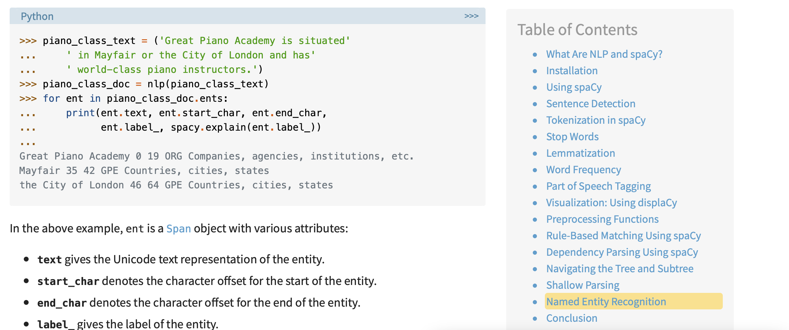
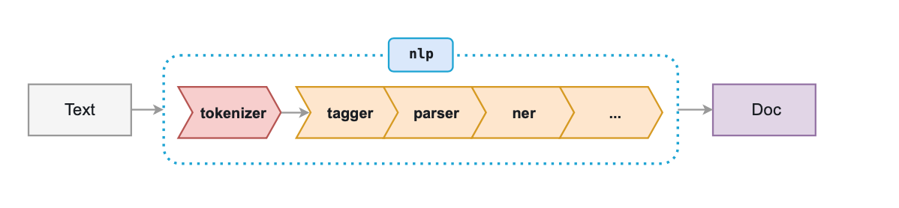

### Methods to add entity/value pairs to table

```python
def add_cr(abstractList, doiList):
    i = 0
    table= {"doi":[], "Entity":[], "Class":[]}
    for doc in nlp_cr.pipe(abstractList):
        doi = doiList[i]
        for x in doc.ents:
          table["doi"].append(doi)
          table["Entity"].append(x.text)
          table["Class"].append(x.label_)
        i +=1
return table
```

*If you are using Colab, you can drag the file into the “Files” section, then right-click and choose “Copy Path” to easily access the path to the file you want.*

### Selecting the Relevant Data

The **metadata** provides lots of useful information about the over 60,00 papers in CORD-19, including authors, reference numbers, etc. However, for our purposes, the data we care about is the abstracts. The full **abstract** of each paper is listed under the column named “abstract”. So, our next step is to choose this text. We will do this using the DataFrame *loc* function. This function takes in the location of a cell in the DataFrame and returns the data present in that cell. To access a specific abstract, just type the specific row you want and the header of the column, and store as a **string** variable.

```python 
text = meta_df.loc[0, “abstract”]
```

This finds the abstract located in the first row of the table (remember, in Python indexing starts at 0). 

### Named- Entity Recognition

#### Core NER model 

```python
nlp = en_core_sci_sm.load()
doc = nlp(text)
displacy_image = displacy,render(doc, jupyter = True, style = ‘ent’)
#  *what is ent*
```

Your output should look like this:

#### 


# subset
[网页连接](https://realpython.com/natural-language-processing-spacy-python/#named-entity-recognition)



- [Another SpaCy resources](https://www.analyticsvidhya.com/blog/2017/0) 

- NLP Text Preprocessing: A Practical Guide and [Template](https://towardsdatascience.com/nlp-text-preprocessing-a-practical-guide-and-template-d80874676e79)

- spaCy [Cheat Sheet](https://www.datacamp.com/community/blog/spacy-cheatsheet): Advanced NLP in Python

- Python spacy.tokens.Doc() [Examples](https://www.programcreek.com/python/example/114356/spacy.tokens.Doc)

- ##### [Language Processing Pipelines](https://spacy.io/usage/processing-pipelines#_title)



- [Training spaCy’s Statistical Models](https://spacy.io/usage/training#_title)
- ==[spaCy 101: Everything you need to know](https://spacy.io/usage/spacy-101#_title)==
- [Doc ](https://spacy.io/api/doc#_title)
- Interesting [blog](https://nlp.stanford.edu/~mcclosky/personal.html) [david mcclosky](http://nlp.stanford.edu/~mcclosky/index.html)


# Question

test data set one by one or put together 

- The code is for single sentence or forparagraph but I don't know how to apply to list of sentence

- What is the pipeline to process unstructured text

- ```python
  # Create the  pipeline to clean, tokenize, vectorize, and classify 
  pipe = Pipeline([("cleaner", predictors()),
                   ('vectorizer', vectorizer),
                   ('classifier', classifier)])
  ```

- 错误的识别
- 识别不出
- 