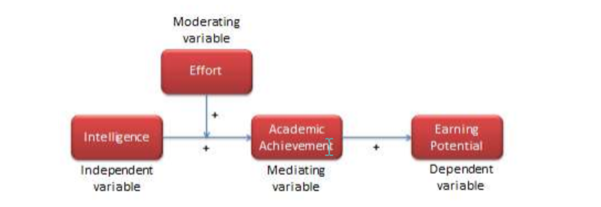

##### [[Chapter](https://socialsci.libretexts.org/Bookshelves/Social_Work/Book%3A_Social_Science_Research_-_Principles_Methods_and_Practices_(Bhattacherjee)/02%3A_Thinking_Like_a_Researcher/2.02%3A_Concepts%2C_Constructs%2C_and_Variables) 14: Mediation and Moderation](https://ademos.people.uic.edu/Chapter14.html) Alyssa Blair

##### [中介變數(mediator)與調節變數(moderator)](https://researcher20.com/2010/06/08/中介變數mediator與調節變數moderator/)

### Working theory

##### [Bacharach (1989) - Summary of the article.](https://www.studocu.com/en-us/document/louisiana-tech-university/organization-theory/summaries/bacharach-1989-summary-of-the-article/7178924/view)

- [a **variable** is a measurable representation of an abstract construct.](https://socialsci.libretexts.org/Bookshelves/Social_Work/Book%3A_Social_Science_Research_-_Principles_Methods_and_Practices_(Bhattacherjee)/02%3A_Thinking_Like_a_Researcher/2.02%3A_Concepts%2C_Constructs%2C_and_Variables) 
- For instance, a person’s ***intelligence*** is often measured as his or her *IQ* (*intelligence quotient*) *score*, which is an index generated from an analytical and pattern-matching test administered to people. 
- In this case, ***intelligence*** is a construct, and ***IQ score*** is a variable that measures the intelligence construct. Whether IQ scores truly measures one’s intelligence is anyone’s guess (though many believe that they do), and depending on whether how well it measures intelligence, the IQ score may be a good or a poor measure of the intelligence construct. 
- As shown in Figure 2.1, scientific research proceeds along two planes: a theoretical plane and an empirical plane. Constructs are conceptualized at the theoretical (abstract) plane, while variables are operationalized and measured at the empirical (observational) plane. Thinking like a researcher implies the ability to move back and forth between these two planes.
- Depending on their intended use, variables may be classified as independent, dependent, moderating, mediating, or control variables. Variables that explain other variables are called **independent variables**, those that are explained by other variables are **dependent variables**, those that are explained by independent variables while also explaining dependent variables are **mediating variables** (or intermediate variables), and those that influence the relationship between independent and dependent variables are called **moderating variables**. As an example, if we state that higher intelligence causes improved learning among students, then intelligence is an independent variable and learning is a dependent variable. There may be other extraneous variables that are not pertinent to explaining a given dependent variable, but may have some impact on the dependent variable. These variables must be controlled for in a scientific study, and are therefore called **control variables**.

- ###### [Concepts, Constructs, and Variables](https://socialsci.libretexts.org/Bookshelves/Social_Work/Book%3A_Social_Science_Research_-_Principles_Methods_and_Practices_(Bhattacherjee)/02%3A_Thinking_Like_a_Researcher/2.02%3A_Concepts%2C_Constructs%2C_and_Variables)

- [**Constructive and Operational Definitions**](http://media.acc.qcc.cuny.edu/faculty/volchok/Measurement_Volchok/Measurement_Volchok4.html)

  Before a concept or construct can be measured, it must be defined. Researchers develop two kinds of definitions:

  1. Theoretical Definitions
  2. Operational Definitions

https://www.scribd.com/document/418026200/Constitutive-vs-Operational-Definitions

http://media.acc.qcc.cuny.edu/faculty/volchok/Measurement_Volchok/Measurement_Volchok4.html

### [THE IMPACT OF RESEARCH GRANT FUNDING ON SCIENTIFIC PRODUCTIVITY](https://www.nber.org/papers/w13519.pdf)

estimate the impact of grants on research productivity. 

more likely to receive grant funding and to produce high quality research.

In particular, more qualified and/or motivated researchers are more likely to receive grant funding and to produce high quality research.

###### explaining why ==some== Ph.D. students produce more publications than others. 

==Assume== that previous **empirical research** has shown that there is a **positive** relationship between positive attitude toward research and research productivity, 

**measured** as a number of journal articles published prior to receiving Ph.D. (i.e., students who have more positive attitude toward research are likely to produce more publications than those students who have less positive attitude).

However, there are likely other factors that may **influence** each of these two variables or the relationship between them. Your goal is to expand this basic model **by including other variables** that will help us understand why some doctoral students are more productive than others.

- Add **three** variables to the model above. 

  - At least one of these three additional variables must be a **moderator** of the relationship between attitudes and productivity (i.e., a factor that increases or reduces the effect of attitude toward research on research productivity), 
  - or mediator of this relationship (i.e., a variable that “transmits” the effect of attitude toward research on research productivity).
- Use boxes and arrows to depict relationships among variables in your theory. Relationships between variables in your model can be positive or negative.
- Define each variable clearly and parsimoniously (see Bacharach, 1989)
- Develop a brief (2-3 sentences) rationale for each of the links in your model. That is, explain whyyou expect each of the relationships you propose to exist.

A PhD program is not simply a continuation of your undergraduate program. The goal is not to complete an assigned set of courses as in an undergraduate program, but to develop significant and original research in your area of expertise. 

Remember, the answer to the question "Why are you doing this research?" should not be "Well, because it's what I've been working on for the past few years already." In your first year, you should explore the research of a diverse set of groups. After touring their labs, talking to the students, or sitting in on group meetings, you may find that this group is the right one for you.

## 9. There are no real breaks.

In a stereotypical "9-to-5" job, when the workday is over or the weekend arrives, you can generally forget about your work. And a vacation provides an even longer respite. **But in a PhD program, your schedule becomes "whenever you find time to get your work done."** You might be in the lab during regular work hours or you might be working until 10 p.m. or later to finish an experiment. And the only time you might have available to analyze data might be at 1 a.m. Expect to work during part of the weekend, too. Graduate students do go on vacations but might still have to do some data analysis or a literature search while away.

**Faculty mentoring** can play a monumental role in ensuring that doctorial students are successful throughout the coursework, dissertation process, and professional development. 

- Student-Advisor Relationship
  - Student can influence the relationship with positive proactive behaviors
  - found that the more productive your supervisor is, the more productive you are.

- That last paper found the **biggest** effect of academic success was neither institution nor advisor, but number of first author papers in high Impact Factor journals. 

A **mediator variable** is the variable that causes mediation in the dependent and the independent variables. i.e.  it explains the relationship between the dependent variable and the independent variable. 

for example, 

The process of complete mediation is defined as the complete intervention caused by the mediator variable. This results in the initial variable no longer affecting the outcome variable. The process of partial mediation is defined as the partial intervention.

- ==burnout==(negtive attitude) as a ==mediator== between **high performance work system** (HPWS) and **intention to leave** (ITL).
- the role of **mentoring** as a ==moderator== between HPWS and burnout as well as between burnout and ITL has also been explored.
- This study contributes to the literature by identifying the black-box using burnout and mentoring to understand the HPWS and ITL relationship.

 no research has been conducted using variables sucas mentoring (moderator) that reduces the negative employee attitudes like burno

evaluates the role of mentoring as moderator between HPWS and burnout as well as between

burnout and ITL (Figure 1). So, the study proposes to check the conditional indirect effect of

HPWS on ITL through burnout in the presence of mentoring (moderated-mediation model)

- Positive attitude will increase the research productivity when advisor/mentor provides more supportive environment and have more social/project resources

 like  training

NEW PHD training  enhance the  graduate student actual potential, ability and power to perform particular  task at the specific time, which reduces the fatigue and mental pressure increasing the positive attitude 

main  focus of training is to enhance and improve the skills of th employees, which in turn reduce the feeling of emotional exhaustion.

**Hypothesis 1: Perceived HPWS are negatively related to burnout.**

positive attitudes towards certain behaviours determine the intention to perform these behaviours.

positive attitudes can be viewed as a prerequisite for teacher educators' intentions to conduct research.

