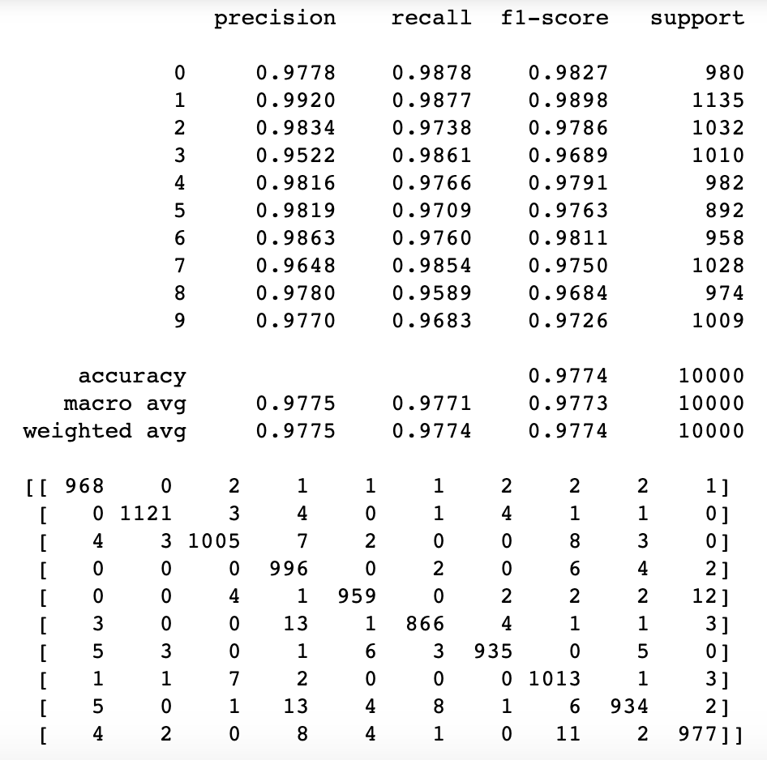

#### This assignment 1

a) Study of hyperparameter impact - after you complete the program, you should add one page discussion and conclusion regarding hyperparameter impact to your notebook.

When the learning rate is equal to 0.003 

We do the 10 Epoch, the training time is 4.1520909388860066

Here is the loss ruction:

 

And we get the accuracy table as follows:

Our model is generating 97.71% accuracy. What happens when we change the learning rate to 𝜂=0.05?

covariance of embeddings is 0.30

When we change learning rate is equal to 0.05, our Training Time (in minutes) = 4.03. This is no big different  compared with the model1 which learning rate equal to 0.003. And when we check the loss curve, we can see this curve drop down very quick. The loss curve reach the lower point around epoch100. But for the model with rate equal to 0.003, the loss curve droped to the lower point around epoch1000.

The accuracy of learning rate 0.05 model is equal to 97.16%, very similar to the previous one. If the learning rate is small, then training is more reliable, but it will take a lot of time because steps towards the minimum of the loss function are tiny.

<!-- covariance of embeddings is 5.48. The covariance is a measure that tells the amount of dependency between two variables. Compared with the covariance of embeddings, we can find when we increasing the learining rate form 0.003 to 0.05, there is more related between the embeddings. -->

When we change the number of hidden layers from 2 to 3 and the third hidden layer size can be 32. our training Time (in minutes) = 3.75, which is slight decreseing.

From the loss plot above, we can see there is no big change compared previous models. I get accuracy                         equal to 0.9759 which is also very similar with other two models.  And the covariance of embedding is 

b) Study of data bias impact - after you complete the program, you should add one page discussion and conclusion regarding data bias impact to your notebook.

