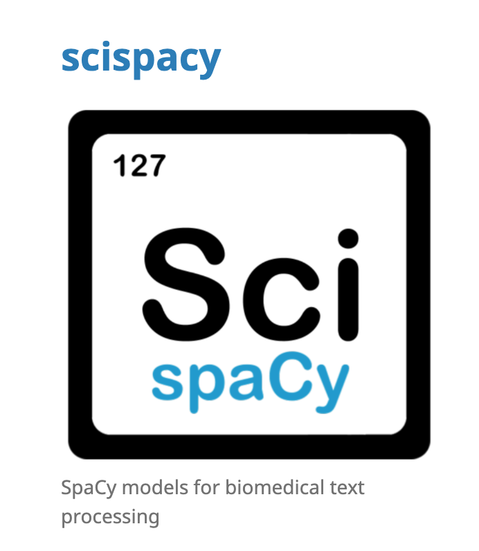
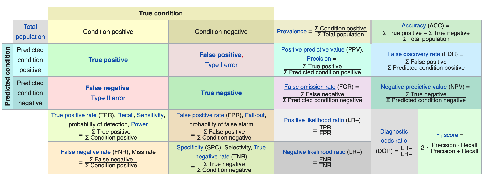

[spaCy Link](https://allenai.github.io/scispacy/) 

https://allenai.github.io/scispacy/

https://github.com/allenai/scispacy

[Sets](https://realpython.com/python-sets/) in Python


### [Presetations](https://slideslive.com/38929078/mart-memoryaugmented-recurrent-transformer-for-coherent-video-paragraph-captioning)

https://developers-dot-devsite-v2-prod.appspot.com/machine-learning/crash-course/backprop-scroll

https://www.youtube.com/watch?v=ToIXSwZ1pJU&pbjreload=101

https://github.com/arundasan91/adv-ai-ml-research/tree/master/Lecture-2

https://bookdown.org/yihui/rmarkdown/params-declare.html

##### spaCy [Cheat Sheet](https://www.datacamp.com/community/blog/spacy-cheatsheet): Advanced NLP in Python

##### Natural Language Processing With [spaCy in Python](https://realpython.com/natural-language-processing-spacy-python/#named-entity-recognition) ==详细教程==


##### ==Other Projects==

Named-Entity [evaluation metrics](http://www.davidsbatista.net/blog/2018/05/09/Named_Entity_Evaluation/#:~:text=When%20you%20train%20a%20NER,score%20at%20a%20token%20level.&text=But%20when%20using%20the%20predicted,a%20full%20named%2Dentity%20level) based on entity-level

Conditional Random Fields for [Sequence Prediction](http://www.davidsbatista.net/blog/2017/11/13/Conditional_Random_Fields/)


##### [StanfordNER](http://www.davidsbatista.net/blog/2018/01/23/StanfordNER/) - training a new model and deploying a web service [other resources](https://github.com/dat) [stanford web](https://nlp.stanford.edu/software/CRF-NER.shtml)

[interesting api](http://corenlp.run)

##### 自然语言处理之[spaCy](https://www.biaodianfu.com/spacy.html)

```
Welcome to Ubuntu 16.04.5 LTS (GNU/Linux 4.15.0-112-generic x86_64)

 * Documentation:  https://help.ubuntu.com
 * Management:     https://landscape.canonical.com
 * Support:        https://ubuntu.com/advantage

150 packages can be updated.
0 updates are security updates.

New release '18.04.5 LTS' available.
Run 'do-release-upgrade' to upgrade to it.

*** System restart required ***
Last login: Thu Sep 24 09:45:41 2020 from 89.187.161.155
xingmeng@aploverseer:~$ tail results_chemical.tsv 
tail: cannot open 'results_chemical.tsv' for reading: No such file or directory
xingmeng@aploverseer:~$ cd ner
xingmeng@aploverseer:~/ner$ ls
babynames_2010-2018.csv  diseases.txt  final_drugs.txt  results_chemical.tsv  template.txt  template.txt.bak  test2.py  test.py
xingmeng@aploverseer:~/ner$ tail results_chemical.tsv 
FEMALE  Hayden, please stop taking Krintafel, it is bad for you.        Hayden  Krintafel
FEMALE  Hayden, please stop taking Tvia, it is bad for you.     Hayden  Tvia
FEMALE  Hayden, please stop taking Alyq, it is bad for you.     Hayden  Alyq
FEMALE  Hayden, please stop taking Cefpoderm, it is bad for you.        Hayden  Cefpoderm
FEMALE  Hayden, please stop taking Wixela, it is bad for you.   Hayden  Wixela
FEMALE  Hayden, please stop taking caplacizumab-yhdp, it is bad for you.        Hayden  caplacizumab-yhdp
FEMALE  Hayden, please stop taking Cablivi, it is bad for you.  Hayden  Cablivi
FEMALE  Hayden, please stop taking Dotti, it is bad for you.    Hayden  Dotti
FEMALE  Hayden, please stop taking prabotulinumtoxinA-xvfs, it is bad for you.  Hayden  prabotulinumtoxinA-xvfs
FEMALE  Hayden, please stop taking Jeuveau, it is bad for you.  Hayden  Jeuveau
xingmeng@aploverseer:~/ner$ ls -tr
final_drugs.txt  diseases.txt  babynames_2010-2018.csv  test2.py  template.txt.bak  template.txt  test.py  results_chemical.tsv

cp template.txt template.txt.bak
cat results.tsv 
xingmeng@aploverseer:~/ner$ nohup python test.py > results_chemical.tsv 2>&1 &
wc -l results_chemical.tsv 
tail results_chemical.tsv 
cat results_chemical.tsv 
nohup python test.py > results_chemical.tsv 2>&1 &
ls -tr
top
ps
wc -l results_chemical.tsv 
rm results.tsv 
kill 26627

cp template.txt template.txt.bak

sudo cat ../../arios/.bashrc

nohup python test_ds.py > results_diseases.tsv 2>&1 &
```


Template

```Template-chemical
<NAME> said he has been taking <CHEMICAL> for her illness.
Did you hear that <NAME> has been using <CHEMICAL>.
<CHEMICAL> has really been harming <NAME>, I hope they stop.
I think <NAME> is addicted to <CHEMICAL>.
<NAME>, please stop taking <CHEMICAL>, it is bad for you.
```


##### ==How could I know they finish run the code?==


for sentence in template_chemical_doc:
    

**Question**

```Python
#groundtrues = set()

for token in sentence:
    if str(token) in chemicals[:3]: 
        groundtrues.add(str(token))
print(groundtrues)
```




https://en.wikipedia.org/wiki/Confusion_matrix

https://realpython.com/python-sets/