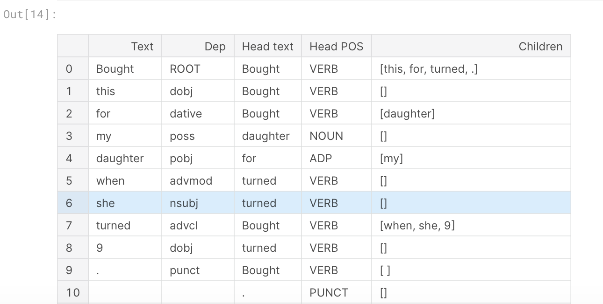
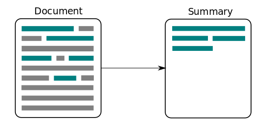
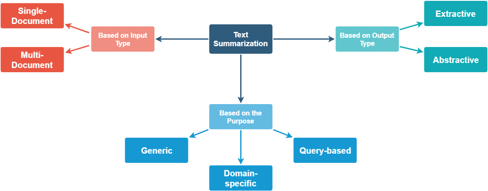

# 1. Amazon Review Prediction using spaCy

[Reference](https://www.kaggle.com/kamalkhumar/amazon-review-prediction-using-spacy)

### Dependency Parser

A dependency parser analyzes the grammatical structure of a sentence, establishing relationships between "head" words and words which modify those heads

Spacy can be used to create these dependency parsers which can be used in a variety of tasks.

```python
doc = nlp(data["verified_reviews"][1009])
olist = []
for token in doc:
    olist.append([token.text, token.dep_, token.head.text, token.head.pos_,
          [child for child in token.children]])
odf = pd.DataFrame(olist)
odf.columns = ["Text", "Dep", "Head text", "Head POS", "Children"]
odf
```



- Text: The original token text.
- Dep: The syntactic relation connecting child to head.
- Head text: The original text of the token head.
- Head POS: The part-of-speech tag of the token head.
- Children: The immediate syntactic dependents of the token.


# 2. Wine Reviews (SpaCy+BERT)🍷

[link](https://www.kaggle.com/mariapushkareva/wine-reviews-spacy-bert)

###  Part of Speech Tagging (POS)

**Part of speech** or **POS** is a grammatical role that explains how a particular word is used in a sentence. There are eight parts of speech: noun, pronoun, adjective, verb, adverb, preposition, conjunction, interjection. **Part of speech tagging** is the process of assigning a POS tag to each token depending on its usage in the sentence. POS tags are useful for assigning a syntactic category like noun or verb to each word. In spaCy, POS tags are available as an attribute on the Token object:

```python
# Part of Speech Tagging
import string
from spacy.lang.en.stop_words import STOP_WORDS
from spacy.lang.en import English
punctuations = string.punctuation
stopwords = STOP_WORDS
```

```python
# POS tagging
for i in nlp(review):
    print(i, Fore.GREEN + "=>",i.pos_)
```


# 3. Summarization With Wine Reviews Using spaCy

[Ref](https://www.kaggle.com/harunshimanto/summarization-with-wine-reviews-using-spacy)

### What Is Text Summarization?



> Text summarization is the process of distilling the most important information from a source (or sources) to produce an abridged version for a particular user (or users) and task (or tasks).


### Types of Text Summarization Methods

Text summarization methods can be classified into different types.


##### 3.1 Clean text before feeding it to spaCy


# 4. Topic Modeling: Finding Related Articles

[Link](https://www.kaggle.com/danielwolffram/topic-modeling-finding-related-articles)

https://discovid.ai/search

##### Did you find an interesting article and want to easily find related research without browsing all existing publications yourself? Do you have a specific research question and want to discover relevant articles? Then this notebook might help you.

**Approach**: We first discover a number of topics using LDA (Latent Dirichlet Allocation). This allows us to view each article as a **mixture** of these topics. By mapping a specific article into the topic space (a simplex with a topic in each corner), we can then find related articles.


# 5, NLP Text Mining - Disease behaviour


# 6, Knowledge Graph & NLP Tutorial-(BERT,spaCy,NLTK)

[link](https://www.kaggle.com/pavansanagapati/knowledge-graph-nlp-tutorial-bert-spacy-nltk)

