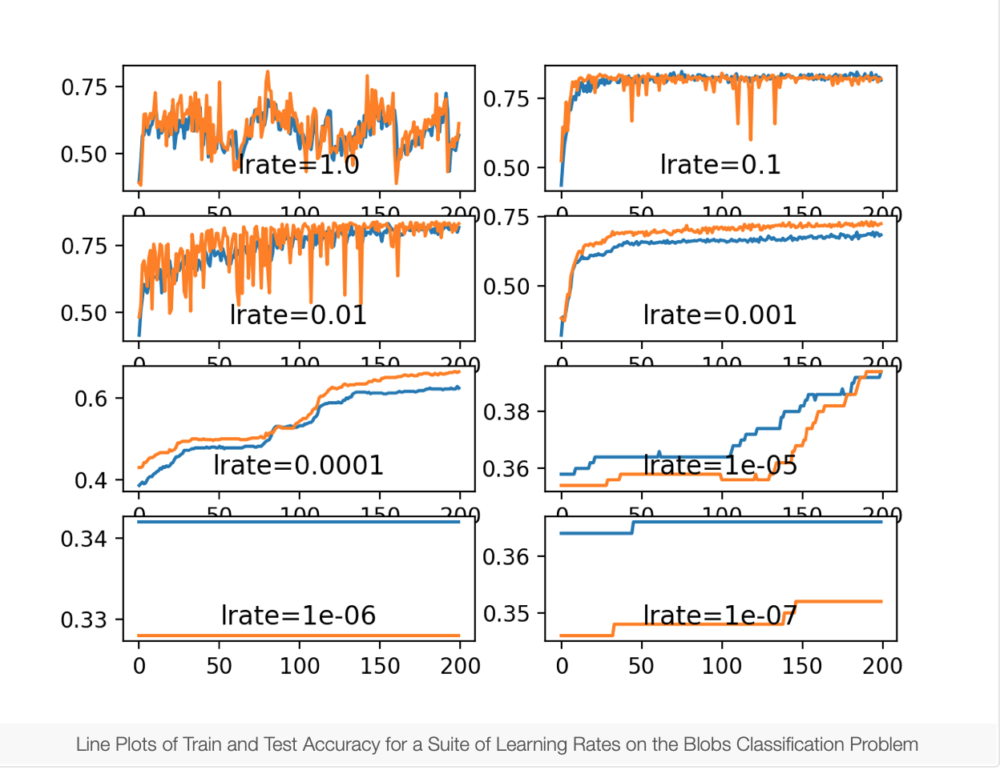
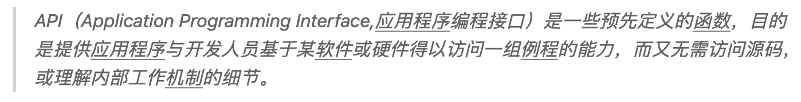
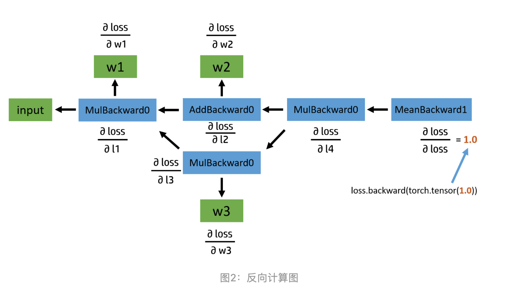

##### Hyperparameter Optimization in Machine Learning [Models](https://www.datacamp.com/community/tutorials/parameter-optimization-machine-learning-models)

Rad TA [Github](https://github.com/arundasan91/adv-ai-ml-research/blob/master/Lecture-2/Lecture-2-Basic-Neural-Network-Example.ipynb)

##### [Text Classification](https://monkeylearn.com/text-classification/)

https://ds.163.com/feed/5ea55efd517f0f75c1149f74/

###### Learning to [Classify Text](https://www.nltk.org/book/ch06.html)


### Learning Rate Dynamics

We can see that the model was able to learn the problem well with the learning rates 1E-1, 1E-2 and 1E-3, although successively slower as the learning rate was decreased. With the chosen model configuration, the results suggest a moderate learning rate of 0.1 results in good model performance on the train and test sets.



### Momentum Dynamics

### Effect of Learning Rate Schedules

### Drop Learning Rate on Plateau


Stochastic Gradient Descent


### Learning Parameters, Part 4: Tips For Adjusting Learning Rate, Line Search


### How to Code a Neural Network with Backpropagation In Python (from scratch)

### Backpropagation Algorithm


```python
# Assuming optimizer uses lr = 0.05 for all groups
# lr = 0.05     if epoch < 30
# lr = 0.005    if 30 <= epoch < 60
# lr = 0.0005   if 60 <= epoch < 90
```


```python
for epoch in range(1, 21):
    scheduler.step()
    print('Epoch-{0} lr: {1}'.format(epoch, optimizer.param_groups[0]['lr']))
    if epoch % 5 == 0:print()
```


https://fiveplus.top/post/introduction-to-pytorch笔记/

可视化展示MNIST如何聚类的： https://colah.github.io/posts/2014-10-Visualizing-MNIST/

Introduction to Dimensional [Reduction](https://medium.com/@net_satsawat/dimension-reduction-tutorial-on-kuzushiji-mnist-93419101474e)


在计算过程中，默认的函数操作会创建一个新的 Tensor。如果想要改变一个 Tensor 的值，需要用函数名加下划线表示：

```python
torch.abs(x) # 创建一个新的 Tensor
torch.abs_(x) # 改变 x
```

**自动求导**

torch.autograd.Variable 是进行运算和求导的单位，它包含了几个常用属性：

\1. data -- 保存数据，是一个 Tensor

\2. grad -- 保存导数，是一个与 data 形状一致的 Variable

\3. creator -- 用于实现常用计算，创建新的 Variable

\4. grad_fn -- 计算导数的方法

在对 Variable 进行运算时，运算会作用在 data 上，因此我们可以使用所有 Tensor 支持的方法进行运算。

Pytorch-API: https://zhuanlan.zhihu.com/p/42584465:  API 兼容性[中文](https://wizardforcel.gitbooks.io/pytorch-cn/content/docs/package_references/torch-autograd.html) 

Python API: TORCH.NN: https://pytorch.org/docs/stable/nn.html

Pytorch的API[总览](https://cloud.tencent.com/developer/article/1525076)

在pytorch将tensor转成numpy

[nn.module]( https://github.com/pytorch/pytorch/blob/master/torch/nn/modules/module.py)



最后，演示开启WEB服务，写一个简单的API接口，以体现出API的函数 (y=f(x)) 功能。

简单来说就是函数。

把某些功能封装好，方便其他人调用。

调用的人可以很方便使用这些功能，并且可以不需要知道这些功能的具体实现过程。

比如你写了一个库，里面有很多函数，如果别人要使用你这个库，但是并不知道每个函数内部是怎么实现的。使用的人需要看你的文档或者注释才知道这个函数的入口参数和返回值或者这个函数是用来做什么的。对于用户来说 ，你的这些函数就是API。

API(Application Programming Interface应用程序编程接口) 是一些预先定义好的函数，目的是提供应用程序以及开发人员基于某软件或硬件得以访问一组例程的能力。

##### [Computational Graphs](https://zhuanlan.zhihu.com/p/69294347)



