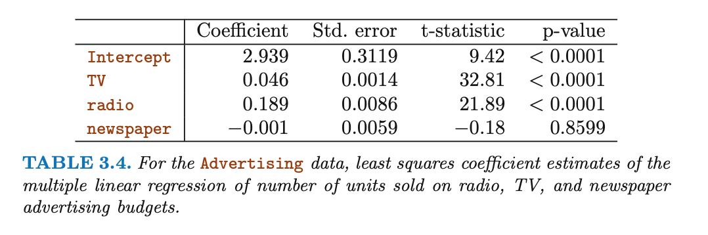
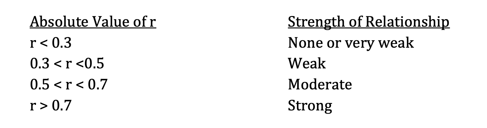

1. Describe the null hypotheses to which the p-values given in Table 3.4 correspond. Explain what conclusions you can draw based on these p-values. Your explanation should be phrased in terms of sales, TV, radio, and newspaper, rather than in terms of the coefficients of the linear model.

==reference==

ISLR Chapter 2 Conceptual [Exercises](https://www.kaggle.com/suugaku/islr-chapter-2-conceptual-exercises) [Ref](https://github.com/peterhurford/statsnotes/blob/master/intro_stats_learning/02_statistical_learning/exercises.md)

ISLR Chapter 3 Conceptual [Exercises](https://www.kaggle.com/suugaku/islr-chapter-3-conceptual-exercises)

ISLR Chapter 3: Linear Regression [(Part 4: Exercises - Conceptual)](https://amitrajan012.github.io/post/linear-regression_part4/)

https://github.com/peterhurford/statsnotes/blob/master/intro_stats_learning/02_statistical_learning/exercises.md

https://github.com/peterhurford/statsnotes/blob/master/intro_stats_learning/03_linear_regression/exercises.md

Euclidean Distance - Practical Machine Learning [Tutorial with Python p.15](https://www.youtube.com/watch?v=hl3bQySs8sM)

[R 第 2 章 数据结构](https://bookdown.org/xiao/RAnalysisBook/section-2.html)

[Descriptive](https://www.statsandr.com/blog/descriptive-statistics-in-r/#boxplot) statistics in R

[Solution chapter 3](https://github.com/jstjohn/IntroToStatisticalLearningR-/blob/master/R_Exercises/Exercise2/Exercise2.Rmd)==参考的这个== 很好的[补充](https://rstudio-pubs-static.s3.amazonaws.com/65559_51f05af2179c4490a9489612d24dd9a4.html)

[another](http://timahn.com/512/TAhn_HW_2.pdf) solution of ch3

[another 2](https://rstudio-pubs-static.s3.amazonaws.com/65559_51f05af2179c4490a9489612d24dd9a4.html)

https://www.westga.edu/academics/research/vrc/assets/docs/scatterplots_and_correlation_notes.pdf

##### Understanding Diagnostic Plots for Linear Regression Analysis

##### Regression Diagnostics

https://sphweb.bumc.bu.edu/otlt/MPH-Modules/BS/R/R5_Correlation-Regression/R5_Correlation-Regression7.html

## Model Assumptions

The model fitting is just the first part of the story for regression analysis since this is all based on certain assumptions. Regression diagnostics are used to evaluate the model assumptions and investigate whether or not there are observations with a large, undue influence on the analysis. Again, the assumptions for linear regression are:

1. **Linearity**: The relationship between X and the mean of Y is linear.
2. **Homoscedasticity**: The variance of residual is the same for any value of X.
3. **Independence**: Observations are independent of each other.
4. **Normality**: For any fixed value of X, Y is normally distributed.

Before we go further, let's review some definitions for problematic points.

- **Outliers**: an outlier is defined as an observation that has a large residual. In other words, the observed value for the point is very different from that predicted by the regression model.
- **Leverage points**: A leverage point is defined as an observation that has a value of x that is far away from the mean of x. 
- **Influential observations**: An influential observation is defined as an observation that changes the slope of the line. Thus, influential points have a large influence on the fit of the model. One method to find influential points is to compare the fit of the model with and without each observation.

##### Linear Regression Assumptions and Diagnostics in R: [Essentials](http://www.sthda.com/english/articles/39-regression-model-diagnostics/161-linear-regression-assumptions-and-diagnostics-in-r-essentials/)

