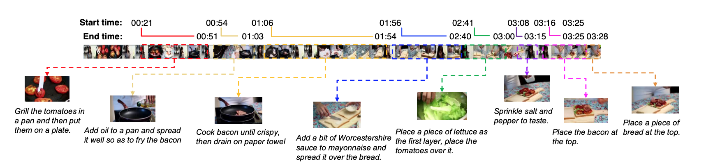

<!-- https://arxiv.org/abs/2005.05402 -->

# 
MART: Memory-Augmented Recurrent Transformer for Coherent Video Paragraph Captioning 

### 
by Jie Lei1 Liwei Wang2 Yelong Shen

### 
Present by Xingmeng Zhao

<!-- break page-->

# Goals and Challenge

- Generating multi-sentence descriptions for videos 

  - generate a natural language description capturing the content of a video.

- challenging captioning tasks 

  - high requirements for relevance b/e each video segment 
  - coherence and concise across the multi-sentences

- Author propose a new approach called Memory-Augmented Recurrent Transformer (MART)

  - memory module to deal with coherent paragraph generation problem

  - less redundant

  - generates a highly summarized memory state from the video segments and the sentence history so as to help better prediction of the next sentence
  
    

<!-- break page-->

# Video Paragraph Captioning (I)

# 

- For example, An elderly man is playing the piano in front of a crowd (at word level)

   Encoder : [LSTM]->[LSTM]->... ...->[LSTM]

   

# Previous Work

<!--that generates a new sentence conditioned on previously generated sentences by passing the LSTM hidden states throughout the entire decoding process.-->

<!--with a transformer captioning module decoding natural language sentences from encoded video segment representations-->

- LSTMs as the language decoder: 

  - Xiong et al. (2018)

  - Park et al. (2019) 

- Transformer model

  - Vanilla transformer video paragraph captioning model  (Zhou et al., 2018), 
  - Transformer-XL (Dai et al., 2019)

- Memory- Augmented Recurrent Transformer (MART) model
  - Unified encoder-decoder design i.e., the encoder and decoder in MART use shared transformer layers rather than separated 
  - memory module and memory updater design
    
    - updates its memory state using both the current inputs and previous memory state
    
    - memory state = container of the highly summarized video segments and caption history information
    
      <!--therefore, when generating a new sentence, MART is aware of the previous contextual information and can generate paragraph captions with **higher coherence and lower repetition.**-->
  
  <!-- break page-->
  
  

  

# Video Paragraph Captioning (II)

<!-- break page-->

# Architecture for Previous Models

- **Vanilla transformer**(left) : **Seperate** Encoder- Decoder Architecture
- **Transformer-XL** (right): **Shared** Encoder- Decoder Architecture

<!-- break page-->

- ## New Model Architecture: Memory- Augmented Recurrent Transformer (MART) model

- Memory States: 
- Multi-Head Attention:

<!-- break page-->

- ## New Model Architecture: Memory- Augmented Recurrent Transformer (MART) model

Memory Updater Model: 

- Takes current segment hidden states and previous memory states to get and update the current memory states.
- Internal Cell States $C_t^l$
- Update gate $Z_t^l$

<!-- break page-->

- ## New Model Architecture: Memory- Augmented Recurrent Transformer (MART) model

where, $$ S_t^l = MultiHeadAtt (M_{t-1}^l,\hat{H_t^l},\hat{H}_t^l)$$

​			$$C_t^l = tanh (W_{mc}^l M_{t-1}^l + W_{sc}^l S_t^l + b_c^l),$$

​			$$Z_t^l = sigmod (W_{mz}^l M_{t-1}^l + W_{sz}^lS_t^l + b_z^l)$$

​			$$M_t^l = (1-Z_t^l) ⊙ C_t^l + Z_t^l ⊙ M_{t-1}^l,$$

where $⊙$ denotes Hadamard product and $W_{mc}^l,W_{sc}^l, W_{mz}^l,and \ W_{sz}^l$ are trainable weights,$b_c^l \ and\ b_z^l \ are\ trainable \ bias$$

<!-- break page-->

# Data and Experiments

- ###  datasets

  - **ActivityNet Captions** (Krishna et al., 2017) 

  - **YouCookII** (Zhou et al., 2017)

    

    <!--Each video has a single reference paragraph. Both datasets come with temporal event segments annotated with human written natural language sentences. On average, there are 3.65 event segments for each video in ActivityNet Captions, 7.7 segments for each video in YouCookII.-->
    
    

<!-- break page-->

# Data and Experiments

- ###  datasets

  - **ActivityNet Captions** (Krishna et al., 2017) 

  - **YouCookII** (Zhou et al., 2017)

- ### Features Embedding

  - Appearance: using 2K features form an image recognition model
  - motion features: using 1K features from an action recognition model
  - Extracted at 2FPS, normalized and concatenated <!--as inputs-->

- ### Evaluation Metrics

  - **Evaluate** the captioning performance at paragraph-level (Park et al., 2019; Xiong et al., 2018)
  - ==Standart Metrics==: **BLEU@4** (Papineni et al., 2002), **METEOR** (Denkowski and Lavie, 2014), **CIDEr- D** (Vedantam et al., 2015)
  - ==Repetition==: **R@4** degree of N-gram (N=4) in the paragraph
  - Average scores across all the paragraphs in theses videos.  

<!-- break page-->

# Experiments Results

<!--Mart significant better than other three-->

- MART model has strong comparable prefermance for standard language metrics for both datasets

- MART efficiency to reduce redundacy in generated paragraphs

  

  <!-- break page-->

  

- Compared MART with other SOTA models 
- gray part show not in fair to comparison with others <!--from this table -->
- MART has best CIDEr scores and Repetition (less)

<!-- break page-->

- **Relevance**, how related is a generated paragraph caption to the stories of given video

- **Coherence**: whether a generated paragraph caption reads fluently and easily by multi-sentences

  

<!-- break page-->

# Conclusion and Future Work

- ### MART produces more Coherent and less Redundant Paragraphs

- ### Vanilla transformer less coherent and redundant

- ### MART and Transformer_XL are good for pronouns and person mention using 

- ### MART has less Repetition compared other two methods

- ### Human Evaluation to compared other SOTA methods

  

