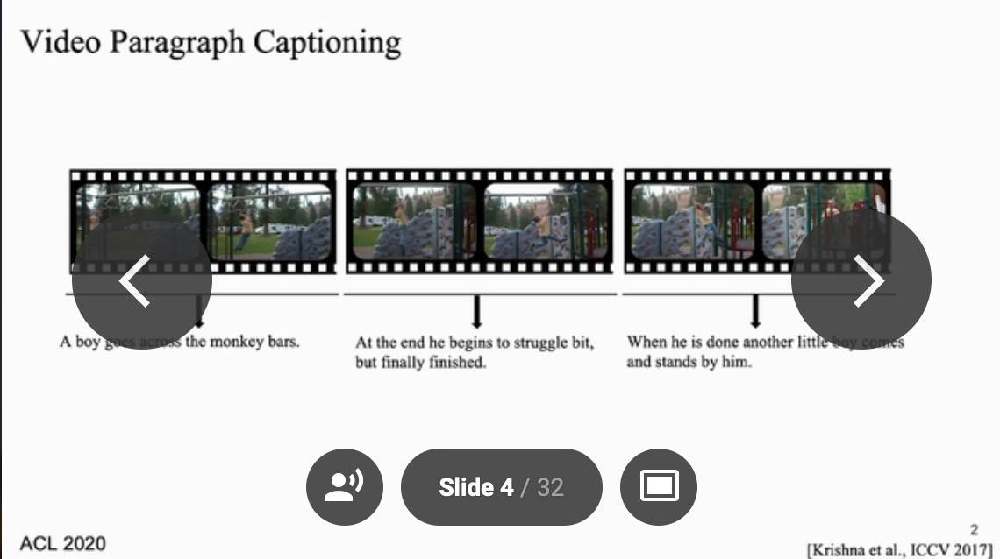
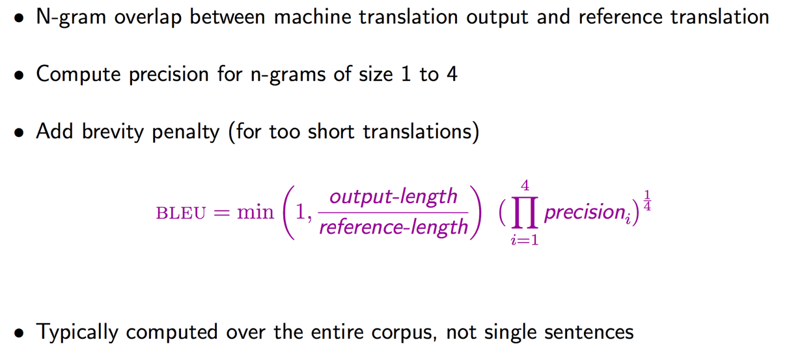

**Project [description](https://reposhub.com/python/deep-learning/jayleicn-recurrent-transformer.html)**

In video captioning, goal is to generate a natural language description capturing the content of video 

change example:

for example: 

for the video clip, we might describe it as "A boy goes across the momkey bars" single video captioning is useful when describing a **very short** video clip. In real world, we often dealing with much longer videos, and we are interested in captioning a coherent and concise multi-sentence stories about them. This is excatly the task of video paragraph captioning. 

**in author setup**, they give a list of consective video segments/clips from a single video, and require the machine to automatically generate a natural language sentence caption for each of the clips and meanwhile that generated caption sentences should form a coherent and the concise paragraph when putting together.

**Previous work**

One line of work treat video paragraph captioning similarity as single video captioning task, where each caption is decoded individually without knowing the context, that is, the previous video segments and the captions that have already been generated.

Evaluation goal:

Basics: Measuring The Linguistic [Complexity](https://towardsdatascience.com/linguistic-complexity-measures-for-text-nlp-e4bf664bd660) of Text

- higher coherence 

- lower repetition.

### BLUE

