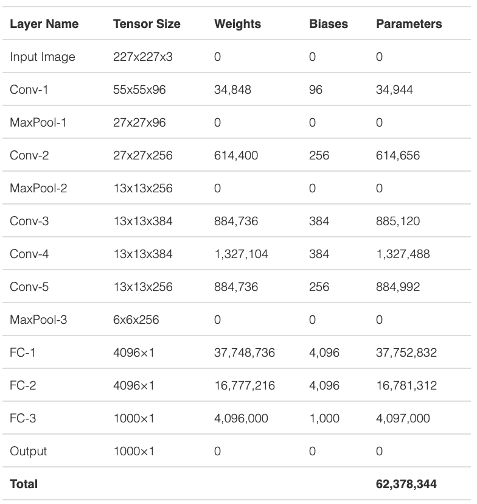

Hi Everyone,


https://github.com/arundasan91/adv-ai-ml-research.git

 

Assignment #2 is up and available in [https://github.com/arundasan91/adv-ai-ml-research/tree/master/Assignment-2](https://nam11.safelinks.protection.outlook.com/?url=https%3A%2F%2Fgithub.com%2Farundasan91%2Fadv-ai-ml-research%2Ftree%2Fmaster%2FAssignment-2&data=02|01||50c4bdd046c245a110dc08d868bfb148|3a228dfbc64744cb88357b20617fc906|0|0|637374519803754587&sdata=fWrrqVv9iw0yAsfg5Zj5jjqRExt7zmhw1aX%2FT2Azclc%3D&reserved=0)

You can just git pull in the cloud. I am also attaching the necessary files here as well.

 

When we were doing **MLP**, we found that the **embeddings** hold a lot of information. Similarly, we discussed that the convolution kernels are the trainable parameters of Conv operation. If we provide an input to the CNN (forward pass), the output of the multiplication operation with respect to each kernel is called an activation map (map since it is a 2D plane). This is similar to the embedding we found out for the DNN case. We can easily visualize activation maps in PyTorch by doing a forward pass on the model with a data input. I’m including a notebook to see how you can extract the weights of these kernels as well as the activations.

 

Here are the tasks:

 

- **Visualize the activation maps of each convolution layers**. 

- - I’ve already done the visualization for Conv1. You have to do it for Conv2. However, you might want to remember that we apply MaxPool after Conv1. So, similarly, you have to apply MaxPool to the output of Conv1 before you try to get the activations of Conv2. 
  - Pay attention to the shape of each output we get from Conv and MaxPool operations. I have added a model architecture in the Assignment to aid you with this.

- **Study the inter and intra class distances of embeddings extracted from two samples of numbers 6 and 7.** 

- -  I’ve already written the code to extract numbers 6 and 7 as two variables. Get the embeddings (fc2 layer) from the CNN model for these four numbers (two each from 6 and 7). Now you have two embeddings for 6 and two for 7. Now, study the inter and intra class distance of these embeddings. You can use MSE and CrossEntropy to study the distances..

 

**Pleas**e CC Dr. Rad in future correspondences.

 

Thank you,

Arun


## 一步一步来，用传统方法画个图

https://zhuanlan.zhihu.com/p/93423829


L1


https://blog.csdn.net/qq1332479771/article/details/56087333


### **用git命令操作**

1. 用`git remote`查看远程主机状态

```
git remote -v 
git remote add upstream git@github.com:xxx/xxx.git
git fetch upstream
git merge upstream/master
git push 
```


AlexNet has the following layers:

1. **Input**: Color images of size 227x227x3. The [AlexNet paper](https://papers.nips.cc/paper/4824-imagenet-classification-with-deep-convolutional-neural-networks.pdf) mentions the input size of 224×224 but that is a typo in the paper.
2. **Conv-1**: The first convolutional layer consists of 96 kernels of size 11×11 applied with a stride of 4 and padding of 0.
3. **MaxPool-1**: The maxpool layer following Conv-1 consists of pooling size of 3×3 and stride 2.
4. **Conv-2**: The second conv layer consists of 256 kernels of size 5×5 applied with a stride of 1 and padding of 2.
5. **MaxPool-2**: The maxpool layer following Conv-2 consists of pooling size of 3×3 and a stride of 2.
6. **Conv-3**: The third conv layer consists of 384 kernels of size 3×3 applied with a stride of 1 and padding of 1.
7. **Conv-4**: The fourth conv layer has the same structure as the third conv layer. It consists of 384 kernels of size 3×3 applied with a stride of 1 and padding of 1.
8. **Conv-5**: The fifth conv layer consists of 256 kernels of size 3×3 applied with a stride of 1 and padding of 1.
9. **MaxPool-3**: The maxpool layer following Conv-5 consists of pooling size of 3×3 and a stride of 2.
10. **FC-1**: The first fully connected layer has 4096 neurons.
11. **FC-2**: The second fully connected layer has 4096 neurons.
12. **FC-3**: The third fully connected layer has 1000 neurons.


Next, we will use the above architecture to explain

1. **How to calculate the tensor size at each stage**
2. **How to calculate the total number of parameters in the network**

### Size of the Output Tensor (Image) of a Conv Layer

Let’s define

 = Size (width) of output image.
 = Size (width) of input image.
 = Size (width) of kernels used in the Conv Layer.
 = Number of kernels.
 = Stride of the convolution operation.
 = Padding.




https://www.learnopencv.com/number-of-parameters-and-tensor-sizes-in-convolutional-neural-network/

##### [关于Numba你可能不了解的七个方面](https://developer.aliyun.com/article/222523)

**简介：** 目前Numba正被开始流行使用来加速Python程序，本文讲解了七个大家可能不了解的方面，希望对大家有所帮助

