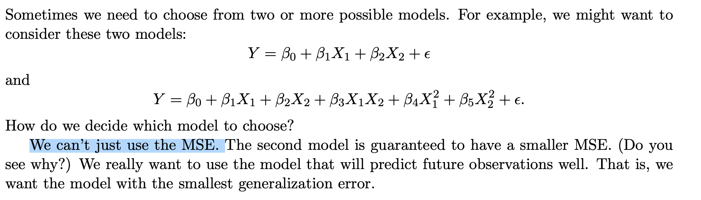
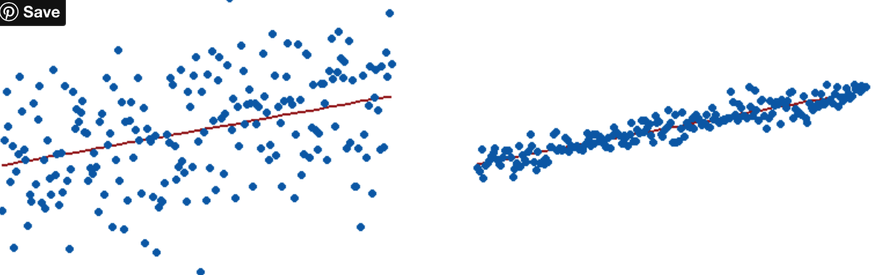
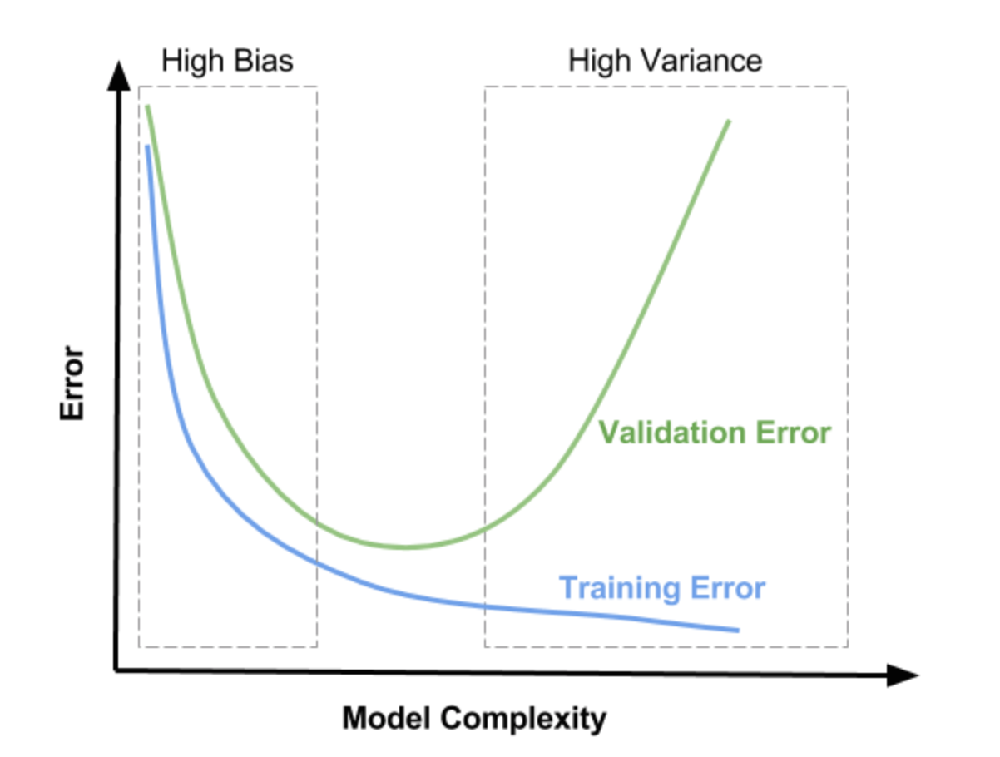
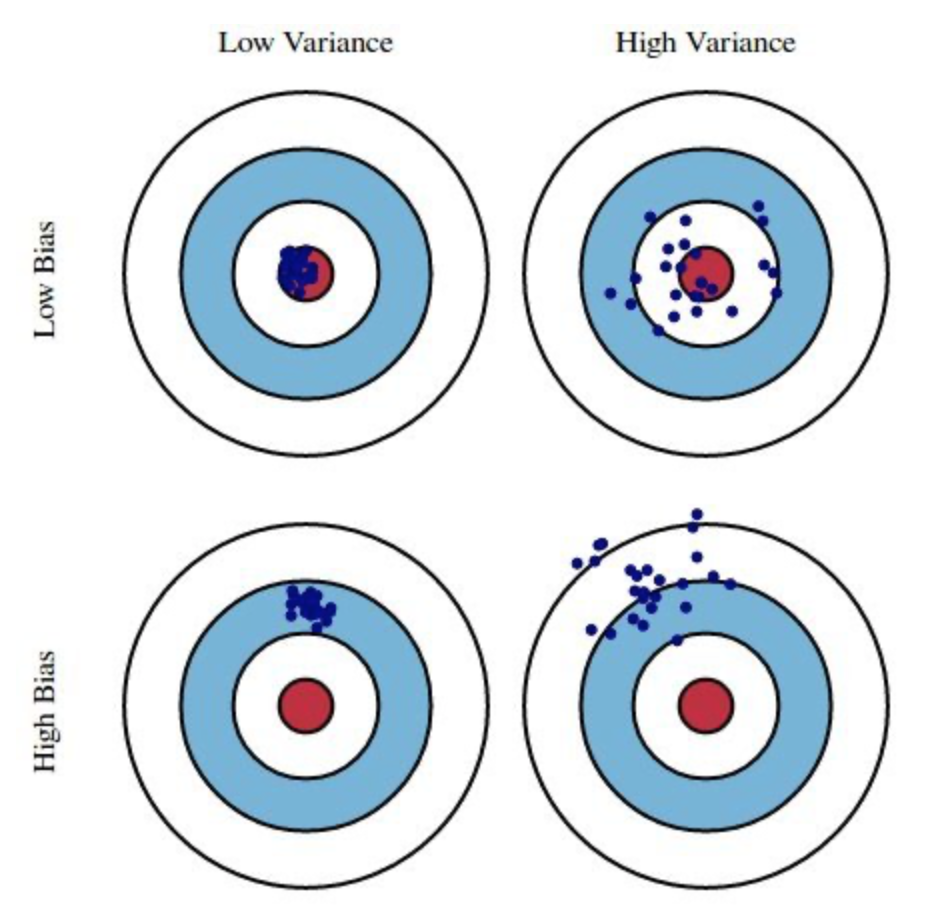
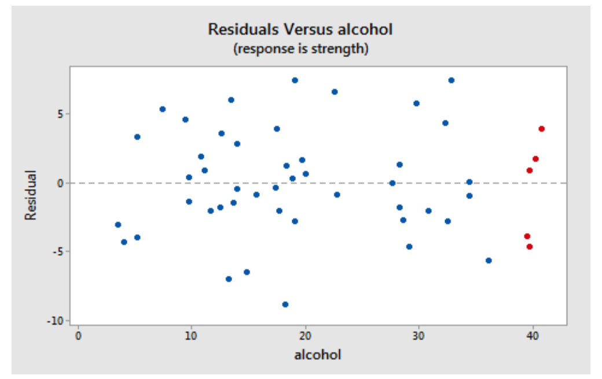
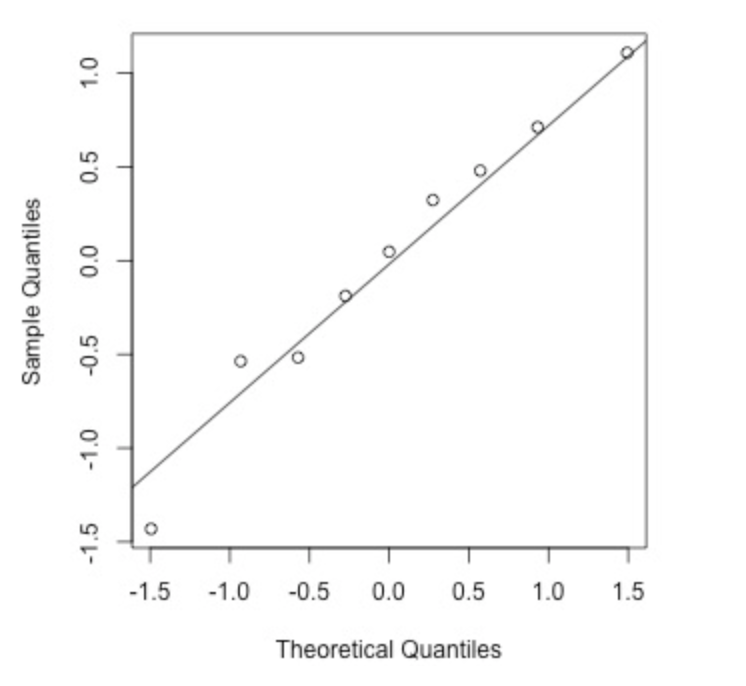

Lecture 21: [Model Selection](http://www.stat.cmu.edu/~larry/=stat401/lecture-21.pdf)



##### 3 Why is the Training Error Smaller than the Generalization Error?


##### [Training Regression Models](http://rstudio-pubs-static.s3.amazonaws.com/523564_861fa219cc944816acd5584b02a9e18e.html)

##### **Training and Valudation MSE**

Notice that as we considered moved from ==less flexible fitting== methods (such as considering only linear model) to more flexible fitting methods (such as considering degree-9 polynomials), we saw two things occur:

- As flexibility increased, the training MSE decreased.
- As flexibility increased, validation MSE first decreased, and then increased.

##### [CAP 5703](https://rstudio-pubs-static.s3.amazonaws.com/384357_6b71ee9df6214ed5bf76f8de9ef5aba3.html) Assignment#3 Danilo Martinez

##### [homework](https://rpubs.com/liudennis/stat5720-chpt8) chapter 8

[Statistics 512](https://www.stat.purdue.edu/~snandy/stat512/topic5.pdf): Applied Linear Models

##### Getting started [simulating data in R](https://aosmith.rbind.io/2018/08/29/getting-started-simulating-data/): some helpful functions and how to use them

##### Fitting [Polynomial Regression](https://www.r-bloggers.com/2015/09/fitting-polynomial-regression-in-r/) in [R](https://datascienceplus.com/fitting-polynomial-regression-r/)

##### Polynomial Regression in [python](https://towardsdatascience.com/polynomial-regression-bbe8b9d97491)

**Table of Contents**

- Why Polynomial Regression
- Over-fitting vs Under-fitting
- Bias vs Variance trade-offs
- Applying polynomial regression to the Boston housing dataset.

- Introducing Monte [Carlo Methods](http://inst-mat.utalca.cl/jornadasbioestadistica2011/doc/CursoCasella/%20UseR-SC-10-B-Part1.pdf) with [R](https://homerhanumat.github.io/r-notes/monte-carlo-simulation.html)

##### Visual Representation of R-squared

To visually demonstrate how R-squared values represent the scatter around the regression line, you can plot the fitted values by observed values.



The R-squared for the regression model on the left is **15%,** and for the model on the right it is **85%.** When a regression model accounts for more of the **variance**, the data points are closer to the regression line. In practice, you’ll never see a regression model with an R2 of 100%. In that case, the fitted values equal the data values and, consequently, all of the observations fall exactly on the regression line.

##### R-squared and the Goodness-of-Fit

R-squared evaluates the scatter of the data points around the fitted regression line. It is also called the [coefficient](https://statisticsbyjim.com/glossary/regression-coefficient/) of determination, or the coefficient of multiple determination for multiple regression. For the same data set, higher R-squared values represent smaller differences between the observed data and the fitted values.

R-squared is the percentage of the dependent variable variation that a linear model explains.


R-squared is always between 0 and 100%:

- 0% represents a model that does not explain any of the variation in the [response](https://statisticsbyjim.com/glossary/response-variables/)variable around its [mean](https://statisticsbyjim.com/glossary/mean/). The mean of the dependent variable predicts the dependent variable as well as the regression model.
- 100% represents a model that explains all of the variation in the response variable around its mean.

Usually, the larger the R2, the better the regression model fits your observations. However, this guideline has important caveats that I’ll discuss in both this post and the next post.

```python
# Let’s fit it using R. When fitting polynomials you can either use

model <- lm(noisy.y ~ poly(q,3))
#Or
model <- lm(noisy.y ~ x + I(X^2) + I(X^3))
# note that q, I(q^2) and I(q^3) will be correlated and correlated variables can cause problems. 
# The use of poly() lets you avoid this by producing orthogonal polynomials, therefore I’m going to use the first option.
```

##### Model Tuning ([Part 1 - Train/Test Split](https://dziganto.github.io/data%20science/machine%20learning/model%20tuning/python/Model-Tuning-Train-Test-Split/))

##### Model Tuning ([Part 2 - Validation & Cross-Validation](https://dziganto.github.io/cross-validation/data%20science/machine%20learning/model%20tuning/python/Model-Tuning-with-Validation-and-Cross-Validation/))

- Bias-Variance Tradeoff
- Validation Set
- Model Tuning
- Cross-Validation

Compare **training error** and something called ***validation error*** to figure out what’s going on with our model. Depending on the values of each, our model can be in one of three regions:

1) **High Bias** - underfitting
2) **Goldilocks Zone** - just right
3) **High Variance** - overfitting



##### Canonical Plot

##### 

##### Model Tuning

We need to decrease **complexity**. One way to do this is by using ==***regularization***==. I won’t go into the nitty gritty of how regularization works now because I’ll cover that in a future post. Just know that regularization is a form of constrained optimization that imposes limits on determining model parameters. It effectively allows me to add bias to a model that’s overfitting. I can control the amount of bias with a hyperparameter called *lambda* or *alpha* (you’ll see both, though sklearn uses alpha because lambda is a Python keyword) that defines regularization strength.


##### [Residuals vs. Predictor Plot](https://online.stat.psu.edu/stat501/lesson/4/4.3)



##### [Normal Probability Plot of Residuals](https://online.stat.psu.edu/stat501/lesson/4/4.6)



in fact **mean squared error equals the variance of the errors plus the square of the mean error.** That is: **MSE = VAR(E) + (ME)^2**. Hence, if you try to minimize mean squared error, you are implicitly minimizing the bias as well as the variance of the errors.


# studentized residuals

###### https://rdrr.io/cran/olsrr/man/ols_plot_resid_stud_fit.html
###### https://www2.kenyon.edu/Depts/Math/hartlaub/Math305%20Fall2011/R.htm
###### https://cran.r-project.org/web/packages/olsrr/vignettes/influence_measures.html
###### Functions rstandard and rstudent give the standardized and Studentized residuals respectively. (These re-normalize the residuals to have unit variance, using an overall and leave-one-out measure of the error variance respectively.)