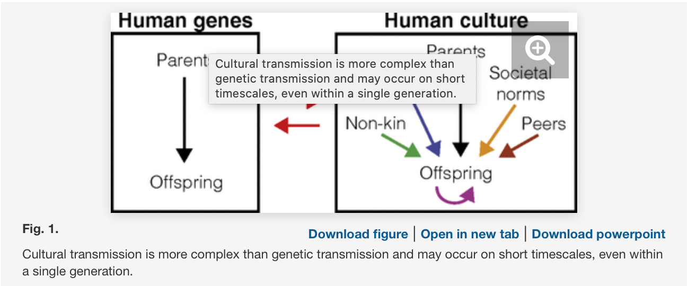
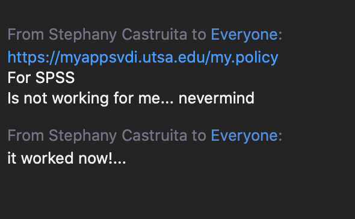

# A Cultural Evolution Approach to Digital Media

### ABSTRACT

From emails to social media, from instant messaging to political memes, the way we produce and transmit culture is radically changing. This book uses, for the first time, cultural evolution theory to analyze how information spreads, and how it affects our behavior in the digital age. Online connectedness and digital media allows access to networks where cultural transmission is possible, increasing both the availability of cultural models (from whom we can copy) and our reach (the number of individuals who can copy from us). This poses new problems, and new opportunities (Chapter 1). A cognitive and evolutionary approach suggests that we are wary learners, and the power of social influence, either online or offline, is often overestimated (Chapter 2). The background developed in the initial chapters into the details of different online phenomena is used: the tendency to copy popular individuals (Chapter 3), popular opinions (Chapter 4), or exchange information only with same-minded individuals (Chapter 5). The spread of online misinformation is then scrutinized at length (Chapter 6), proposing that to understand the phenomenon we need to understand why, generally, some information is more successful in spreading than other. The last two chapters examine how online, digital, transmission is different from other forms of cultural transmission, providing more “fidelity amplifiers” (Chapter 7), and how this could affect future cultural cumulation (Chapter 8). Overall, it is proposed that a “long view” to the current situation, based on a personal perspective of cognitive and evolutionary approaches to culture, suggests that some of the dangers of digital, online, interactions may have been overestimated, and the opportunities still ahead of us are discussed.

Technical Meetups have become a community staple in the lives of many information technology professionals. Traditionally, Meetups have been an in-person, live forum where like-minded individuals continue to learn about specific technology trends and expand their professional network. While the Covid-19 pandemic has brought live Meetup events to a halt for the time being, the desire for community interaction remains. How have Meetups evolved to meet this need? To answer this, let’s look back at some historical milestones.

https://www.cxotoday.com/news-analysis/technical-meetups-evolve-in-the-shadow-of-covid-19/

Can the meetup help people built network? to be successed in the career? Feels nervel?

# What is the impact of social media on human behavior?

https://firstmonday.org/ojs/index.php/fm/article/view/10213/8073

### ==Online Social Networking and Mental Health==

### ==Combining surveys and online behavioral data==

Large behavioral datasets can be complemented with smaller-scale survey data to create insights impossible with either data alone. In this talk, Winter will review two research projects that leveraged this methodology. In the first, **survey** data from highly active Halo players is combined with gameplay data to understand the impact of friendships on team success in the game's PvP tournaments. In the second, survey data about people's moods enabled a deeper understanding of sentiment analysis of tweets. Although topically disparate, **the common methodology in these studies illustrates the power of combining small and large datasets.**	

### Going Online to Meet Offline: Organizational Practices of Social Activities through Meetup

The survey shows that many people see **going together** to a cultural event as an effective means to an end, the end being **expanding their social network**, in some cases precipitated by a change in circumstance, such as a move, or a relationship finishing. But joint attendance also enhances enjoyment of the cultural event itself, providing opportunities to share experience and reactions with a congenial group of people, and informing people about events that they might not otherwise have heard about.

The survey shows that the most valued meetups are those organised carefully and sensitively, with organisers who take pains to make everyone feel welcome, and who have provided clear advance information about where and how people can connect with the other members of the group. 

### Enhancing the experience of cultural events through group attendance: a case study of meetup.com

*Networking is one of the [keys](https://www.linkedin.com/pulse/afraid-going-meetups-try-stefan-welack) to success in your professional life*

### Online Social Networking and Mental Health

### How Offline Gatherings Affect Online Communities -- When Virtual Community Members ‘meetup’

### Study Shows Meetup Increases Feelings of Connectedness

Meetup Launched "Campus Community" and Offers Free Organizer Subscriptions to College Students, Plus a Resource Page to Combat Loneliness During COVID-19

### Technical Meetups Evolve in the Shadow of COVID-19

Technical Meetups have become a community staple in the lives of many information technology professionals. Traditionally, Meetups have been an in-person, live forum where like-minded individuals continue to learn about specific technology trends and expand their professional network. While the Covid-19 pandemic has brought **live Meetup** events to a halt for the time being, the desire for community interaction remains. How have Meetups evolved to meet this need? To answer this, let’s look back at some historical milestones.

Since then, technical meetups have been formed and have **evolved** throughout the world with technological influence from the world’s most prestigious technology companies. 

While each Meetup has its own unique personality, the formats have a lot of similarities. Typically, each meeting will start out as more of a social gathering and networking time. This is usually done with food and drink that the sponsor of the group provides. The heart of the evening is typically the talks which are either one to two full length talks about the technology the group is focused on, or “lightening talks” which are multiple 5 to 15 minute talks that also get directly to the subject at hand. After a Question and Answer session, it is very common for members of the group to go out and have another meal or drinks together.

With the novel Coronavirus disrupting the world, Meetups are currently evolving to meet the desire for community which is lacking when public venues are all shutdown. While **virtual meetups** have become the norm for most Meetups during the pandemic, many Meetups are holding out until they can meet in person again. Virtual Meetups will be successful if everyone in the group follows certain guidelines and adheres to them.

##### How Offline Gatherings Affect Online Communities -- When Virtual Community Members ‘meetup’

### [Cultural evolutionary theory](https://www.pnas.org/content/114/30/7782): How culture evolves and why it matters

Human cultural traits—behaviors, ideas, and technologies that can be learned from other individuals—can exhibit complex patterns of transmission and evolution, and researchers have developed theoretical models, both verbal and mathematical, to facilitate our understanding of these **patterns**. Many of the first quantitative models of cultural evolution were modified from existing concepts in theoretical population genetics because cultural evolution has many parallels with, as well as clear differences from, **genetic** evolution. Furthermore, cultural and genetic evolution can interact with one another and influence both **transmission and selection**. This interaction requires theoretical treatments of **gene–culture** **coevolution** and **dual inheritance**, in addition to purely cultural evolution. In addition, cultural evolutionary theory is a natural component of studies in demography, human ecology, and many other disciplines. Here, we review the core concepts in cultural evolutionary theory as they pertain to the extension of biology through culture, focusing on cultural evolutionary applications in population genetics, ecology, and demography. For each of these disciplines, we review the theoretical literature and highlight relevant empirical studies. We also discuss the societal implications of the study of cultural evolution and of the interactions of humans with one another and with their environment.

==Human culture encompasses ideas, behaviors, and artifacts that can be learned and transmitted between individuals and can change over time==

##### Population Genetics and Cultural Evolution

Many of the first models of cultural evolution drew explicit parallels between culture and genes by modifying concepts from theoretical population genetics and applying them to culture. 

Cultural patterns of transmission, innovation, random fluctuations, and selection are conceptually analogous to genetic processes of transmission, mutation, drift, and selection, and many of the mathematical techniques used to study genetics can be useful in the study of culture.

### Online Social Networking and [Mental Health](https://www.ncbi.nlm.nih.gov/pmc/articles/PMC4183915/)

(online live events) 

### Study Shows Meetup Increases Feelings of Connectedness

Three out of four people reported that Meetup has made their life better, and eight out of ten say they feel more connected to others. To help combat feelings of isolation during social distancing, the company has announced its first two initiatives [under new](https://c212.net/c/link/?t=0&l=en&o=2802432-1&h=4123563135&u=https%3A%2F%2Fwww.prnewswire.com%2Fnews-releases%2Fmeetup-spins-off-from-wework-301031766.html&a=under+new) ownership: Meetup "Campus Community" and a COVID-19 resource page.

Meetup's COVID-19 resource page makes it easy for people to discover groups that can help **foster togetherness** despite the COVID-19 pandemic. These groups are hosted live on video chat platforms and span Meetup's most popular online categories including wellness (mediation, yoga, crafts), job networking (tech, coding, business), and support around COVID-19 (healthcare/essential workers, and affected families). 

Across all key indicators, the ImpactED study showed that Meetup is making a positive life impact on its members. In fact, there is a clear relationship between the frequency of using Meetup and the positive impact Meetup members experienced, particularly for those who kept meeting amongst the same group.

**Guidelines for developing research proposals**

**One-page outline (1 page, bullet points)**

1. What is the purpose of your study? **What** research question are you going to examine in this study?

- To study whether online live events holding on social networking sites such as Facebook, Zoom, Meetup, and so on, will increase feelings of connectedness to decrease the mental health problems and improve emotional and social connections during the pandemic period.
- The Virtual events (live streaming events) become more widely used due to the social distancing, which have positive effect on conquer feelings of isolation during the pandemic period?
- This online social networking profound change the human behavior in the way of people communication and interaction? Compared to past,  people have already adapted new relationship pattern. 

- students who have attended meetups report significant improvements to their educational experience and career prospects. It helps people connect face-to-face with other people who have similar interests and hobbies.

- Group Organization
- consumed on electronic devices, such as computers and smartphones

- Facebook is used for both business and personal communication,  its application has brought numerous advantages in terms of increasing connectivity, sharing ideas, and online learning.

- Recently, however, some researchers have associated online social networking with several psychiatric disorders, including depressive symptoms, anxiety, and low self-esteem. 

- offline gatherings may provide individual benefits for members as the development of relationships strengthens social ties, leading to the creation of bonding social capital.

- Virual interaction totally change people communication pattern

- Group Size

- relationship pattern

- strengthens ties to other attendees

###### How Offline Gatherings Affect Online Communities -- When Virtual Community Members ‘[meetup](https://www.researchgate.net/publication/263568471_How_Offline_Gatherings_Affect_Online_Communities_--_When_Virtual_Community_Members_%27meetup%27)’

2. **Why** is this research question interesting and important? (Hints: practical importance of

the problem to be addressed, previous research got it wrong, new methods became

available that allow better addressing your research question, etc.)

- In the past study shows although social networks enable an individual to interact with a large number of people, these interactions are shallow and cannot adequately replace everyday face-to-face communication. But during the special period, 
- During the past decade, online social networking has caused profound changes in the way people communicate and interact.  It is unclear, however, whether some of these changes may affect certain normal aspects of human behavior and cause psychiatric disorders. Several studies have indicated that the prolonged use of social networking sites (SNS), such as Facebook, may be related to signs and symptoms of depression. This concise review focuses on the recent findings regarding the suggested connection between SNS and mental health issues such as depressive symptoms, changes in self-esteem, and Internet addiction.

- online interaction affects offline community, the question of how offline interaction affects online community has largely been ignored
- this potential relationship between their use and feelings of loneliness and depression has not yet been properly investigated

3. What contribution(s) do you intend to make with your study? Shifting consensus?Creating consensus? Filling the gap(s) in the literature?

Shifting consensus: 

- group age -> addicted to Internet
- Group Organization

4. Provide a theoretical model that depicts the hypothesized relationships between the study variables. Use boxes and arrows. Please limit the number of hypothesized links to 5±2.

5. What theory and literature are you going to use to build rationales for your hypotheses? 

- In 1998, Kraut et al. published one of the first studies to indicate that Internet use in general significantly affects social relationships and participation in community life. In this research, the authors found that increased time spent online is related to a decline in communication with family members, as well as the reduction of the Internet user's social circle, which may further lead to increased feelings of depression and loneliness. 

6. What research strategy are you going to use (e.g., lab experiment, quasi-experiment, survey, etc.)?

### [STREAM](https://www.technologynetworks.com/neuroscience/articles/stream-six-strategies-that-can-help-your-mental-health-during-coronavirus-isolation-332626): Six Strategies That Can Help Your Mental Health During Coronavirus Isolation**

The coronavirus pandemic has been ongoing for several months. 

lockdown policies

This social isolation, and the loneliness that can come with it, is a major concern for mental health.

Social isolation and poor mental health are strongly linked, in studies of both the [elderly](https://www.nia.nih.gov/news/social-isolation-loneliness-older-people-pose-health-risks) and [young](https://www.sciencedirect.com/science/article/pii/S0890856714008600) [people](https://www.sciencedirect.com/science/article/pii/S0890856714008600).

### Live streaming of [sporting events](https://thedailynews.cc/articles/live-streaming-of-sporting-events-becoming-more-widely-used-this-season-due-to-attendance-restrictions/) becoming more widely used this season due to attendance restrictions

### [Cultural Evolution](https://oxford.universitypressscholarship.com/view/10.1093/oso/9780198835943.001.0001/oso-9780198835943) in the Digital Age

From emails to social media, from instant messaging to political memes, the way we **produce and transmit culture** is radically changing. This book uses, for the first time, **cultural evolution theory** to analyze how information spreads, and how it **affects our behavior in the digital age.** **Online connectedness** and digital media allows access to networks where cultural transmission is possible, increasing both the availability of cultural models (from whom we can copy) and our reach (the number of individuals who can copy from us). This poses new problems, and new opportunities (Chapter 1). A cogniti ... More

*Keywords:* [cultural evolution](https://www.universitypressscholarship.com/search?f_0=keywords&q_0=cultural evolution), [cultural transmission](https://www.universitypressscholarship.com/search?f_0=keywords&q_0=cultural transmission), [social networks](https://www.universitypressscholarship.com/search?f_0=keywords&q_0=social networks), [social media](https://www.universitypressscholarship.com/search?f_0=keywords&q_0=social media), [digital media](https://www.universitypressscholarship.com/search?f_0=keywords&q_0=digital media), [internet](https://www.universitypressscholarship.com/search?f_0=keywords&q_0=internet), [social influence](https://www.universitypressscholarship.com/search?f_0=keywords&q_0=social influence)

OFFLINE AND ONLINE [RELATIONSHIPS](https://digitalcommons.wpi.edu/cgi/viewcontent.cgi?article=3733&context=iqp-all)

A widely-reported 2006 study [15] argued that since 1985, when gatherings in the virtual world increased, Americans have become more socially isolated, the size of their discussion networks in the physical world declined, and the diversity of those people with whom they discuss important matters decreased.

### [Enhancing](https://www.researchgate.net/publication/313242975_Enhancing_the_experience_of_cultural_events_through_group_attendance_a_case_study_of_meetupcom) the experience of cultural events through group attendance: a case study of meetup.com

GOING TO THINGS TOGETHER MAKES EVENTS BETTER, MAKES LIVES BETTER – NEW RESEARCH ON MEETUP.COM Meetup.com is an international social application that puts people with common interests in touch with one another so that they can **attend events together and socialise around the event.** A recent detailed survey conducted by psychologist John Sloboda, completed by meetup members living and working in London, confirms the high value that going together to cultural events (such as concerts, talks, films) brings to many people. **The survey shows that** many people see going together to a cultural event as an effective means to an end, the end **being expanding their social network**, in some cases precipitated by a change in circumstance, such as a move, or a relationship finishing. But joint attendance also enhances enjoyment of the cultural event itself, providing opportunities to **share experience and reactions with a ==congenial== group of people**, and informing people about events that they might not otherwise have heard about. The survey shows that the most valued meetups are those organised carefully and sensitively, with organisers who take pains to make everyone feel welcome, and who have provided clear advance information about where and how people can connect with the other members of the group. The best organisers are volunteers who have a genuine interest in people (including themselves) having a good time and in ensuring that everything runs smoothly. Meetups organised for personal profit or professional gain are less appreciated. Many meetup attenders belong to several different meetup groups, attend meetups regularly, and **gain high satisfaction** from doing so. The findings suggest that self-organising groups of “cultural consumers” are a force for social and cultural good, particularly in big cities, where loneliness and alienation are common experiences. Meetup usually improves the going out experience, and can be socially transformative for some of its members. The lessons of meetup deserve to be more widely shared and used in the cultural sector. Read the full report at http://www.johnsloboda.co.uk/#post42

### The mutual shaping of online and offline social relationships

**Analysis.** *Interview data were recorded, transcribed, translated and coded following the principles of grounded theory.* 

**Results.** *Participants have been using the Internet to overcome geographical barriers and to integrate the virtual world into everyday life. Initial interactions in the online community promote the need for individuals to meet in the physical world **with those who have similar interests and backgrounds**. Interactions in the physical world in turn help weak tie relationships to develop into stronger ties.* 

### Meetups

https://digitalcommons.wpi.edu/cgi/viewcontent.cgi?article=3733&context=iqp-all

### Study [Shows](https://www.prnewswire.com/news-releases/study-shows-meetup-increases-feelings-of-connectedness-301058211.html) Meetup Increases Feelings of [Connectedness](https://www.prnewswire.com/news-releases/study-shows-meetup-increases-feelings-of-connectedness-301058211.html)

Meetup Launched "Campus Community" and Offers Free Organizer Subscriptions to College Students, Plus a Resource Page to Combat Loneliness During COVID-19

Meetup's COVID-19 resource page makes it easy for people to discover groups that can help **foster togetherness** despite the COVID-19 pandemic.

the ImpactED study showed that Meetup is making a positive life impact on its members. 

The findings for Meetup members revealed: 

- 80% of people who go to Meetup events feel **more connected to others.**
- 90% of those who joined to learn something new increased their **knowledge and/or skills.**
- 72% of people reported an increased number of **friendships.**

The findings for Meetup organizers revealed:

- 89% of organizers reported an increased ability to **impact the lives of others**. 
- 74% of organizers say **Meetup has made their life better**. 
- 78% of organizers reported an increased impact on their **self-confidence**.

To helps relieve feelings of loneliness and isolation which is why we are making it easier for members to find the groups they may need most right now, as well as helping college students reconnect to their campus community."

Meetup is uniquely positioned to organize and **promote communities at scale around similar interests**** by specifically matching people by topics and/or location. Meetup organizers--who create and maintain over 330,000 groups in 193 countries--not only convene around their passions, but organize to start movements of all sizes, and have significant abilities to enhance their own lives and others by using Meetup.

*ImpactED at University of Pennsylvania Survey Methodology*

*Meetup engaged ImpactED at the University of Pennsylvania to conduct a cross-sectional study of its current members.* *Survey questions captured details about members' Meetup event attendance, their motivations for joining, and the impact Meetup has had on their lives. ImpactED worked with Meetup to create a logic model and indicators, which illustrate the theory and assumptions underlying Meetup as an organization. Using the logic model and indicators as a guide, ImpactED developed two surveys: one for members and one for organizers. A total of 3,001 members and 2,442 organizers completed the survey, yielding response rates of 2.1% and 7.0% respectively. The data was weighted to account for non-response bias and to more accurately represent the population of Meetup users.* 

### Online Social Networking and [Mental Health](https://www.ncbi.nlm.nih.gov/pmc/articles/PMC4183915/)

### Darwinism Extended: A Survey of How the Idea of [Cultural Evolution Evolved](https://link.springer.com/article/10.1007/s11406-013-9415-8)

https://link.springer.com/article/10.1007/s11406-013-9415-8

### [A Study on NLP](https://www.amrita.edu/sites/default/files/a-study-on-nlp-impacting-human-behavior.pdf) impacting Human Behavior

### Detecting [adversarial behaviour](https://blog.f-secure.com/command-lines/) by applying NLP techniques to command lines

### A Cultural Evolution Approach to [Digital Media](https://www.ncbi.nlm.nih.gov/pmc/articles/PMC5156828/)

[A Cultural Evolution Approach to Digital Media](https://www.frontiersin.org/articles/10.3389/fnhum.2016.00636/full)

cultural evolution framework：

how cultural transmission biases, that is, simple heuristics such as “copy prestigious individuals” or “copy the majority,” 

copy the majority

to develop hypotheses informed by cognitive science and evolutionary theory. 

widespread diffusion of digital media offers to social sciences is the availability of vast amounts of data on human behavior 

### Mental Health

https://www.who.int/docs/default-source/coronaviruse/mental-health-considerations.pdf?sfvrsn=6d3578af_2

##### Keeping People Safe and [Informed](https://about.fb.com/news/2020/10/coronavirus/) About the Coronavirus

##### How social distancing can [hurt](https://www.pbs.org/newshour/health/why-your-mental-health-may-be-suffering-in-the-covid-19-pandemic) mental health

Despite social distancing, “we have opportunities to **deepen/reshape** our relationships,” Bufka said.

bond together from a physical distance

Limit media to reduce anxiety

==Is Facebook Making Us [Lonely](https://cacm.acm.org/magazines/2015/12/194633-internet-use-and-psychological-well-being/fulltext)?==

[**The path to the next normal**](https://www.mckinsey.com/~/media/McKinsey/Featured%20Insights/Navigating%20the%20coronavirus%20crisis%20collected%20works/Path-to-the-next-normal-collection.pdf)

Research Proposals

 

·   The purpose of this study is to study whether live streaming events holding on social networking sites such as Facebook, Zoom, Meetup, and so on, will increase feelings of connectedness to decrease the mental health problems, like depressive symptoms, stress, and loneliness, and improve emotional and social connections during the pandemic period, further change the human behavior in the way of people communication and interaction.

 

·   Research Questions 

​                                             

\1.   The virtual events now span most popular categories including working from home, wellness (mediation, yoga, Zumba), job networking (tech, coding, business), and support around COVID-19 (healthcare/essential workers. It becomes more widely used due to the social distancing, which have positive effect on conquer feelings of isolation during the pandemic period?

\2.   This online social networking profound change the human behavior in the way of people communication and interaction and re-divide the proportion of our online and offline social relationships. Compared to past, people have already adapted/tolerant of this remote virtual social relationship pattern. They become more positive attitude to this things.

- The     reason why this research question interesting and important is that based     on the past study, much research shows people communicate online primarily     with people with whom they communicate offline—their relatively strong     social ties—and their online communication supplements rather than     replaces their offline communication. Online social networking may cause     psychiatric disorders, such as symptoms of depression,     changes in self-esteem, and Internet addiction. But     now by defense in the covid-19 and social distancing, more and more people are involving     in the online live events. It is interesting to know how humans influence     and adapt to changing environmental conditions.

·   The contribution I am intend to make with this study is to shifting consensus. 

·   What theory and literature are you going to use to build rationales for your hypotheses? The research strategy that I am going to use is combining surveys and online behavioral data

- A theoretical model 

|      |          |
| ---- | -------- |
|      |  |

 

 

 From Stephany Castruita to Everyone: (11:35 AM)

From Stephany Castruita to Everyone: (11:35 AM)

 

https://myappsvdi.utsa.edu/my.logout.php3?errorcode=19

 

 

###  Measuring Emotions in the COVID-19 Real World Worry Dataset

[Bennett Kleinberg](https://www.semanticscholar.org/author/Bennett-Kleinberg/91010235), [I. Vegt](https://www.semanticscholar.org/author/I.-Vegt/51241310), [Maximilian Mozes](https://www.semanticscholar.org/author/Maximilian-Mozes/37237998)

Published 2020

Computer Science

ArXiv

The COVID-19 pandemic is having a dramatic impact on societies and economies around the world. With various measures of lockdowns and social distancing in place, it becomes important to understand emotional responses on a large scale. In this paper, we present the first ground truth dataset of emotional responses to COVID-19. We asked participants to indicate their emotions and express these in text. This resulted in the Real World Worry Dataset of 5,000 texts (2,500 short + 2,500 long texts). Our analyses suggest that emotional responses correlated with linguistic measures. Topic modeling further revealed that people in the UK worry about their family and the economic situation. Tweet-sized texts functioned as a call for solidarity, while longer texts shed light on worries and concerns. Using predictive modeling approaches, we were able to approximate the emotional responses of participants from text within 14% of their actual value. We encourage others to use the dataset and improve how we can use automated methods to learn about emotional responses and worries about an urgent problem. L

 