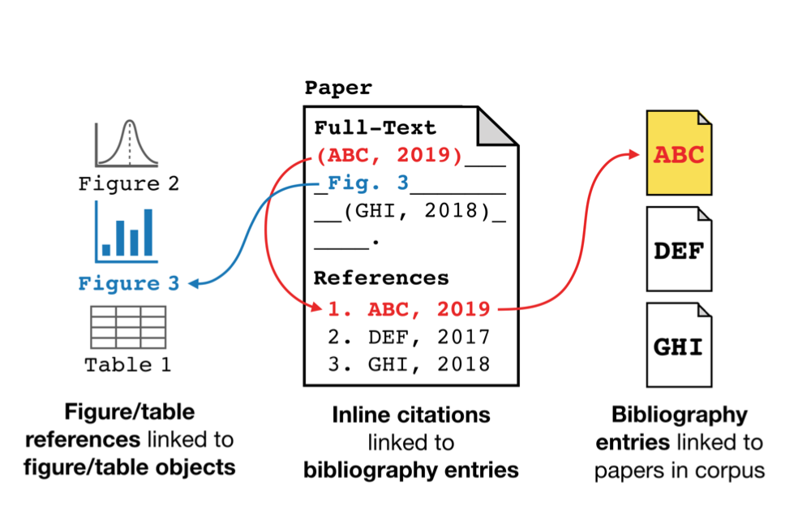
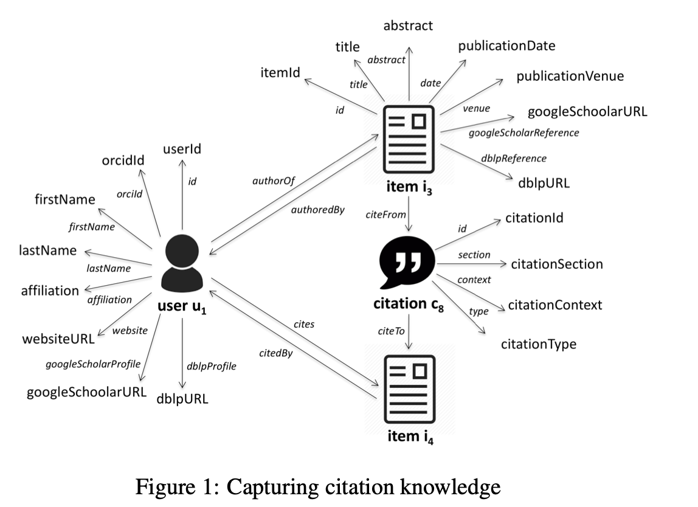
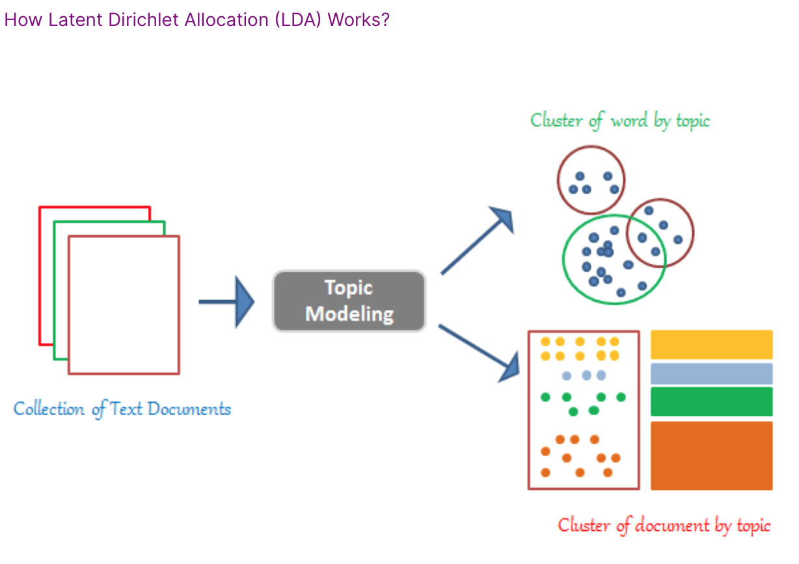
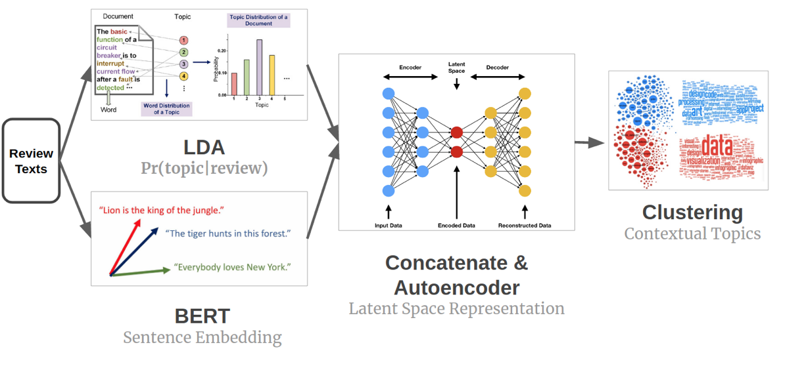

[Paper Reading](https://www.aclweb.org/anthology/2020.acl-main.207.pdf) 

[Code](https://github.com/allenai/specter)

### S2ORC: The Semantic Scholar Open Research Corpus

##### [COVID-19 and Text data mining - a grand experiment around CORD-19 dataset?](http://musingsaboutlibrarianship.blogspot.com/2020/05/covid-19-and-text-data-mining-tdm.html)

https://www.aclweb.org/anthology/2020.lrec-1.272.pdf

### COVID-19 Open Research Dataset Challenge [(CORD-19)](https://www.kaggle.com/allen-institute-for-ai/CORD-19-research-challenge)

Topic Modeling: Finding 

- Did you find an interesting article and want to easily find related research without browsing all existing publications yourself? Do you have a specific research question and want to discover relevant articles? Then this notebook might help you.

  **Approach**: We first discover a number of topics using LDA (Latent Dirichlet Allocation). This allows us to view each article as a mixture of these topics. By mapping a specific article into the topic space (a simplex with a topic in each corner), we can then find related articles.

  Website now available on [discovid.ai](https://discovid.ai/)!

- COVID-19 [Literature Clustering](https://www.kaggle.com/maksimeren/covid-19-literature-clustering)

  - to find meaning in the clusters, topic modelling will be performed to find the keywords of each cluster.

- Mining COVID-19 scientific [papers](https://www.kaggle.com/mobassir/mining-covid-19-scientific-papers)

  - The flu, the common cold, allergies, and COVID-19 — the disease associated with the new coronavirus — have similar symptoms, but the coronavirus has been far deadlier.Overlapping symptoms include a sore throat, fatigue, and a dry cough. That can make it challenging for doctors to diagnose COVID-19.People with COVID-19 don't typically have runny noses or sneeze a lot.The coronavirus primarily affects the lungs and commonly causes a fever, a dry cough, and shortness of breath.

  - Topic Modeling - In recent years, huge amount of data (mostly unstructured) is growing. It is difficult to extract relevant and desired information from it. At the document level, the most useful ways to understand text by its topics. The statistical process of learning and extracting these topics from huge amount of documents is called topic modeling.In Text Mining Topic Modeling is a technique to extract the hidden topics from huge amount of text.

    There are so many algorithms to do topic modeling. **Latent Dirichlet Allocation (LDA)** is one of those popular algorithms for topic modeling.

    

- Covid-19: BERT + MeSH Enabled [Knowledge Graph](https://www.kaggle.com/sandyvarma/covid-19-bert-mesh-enabled-knowledge-graph#Query-4:-What-has-been-published-about-ethical-and-social-science-considerations?)

  - Scispacy + Bert

- Topic Modeling with BERT, LDA, and Clustering

  - 

- Covid-19 QA-BERT

  - The objective of this project is to integrate the state of the art Natural Language Processing (NLP) techniques to create a method to ask a database a question and have it return sensible results that answer that question. The BERT model searches for answers on a large dataset rather slowly, so it was decided to use tf-idf first and find the 10 most relevant articles, then **make the BERT model find an answer among these 10 articles.**

- COVID-19-BERT-ResearchPapers-[Semantic-Search](https://www.kaggle.com/theamrzaki/covid-19-bert-researchpapers-semantic-search#===-What-has-been-published-about-medical-care?-=====)

  - **semantic search engine using BERT**
  - Abstract_Summary

- Interactive Search using BioBERT and CorEx Topic Modeling

  - use BioBERT for vectorizing academic medical texts, and how to use CorEx for topic modeling. 

- [NER](https://www.kaggle.com/vishakha10/ner-using-bert-model) using bert model

