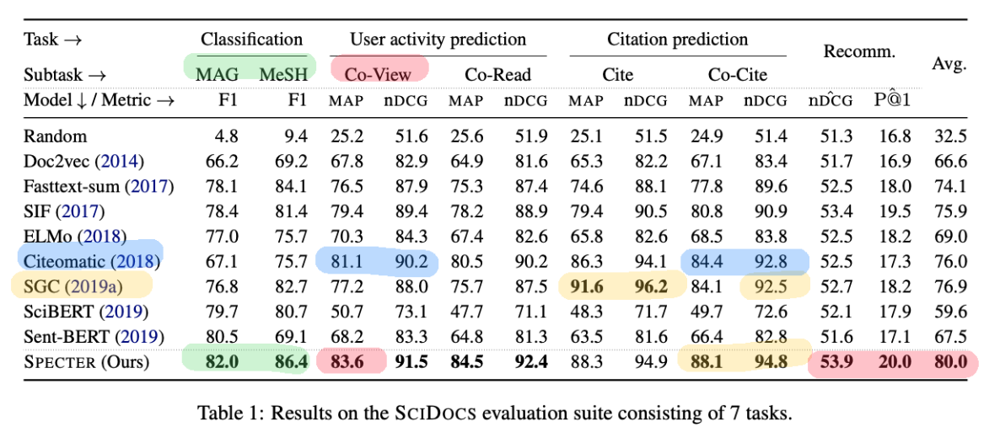

# 
SPECTER: Document-level Representation Learning using Citation-informed Transformers 

### 
by Arman Cohan, Sergey FeldmanIz, Beltagy Doug and Downey Daniel S. Weld

### 
Present by Xingmeng Zhao

<!-- break page-->

# 1 Goals and Challenge

- What is Representation learning? 
- Recently, the most populat method for Representation learning is transformer language method like BERT targeted towards token- and sentence-level training (no inter-document Relatedness)
  - limitation for whole document level represetation power
-  SPECTER - generate document-level embedding of scientific documents based on the pretraining transformer model, like SciBERT. (no fine-tuning)
- three document-level tasks: 
  - Task A: topic classification
  - Task B: citation prediction
  - Task C: recommendation
- SCIDOCS,
  - novel collection of data sets which anonymized user signal of document relatedness
  - new evaluation benchmark including 7 document-level tasks ranging from citation prediction and recommendation.

<!-- break page-->

# 2 Data Introduction

<!--https://allenai.org/data -->                              

- SPECTER Model 
  - no need to for task-specific fine-tuning of pre-trained model 
  - leverage the power of pretrained language model
  - learning the embedding for scientific documents
  - unlike many prior models, when doing inference, SPECTER don't require any citation information, which means we can predict (embedding )the new papers that have not yet been cited.
  -  learned paper embedding easily used as features<!--no need fine-tuning for specific task--> 
  - input data - scientific paper embedding (feature-based): 
    - paper's title
    - abstract - comprehensive summary of paper <!--pass-->
    - citations (SPECTER)

​			

<!-- break page-->

# 3 Previous Work

- Per-trained Language model

  - SciBERT: A Pretrained Language Model for Scientific Text (fine-tuning based)

  

  

<!-- break page-->

# 4 Model

### 4.1 SPECTER

- Author call their model SPECTER, which means learns Scientific Paper Embeddings using Citation-informed TransformERs With respect to the terminology used by citiation.
- Not fine-tuning based ---  [CLS] token
- our approach results in embeddings that can be applied to downstream tasks in a “feature-based” fashion, meaning the learned paper embeddings can be easily used as features, with no need for further task-specific fine-tuning.

- SPECTER Model = pretrained transformer networks (SciBERT)  + cititaion information 

<!-- break page-->

### 4.2 Document Representation

- The goal is to represent a given paper P as a dense vector v that best represents the paper and can be used in downstream tasks. 
- SPECTER builds embeddings from the title and abstract of a paper. 
- Encode the concatenated title and abstract using a SciBERT and take the final representation of the [CLS] token as the output representation of the paper

where Transformer is the Transformer’s forward function, and input is the **concatenation** of the [CLS] token and WordPieces (Wu et al., 2016) of the title and abstract of a paper, separated by the [SEP] token.

- Using the above method with an “off-the-shelf” SciBERT does not take global inter-document information into account. 
- This is because SciBERT, like other pretrained language models, is trained via language modeling objectives, which **only predict words or sentences given their in-document**, **nearby textual context.** 
- In contrast, we propose to **incorporate citations** into the model as a **signal of inter-document relatedness**, while still leveraging the model’s existing strength in modeling language.

<!-- break page-->

### 4.3 Citation-Based Pretraining Objective

- **A citation from one document to another** suggests that the documents are related. 

<!-- To encode this relatedness signal into our representations, -->

<!-- a loss function that trains the Transformer model to learn closer representations for papers when one cites the other, and more distant representations otherwise. The high-level overview of the model is shown in Figure -->

In particular, 

- Using Loss Function to encode this relatedness signal into our representations
- For each training set including a triplet of papers
  - a query paper $P^Q$
  - a positive paper $P^+$, which is a paper that the query paper cites
  - a negative paper $P^−$, which is s a paper that is not cited by the query paper (but that may be cited by $P^+$). 

- Loss Function <!-- train the model using dataset and loss function-->

  

  - where d is a distance function and m is the loss margin **hyperparameter** (we empirically choose m = 1). 
  - L2 norm distance:

where $v_A$ is the vector corresponding to the **pooled output** of the Transformer run on paper A.  Starting from the trained SciBERT model, we pretrain the Transformer parameters on the citation objective to learn paper representations that capture document relatedness.

##### Selecting Negative Distractors $P^-$

1. randomly selected papers from the corpus.

2. Hard Negative the papers that are not cited by the query paper, but are cited by a paper cited by the query paper 

   i.e. if $P^1 \xrightarrow{cite}P^2 $  and   $P^2 \xrightarrow{cite}P^3$  but $P^1 \not\xrightarrow{cite}P^3$ then $P^3$ is a candidate hard negative example for $P^1$

<!-- expect the hard negative related to the quary paper but less related than the cited papers, in the experiment design, more accuracy  -->

<!--https://blog.csdn.net/lanchunhui/article/details/53096710 -->

<!--Given a query paper, intuitively we would expect the model to be able to distinguish between cited papers, and uncited papers sampled randomly from the entire corpus. This inductive bias has been also found to be effective in content-based citation recommendation applications (Bhagavatula et al., 2018). But, random negatives may be easy for the model to distinguish from the positives. To provide-->

<!--second set of negative examples.Wedenoteas “hard negatives” the papers that are not cited by the query paper, but are cited by a paper cited by the query paper, i.e. if P1cite− − → P2and P2cite− − → P3 but P1?cite− − → P3, then P3is a candidate hard nega-tive example for P1. We expect the hard negatives to be somewhat related to the query paper, but typi--->

<!-- break page-->

# 5 Model Evaluation Framework

- Introduced a new comprehensive evaluation framework to measure the effectiveness of scientific paper embeddings, called SCIDOCS. 
- The framework consists of diverse tasks, ranging from citation prediction, to prediction of user activity, to document classification and paper recommendation.
-  we simply plug in the embeddings as features for each task.  (Note that SPECTER will not be further fine-tuned on any of the tasks)
  - Document Classification
    - MeSH Classification - mapping the MeSH vocabulary to the disease classes.
    - Paper Topic Classification
  - Citation Prediction
    - predicting direct citations
    - predicting co-citations
  - User Activity
    - The embeddings for similar papers should be close to each other
    - Assuming users look for academic papers, the papers they view in a single browsing session tend to be related.
    - Using user activity as a proxy for identifying similar papers and test the model’s ability to recover this information.
  - Recommendation

<!-- break page-->

# 6 Experiment and Data

- SciBERT Trained on subset of  Semantic Scholar Data, consisting of about 146K query papers (around 26.7M tokens) with their corresponding outgoing citations, 

  - Microsoft Academic Graph (MAG) (Sinha et al., 2015), defined topic categories of the database of papers
  - Medical Subject Headings (MeSH) (Lipscomb, 2000), consisting of 23K academic medical papers, where each paper is assigned one of 11 top-level disease classes such as cardiovas-cular diseases, diabetes, digestive diseases derived from the MeSH vocabulary.

-  Using an additional 32K papers for validation.

- For each query paper, Author construct up to 5 training triples comprised of a query, a positive, and a negative paper. 

  - 2 hard negative(Citations of Citations)
  - 3 easy negative (Random Selected Papers)

- Finally, 684K training triples and 145K validation triples.

- Implement by AllenNLP - An open-source NLP research library, built on PyTorch and spaCy

  

- Choose several SOTA models as baseline methods

<!-- break page-->

# 7 Result

<!--Evaluation tasks-->

<!-- macro F1, a standard classification metric -->

<!--Our evaluation of the learned representations on predicting user activity is shown in the “User activity” columns of Table 1. -->

<!-- improving over the best baseline (Citeomatic in this case) by 2.7 and 4.0 points, respectively. -->

<!--Note that methods like SGC cannot be used in real-world setting to embed new papers that are not cited yet. On the other hand, on co-citation data our method is able to achieve the best for recommendation task, we observe that SPECTER outperforms all other models on this task as well, with nDCG of 53.9.-->

<!-- On the recommendations task, not like other tasks, the differences in method scores are generally smaller. This is because for this task the embeddings are used along with several other informative features in the ranking model (described under task-specific models in §4), meaning that embedding variants have less opportunity for impact on overall performance.-->

- nDCG, Normalized Discounted Cumulative Gain
- Macro F1-score is used to assess the quality of problems with multiple binary labels or multiple classes
- MAP, standard ranking metrics

- Figure 2 shows t-SNE projections of embeddings (SPECTER) compared with the SciBERT baseline for a random set of papers. 
- Comparing SPECTER embeddings with SciBERT, we observe that our embeddings are better at encoding topical information, as the clusters seem to be more compact. 

<!-- break page-->

### Comparison with Task Specific Fine-Tuning 

### 

- SPECTER  has better performance 

<!-- break page-->

# 8 Related Work & Conclusion & Future Work

- SPECTER embeddings are based on only the title and abstract of the paper. Adding the full text of the paper would provide a more complete picture of the paper’s content and could improve accuracy (Co-hen et al., 2010; Lin, 2008; Schuemie et al., 2004).

- The landscape of Transformer language models is rapidly changing and newer and larger models are frequently introduced. It would be interest-ing to initialize our model weights from more re-cent Transformer models to investigate if additional gains are possible. Another item of future work is to develop better multitask approaches to leverage

- Outgoing citations

  <!-- break page-->

  

  ### 

  

  

# Thank you

