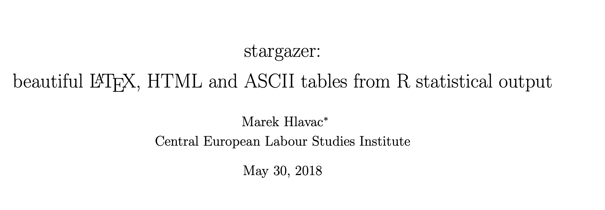

https://cran.r-project.org/web/packages/stargazer/vignettes/stargazer.pdf

##### Logistic Regression Model Tuning with scikit-learn — Part 1

https://towardsdatascience.com/logistic-regression-model-tuning-with-scikit-learn-part-1-425142e01af5

https://www.kaggle.com/joparga3/2-tuning-parameters-for-logistic-regression

https://machinelearningmastery.com/hyperparameters-for-classification-machine-learning-algorithms/

##### Hyperparameter Optimization in Machine Learning Models ==(data camp)==

https://www.datacamp.com/community/tutorials/parameter-optimization-machine-learning-models

##### FINETUNING TORCHVISION MODELS

https://pytorch.org/tutorials/beginner/finetuning_torchvision_models_tutorial.html

##### Generative Adversarial Networks: Revitalizing old video game textures

https://towardsdatascience.com/generative-adversarial-networks-revitalizing-old-video-game-textures-669493f883a0