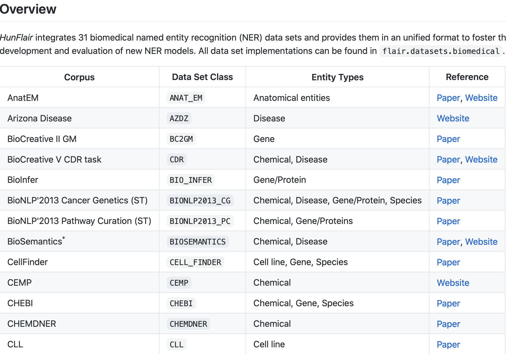
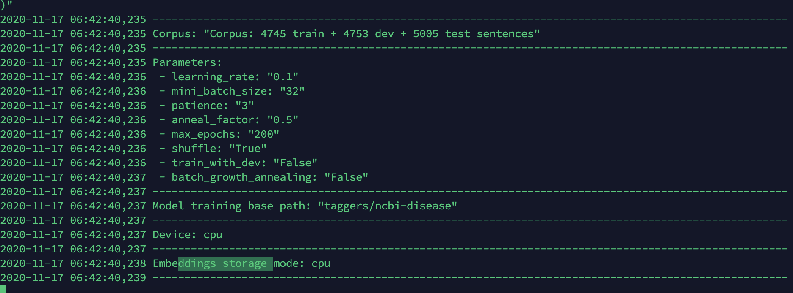
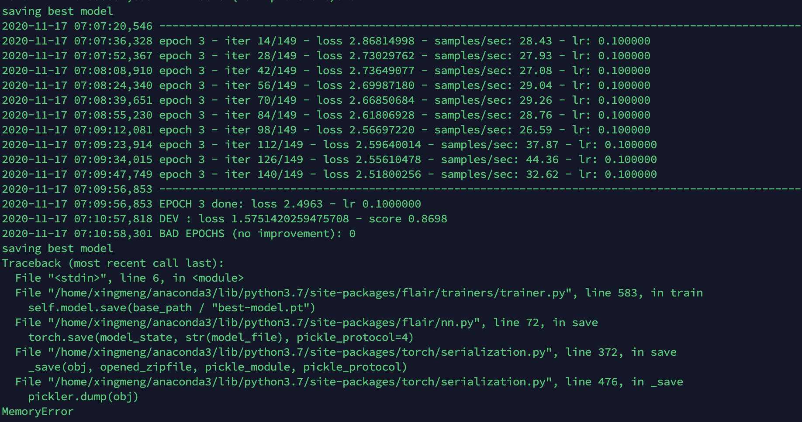

# NLP Tutorial AI with Python | Natural Language Processing

https://data-flair.training/blogs/nlp-natural-language-processing/

https://data-flair.training/blogs/nlp-tutorial-natural-language-processing/


# HunFlair - Data Sets

https://github.com/flairNLP/flair/blob/master/resources/docs/HUNFLAIR_CORPORA.md




# Training Custom NER Model Using Flair

https://medium.com/thecyphy/training-custom-ner-model-using-flair-df1f9ea9c762




```python
import flair
print(flair.device)
```




What is the SequenceTagger?? Loading pre-trained  model