==Why not same sample???==

same sample give same result not make sense 

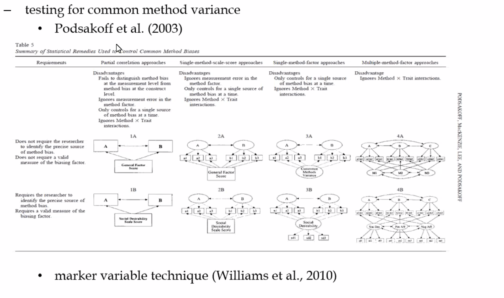

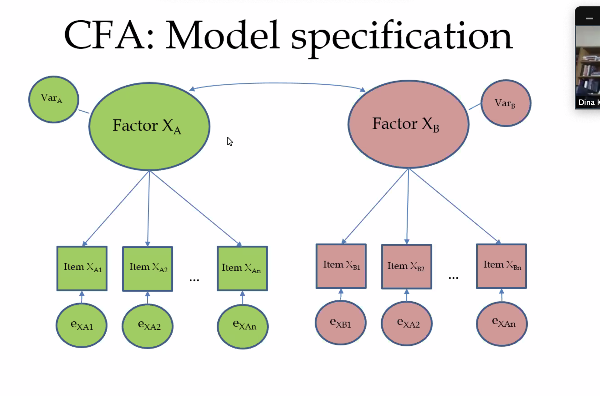

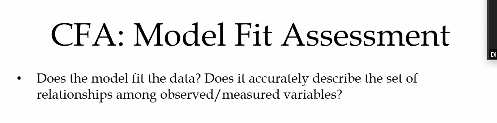

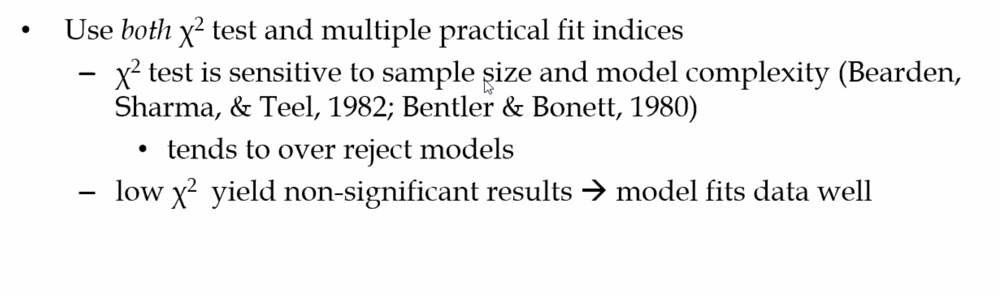

we expected to see $X^2$ small and none significant 

Why??? 

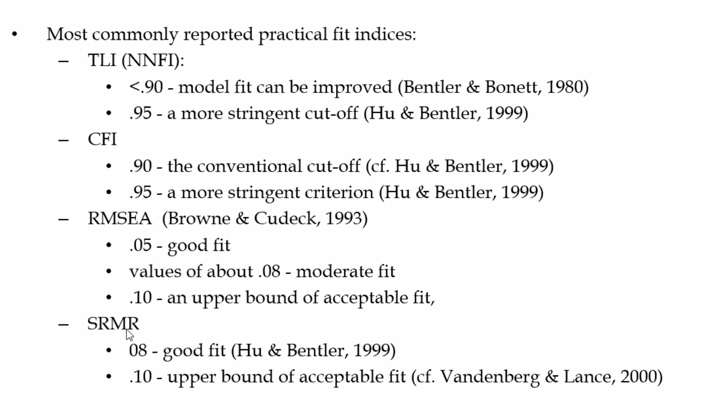

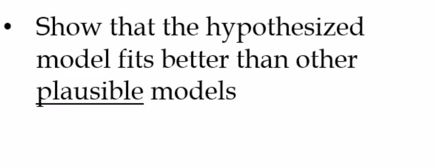

you don't want to test all models -> think what meaningful 

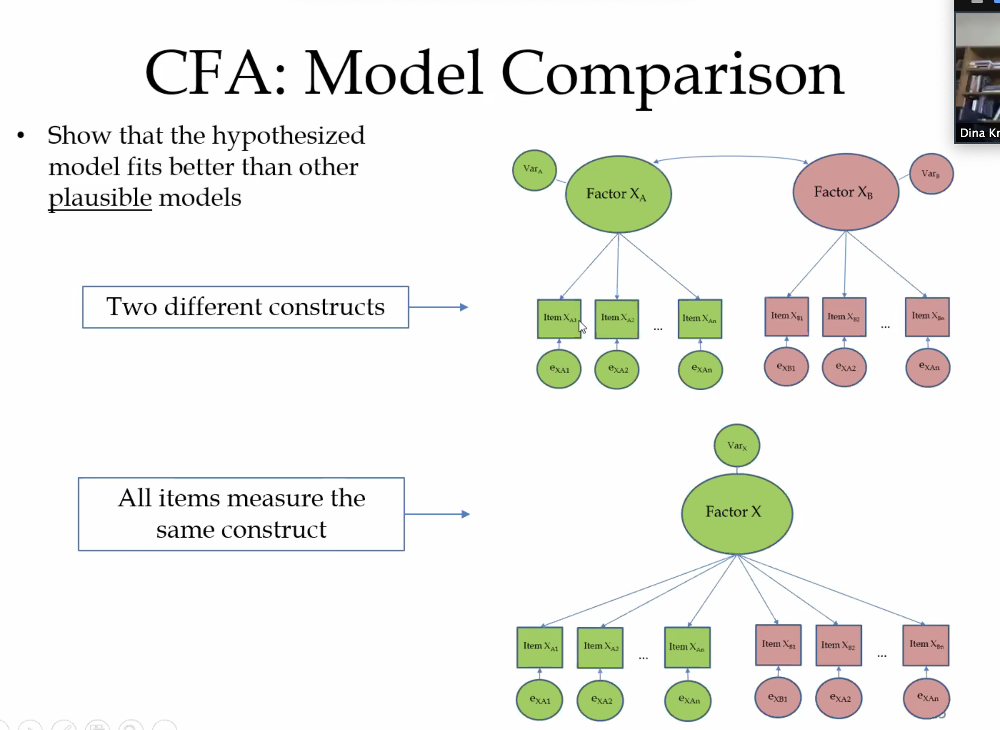

Visualize the model first

How many factors 4 factors 

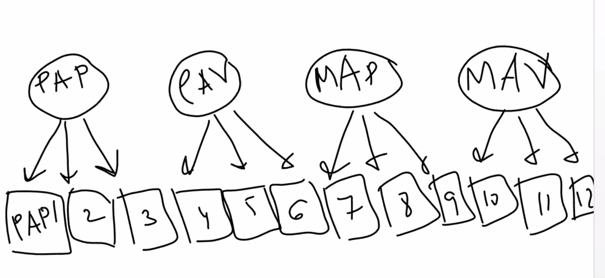

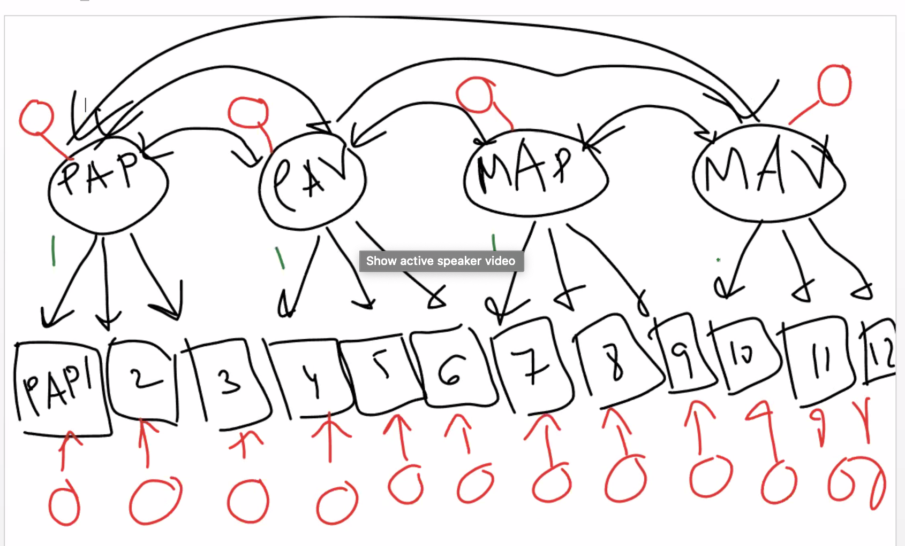

​	Overfitting 

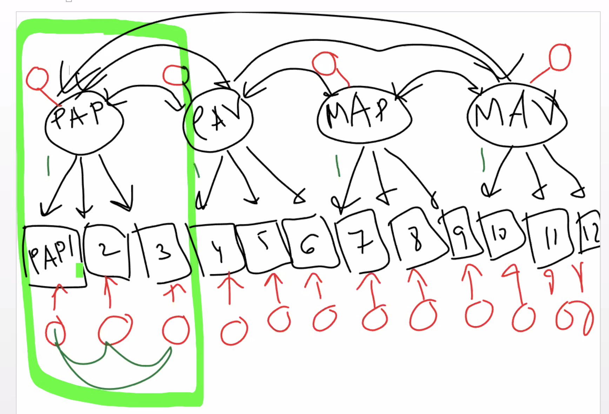

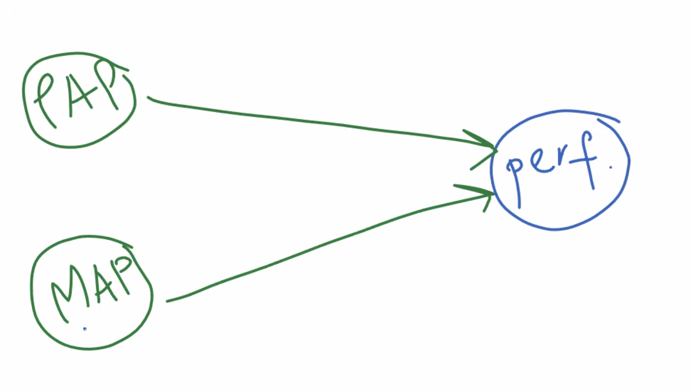

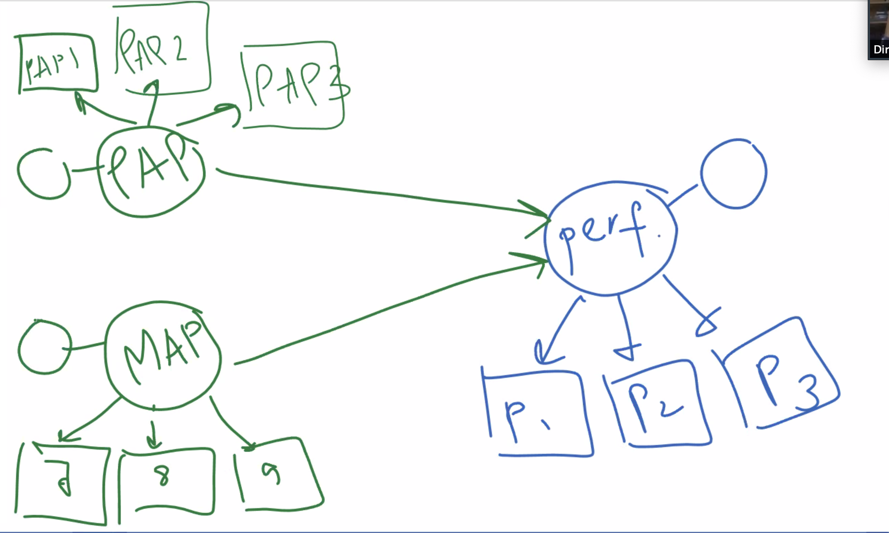