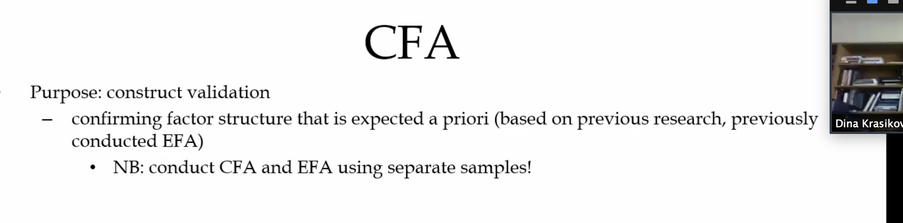
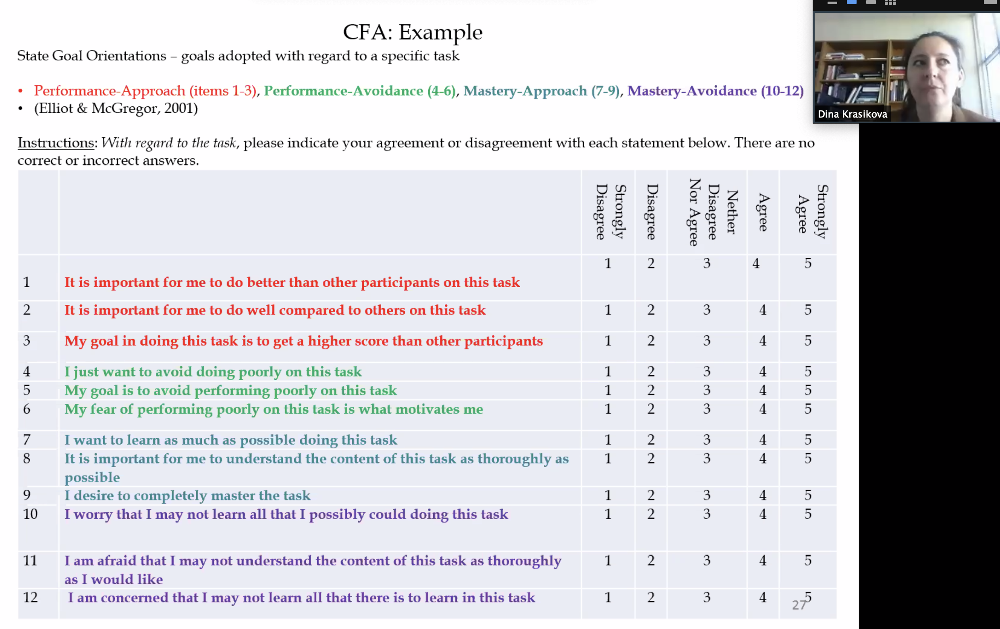

==Why not same sample???==

same sample give same result not make sense 

we expected to see $X^2$ small and none significant 

Why??? 

you don't want to test all models -> think what meaningful 

Visualize the model first

How many factors 4 factors 

​	Overfitting 

