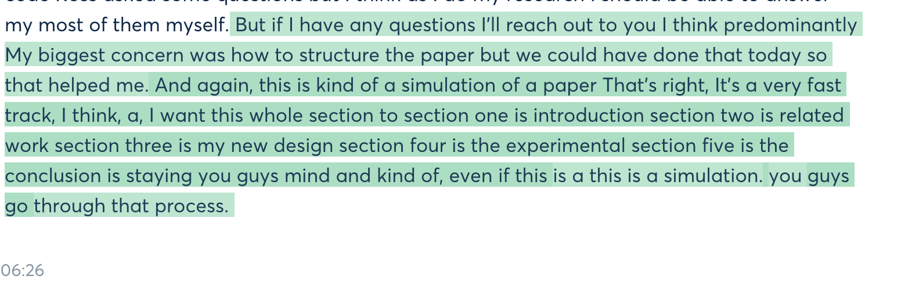

fast reading 

detail reading


Read the paper by your self

pin him during the week ask queston 

book

code may have issue 

papper writting 

overleft 

6 pages is enough 

pick for reading 

good vernue 

no one write a new book 

implement your code 

writing part 

deadline 

==CVPR==




10 GPU


GAN 

who want to present send the email ???

When incorportate in the section topic slide 10 slides presnet the idea 

Max 10mins 

review sections 

feedback 

mistake 


- When is work when is not work 
- coding to do scientific paper writing 
- survey paper 
- how we did expriments 


### 5 Section 

- Introduction  
- backgroud - Literiture review
- proposed method own word and own 

- experiment try to conduct exp and result with your own test 

- Conclusion


code runing some testing 

new idea to build the model 

architecture 

experiment piece apply it to the test and generate result 

system working for the project 

not copy method use your own word explained you thought 

result not be good 

construction of the paper of scitific method 

learn how to play basketball 

how to construct the paper 

relationship about these section


5-6 pages


write about the research 

OR 

- proposal describt the topic preliminary number 
- conduct the full research 


==reach out to him about the problem==


### Self-supervised paper

- Arun presentation 


```
CUDA_VISIBLE_DEVICES=1 python bert_fairseq.py
vim bert_fairseq.py
```


```Python
# Load BART (for PyTorch 1.0 or custom models):
# Load the model in fairseq
from fairseq.models.bart import BARTModel
bart = BARTModel.from_pretrained('/path/to/bart.large', checkpoint_file='model.pt')
bart.eval()  # disable dropout (or leave in train mode to finetune)

torch.hub.load(..., force_reload=True)
# Load BART from torch.hub (PyTorch >= 1.1):
import torch
bart = torch.hub.load('pytorch/fairseq', 'bart.large', force_reload=True)
bart.eval()  # disable dropout (or leave in train mode to finetune)

# Apply Byte-Pair Encoding (BPE) to input text:
tokens = bart.encode('Hello world!')
assert tokens.tolist() == [0, 31414, 232, 328, 2]
bart.decode(tokens)  # 'Hello world!'

#Extract features from BART:
# Extract the last layer's features
last_layer_features = bart.extract_features(tokens)
assert last_layer_features.size() == torch.Size([1, 5, 1024])

# Extract all layer's features from decoder (layer 0 is the embedding layer)
all_layers = bart.extract_features(tokens, return_all_hiddens=True)
assert len(all_layers) == 13
assert torch.all(all_layers[-1] == last_layer_features)


#Use BART for sentence-pair classification tasks:
# Download BART already finetuned for MNLI
bart = torch.hub.load('pytorch/fairseq', 'bart.large.mnli')
bart.eval()  # disable dropout for evaluation

# Encode a pair of sentences and make a prediction
tokens = bart.encode('BART is a seq2seq model.', 'BART is not sequence to sequence.')
bart.predict('mnli', tokens).argmax()  # 0: contradiction

# Encode another pair of sentences
tokens = bart.encode('BART is denoising autoencoder.', 'BART is version of autoencoder.')
bart.predict('mnli', tokens).argmax()  # 2: entailment


#Register a new (randomly initialized) classification head:
bart.register_classification_head('new_task', num_classes=3)
logprobs = bart.predict('new_task', tokens)

#Batched prediction:

import torch
from fairseq.data.data_utils import collate_tokens

bart = torch.hub.load('pytorch/fairseq', 'bart.large.mnli')
bart.eval()

batch_of_pairs = [
    ['BART is a seq2seq model.', 'BART is not sequence to sequence.'],
    ['BART is denoising autoencoder.', 'BART is version of autoencoder.'],
]

batch = collate_tokens(
    [bart.encode(pair[0], pair[1]) for pair in batch_of_pairs], pad_idx=1
)

logprobs = bart.predict('mnli', batch)
print(logprobs.argmax(dim=1))
# tensor([0, 2])

# Filling masks:
# BART can be used to fill multiple <mask> tokens in the input.
bart = torch.hub.load('pytorch/fairseq', 'bart.base')
bart.eval()
bart.fill_mask(['The cat <mask> on the <mask>.'], topk=3, beam=10)
# [[('The cat was on the ground.', tensor(-0.6183)), ('The cat was on the floor.', tensor(-0.6798)), ('The cat sleeps on the couch.', tensor(-0.6830))]]
```


#### Evaluating the `bart.large.mnli` model:

Example python code snippet to evaluate accuracy on the MNLI `dev_matched` set.

```
label_map = {0: 'contradiction', 1: 'neutral', 2: 'entailment'}
ncorrect, nsamples = 0, 0
bart.cuda()
bart.eval()
with open('glue_data/MNLI/dev_matched.tsv') as fin:
    fin.readline()
    for index, line in enumerate(fin):
        tokens = line.strip().split('\t')
        sent1, sent2, target = tokens[8], tokens[9], tokens[-1]
        tokens = bart.encode(sent1, sent2)
        prediction = bart.predict('mnli', tokens).argmax().item()
        prediction_label = label_map[prediction]
        ncorrect += int(prediction_label == target)
        nsamples += 1
        print('| Accuracy: ', float(ncorrect)/float(nsamples))
# Expected output: 0.9010
```


**定义device，其中需要注意的是“cuda:0”代表起始的device_id为0，如果直接是“cuda”，同样默认是从0开始。可以根据实际需要修改起始位置，如“cuda:1”。**

https://blog.csdn.net/daydayjump/article/details/81158777	

PyTorch默认使用从0开始的GPU，如果GPU0正在运行程序，需要指定其他GPU。https://www.cnblogs.com/darkknightzh/p/6836568.html

1.1 直接终端中设定：

```
CUDA_VISIBLE_DEVICES=1 python my_script.py
```

 1.2 python代码中设定：

```python
import os
os.environ["CUDA_VISIBLE_DEVICES"] = "2"
```

1.3 使用函数 set_device

```
import torch
torch.cuda.set_device(id)
```

不过官方建议使用CUDA_VISIBLE_DEVICES，不建议使用 set_device 函数。


We present BART, a denoising autoencoder for pretraining sequence-to-sequence models.

BART is trained by (1) corrupting text with an arbitrary noising function, and (2) learning a model to reconstruct the original text. It uses a standard Tranformer-based neural machine translation architecture which, despite its sim-plicity, can be seen as generalizing BERT (due to the bidirectional encoder), GPT (with the left-to-right decoder), and many other more re-cent pretraining schemes.

 We evaluate a num-ber of noising approaches, finding the best per-formance by both randomly shuffling the or-der of the original sentences and using a novel in-filling scheme, where spans of text are re-placed with a single mask token. 

BART is particularly effective when fine-tuned for text generation but also works well for comprehension tasks. 

It matches the performance of RoBERTa with comparable training resources on GLUE and SQuAD, achieves new state-of-the-art results on a range of abstractive di-alogue, question answering, and summariza-tion tasks, with gains of up to 6 ROUGE.

BART also provides a 1.1 BLEU increase over a back-translation system for machine translation, with only target language pretraining. We also report ablation experiments that replicate other pretraining schemes within the BART framework, to better measure which factors most influence end-task performance.


RoBERTa

GLUE

SQuAD