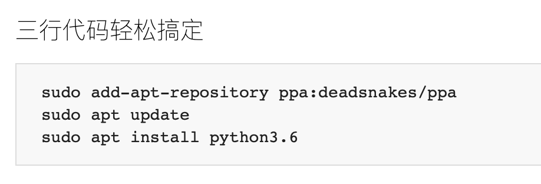
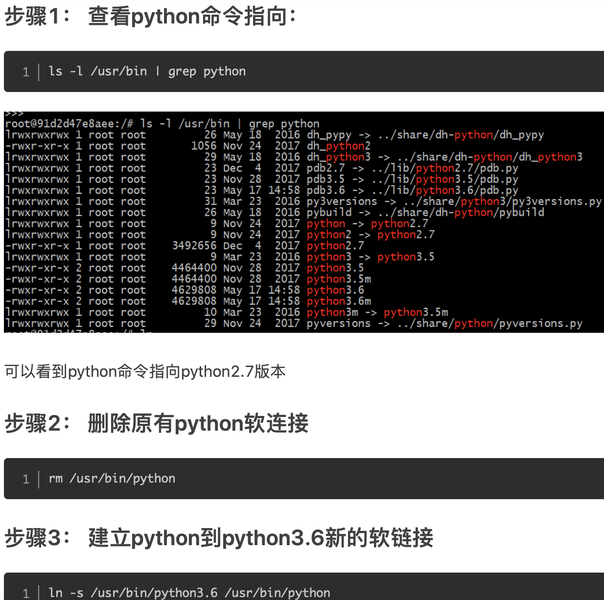
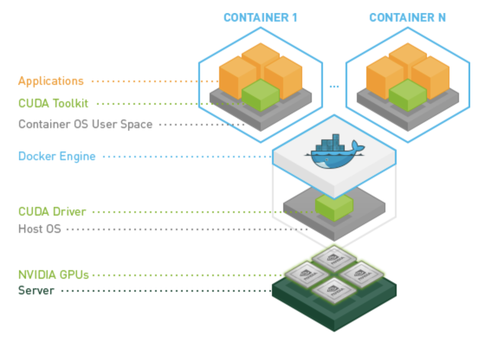

### Toxicity Detection: Does Context Really Matter? [Ref](https://ui.adsabs.harvard.edu/abs/2020arXiv200600998P/coreads)


### Defining [Main](https://realpython.com/python-main-function/) Functions in Python

### Ubuntu 18.04 + Docker + Pycharm打造机器学习平台Tensorflow	

### Docker 教程

### [pycharm与ssh远程访问服务器docker](https://my.oschina.net/u/4414849/blog/4668991)

docker内==手动==安装python环境 

https://www.shawn22.xyz/posts/e1b007ae.html

http://www.bear9596.com:8080/blog/12

https://www.jianshu.com/p/2a5cd519e583



#### 3.2 docker镜像操作

```
docker search mysql //搜索
docker pull 镜像名称 //下载
docker images //查看本地已下载镜像
docker rmi 镜像id //删除镜像
```

#### 3.3 docker容器操作

```
docker run -d -p --name 容器名或镜像ID）
-d 后台运行
-p 随机分配端口
-p 端口1（宿主机）:端口2（容器中）//端口转发
docker ps //查看当前处于运行状态的容器
docker start 容器ID或容器名 //开启容器
docker stop 容器ID或容器名 //停止运行中的容器
docker ps -a //查看停止的容器
docker rm 容器ID或容器名 //删除容器
docker exec -it 容器ID或容器名 /bin/bash //进入容器内部
docker save 容器名/容器ID > test.tar //导出容器
docker load < test.tar //导入容器
```


```python3 -m pip install paddlepaddle -i https://mirror.baidu.com/pypi/simple```

```
python -m pip install scispacy==0.2.5

python -m pip install https://s3-us-west-2.amazonaws.com/ai2-s2-scispacy/releases/v0.3.0/en_ner_bc5cdr_md-0.3.0.tar.gz
```


```
docker commit -m "add python&source" -a "festive_elbakyan" 1b6f1a3586dd python:flair

docker run -it -v $PWD:/home/root123 python:flair /bin/bash

docker rmi dd260b21ac2a

docker run -it -v $PWD:/home/root123 ubuntu:16.04 /bin/bash

python -m pip install flair
```


PyCharm采用SSH连接Docker镜像搭建Python开发环境

https://cloud.tencent.com/developer/article/1649280

##### Docker保存修改后的镜像

```
docker run -it python:flair /bin/bash

-a :提交的镜像作者；
-c :使用Dockerfile指令来创建镜像；
-m :提交时的说明文字；
-p :在commit时，将容器暂停。
将容器a404c6c174a2 保存为新的镜像,并添加提交人信息和说明信息。
docker commit -a "runoob.com" -m "my apache" a404c6c174a2 mymysql:v1

docker ps 查看正在运行的容器
docker exec –it  3bd0eef03413 bash  进入正在运行的容器内
进入容器后，就可以修改镜像了，比如修改镜像中已经部署的代码或者安装新的软件或包等，修改完成之后，exit 退出容器
docker commit 3bd0eef03413  demo：v1.3  提交你刚才修改的镜像，新的镜像名称为demo，版本为v1.3
```

##### 【Docker】保存镜像、 容器到本地， 从本地加载镜像、 容器

```vim
保存，加载镜像命令：
docker save imageID > filename
docker load < filename

保存，加载容器命令：
docker export containID > filename
docker import filename [newname]

通过容器加载了一个ubuntu系统的镜像，运行命令是这样的：
docker run -it ubuntu:container /bin/bash

# 进入正在运行的容器内
docker exec –it docker run -it pedantic_perlman /bin/bash
docker run -it pedantic_perlman /bin/bash

docker commit -m "add python&source" -a "pedantic_perlman" 2f8a83f8e27e python:flair.v1.1
docker run -it -v $PWD:/home/root123 python:flair.v1.1 /bin/bash


docker run -e PYTHONIOENCODING=utf-8 python:flair.v1.1 /bin/bash
```


https://www.cnblogs.com/ssyfj/p/11710421.html

2P222-U54OA-UQBD3-G25JQ

##### Python pip install Contextual Version [Conflict](https://akbarhabeeb.medium.com/python-pip-install-contextualversionconflict-94ecdccff123)

```
pip list

Package    Version
---------- -------
pip        20.2
setuptools 49.2.0
wheel      0.34.2
```


==CUDA_VISIBLE_DEVICES=1 python==

```
CUDA_VISIBLE_DEVICES=1 python HunFlair_demov1.py

```


test more model 

data set and slit diif date seet gider bias 

name and paper 

chemical giner 


##### [安装nvidia-docker2](https://cloud-atlas.readthedocs.io/zh_CN/latest/docker/gpu/nvidia-docker.html)

https://github.com/NVIDIA/nvidia-docker



lspci | grep -i nvidia


zero -shot ex


related work 


python3 的解决方式是 容器在初始化时候 需要设置shell的stdin/stdout/stderr 的默认编码方式为 utf-8,需要重启容器

docker run -e 指定python io encoding编码格式：

```bash
# docker run 方式
docker run -e PYTHONIOENCODING=utf-8 mydocker_image:v1 /bin/bash
```

docker compose 编排方式：

```bash
# docker-compose 方式
 environment:
      - PYTHONIOENCODING=utf-8
```


### Sentence-State LSTM for Text Representation

https://paperswithcode.com/paper/sentence-state-lstm-for-text-representation#code

### Toxicity Detection: Does Context Really Matter?

https://arxiv.org/abs/2006.00998


### Setting up a Jupyter Lab remote server

https://agent-jay.github.io/2018/03/jupyterserver/


