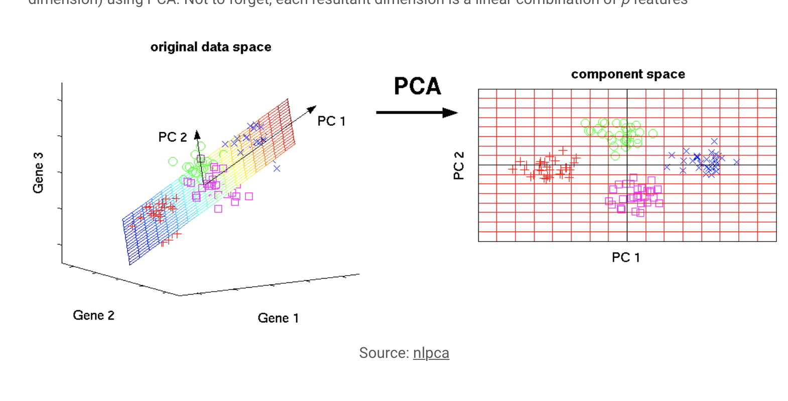
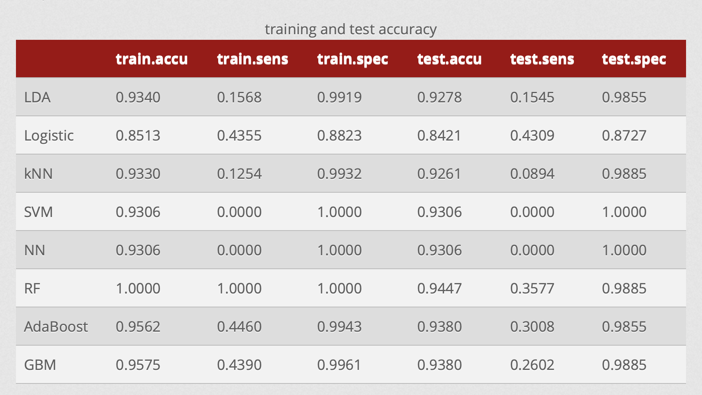
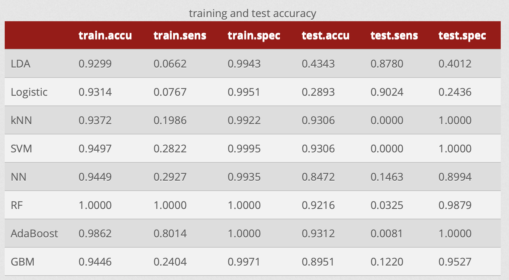
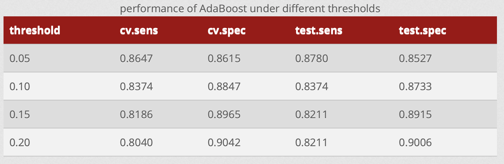
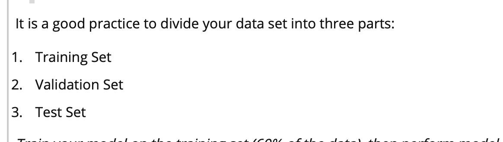

- Look at the cumulative proportion row to get the variance explained - > 9 principle components were chosen which explained 96% variance of dataset


- the number of components to be used for furthur analysis can also be determined using the screen plot 
- the 9 principal component scores can be used as the predictor variables to build the logistic regression model which predicts binary outcome 
- Doing pca before logistic regression




**First principal component** is a linear combination of original predictor variables which captures the maximum variance in the data set. It determines the direction of highest variability in the data. Larger the variability captured in first component, larger the information captured by component. No other component can have variability higher than first principal component.

The first principal component results in a line which is closest to the data i.e. it minimizes the sum of squared distance between a data point and the line.

Similarly, we can compute the second principal component also.

 

**Second principal component** (`Z²`) is also a linear combination of original predictors which captures the remaining variance in the data set and is uncorrelated with `Z¹`. In other words, the correlation between first and second component should is zero. It can be represented as:

```
Z² = Φ¹²X¹ + Φ²²X² + Φ³²X³ + .... + Φp2Xp
```

If the two components are uncorrelated, their directions should be orthogonal (image below). This image is based on a simulated data with 2 predictors. Notice the direction of the components, as expected they are orthogonal. This suggests the correlation b/w these components in zero.

https://www.analyticsvidhya.com/blog/2016/03/pca-practical-guide-principal-component-analysis-python/


## Why is normalization of variables necessary in PCA ?

## Implement PCA in R & Python (with interpretation)


==variance== variance is the spread of data in a dataset. in pea, the variables are transformed in such a vay that they explain variance of the dataset in decreasing manner 

few dim as posssible

 80% explained variance 

eigenvalues 

screen plot of eigenvalues 

Standardization 

principal component regression — **multicollinearity** 

	- least squares estimate are unbiased but variances are large to be far from true value.
	- pc regression the original predictor variables are replaced by uncorrelated pricipal component

==Problem Description:== predict the conty wise democrat winner of USA presidential primary election using the demographic information of each county 

==Data Description:== the dataset id obtained from . it consists of conty wise demographic information of all 50 states in the USA and primary presidental election results of 28 states 

==Exploratory Data Analysis:== 	there are 51 


splite data set by year???

trainning data use for train the model 


- We then operate the same set of classifiers with only the first twenty principal components and see if there is a significant improvement. 
- if any, tuned within certain grids of values **using repeated cross-validation (10-fold, repeat 5 times)** to have the optimal performance.


## Classification without Tackling Imbalance

<!--https://rstudio-pubs-static.s3.amazonaws.com/336831_55c98ceeb234439b80d844da949ff1f4.html -->

### Without PCA



- The **accuracy, sensitivity (true positive rate) and specificity (true negative rate)** of predictions on training and test sets are reported to compare the performance. Sensitivity and specificity are calculated with bankrupt companies being the positive class.

- From this table we can see that all of these classifiers have decent accuracy on both training and test sets. However, a further inspection on the sensitivity and specificity could reveal that the high accuracy is usually achieved via classifying most of the cases as positive, the extreme cases being SVM and neural network, with 0% sensitivity and 100% specificity.

- Among these classifiers, random forest performs fairly well on the original data. It fits the training set perfectly and achieves some degree of accuracy at identifying the positive cases (35.77% sensitivity). AdaBoost and GBM yield similar results on test set but have lower sensitivity on training set. 
- Logistic regression has the best sensitivity on test set (43.09%), but it also has lower specificity compared to other models.


### With PCA

The first 8 principal components already take up 90% of the total variance. Now we run the same classification methods on the dataset of the PC scores.



From the results we can see that PCA doesn’t really improve the models. For many classifiers we actually get worse accuracy. For instance random forest now has much lower sensitivity. This might be due to the fact that random forest usually doesn’t suffer from high dimension. By reducing dimension with PCA, we lose some of the variability and as a result get a worse random forest model. LDA and logistic regression both obtain high sensitivity and low specificity and low accuracy on test set.

The severe imbalance of the original dataset suggests against using straight-forward classification methods without any modification. But for the sake of comparison, we run a few commonly used classifiers on the **raw dataset** (after imputation) and **report their performance on training data and test data**. We then operate the same set of classifiers with only the first twenty principal components and see if there is a **significant improvement**. Note that the classifiers implemented in this section already have their parameters, if any, tuned within certain grids of values using repeated cross-validation (10-fold, repeat 5 times) to have the optimal performance.

## Classification with ==Tackling== Imbalance data

Various kinds of techniques have been proposed for dealing with class imbalance, including upsampling the minority class, downsampling the majority class and synthetic minority upsampling technique (SMOTE).

SMOTE is a sampling method that generates artificial minority samples based on the feature space similarities in order to shrink the learning bias of the minority class.

Based on all three sampling methods, the SMOTE methods has a best resistance on the imbalanced data. 

### Strategies — Resampling Techniques

#### - Sampling Method

#### - Evaluation Metric

#### - Adding a New Variable


## Conclusion

## Discussion

In this case, **misclassifying** a will-be bankrupt company as not bankrupt is usually assumed to be much more costly than the other way around. Therefore the ideal model should be able to correctly identify as many positive cases as possible. 

**So here we are looking for classifiers that maximize sensitivity without losing too much specificity.**



SMOTE1: https://arxiv.org/pdf/1403.1949.pdf


By setting the parameter *scale* equal to *TRUE* the data is standardized before running the pcr algorithm on it. You can also perform validation by setting the argument *validation*. In this case I chose to perform 10 fold cross-validation and therefore set the *validation* argument to “CV”, 	


- What you would like to see is a low **cross validation error** with a lower number of components than the number of variables in your dataset. 
- it looks like 3 components are enough to explain more than 90% of the **variability** in the data although the CV score is a little higher than with 4 or 5 components. Finally, note that 6 components explain all the variability as expected.


Now you can try to use PCR on a traning-test set and evaluate its performance using, for example, using only 3 components.

```R
# Train-test split
train <- iris[1:120,]
y_test <- iris[120:150, 1]
test <- iris[120:150, 2:5]
    
pcr_model <- pcr(Sepal.Length~., data = train,scale =TRUE, validation = "CV")
pcr_pred <- predict(pcr_model, test, ncomp = 3)
mean((pcr_pred - y_test)^2)
```


With the iris dataset there is probably no need to use PCR, in fact, it may even be worse using it. 


Why consider PCA 

- several variables are correlated on analysis.

- The smallest CV error occurs when M =10 components are used




https://www.kdnuggets.com/2019/01/fine-tune-machine-learning-models-forecasting.html


## Model Performance/**Comparing the models performance** 

http://www.socr.umich.edu/people/dinov/courses/DSPA_notes/14_ImprovingModelPerformance.html


+++++++++++++++

## Intruducion https://rstudio-pubs-static.s3.amazonaws.com/222571_7b65a75ec1214b56bccafa79e8c7f9ed.html

- Principal Component Analysis (PCA) is a feature extraction methods that use orthogonal linear projections to capture the underlying variance of the data.

- To create a predictive model based on regression we like to have as many relevant predictors as possible.
- Too many predictors (high dimensionality) and we take the **risk of over-fitting, multicollinearity, etc.**
- The intuition of Principal Component Analysis is to find new combination of variables which form larger variances.
- PCA tries to find **linear combination of the variables** which contain much information by looking at the variance. 
-  more **difficult** to interpret than a regular logistic regression model


# plot 1-2

- As you can see, two main results are printed, namely the **validation error** and the **cumulative percentage of variance** explained using n components. 

- In the example above, it looks like 3 components are enough to explain more than 90% of the variability in the data. Now you can try to use PCR on a traning-test set and evaluate its performance using, for example, using only 6 components

- The plot above shows that ~ 10 components explains around 95% variance in the data set. In order words, using PCA we have reduced 17 predictors to 10 without compromising on explained variance. This is the power of PCA> **Let’s do a confirmation check, by plotting a cumulative variance plot.** This will give us a clear picture of number of components.

- This plot shows that 10 components results in variance close to ~ 98%. Therefore, in this case, we’ll select number of components as 30 [PC1 to PC30] and proceed to the modeling stage. This completes the steps to implement PCA on train data. For modeling, we’ll use these 30 components as predictor variables and follow the normal procedures.


## PCR https://rstudio-pubs-static.s3.amazonaws.com/222571_7b65a75ec1214b56bccafa79e8c7f9ed.html

- in this case the first 6 Principal Components explain over 90% of the variance of the data. That is we can use these first 6 PC as predictor in our next model.
-  For this, we need to **create our binary dependent variable. So we’ll put a 1 for every ret3days > 3%, 0 otherwise.**


# Predictive Modeling with PCA Components

-  In this model, we are able to explain up to 70% of the variance if we use all 17 components.
- We can graph the MSE using the “validationplot” function with the argu
- so we will use 10 components in our prediction model and we will **calculate the means squared error** using test data.
- If you compare the MSE the least squares model performs slightly better than the PCR one. However, there are a lot of non-significant features in the model as shown below.


**Conclusion**

Since the least squares model is simpler it is probably the superior model. PCR is strongest when there are a lot of variables involve and if there are issues with multicollinearity.


means squared error.

```
mean((pcr.pred-Mroz$income[test])^2)
```

**MSE is what you would use to compare this model to other models** that you developed. Below is the performance of a least squares regression model

If you compare the MSE the least squares model performs slightly better than the PCR one. However, there are a lot of non-significant features in the model as shown below.


set.seed(1)

 tr.ind = sample(seq_len(nrow(x.BC)),floor(0.7*nrow(x.BC)), replace = F) x.tr = x.BC[tr.ind,];x.te = x.BC[-tr.ind,];y.tr = y.BC[tr.ind]; y.te = y.BC[-tr.ind] lasso.cv = cv.glmnet(x.tr, y.tr, family = "binomial", type.measure = "class") lasso.fit = glmnet(x.tr, y.tr, family = "binomial") 

lasso.predict = predict(lasso.fit, s = lasso.cv$lambda.1se, newx = x.te, type = "class") 


err.lasso = 1 - confusionMatrix(y.te, as.factor(lasso.predict))$overall[1] ridge.cv = cv.glmnet(x.tr, y.tr, family = "binomial", alpha = 0, type.measure = "class") ridge.fit = glmnet(x.tr, y.tr, alpha = 0, family = "binomial") ridge.predict = predict(ridge.fit, s = ridge.cv$lambda.1se, newx = x.te, type = "class") err.ridge = 1 - confusionMatrix(y.te, as.factor(ridge.predict))$overall[1] enet.cv = cv.glmnet(x.tr, y.tr, family = "binomial", alpha = 0.5, type.measure = "class") enet.fit = glmnet(x.tr, y.tr, alpha = 0.5, family = "binomial") enet.predict = predict(enet.fit, s = enet.cv$lambda.1se, newx = x.te, type = "class") err.enet = 1 - confusionMatrix(y.te, as.factor(enet.predict))$overall[1] err = data.frame(err.lasso = err.lasso, err.ridge = err.ridge, err.enet = err.enet) rownames(err) = "Misclassification error"

```{r }
# Best subset of predictors (Exhaustive search)
require(MASS); require(tidyverse); require(caret); require(leaps)
require(ggplot2); 
#install.packages("ggthemes")
#library(ggthemes)

set.seed(1)
data('Boston')

inTrain <- createDataPartition(Boston$crim, p = 0.6, list = FALSE)

x_train <- Boston[inTrain, -1]
y_train <- Boston[inTrain, 1]
x_test <- Boston[-inTrain, -1]
y_test <- Boston[-inTrain, 1]

best_subs <- regsubsets(x = x_train, y = y_train, nvmax = 13)

fit_summary <- summary(best_subs)

data_frame(MSE = fit_summary$rss/nrow(x_train),
           Cp = fit_summary$cp, 
           BIC = fit_summary$bic,
           AdjustedR2 = fit_summary$adjr2) %>%
    mutate(id = row_number()) %>%
    gather(Metric, value, -id) %>%
    ggplot(aes(id, value, col = Metric)) +
    geom_line() + geom_point() + ylab('') + 
    xlab('Number of Variables Used') + 
    facet_wrap(~ Metric, scales = 'free') +
   # theme_tufte() + 
    scale_x_continuous(breaks = 1:13)

scales = c('r2', 'adjr2', 'bic', 'Cp')
par(mfrow = c(2,2))
for (scale in scales) {
    plot(best_subs, scale = scale)
}

```


https://coggle.it/diagram/XH1nsVaBBHFmcwpK/t/chapter-5-quasi-experiment-designs-that-groups-and-pretests

https://www.statisticshowto.com/experimental-design/#QuasiED

https://www.nap.edu/read/18293/chapter/3#22