### Questions

1 raw = T

```
regfit.fwd <- regsubsets (y ~ poly(x, 10, raw = T), data = dt, nvmax=10, method ="forward")
regfit.bwd <- regsubsets (y ~ poly(x, 10, raw = T), data = dt, nvmax=10, method ="backward")
```


**==Linear Model Selection and Regularization==**

这一节的内容主要是线性回归的进一步延伸，在一般的最小二乘线性回归中经常遇到的问题是自变量数目较多，高维度的自变量会导致样本数目相对偏少和自变量间的共线性现象，最终使得回归模型过拟合，预测精度下降以及模型的解释能力的削弱。选择合理的自变量不仅能降低模型的复杂度，而且能有效防止过拟合问题.

本节内容主要介绍在变量选择上的三种常见方法：

​    (1)子集选择(subset selection)：以模型优劣的判别准则来选择合适的自变量子集，常见的方法有最优子集法和逐步回归法；

​     (2)收缩法/正则化(shrinkage/regularization)：在对所有变量的传统最小二乘回归中加入约束,使得某些回归系数收缩为0，从而达到选择合适自变量的目的，主要包括岭回归（ridge regression)及lasso回归；

​    (3)维数缩减(dimension reduction)：利用投影得到不相关的自变量组合，主要方法为**主成分回归**(PCR)和偏最小二乘回归(PLS).

前两种方法在本质上是一样的，都是通过选择全变量的一个合适的子集来达到降维的目的，只不过(1)是将选择和判别分开，每一个子集便是一个选择，判别是通过相应的判别准则来决定哪一个子集选择是最佳的，而(2)是将选择和判别融为一个过程，在全变量的最小二乘中加入罚约束，在最小二乘的过程中要考虑到变量的选择问题，最终达到最小二乘和变量选择的一个权衡；(1)和(2)都是在原始变量基础上选择一个合理的子集，而(3)则换了一种思路，不直接使用原始变量，而是对原始变量进行投影转换为新的变量，既使得变量的维度减少又使新变量间相互独立。


**subset selection**

**最优子集法**是将全自变量的所有非空子集都作为一个选择，然后通过判别准则来选择最优的子集，当有p个自变量时便会有2^p 个回归方程需要进行判别，当p稍微大一些时复杂度就会极高。

**逐步回归法**是对自变量进行逐个的分析，按照优进差退是原则进行选择，主要的方法包括前进法、后退法及混合法；前进法和后退法主要的区别是原始模型是空模型还是全模型，由此产生了不同的适用性：当自变量维度较高（自变量个数大于样本量，p>n）时，前进法仍然适用，而由于后退法第一步就要建立全模型（只有当样本量大于自变量个数时才能建立合理的全模型），所以后退法不再适用；前进法是只进不出，后退法是只出不进，而合法则是有进也有出，因为新进的变量不能保证已被选择的变量仍然显著，所以混合法最受推崇

**模型选择的判别准则**

​    模型拟合优劣的一般判别准则有残差平方和SSE及复相关系数R等，但是当自变量子集扩大时，残差平方和会减少，复决定系数会增大，这便会导致自变量选择的越多拟合效果就会越好的假象，所以残差平方和、复相关系数或样本决定系数都不能作为选择自变量的准则。 以下本文从不同角度给出自模型选择的几个常用判别准则：

   (1)拟合角度：调整的复决定系数 Ra=1-(n-1)(1-R2)/(n-p-1)越大，对应的回归方程越好；

​    (2)极大似然估计角度：AIC准则，AIC值越小，对应的回归方程越优；

​    (3)预测角度：Cp统计量越小，对应的回归模型越优；

   (4)试验误差：对样本进行训练样本和试验样本分组，在试验样本上的验证集法或交叉验证的试验误差最小的回归方程最优


###### reference

1. ##### Chapter 15 Linear regression https://learningstatisticswithr.com/book/regression.html

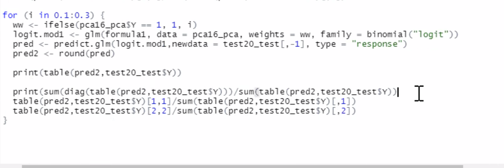

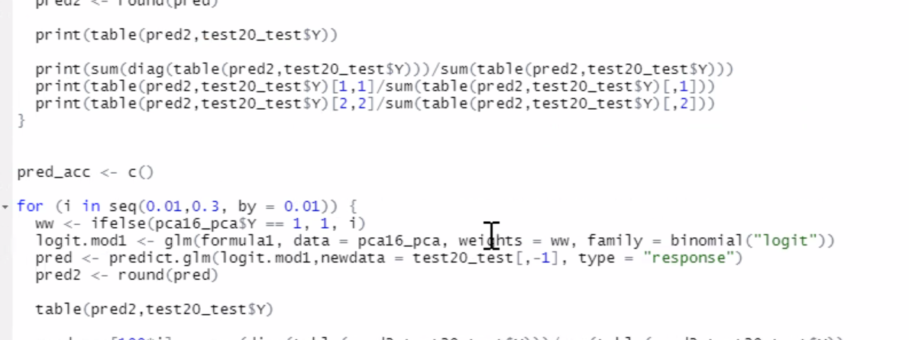

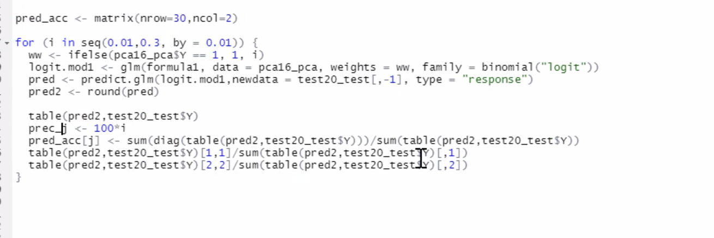

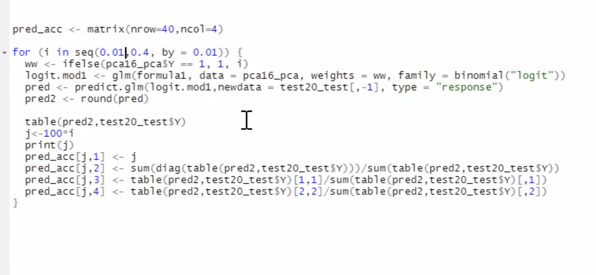


### 机器学习算法系列之二】浅析Logistic Regression


文章中谈到一个重要观点，随着时间的增加，一个国家的大小（我理解为资源）和这个国家人们的生育能力限制了人口的增长，人口数量会渐渐趋近一个==稳定值==。厉害的是他将这个过程用公式给描述出来了，他从人口数量增长的速度公式入手，即人口数量P(t)P(t)对时间t的导数:

$\frac{\partial P}{\partial t} = rP(1-\frac{P}{K})$


#### Binomial logistic regression model

逻辑回归是为了解决分类问题，根据一些已知的训练集训练好模型，再对新的数据进行预测属于哪个类。如图3所示，有一些属于两个类的数据，目标是判断圆圈属于哪一类。也就是说==逻辑回归的目标是找到一个有足够好区分度的决策边界==，从而能够将两类很好的分开。假设已经存在这样一个边界，针对于图中这种线性可分的情况，这条边界是

输入特征向量的线性组合，假设输入的特征向量为$x\in R^n$ (图中输入向量为二维)，Y取值为0，1。那么决策边界可以表示为$w_1x_1+w_2x_2+b=0$，假如存在一个例子使得$h_w(x) = w_1x_1+w_2x_2+b > 0$，那么可以判断它类别为1，这个过程实际上是感知机，即只通过决策函数的符号来判断属于哪一类。而逻辑回归需要再进一步，它要找到分类概率$P(Y=1)$与输入向量x的直接关系，**然后通过比较概率值来判断类别**，而刚好上文中的logit function能满足这样的要求，它令决策函数的输出值 $w^Tx+b$ 等于概率值比值取对数 $ log{\frac{P(Y=1|x)}{1-P(Y=1|x)}}$求解这个式子得到了输入向量x下导致产生两类的概率为:


$P(Y=1|x)=\frac{e^{w\cdot x+b}}{1+e^{w\cdot x+b}} :::::::::(1)$

$P(Y=0|x)=\frac{1}{1+e^{w\cdot x+b}} :::::::::(2)$

因此逻辑回归的思路是，

- 先拟合决策边界(这里的决策边界不局限于线性，还可以是多项式)，
- 再建立这个边界与分类的概率联系，从而得到了二分类情况下的概率。

这里有个非常棒的博文[6]推荐，阐述了逻辑回归的思路


==建立似然函数 -> 通过极大似然估计法来确定模型的参数==

### 解法

梯度下降，牛顿法和BFGS

优化的主要目标是找到一个**方向**，参数朝这个方向移动之后使得**似然函数的值能够减小**，这个方向往往由一阶偏导或者二阶偏导各种组合求得。

逻辑回归的损失函数是 $min J(w) = min {-\frac{1}{m}[\sum_{i=1}^{m}y_ilog h_w (x_i) + (1-y_i)log(1-h_w(x_i))]} :::::::::(4)$

这几种方法一般都是采用迭代的方式来逐步逼近极小值，

需要给定参数 $w_0$ 作为**起点**，并且需要一个阈值 $\epsilon$ 来判断迭代何时停止。

- #### 梯度下降法

比阈值小就停止

- #### 牛顿法

在现有极小点估计值的附近对f(x)做二阶泰勒展开，进而找到极小点的下一个估计值

- #### BFGS

  BFGS就是一种拟牛顿法，它是由四个发明人的首字母组合命名，是求解无约束非线性优化问题最常用的方法之一

  

### 正则化

正则化不是只有逻辑回归存在，它是一个通用的算法和思想，所以**会产生过拟合现象的算法都可以使用正则化来避免过拟合**，在谈正则化之前先聊聊什么是过拟合。

#### 过拟合

过拟合现象是指对训练数据预测很好但是对未知数据预测不行的现象，通常都是因为模型过于复杂，或者训练数据太少, 即当$\frac{complexity\: of \:the \:model}{training \:set \:size}$比值太大的情况下会发生过拟合。

模型复杂体现在两个方面，

一是参数过多，

二是参数值过大。

参数值过大会导致导数非常大，那么拟合的函数波动就会非常大，即下图所示，从左到右分别是欠拟合、拟合和过拟合。

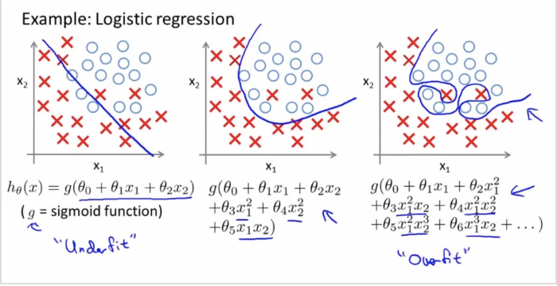

在模型过于复杂的情况下，模型会学习到**很多特征**，从而导致可能把所有训练样本都拟合到，就像上图中一样，拟合的曲线将每一个点都正确的分类了.

从而，解决过拟合可以从两个方面入手，

一是减少模型复杂度，

一是增加训练集个数。而正则化就是减少模型复杂度的一个方法。

##### 4.2 正则化的两种方法

由于模型的参数个数一般是由人为指定和调节的，所以**正则化常常是用来限制模型参数值不要过大**，也被称为**惩罚项**。一般是在目标函数(经验风险)中加上一个正则化项$\Phi(w)$,	

$J(w) = -\frac{1}{m}[\sum_{i=1}^{m}y_ilog h_w (x_i) + (1-y_i)log(1-h_w(x_i))] + \lambda \Phi(w) :::::::::(12)$

而这个正则化项一般会采用L1范数或者L2范数。其形式分别为 $\Phi (w)=||x||_1$ 和 $\Phi (w)=||x||_2$

首先针对L1范数ϕ(w)=|w|ϕ(w)=|w|，当采用梯度下降方式来优化目标函数时，对目标函数进行求导，正则化项导致的梯度变化当$w_j>0$是取1，当$w_j<0$时取 -1.

...也就是为什么L1正则能够使权重稀疏，这样参数值就受到控制会趋近于0。L1正则还被称为 **Lasso regularization**。

...在机器学习中也将L2正则称为weight decay，在回归问题中，关于L2正则的回归还被称为**Ridge Regression**岭回归。weight decay还有一个好处，它使得目标函数变为**凸函数**，**梯度下降法和L-BFGS都能收敛到全局最优解**

需要注意的是，L1正则化会导致参数值变为0，但是L2却只会使得参数值减小，这是因为L1的导数是固定的，参数值每次的改变量是固定的，而L2会由于自己变小改变量也变小。而(12)式中的$\lambda$也有着很重要的作用，它在权衡拟合能力和泛化能力对整个模型的影响，$\lambda$越大，对参数值惩罚越大，==泛化能力==越好。

此外，从贝叶斯的角度而言，**正则化项实际上是给了模型一个先验知识**，L2正则相当于添加了一个均值为0协方差为$1/\lambda$ 的高斯分布先验(将L2正则表示为$\frac{\lambda}{2}w^Tw$ )，当 $\lambda$ 为0，即不添加正则项，那么可以看成协方差是无穷大，w 可以不受控制变成任意大。当  $\lambda$ 越大，即协方差越小，那么参数值的取值方差会变小，模型会趋向于稳定(参考[10]最高票答案)。


#### 逻辑回归与其他模型的关系

##### 逻辑回归与线性回归

##### 在谈两者关系之前，需要讨论的是，逻辑回归中使用到的==sigmoid==函数到底起到了什么作用。	

将 $w^Tx+b$ 值映射到了(0,1)，并且解释成概率。 而如果调节线性函数，那么最需要的是减少离群点的影响，离群点往往会导致比较大的$|w^Tx+b|$ 值, 通过sigmoid函数刚好能够削弱这种类型值的影响，这种值经过sigmoid之后接近0或者1，从而对$w_j$的偏导数为$h_w(x^{(i)})(1-h_w(x^{(i)}))x_j^{(i)}$，无论接近0还是1这个导数都是非常小的。因此可以说sigmoid在逻辑回归中起到了两个作用，一是将线性函数的结果映射到了(0,1)，一是减少了离群点的影响。


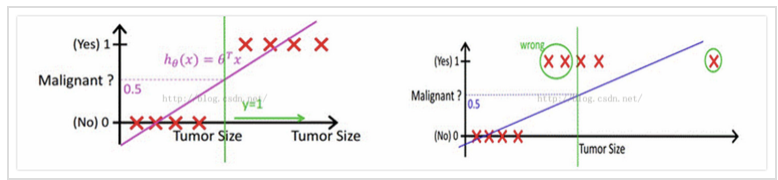


有的人觉得逻辑回归本质上就是线性回归，它们俩都要学习一个线性函数，逻辑回归无非是多加了一层函数映射，但是我对线性回归的理解是在拟合输入向量x的分布，而逻辑回归中的线性函数是在拟合决策边界，它们的目标是不一样的。所以我不觉得逻辑回归比线性回归好，它们俩要解决的问题不一样。但它们都可以用一个东西来概括，那就是广义线性模型GLM(Generalized linear models)[12]


- 先介绍何为指数簇(exponential family)
- 当某个随机变量的概率分布可以表示为$p(y;η)=b(y)exp(η^T(y)−a(η))$时就可以说它属于指数簇，通过调整η可以获得不同的分布。对应于线性回归与逻辑回归的**高斯分布**与**伯努利分布**就是属于指数簇的，

GLM需要满足下面三个条件:

1. 在给定观测值x和参数w情况下，输出y服从参数为ηη的指数簇分布

2. 预测的值$h_w(x)=E[y|x]$

3. $η=w^Tx$

因此，选择合适的参数就能分析出线性回归和逻辑回归都是GLM的一种特例，有时会看到有的人会从GLM出发将逻辑回归的公式给推导出来。总之，线性回归和逻辑回归是**属于同一种模型**，**但是它们要解决的问题不一样**，

- 前者解决的是==regression==问题，后者解决的是==classification==问题，

- 前者的输出是连续值，后者的输出是离散值，

- 而且前者的损失函数是输出y的高斯分布，后者损失函数是输出的伯努利分布。

##### 逻辑回归与最大熵 (maximum entropy model， MaxEnt)也是很典型的分类算法了，

最大熵在解决二分类问题时就是逻辑回归，在解决多分类问题时就是多项逻辑回归。为了证明最大熵模型跟逻辑回归的关系，那么就要证明两者求出来的模型是一样的，即求出来的h(x)的形式应该是一致的。由于最大熵是通过将有约束条件的条件极值问题转变成拉格朗日对偶问题来求解，模型的熵为


- 熵度量了事物的不确定性，越不确定的事物，它的熵就越大。具体的，随机变量X的熵的表达式如下：

$H(X) = -\sum\limits_{i=1}^{n}p_i logp_i$

其中n代表X的n种不同的离散取值。而$p_i$代表了X取值为i的概率，log为以2或者e为底的对数

- 熟悉了一个变量X的熵，很容易推广到多个个变量的联合熵，这里给出两个变量X和Y的联合熵表达式：

$H(X,Y) = -\sum\limits_{x_i \in X}\sum\limits_{y_i \in Y}p(x_i,y_i)logp(x_i,y_i)$

- 有了联合熵，又可以得到条件熵的表达式H(Y|X)，条件熵类似于条件概率,它度量了我们的Y在知道X以后剩下的不确定性。表达式如下：

$H(Y|X) = -\sum\limits_{x_i \in X}\sum\limits_{y_i \in Y}p(x_i,y_i)logp(y_i|x_i) = \sum\limits_{j=1}^{n}p(x_j)H(Y|x_j)$

用下面这个图很容易明白他们的关系。左边的椭圆代表H(X),右边的椭圆代表H(Y),中间重合的部分就是我们的互信息或者信息增益I(X,Y), 左边的椭圆去掉重合部分就是H(X|Y),右边的椭圆去掉重合部分就是H(Y|X)。两个椭圆的并就是H(X,Y)。

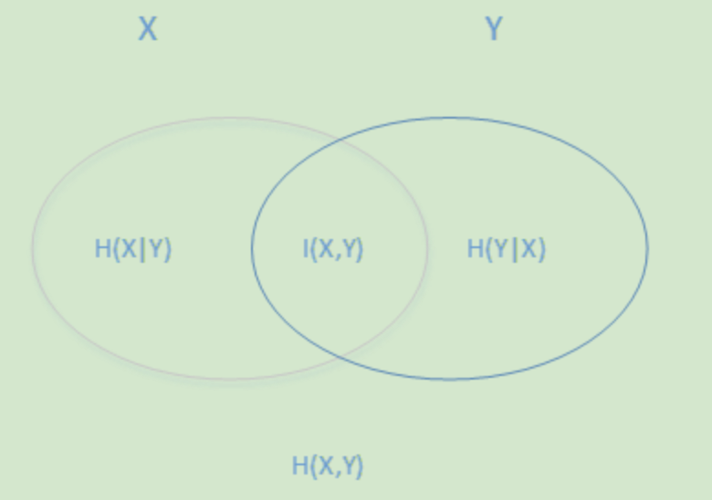

##### 最大熵模型损失函数的优化

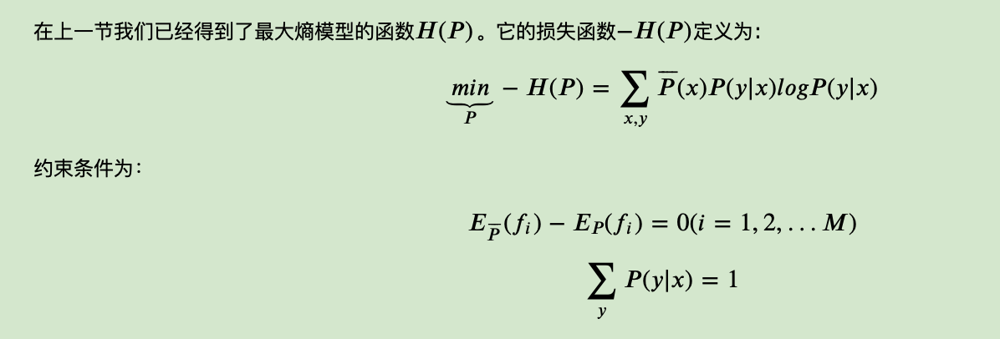

https://www.cnblogs.com/pinard/p/6093948.html	


$$
\begin{cases}
h(x)_v\geqslant 0 & \text{ always } \\
\sum_{v=1}^k h(x)_v = 1 & \text{ always } \\
\sum_{i=1}^m h(x^{(i)})*u x^{(i)}_j = \sum\*{i=1}^m A(u,y^{(i)})x^{(i)}_j & \text{ for all } : u, j
\end{cases} :::::::::(15)
$$
通过约束条件(15)可以直接推导出softmax的公式。基于这一点，再回过头来看《统计学习方法》上的约束条件，如果假设$P(y|x)=h(x)$，公式左边的$f(x,y)$实际上取值一直为1，那么这两个约束条件实际上是一样的。


因此，可以这样说，最大熵在解决二分类问题时就是逻辑回归，在解决多分类问题时就是多项逻辑回归。此外，最大熵与逻辑回归都称为对数线性模型(log linear model)。

##### 逻辑回归与svm

逻辑回归和svm作为经典的分类算法，

相同点:

1. 都是分类算法
2. 都是监督学习算法
3. 都是判别模型
4. 都能通过核函数方法针对非线性情况分类
5. 目标都是找一个分类超平面
6. 都能减少离群点的影响

不同点:

1. 损失函数不同，逻辑回归是==cross entropy loss==，svm是==hinge loss==
2. 逻辑回归在优化参数时所有样本点都参与了贡献，svm则只取离分离超平面最近的支持向量样本。这也是为什么逻辑回归不用核函数，它需要计算的样本太多。并且由于逻辑回归受所有样本的影响，当样本不均衡时需要平衡一下每一类的样本个数。
3. 逻辑回归对概率建模，svm对分类超平面建模
4. 逻辑回归是处理经验风险最小化，svm是结构风险最小化。这点体现在svm自带L2正则化项，逻辑回归并没有
5. 逻辑回归通过非线性变换减弱分离平面较远的点的影响，svm则只取支持向量从而消去较远点的影响
6. 逻辑回归是统计方法，svm是几何方法

##### 逻辑回归与朴素贝叶斯

相同点是，它们都能解决分类问题和都是监督学习算法。此外，有意思的是，当假设朴素贝叶斯的条件概率$P(X|Y=ck)$服从高斯分布时Gaussian Naive Bayes，它计算出来的$P(Y=1|X)$形式跟逻辑回归是一样的[18]。

不同的地方在于，逻辑回归为判别模型求的是$p(y|x)$，朴素贝叶斯为生成模型求的是$p(x,y)$。前者需要迭代优化，后者不需要。在数据量少的情况下后者比前者好，数据量足够的情况下前者比后者好。由于朴素贝叶斯假设了条件概率$P(X|Y=ck)$是条件独立的，也就是每个特征权重是独立的，如果数据不符合这个情况，朴素贝叶斯的分类表现就没有逻辑回归好。

##### 逻辑回归与能量模型

### 并行化

实际上逻辑回归的并行化最主要的目标就是计算梯度。将目标的label变为-1和1，那么梯度公式可以整合在一起变成$\sum_{i=1}^M(\frac{1}{1+exp(y^{(i)}w^Tx^{(i)})}-1)y^{(i)}x^{(i)}$

梯度计算里面最主要的就是矩阵乘法，一般的做法都是想办法将矩阵切割成大小合适的块。针对二分类，现在有M个样本，N个特征，假如有m*n个计算节点，并且将计算节点排列成m行n列，那么每个节点分配M/m个样本，N/n个特征，如下图所示。

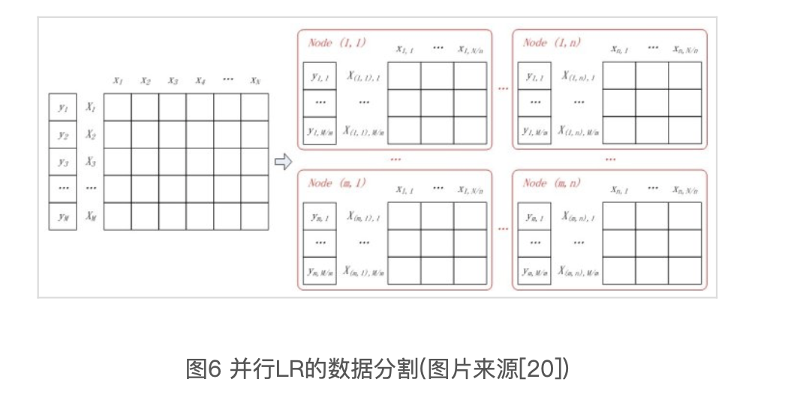


https://chenrudan.github.io/blog/2016/01/09/logisticregression.html


机器学习 = 表示+评估+优化


##### 机器学习 = 表示+评估+优化

https://chenrudan.github.io/blog/2014/06/26/dl1baseconcept.html

表示是指由输入如何得到输出，评估是指估计输出或者输入的分布，优化是用来逼近分布。

机器学习是为了拟合真实分布，从而得到未知分布。

针对解决两类问题，一种是分类问题classification，给了输入，输出独立且得到确定分类。

另一种是回归问题regression，针对给的输入，通过训练出来的模型能够预测出输出值，这个输出值是连续分布的。


**泛化（generalization）**

就是将测试集和训练集分开，过拟合（overfitting）得到的分布接近训练集，但是不逼近测试集，这个时候，目标函数会顾及每一个点，导致形成的拟合函数波动很大，每个地方的导数很大，这样虽然把所有点都包括进去，但是函数变化很复杂，只有系数足够打，才能保证导数值大。交叉验证可以帮助避免过拟合（就是用验证集validation）。一般的避免方式是加入正则项（regularization term），正则化项一般是模型复杂度的单调递增函数，模型越复杂，正则化值越大。

【特征】：其实特征是一点一点构成的，小的特征组合形成大的特征，上一层看下一层是pixel级别的，下一层称为上一层的basis，每一层都是输入的另一种表示，不能出现信息的损失。


#### [Principal components analysis）-最大方差解释](https://www.cnblogs.com/jerrylead/archive/2011/04/18/2020209.html)

在这一篇之前的内容是《Factor Analysis》，由于非常理论，打算学完整个课程后再写。在写这篇之前，我阅读了PCA、SVD和LDA。这几个模型相近，却都有自己的特点。本篇打算先介绍PCA，至于他们之间的关系，只能是边学边体会了。PCA以前也叫做Principal factor analysis。


### 机器学习算法系列之三】简述多种降维算法

最近看了一些关于降维算法的东西，本文首先给出了七种算法的一个信息表，归纳了关于每个算法可以调节的(超)参数、算法主要目的等等，然后介绍了降维的一些基本概念，包括降维是什么、为什么要降维、降维可以解决维数灾难等，然后分析可以从什么样的角度来降维，接着整理了这些算法的具体流程。主要目录如下:


高维空间中两两之间的距离矩阵为A, P是高维空间中两点距离占所有距离比重的概率矩阵, Q低维空间中两点距离占所有距离比重的概率矩阵

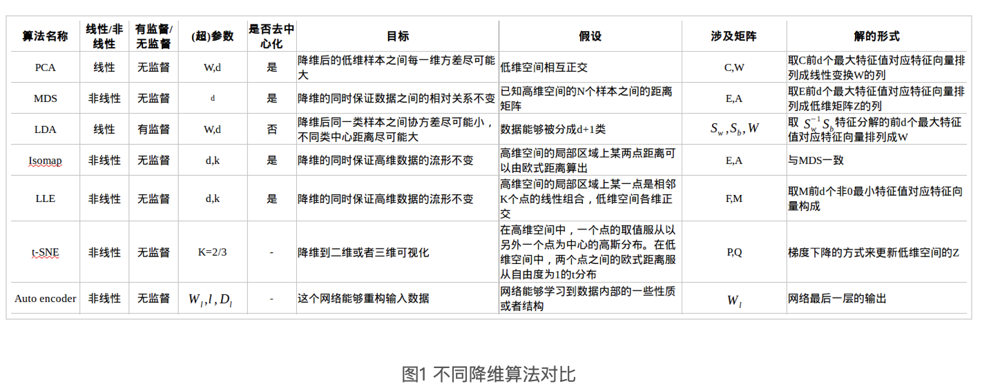

[Python]内存管理	 https://chenrudan.github.io/blog/2016/04/23/pythonmemorycontrol.html

##### 神经网络模型量化方法简介

http://chenrudan.github.io/blog/2018/10/02/networkquantization.html

### 简述生成式对抗网络

本文主要阐述了对生成式对抗网络的理解，首先谈到了什么是对抗样本，以及它与对抗网络的关系，然后解释了对抗网络的每个组成部分，再结合算法流程和代码实现来解释具体是如何实现并执行这个算法的，最后通过给出一个基于对抗网络改写的去噪网络，效果虽然挺差的，但是还是挺有意思的。

https://chenrudan.github.io/blog/2016/11/12/gan.html

### 1. 对抗样本(adversarial examples)

14年的时候Szegedy在研究神经网络的性质时，发现针对一个已经训练好的分类模型，将训练集中样本做一些细微的改变会导致模型给出一个错误的分类结果，这种虽然发生扰动但是人眼可能识别不出来，并且会导致误分类的样本被称为对抗样本，他们利用这样的样本发明了对抗训练(adversarial training)，==模型既训练正常的样本也训练这种自己造的对抗样本，从而改进模型的泛化能力[1]==。如下图所示，在未加扰动之前，模型认为输入图片有57.7%的概率为熊猫，但是加了之后，人眼看着好像没有发生改变，但是模型却认为有99.3%的可能是长臂猿。

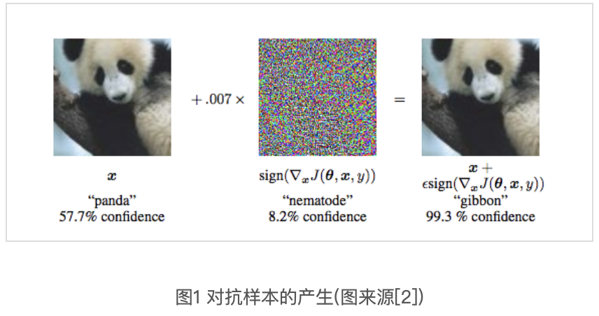

这个问题乍一看很像**过拟合**，在Goodfellow在15年[3]提到了其实模型欠拟合也能导致对抗样本，**因为从现象上来说是输入发生了一定程度的改变就导致了输出的不正确**，例如下图一，上下分别是过拟合和欠拟合导致的对抗样本，其中绿色的o和x代表训练集，红色的o和x即对抗样本，明显可以看到欠拟合的情况下输入发生改变也会导致分类不正确(其实这里我觉得有点奇怪，因为图中所描述的对抗样本不一定就是跟原始样本是同分布的，感觉是人为造的一个东西，而不是真实数据的反馈)。在[1]中作者觉得这种现象可能是因为神经网络的非线性和过拟合导致的，但Goodfellow却给出了更为准确的解释，即==对抗样本误分类是因为模型的线性性质导致的==，说白了就是因为$w^Tx$存在点乘，当x的每一个维度上都发生改变$\hat{x}=x+η$，就会累加起来在点乘的结果上附加上一个比较大的和$wTx˜=wTx+wTη$，而这个值可能就改变了预测结果。例如[4]中给出的一个例子，假设现在用逻辑回归做二分类，

输入向量是x=[2,−1,3,−2,2,2,1,−4,5,1]

权重向量是w=[−1,−1,1,−1,1,−1,1,1,−1,1]

点乘结果是-3，类预测为1的概率为0.0474，

假如将输入变为xad=x+0.5w=[1.5,−1.5,3.5,−2.5,2.5,1.5,1.5,−3.5,4.5,1.5]

那么类预测为1的概率就变成了0.88，就因为输入在每个维度上的改变，导致了前后的结果不一致。 

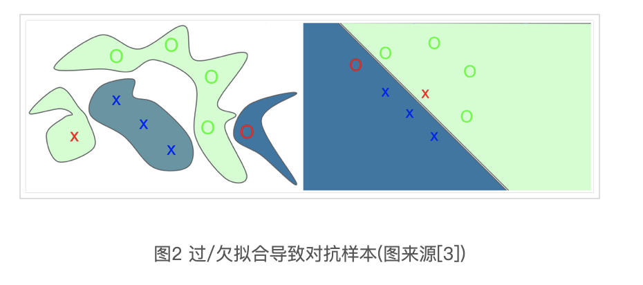

如果认为对抗样本是因为模型的线性性质导致的，那么是否能够构造出一个方法来生成对抗样本，**即如何在输入上加扰动**，Goodfellow给出了一种构造方法fast gradient sign method[2]，其中$J$是损失函数，再对输入x求导，$θ$ 是模型参数，$ϵ$是一个非常小的实数。图1中就是ϵ=0.007

$\eta = \epsilon sign(\triangledown_{x}J(\theta,x,y)) :::::(1)$

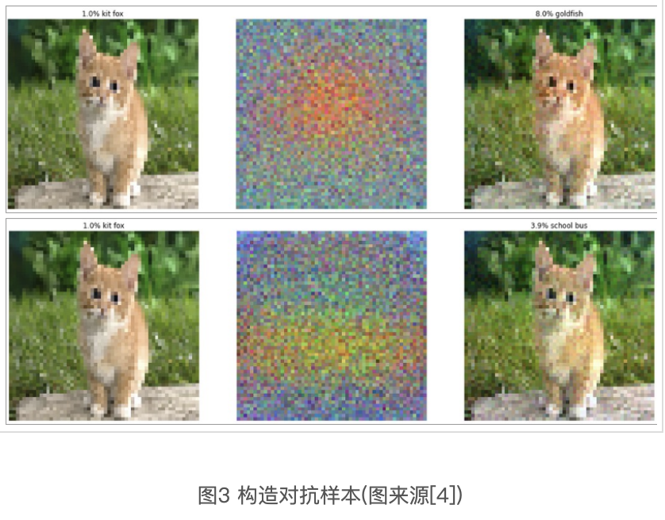

实际上不是只有纯线性模型才会出现这种情况，卷积网络的卷积其实就是线性操作，因此也有预测不稳定的情况，**relu/maxout甚至sigmoid的中间部分其实也算是线性操作**。因为可以自己构造对抗样本，那么就能应用这个性质来训练模型，让模型泛化能力更强。因而[2]给定了一种新的目标函数也就是下面的式子，相当于对输入加入一些干扰，并且也通过实验结果证实了训练出来的模型更加能够抵抗对抗样本的影响。

$\widetilde{J}(\theta,x,y) = \alpha J(\theta,x,y)+(1-\alpha)J(\theta,x+\epsilon sign(\triangledown_{x}J(\theta,x,y))) :::::(2)$

对抗样本跟生成式对抗网络没有直接的关系，对抗网络是想学样本的内在表达从而能够生成新的样本，但是有对抗样本的存在在一定程度上说明了模型并没有学习到数据的一些内部表达或者分布，而可能是学习到一些特定的模式足够完成分类或者回归的目标而已。公式1的构造方法只是在梯度方向上做了一点非常小的变化，但是模型就无法正确的分类。此外还观察到一个现象，用不同结构的多个分类器来学习相同数据，往往会将相同的对抗样本误分到相同的类中，这个现象看上去是所有的分类器都被相同的变化所干扰了。


2. #### 生成式对抗网络GAN

14年Goodfellow提出Generative adversarial nets即生成式对抗网络[5]，它要解决的问题是如何从训练样本中学习出新样本，训练样本是**图片就生成新图片**，训练样本是文章就输出新文章等等。如果能够知道训练样本的分布$p(x)$，那么就可以在分布中随机采样得到新样本，大部分的生成式模型都采用这种思路，

**GAN则是在学习从随机变量z到训练样本x的映射关系**，其中随机变量可以选择服从正太分布，那么就能得到一个由多层感知机组成的生成网络$G(z;θ_g)$，网络的输入是一个一维的随机变量，输出是一张图片。如何让输出的伪造图片看起来像训练样本，Goodfellow采用了这样一种方法，在生成网络后面接上一个多层感知机组成的判别网络$D(x;θ_d)$，这个网络的输入是随机选择一张真实样本或者生成网络的输出，输出是输入图片来自于真实样本$p_{data}$或者生成网络$p_g$的概率，**当判别网络能够很好的分辨出输入是不是真实样本时，也能通过梯度的方式说明什么样的输入更加像真实样本，从而通过这个信息来调整生成网络**。从而G需要尽可能的让自己的输出像真实样本，而D则尽可能的将不是真实样本的情况分辨出来。下图左边是GAN算法的概率解释，右边是模型构成。

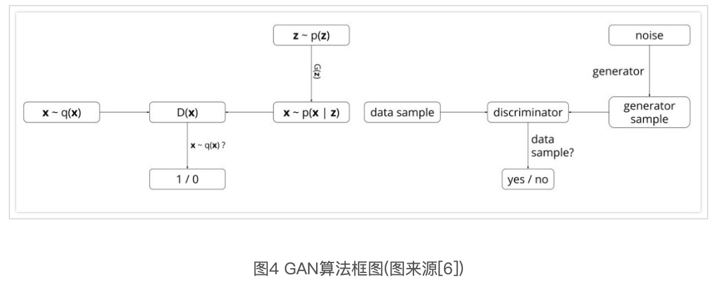

GAN的优化是一个极小极大博弈问题，最终的目的是: generator的输出给discriminator时很难判断是真实or伪造的，即极大化D的判断能力，极小化将G的输出判断为伪造的概率，公式如下。论文[5]中将下面式子转化成了Jensen-shannon散度的形式证明了仅当$p_g=p_{data}$时能得到全局最小值，即**生成网络能完全的还原出真实样本分布**，并且证明了下式能够收敛。(算法流程论文讲的很清楚，这里就不说了，后面结合代码一起解释。)

### 3. 代码解释

https://chenrudan.github.io/blog/2016/11/12/gan.html

### Intriguing properties of neural networks

https://arxiv.org/pdf/1312.6199.pdf