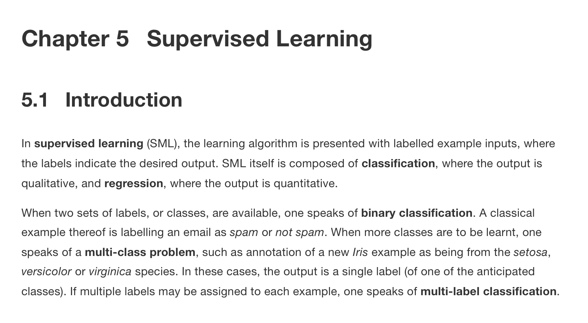
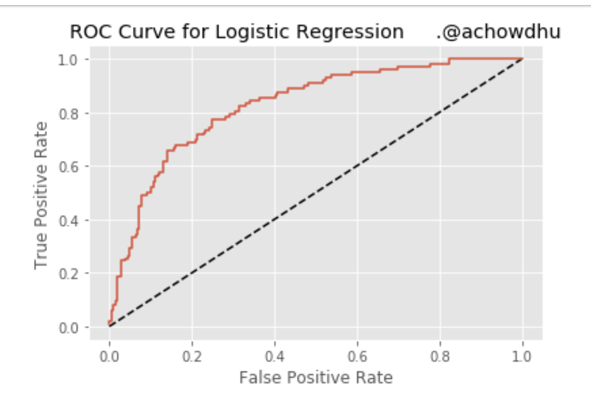

https://rdrr.io/cran/semTools/man/monteCarloMed.html


https://support.sas.com/resources/papers/proceedings/proceedings/sugi31/200-31.pdf


### [UC Business Analytics R Programming Guide](https://uc-r.github.io/)

https://uc-r.github.io/logistic_regression


https://lgatto.github.io/IntroMachineLearningWithR/supervised-learning.html




https://www.linkedin.com/pulse/building-logistic-regression-model-roc-curve-abu



# County community health associations of net voting shift in the 2016 U.S. presidential election

```R
## Simple two path mediation
## Write expression of indirect effect
med <- 'a*b'
## Paramter values from analyses
aparam <- 1
bparam <- 2
## Asymptotic covariance matrix from analyses
AC <- matrix(c(.01,.00002,
               .00002,.02), nrow=2, byrow=TRUE)
## Compute CI, include a plot
monteCarloMed(med, coef1 = aparam, coef2 = bparam, outputValues = FALSE,
              plot = TRUE, ACM = AC)

## Use a vector of parameter estimates as input
aparam <- c(1,2)
monteCarloMed(med, coef1 = aparam, outputValues = FALSE,
              plot = TRUE, ACM = AC)


## Complex mediation with two paths for the indirect effect
## Write expression of indirect effect
med <- 'a1*b1 + a1*b2'
## Paramter values and standard errors from analyses
aparam <- 1
b1param <- 2
b2param <- 1
## Asymptotic covariance matrix from analyses
AC <- matrix(c(1, .00002, .00003,
               .00002, 1, .00002,
               .00003, .00002, 1), nrow = 3, byrow = TRUE)
## Compute CI do not include a plot
monteCarloMed(med, coef1 = aparam, coef2 = b1param,
              coef3 = b2param, ACM = AC)


## WORKING WITH lavaan MODELS. From the mediation tutorial:
## http://lavaan.ugent.be/tutorial/mediation.html

set.seed(1234)
X <- rnorm(100)
M <- 0.5*X + rnorm(100)
Y <- 0.7*M + rnorm(100)
Data <- data.frame(X = X, Y = Y, M = M)
model <- ' # direct effect
Y ~ c*X
# mediator
M ~ a*X
Y ~ b*M
# indirect effect (a*b)
ab := a*b
# total effect
total := c + (a*b)
'
fit <- sem(model, data = Data)

med <- 'a*b'
## Automatically extract information from lavaan object
monteCarloMed(med, object = fit)

## or (unnecessary) manually extract the information first
myParams <- c("a","b")
myCoefs <- coef(fit)[myParams]
myACM <- vcov(fit)[myParams, myParams]
monteCarloMed(med, myCoefs, ACM = myACM)
```


###### 其实已经很清楚了，CV主要是用来寻找模型超参数，以及评估不同模型性能；小数据一般才会用Cross-validation，现在deep learning一般训练数据集非常大，可以直接 train-val-test 划分，在validation data 上调参比较模型性能。

###### ROC是通过在各种阈值设置下将真阳性率（TPR）与假阳性率（FPR）作图而产生的曲线，而AUC是ROC曲线下的面积。作为一个经验法则，具有良好预测能力的模型应该具有接近于1（1是理想的）的AUC比0.5。
###### 曲线下面积越大，诊断准确性越高。在ROC曲线上，最靠近坐标图左上方的点为敏感性和特异性均较高的临界值。
###### How to handle data imbalance in Principal Component Analysis?

####
###### Using the Confusion Matrix, the test result shows 99.9% accuracy due to the Class 1 records. So, let's neglect this 
###### accuracy. Using ROC curve, the test result shows 78% accuracy. That is very low.
###### Applying Sampling Methods to Balance Dataset
###### Using Principal Component Analysis to Solve a Class Imbalance Problem in Traffic Incident Detection
###### https://www.hindawi.com/journals/mpe/2013/524861/
###### https://rstudio-pubs-static.s3.amazonaws.com/336831_55c98ceeb234439b80d844da949ff1f4.html

```{r Description of the data}
# https://stats.idre.ucla.edu/r/dae/logit-regression/ 

# https://stats.idre.ucla.edu/r/dae/logit-regression/ 

# https://mgimond.github.io/Stats-in-R/Logistic.html
# https://uc-r.github.io/logistic_regression

```


```{r pcr}
# install.packages("pls")
# https://www.kaggle.com/subhasree/democrat-prediction-using-pca-regression
# https://ncss-wpengine.netdna-ssl.com/wp-content/themes/ncss/pdf/Procedures/NCSS/Principal_Components_Regression.pdf
# https://www.jianshu.com/p/2f71bc493042 # example
# https://zhuanlan.zhihu.com/p/23795029
# https://towardsdatascience.com/understanding-voting-outcomes-through-data-science-5d257b51ae5c    

library(pls)
set.seed(123)
pcr.fit <- pcr(Y ~., data = train, scale = TRUE ,validation = "CV" ) # hyperparameters cutoff???
summary(pcr.fit)

par(mfrow = c(1, 2))
# Plot the cross validation MSE
validationplot(pcr.fit ,val.type ="MSEP")
validationplot(pcr.fit, val.type = "R2")


#Logistic model is built with 1st 7 principal components as predictor variables
# prediction
press.election <- sqrt(pcr.fit$validation[["PRESS"]])
which.min(press.election)
press.election.eff <- press.election - press.election[which.min(press.election)]
press.election.eff

# The smallest CV error occurs when M =10 components are used
# grid search
for ( i in seq(0.1,0.3, by = 0.01)) {
  
  pcr.probs.train <- predict(pcr.fit, newdata = train, comps = 10)
  pcr.pred.train <- ifelse(pcr.probs.train > i, 1, 0)
  table(pcr.pred.train, All_16$Y)
  xm = mean(pcr.pred.train == All_16$Y)
  
  print(xm)
}

```


```R
# The smallest CV error occurs when M =10 components are used
# grid search
for ( i in seq(0.1,0.3, by = 0.01)) {
  
  pcr.probs.train <- predict(pcr.fit, newdata = train, comps = 10)
  pcr.pred.train <- ifelse(pcr.probs.train > i, 1, 0)
  table(pcr.pred.train, All_16$Y)
  xm = mean(pcr.pred.train == All_16$Y)
  
  print(xm)
}

#Logistic model is built with 1st 7 principal components as predictor variables
# prediction
press.election <- sqrt(pcr.fit$validation[["PRESS"]])
which.min(press.election)
press.election.eff <- press.election - press.election[which.min(press.election)]
press.election.eff


```


```R
table(test$Y)

# Plot the root mean squared error
validationplot(pcr.fit)

# Visualising the Training set results
# install.packages('ElemStatLearn')
library(ElemStatLearn)
set = training_set_pca
X1 = seq(min(set[, 1]) - 1, max(set[, 1]) + 1, by = 0.01)
X2 = seq(min(set[, 2]) - 1, max(set[, 2]) + 1, by = 0.01)
grid_set = expand.grid(X1, X2)
colnames(grid_set) = c('V1', 'V2') # align with PC1 and PC2
prob_set = predict(classifier, type = 'response', newdata = grid_set)
y_grid = ifelse(prob_set > 0.5, 1, 0)
plot(set[, -3],
     main = 'Logistic Regression with Kernel PCA (Training set)',
     xlab = 'PC1', ylab = 'PC2',
     xlim = range(X1), ylim = range(X2))
contour(X1, X2, matrix(as.numeric(y_grid), length(X1), length(X2)), add = TRUE)
points(grid_set, pch = '.', col = ifelse(y_grid == 1, 'springgreen3', 'tomato'))
points(set, pch = 21, bg = ifelse(set[, 3] == 1, 'green4', 'red3'))

# https://www.kaggle.com/stevebroll/logistic-regression-model-using-pca-components

```

```
wget https://dl.fbaipublicfiles.com/fairseq/models/bart.large.cnn.tar.gz
```

What you would like to see is a low cross validation error with a lower number of components than the number of variables in your dataset. If this is not the case or if the smalles cross validation error occurs with a number of components close to the number of variables in the original data, then no dimensionality reduction occurs. In the example above, it looks like 3 components are enough to explain more than 90% of the variability in the data. Now you can try to use PCR on a traning-test set and evaluate its performance using, for example, using only 6 components


```{r logistic regression}
# Packages
library(tidyverse)  # data manipulation and visualization
library(modelr)     # provides easy pipeline modeling functions
library(broom)      # helps to tidy up model outputs


formula = Y ~ total_population + total_votes + white_pct + black_pct + hispanic_pct + female_pct + less_than_hs_pct+ high_school_pct + some_college_pct + college_degree_pct + Births + Deaths + Unemployment_rate + age35andunder_pct + age65andolder_pct + median_income + pov_below_line

formula1 = Y ~ total_population + total_votes + white_pct + black_pct + hispanic_pct + some_college_pct + college_degree_pct +Births + Deaths + Unemployment_rate + pov_below_line

# define the weight 
#wt = 15
#w <- rep(1,length(All_16$Y))
#w <- ifelse(All_16$Y == 1, 5.375, 1)

for (i in seq(0.1,0.3, by = 0.1)) 
  {
ww <- ifelse(pca16_pca$Y == 1, 1, i)
logit.mod1 <- glm(formula1, data = pca16_pca, weights = ww, family = binomial("logit"))
pred <- predict.glm(logit.mod1,newdata = test20_test[,-1], type = "response")
pred2 <- round(pred)

ww <- ifelse(All_16$Y == 1, 1, 1/9)
logit.mod <- glm(formula1, weights = ww, data = All_16,  family = "binomial")
summary(logit.mod)

tidy(logit.mod)

caret::varImp(logit.mod)


logit.mod1 <- glm(formula1, data = All_16, family = "binomial")

# Model Evaluation & Diagnostics
# the p-value can be obtained using:
with(logit.mod1, pchisq(null.deviance - deviance, df.null - df.residual, lower.tail = FALSE))

logit.mod1$null.deviance
logit.mod1$deviance

# r2
modelChi <- logit.mod1$null.deviance - logit.mod1$deviance
pseudo.R2 <- modelChi / logit.mod1$null.deviance
pseudo.R2

#Model significance
Chidf <- logit.mod1$df.null - logit.mod1$df.residual
chisq.prob <- 1 - pchisq(modelChi, Chidf)
chisq.prob


summary(logit.mod1)
confint(logit.mod)
```