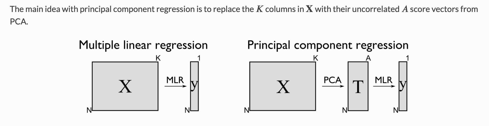
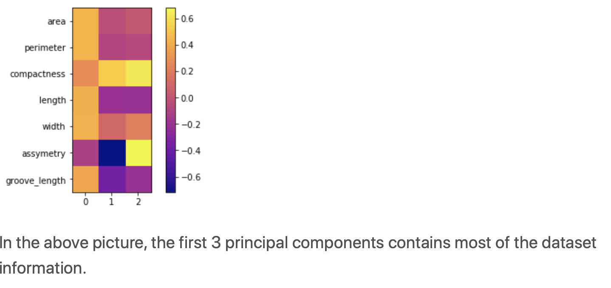
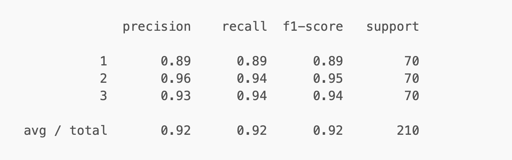
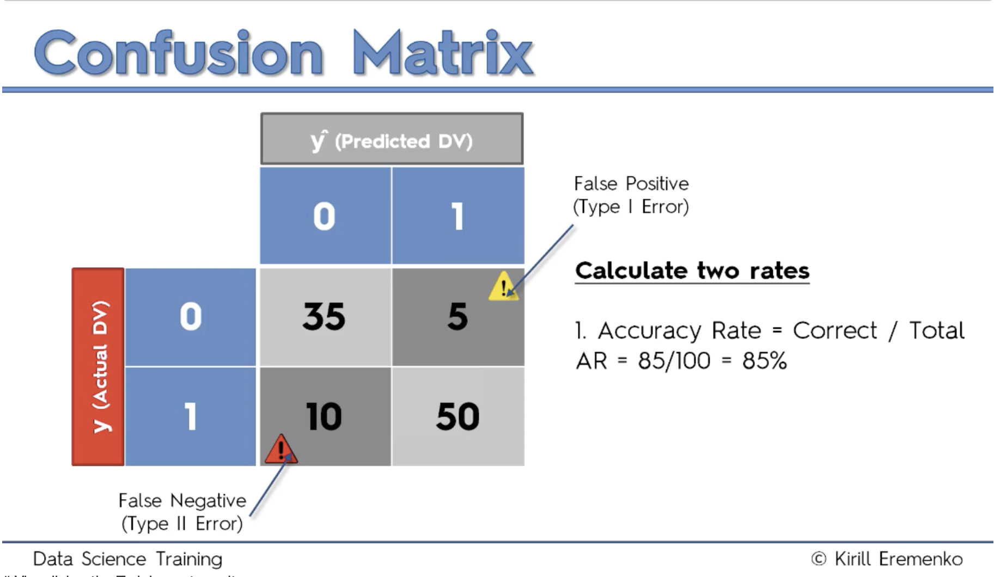
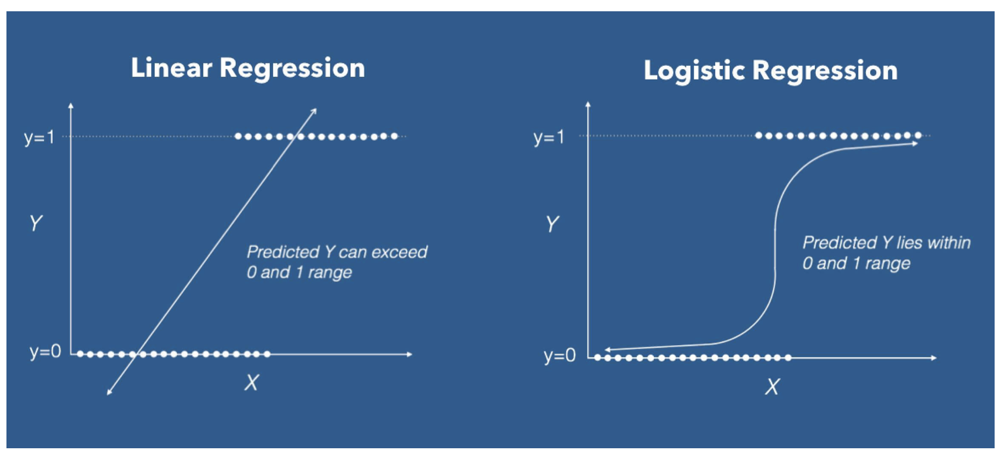
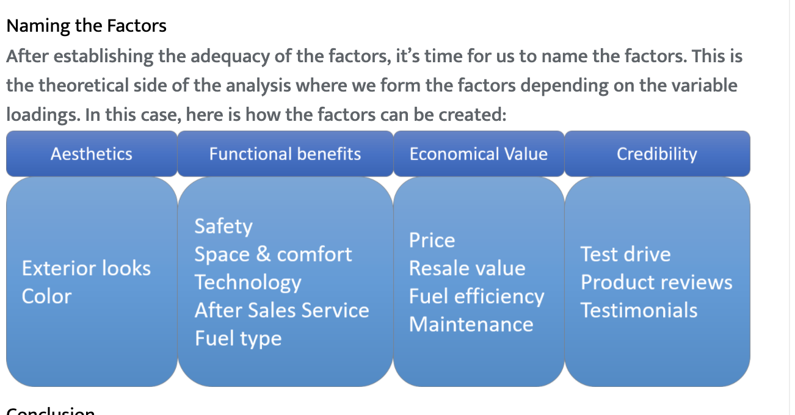

### How to [Interpret](https://www.nyu.edu/classes/jackson/design.of.social.research/Readings/Johnson%20-%20Introduction%20to%20survey%20weights%20%28PRI%20version%29.pdf) the weights in Logistic Regression


https://chf2012.github.io/2017/09/01/软件应用_程序编程/R/R_专题总结/R_文档输出_rmarkdown/


- Post-Stratification or Non-response Weight.

  - This type is used to compensate for that fact that persons with certain characteristics are not as likely to respond to the survey.

  - Example. Most general population surveys have substantially more female than male respondents (often 60/40) although there are often more males in the population. Because the survey over-represents females and under-represents males in the population **a weight is used to compensate for this bias.**

  - There are many respondent characteristics that are likely to be related to the propensity to respond.

    • Age
     • Education
     • Race/ethnicity
     • Gender
     • Place of residence

- How Do We Calculate Weights?

  - Information usually needed:

    - Population estimates of the distribution of a set of demographic characteristics that have also been measured in the sample

    - For example, information found in the Census such as: • Gender

       • Age
       • Educational attainment
       • Household size
       • Residence (e.g., rural, urban, metropolitan) • Region


**Linear Model Selection and Regularization**

https://www.cnblogs.com/runner-ljt/p/4856476.html




https://learnche.org/pid/latent-variable-modelling/principal-components-regression

Principal Component Regression (PCR) combines PCA and OLS. 

## What is Principal Component Regression

PCR (Principal Components Regression) is a regression method that can be divided into three steps:

1. The first step is to run a **PCA** ([Principal Components Analysis](https://www.xlstat.com/en/products-solutions/feature/principal-component-analysis-pca.html)) on the table of the explanatory variables,
2. Then run an **Ordinary Least Squares regression** ([OLS regression](https://www.xlstat.com/en/products-solutions/feature/ordinary-least-squares-regression-ols.html)) also called [linear regression](https://www.xlstat.com/en/products-solutions/feature/linear-regression.html) on the selected components,
3. Finally **compute the parameters** of the model that correspond to the input variables.

## Principal Component Regression models

PCA allows to transform an X table with n observations described by variables into an S table with n scores described by q components, where q is lower or equal to p and such that (S’S) is invertible. An additional selection can be applied on the components so that only the r components that are the most correlated with the Y variable are kept for the OLS regression step. We then obtain the R table.

The OLS regression is performed on the Y and R tables. In order to circumvent the interpretation problem with the parameters obtained from the regression, XLSTAT transforms the results back into the initial space to obtain the parameters and the confidence intervals that correspond to the input variables.

PCR results: Correlation and observations charts and biplots

As PCR is build on PCA, a great advantage of PCR regression over classical regression is the available charts that describe the data structure. Thanks to the correlation and loading plots it is easy to study the relationship among the variables. It can be relationships among the explanatory variables, as well as between explanatory and dependent variables. The score plot gives information about sample proximity and dataset structure. The biplot gather all these information in one chart.

## Prediction with Principal Component Regression

Principal Componenet Regression is also used to build predictive models. XLSTAT enable you to predict new samples' values.	

https://ncss-wpengine.netdna-ssl.com/wp-content/themes/ncss/pdf/Procedures/NCSS/Principal_Components_Regression.pdf


## 3.3 Data normalisation

As I wrote before, normalisation is essential before performing PCA. It doesn’t however affect the correlation. I normalised the independent variables as well as the dependent variable.

```R
crimeData.norm <- data.Normalization(crimeData.descr, type="n1", normalization="column")
crimeData.y.norm <- data.Normalization(crimeData.y, type="n1", normalization="column")
```


## 3.4 PCA

### 3.4.1 Summary

#### hide summary

```R
crimeData.pca1 <- prcomp(crimeData.norm, center=TRUE, scale.=TRUE)
```

#### show summary

```R
crimeData.pca1 <- prcomp(crimeData.norm, center=TRUE, scale.=TRUE)
summary(crimeData.pca1)
```


### Using principal components for estimating logistic regression with high-dimensional multicollinear data

https://citeseerx.ist.psu.edu/viewdoc/download?doi=10.1.1.105.3106&rep=rep1&type=pdf


## Perform Classification using Multiple Linear Regression


```
Training Set Accuracy: 98.4375%
Testing Set Accuracy: 94.44444444444444%
```


### Data Classification using Logistic Regression Algorithm with Principal Component Analysis

https://dchandra.com/machine%20learning/2018/12/05/Classification-using-PCA.html

**What is Principal Component Analysis?**

**What is principal component?**

high variance — 几何理解	

The data analysis is mainly carried out on the features which have more information or high variance.

Variance is a measure of heterogeneity in a dataset. 

- Higher the variance, the data is heterogeneous and 

- smaller the variance, the data is homogeneous.

**What is the relationship between eigen values and eigen vectors with principal component?**

```r
# Filtering the principal components which represents about 95 % of variance
# Data with 95% of variance
PCA = decomposition.PCA(0.95)
# Thr first 3 principal components reqpresents around 95% of data variance
```



```
prediction = model_selection.cross_val_predict(model,X_transform,y,cv=10)
matrix = metrics.confusion_matrix(y,prediction)
print(matrix)
accuracy = metrics.accuracy_score(y,prediction)
print(accuracy)
report = metrics.classification_report(y,prediction)
print(report)
```




**Model Building using Principal Components**

```
# Only considering first 2 principal components which represents around 89% of the given data variance
prediction = model_selection.cross_val_predict(model,df.iloc[:,0:2],df.iloc[:,-1],cv=10)
matrix = metrics.confusion_matrix(df.iloc[:,-1],prediction)
print(matrix)
accuracy = metrics.accuracy_score(df.iloc[:,-1],prediction)
print(accuracy)
report = metrics.classification_report(df.iloc[:,-1],prediction)
print(report)
```


==By comparing the model built using all the features and first two principal components, the accuracy of the model for classification is almost same around 92%.==

```
# Decision Boundary using Principal Components
```


#### Train the model with all data:

https://acadgild.com/blog/logistic-regression-with-pca-algorithm

https://harvard-iacs.github.io/2018-CS109A/sections/section-5/solutions/#What-is-the-right-way-to-normalize?




https://cran.r-project.org/web/packages/logisticPCA/vignettes/logisticPCA.html


### An Introduction to the `logisticPCA` R Package

https://cran.r-project.org/web/packages/logisticPCA/vignettes/logisticPCA.html




https://www.datacamp.com/community/tutorials/logistic-regression-R

Linear regression is not capable of predicting probability. If you use linear regression to model a binary response variable, for example, the resulting model may not restrict the predicted Y values within 0 and 1. Here's where logistic regression comes into play, where you get a probaiblity score that reflects the probability of the occurrence at the event.

https://www.datacamp.com/community/tutorials/logistic-regression-R


```R
glm.pred = ifelse(glm.probs > 0.5, "Up", "Down")
```

```
# Fit a smaller model
glm.fit = glm(Direction ~ Lag1 + Lag2 + Lag3, data = Smarket, family = binomial, subset = train)
glm.probs = predict(glm.fit, newdata = Smarket[!train,], type = "response")
glm.pred = ifelse(glm.probs > 0.5, "Up", "Down")
table(glm.pred, Direction.2005)
mean(glm.pred == Direction.2005)
```

假设我们有两个类：

- **A**，代表人口的99.99％
- **B**，占人口的0.01％

假设我们对识别B类元素感兴趣，这些元素可能是受罕见疾病或欺诈者影响的个人。

仅凭猜测**，**学习者将在其损失函数上得分很高，并且极少数错误分类的元素可能不会从数字上移动（在这种情况下为大海捞针）。这个例子将直觉带到了减轻“类不平衡”问题的“技巧”之一之后：调整成本函数。

当模型显示接近零的灵敏度和接近一的特异性时，我感到数据不平衡是一个问题。请参阅本文[“忽略问题”部分下](http://www.marcoaltini.com/blog/dealing-with-imbalanced-data-undersampling-oversampling-and-proper-cross-validation)的示例。	


**Linear Model Selection and [Regularization](https://www.cnblogs.com/runner-ljt/p/4856476.html)** 在变量选择上的三种常见方法：

- subset selection, 以模型优劣的判别准则来选择合适的自变量子集，常见的方法有最优子集法和逐步回归法；

- shrinkage/regularization, 在对所有变量的传统最小二乘回归中加入约束,使得某些回归系数收缩为0，从而达到选择合适

  ​      自变量的目的，主要包括岭回归（ridge regression)及lasso回归；

- dimension reduction, 利用投影得到不相关的自变量组合，主要方法为主成分回归(PCR)和偏最小二乘回归(PLS).

前两种方法在本质上是一样的，都是通过选择全变量的一个合适的子集来达到**降维**的目的，只不过(1)是将**选择和判别**分开，每一个**子集**便是一个选择，判别是通过相应的**判别准则**来决定哪一个子集选择是最佳的，而(2)是将**选择和判别融为一个过程**，在全变量的最小二乘中加入罚约束，**在最小二乘的过程中要考虑到变量的选择问题，最终达到最小二乘和变量选择的一个权衡**；(1)和(2)都是在原始变量基础上选择一个合理的子集，而(3)则换了一种思路，**不直接使用原始变量**，而是对原始变量进行**投影转换为新的变量**，既使得变量的**维度减少**又使**新变量间相互独立**。


Logistics regression 


https://stats.idre.ucla.edu/spss/seminars/introduction-to-factor-analysis/a-practical-introduction-to-factor-analysis/

# PRINCIPAL COMPONENTS (PCA) AND EXPLORATORY FACTOR ANALYSIS (EFA) WITH SPSS

https://stats.idre.ucla.edu/spss/seminars/efa-spss/




### **Adequacy Test**

Now that we’ve achieved a simple structure it’s time for us to validate our model. Let’s look at the factor analysis output to proceed:	

The root means square of residuals (RMSR) is 0.05. This is acceptable as this value should be closer to 0. Next, we should check the RMSEA (root mean square error of approximation) index. Its value, 0.001 shows the good model fit as it is below 0.05. Finally, the Tucker-Lewis Index (TLI) is 0.93 – an acceptable value considering it’s over 0.9.


```R
set.seed(1234)
X <- rnorm(100)
M <- 0.5*X + rnorm(100)
Y <- 0.7*M + rnorm(100)
Data <- data.frame(X = X, Y = Y, M = M)
model <- ' # direct effect
             Y ~ c*X
           # mediator
             M ~ a*X
             Y ~ b*M
           # indirect effect (a*b)
             ab := a*b
           # total effect
             total := c + (a*b)
         '
fit <- sem(model, data = Data)
summary(fit)
```

https://lavaan.ugent.be/tutorial/mediation.html


https://gist.github.com/xiaolai