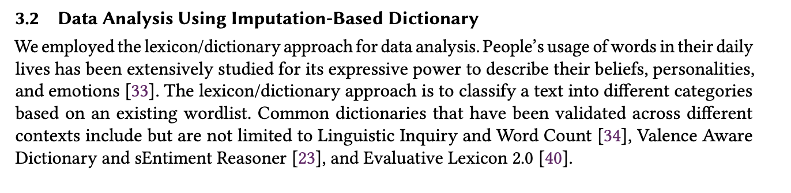

**12/06/2020 Meeting Agenda**

·    A Brief Introduction of the Research Topic and Motivations

o  What is it about?

o  Why is it important?

o  What might make it stand out?

·    What are the data available? What are the other data that would be helpful? 

·    What are the current preliminary findings? How could it be extended both in theories and methodologies?

·    What are the literature topics should we review? And who will review what?

·    What is the desired submission date? What are the possible venues?

·    Project Management:

o  Lit Review Due

o  Methodology Discussion Date

o  Methodology Due

o  Results and Analyses Due

o  1st Complete Paper Draft Due

o  1st Round Revision Due

o  2nd Round Revision Due

o  Submission Due

http://www.joonsungpark.com/papers/CSCW20_YouTube/