# **ICLR 2021 Reviewer Guide**

https://iclr.cc/Conferences/2021/ReviewerGuide


[BART](https://github.com/pytorch/fairseq/tree/master/examples/bart) is sequence-to-sequence model trained with denoising as pretraining objective. We show that this pretraining objective is more generic and show that we can match RoBERTa Results on SQuAD and GLUE and gain state-of-the-art results on summarization (XSum, CNN dataset), long form generative question answering (ELI5) and dialog response genration (ConvAI2). See the associated paper for more details.

https://dchandra.com/category/Machine%20Learning.html


```python
# Make evaluation dataset from .csv files
```


### I Introduction 

With the development of deep learning, various neural networks have been widely used to solve natural language processing (NLP) tasks, such as convolutional neural networks (CNNs), recurrent neural networks (RNNs), graph-based neural networks (GNNs), and attention mechanism. One of the advantages of these neural models is that they can alleviate feature engineering problems. Non-neural natural language processing methods usually rely heavily on discrete manual features. Simultaneously, neural techniques usually use low-dimensional and dense vectors (also known as distributed representation) to represent the syntax or semantic features of the language implicitly. These representations are learned in specific natural language processing tasks. Therefore, neural methods make it easy to develop various natural language processing systems.

Facebook AI recently proposed a pre-training model BART based on a denoising autoencoder to do seq2seq. It mainly uses a method of destroying the text by using an arbitrary noise function and then letting the model relearn to reconstruct the original text. Compared to the previous study, the self-supervised method has widely achieved excellent results in a large number of NLP tasks. Recent research has improved performance by adjusting the distribution of masked tokens (that is, the order in which masked tokens are predicted) and replacing the available context of masked tokens. However, these methods usually focus on specific types of end tasks (such as span prediction, generation, etc.), and their applications are relatively limited.

This Facebook proposed a new architecture, BART, which combines bidirectional and autoregressive Transformer to pre-train the model to deal with issue. BART is a denoising autoencoder suitable for sequence-to-sequence models and can be applied to a large number of end tasks. Pre-training includes two stages: 1) Use arbitrary noise functions to destroy the text; 2) Learn the sequence-to-sequence model to reconstruct the original text. BART uses a standard neural machine translation architecture based on Tranformer, which can generalize pre-training models recently proposed such as BERT and GPT.

Everything has to start with the Transformers: State-of-the-Art Natural Language Processing. The left half of the Transformer is Encoder, and the right half is Decoder. We call the sentence input by the Encoder the source, and the sentence input by the Decoder as the target 

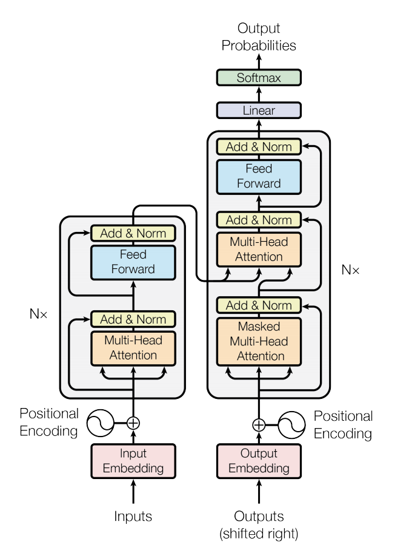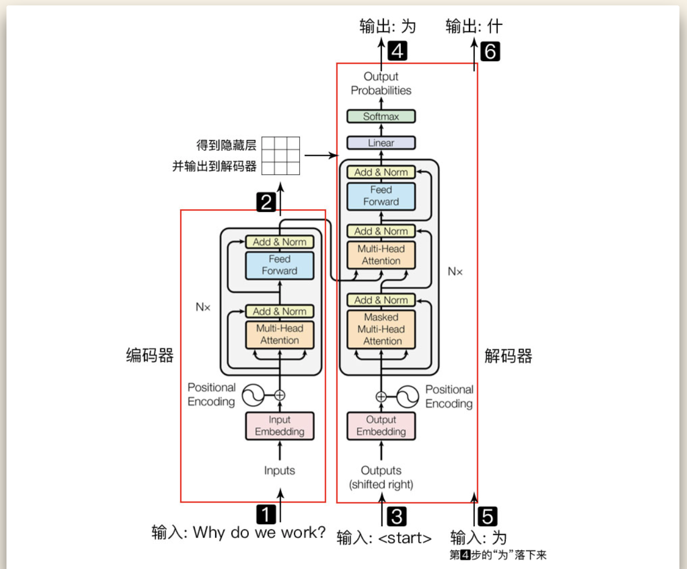

Encoder is responsible for self-attention of the source and obtains the representation of each word in the sentence. The most classic Encoder architecture is BERT, which learns the relationship between words through Masked Language Model, and there are XLNet, RoBERTa, ALBERT, DistilBERT, etc. . But the Encoder structure alone is not suitable for generation tasks. The decoder is shown in figure (b) below. There is a difference between the input and output. The main reason is that the model cannot see future words during Inference. This method is called the AutoRegressive. Common Decoder-based models are usually used for Sentence Generation, such as GPT, CTRL. But the single Decoder structure only predicts words based on the left context and cannot learn bidirectional interactions.

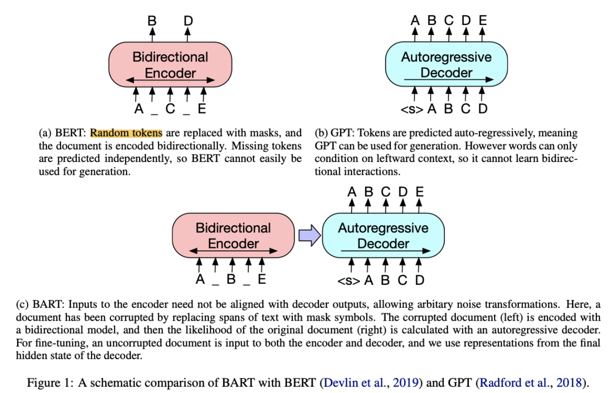

Combined these two models, we can get a new one named the Seq2Seq model for translation tasks. Figure (c) above is the main structure of BART. It seems to be no different from the Transformer. The main difference lies in source and target. In the pre-training phase, the Encoder uses a bidirectional model to encode the corrupted text, and then the Decoder uses autoregressive methods to calculate the original input. In the fine-tuning phase, the input of the Encoder and Decoder are both uncorrupted text

The pre-training language model is mainly divided into three aspects:
\begin{itemize}
\item[*] Autoregressive pre-training language models represented by unidirectional features, collectively referred to as unidirectional models: ELMO/ULMFiT/SiATL/GPT1.0/GPT2.0;
\item[*] The self-encoding pre-training language model of bidirectional feature representation is collectively referred to as the BERT series model:
(BERT/MASS/UNILM/ERNIE1.0/ERNIE(THU)/MTDNN/ERNIE2.0/SpanBERT/RoBERTa)
\item[*] Autoregressive pre-training language model with bidirectional feature representation: XLNet
\end{itemize}

##### 

### II Literature Review

In this paper, author present BART, which pre-trains a model combining Bidirectional and **Auto-Regressive** Transformers. BART is a denoising autoencoder developed by a sequence-to-sequence model. Because of the BART features, this model can apply to a very wide range of end tasks. Author pre-trained BART model by two stages (1) text is corrupted with an arbitrary denoising function, and (2) a sequence-to-sequence model is learned to reconstruct the original text. BART was designed based on a standard Transformer-based neural machine translation architecture. It can consider as generalizing BERT (due to the bidirectional encoder), GPT (with the left-to-right decoder), and many other more recent pre-training schemes (see Figure 1). 

Based on the previous research, the fair comparison of different pre-training models that have been proposed has been difficult to perform, somewhat due to differences in training data, training resources, architectural differences between models, and fine-tuning procedures.  But we can make minor changes to the learning rate and usage of layer normalization to improve performance. For reference, the author compared the following two main approaches:

##### Auto-regressive Language Model

Auto-regressive language modeling performs pretraining by maximizing the likelihood under the forward autoregressive factorization:

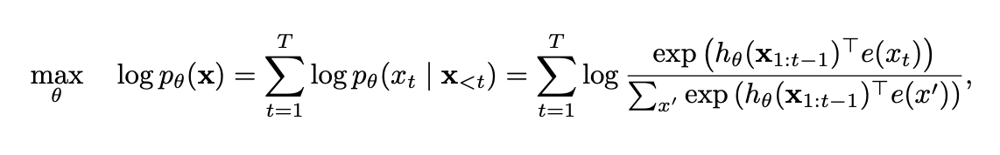

Where a text sequence x = [x1, · · · , xT ], e hθ(x1:t−1) is a context representation produced by neural models, such as RNNs or Transformers, and e(x) denotes the embedding of x.

The advantage of the Auto-regressive Language Model is its density estimation of the joint probability of the text sequence is a traditional language model, which is naturally suitable for processing natural generation tasks. But its joint probability is decomposed from left to right according to the text sequence (sequential disassembly) and cannot be ) factorized by bidirectional representations through context information. The Representative model for this type of architecture is ELMO, GPT1.0, and GPT2.0. And then, XLNet model is designed to improve the model performance, which promotes the traditional autoregressive language model and transforms sequential disassembly into random disassembly (arrangement language model) to generate context-sensitive bidirectional representations. 


In comparison, BERT is based on denoising auto-encoding. Specifically, for a text sequence x, BERT first constructs a corrupted version $\hat{x}$ by randomly setting a portion (e.g. 15%) of tokens in x to a special symbol [MASK]. Let the masked tokens be x¯. The pre-training objective is to reconstruct:

##### Denoising Autoencoder Language Model 

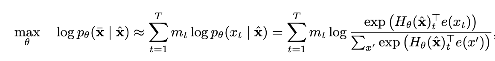

The advantages of the Denoising Autoencoder Language Model are its log likelihood of the output part of the sequence (joint probability) is an essential feature representation of denoising auto-encoding. The Masked Seq-to-Seq model was constructed by introducing noise [MASK] to obtain context-sensitive bidirectional representations. Denoising Auto-encoder Language Model also introduces the assumption of independence, which is a biased estimate of joint probability, without considering the correlation between predictions [MASK]. 

The author directly compared their models on their ability to model fine-tuning objectives (the log-likelihood of the human text) in Table1 as below. The BERT base models are not suitable for directly processing generation tasks. The pre-training objectives for Masked Seq-to-Seq may cause the pre-training process and the generation process to be inconsistent. [MASK] noise during pre-training will not appear in the fine-tuning stage, causing a two-stage mismatch problem. The representative models are BERT base models, like Masked Seq-2seq.

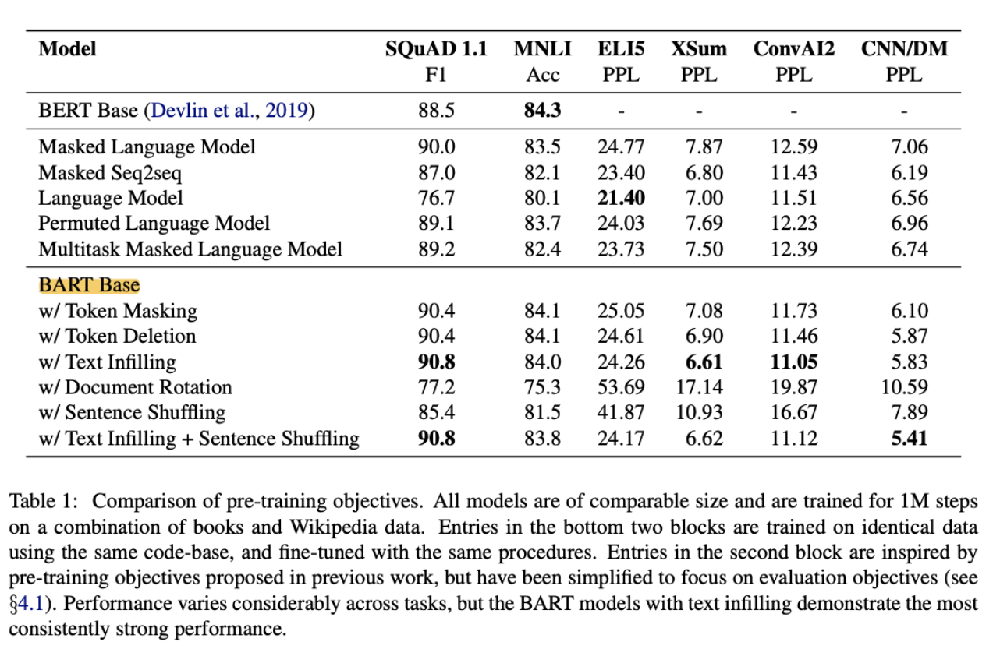

As seen from the above table1, it seems that the performance of the model with Document Rotation or Sentence Shuffling is not very good. It can be understood that if the order of sentences seen by the model during training is chaotic, it may think that the order of sentences, in reality, it's all messy. When you do the test, the input sentences are in normal order, and the model may be at a loss. Actually, text infilling can be regarded as Token Masking + Token Deletion, so, understandably, the performance of Text Infilling is so good.

As well known that the pre-trained Language Model (PLM) is a very popular topic in NLP. We found this diagram below to list some representative work on PLM with their relationship from the previous study. 

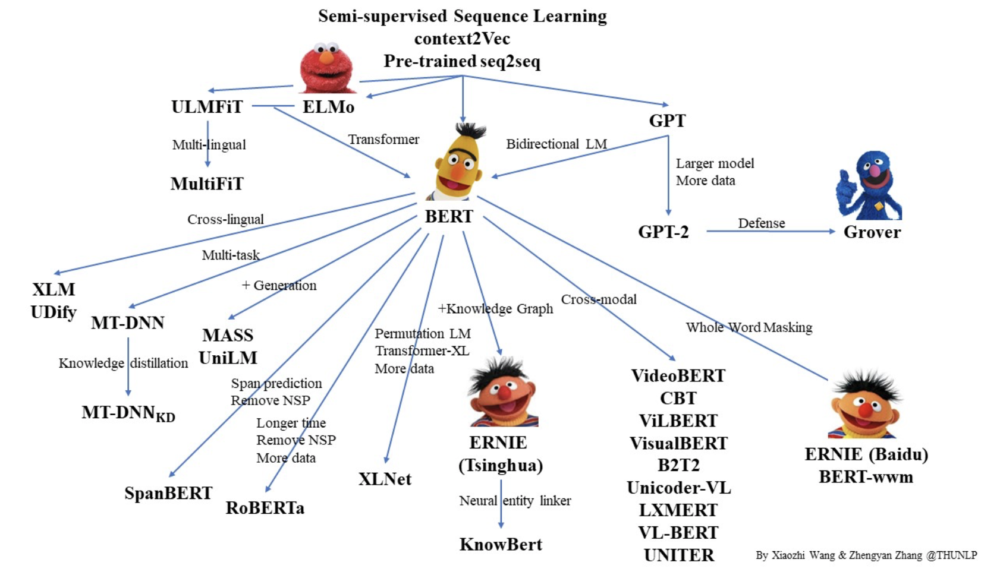


https://github.com/thunlp/PLMpapers/blob/master/README.md

https://huggingface.co/transformers/model_doc/bart.html

https://www.jiqizhixin.com/articles/2019-08-26-16

https://zhuanlan.zhihu.com/p/76912493

https://zhuanlan.zhihu.com/p/115014536

https://cloud.tencent.com/developer/article/1701172

https://zhuanlan.zhihu.com/p/90173832

https://zhuanlan.zhihu.com/p/90173832

NLP — [XLNet](https://errolyan.medium.com/一-什么是xlnet-8e458133b8ff)预训练模型

### 【FB-BART新的预训练模型】[阅读笔记](https://zhuanlan.zhihu.com/p/97525548)


https://huggingface.co/bert-base-uncased?text=Paris+is+the+%5BMASK%5D+of+France


##### Pre-Training of Transformers for Language Understanding

**B**idirectional **E**ncoder **R**epresentations from **T**ransformers


### III Method

#### Architecutre 

BART is a denoising autoencoder that establishes a mapping from the corrupted document to the original document. It used the seq2seq model, which included  a bidirectional encoder and an autoregressive decoder from left to right. When pre-training, the BART model optimizes the reconstruction loss by destroying the document, the cross-entropy between the decoder output and the original document.

BART uses the standard seq2seq Transformer architecture, but with some changes: According to the GPT model, they changed the ReLU activation function to GeLU, and initialized the parameters from N (0, 0.02). The encoder and decoder of the BART base model each have six layers, and the number of layers in the large model increased to 12. Each layer of the BART decoder performs additional cross-attention on the final hidden layer of the encoder. BERT uses an additional feed-forward network before word prediction, while BART does not.

Unlike current denoising autoencoders that are only suitable for specific noise mechanisms, BART can be applied to any type of document corruption. In extreme cases, when all source text information is missing, BART is also equivalent to a language model. The author tried different ways to destroy the document:


#### Pre-trained BART 

- Token Masking: randomly mask out words in the document replaced with [MASK]. 

- Token Deletion: Randomly delete tokens from the input. The difference with Token-Masking is that the token-deletion model should decide which positions are missing inputs

- Text Infilling: Randomly mask a part of the text fragments. This is very similar to SpanBERT. The difference is that SpanBERT mask is filled with each span with a sequence of [MASK] tokens of exactly the same length. Here the spans that the author masks are just filled with a single [MASK] token. The purpose of the Text infilling is to teach the model to learn how many tokens are masked by itself.

- Sentence Permutation: disrupt the order of documents

- Document Rotation: Randomly find a token in the document, and then let the document rotate so that the selected token is the first word. The reason why they did this is to train the model to learn the starting token of the document.

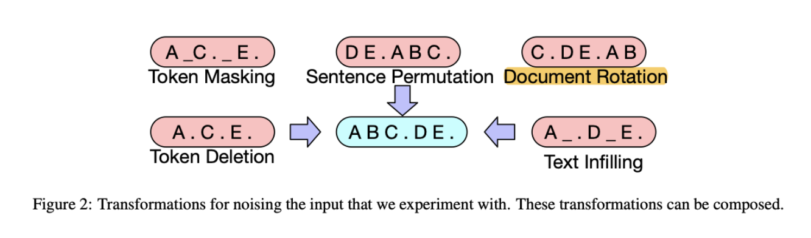

#### Fine-tuning BART


Sequence classification task: In the sequence classification task, the input of the encoder and the decoder are the same, and the final hidden state of the final decoder token is fed into the new multi-class linear classifier. This method is similar to the CLS token in BERT, but BART adds an extra token at the end of the decoder. So that the token's representation can handle the decoder state from the complete input.

Token classification task: For the token classification task, the researchers input the complete document into the encoder and decoder, and use the hidden state at the top of the decoder as the representation of each word. The purpose of this characterization is to classify tokens.

Sequence generation tasks: Since BART has an autoregressive decoder, it can directly fine-tune sequence generation tasks, such as abstract question answering and summarization. In these two tasks, the information is copied from the input but manipulated, which is closely related to the denoising pre-training target. Here, the input of the encoder is the input sequence, and the decoder generates the output in an autoregressive mode.


Machine translation: The author replaces the encoder embedding layer of BART with a new randomly initialized encoder. The model is trained in an end-to-end. That is, the new encoder is trained to map foreign words to the input (BART can denoise it into English). The new encoder can use a different vocabulary than the original BART model. The source encoder training is divided into two steps, both of which need to backpropagate the cross-entropy loss output from the BART model. In the first step, the researchers freeze most of the BART parameters and only update the randomly initialized source encoder, the BART position embedding, and the self-attention input projection matrix of the first layer of the BART encoder. In the second step, the researcher will train all model parameters in a small number of iterations.

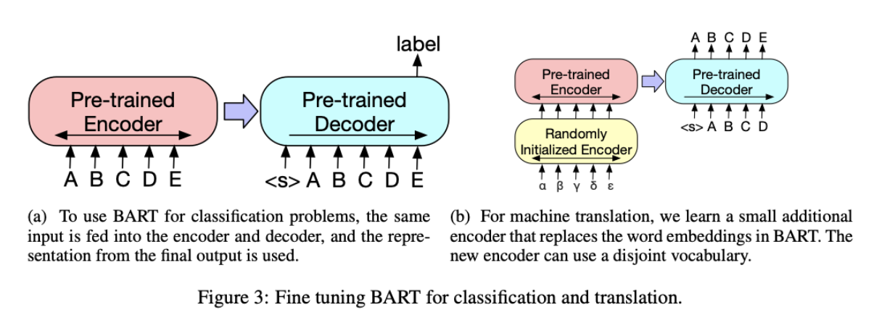

​	


### IV Large-scale Pre-training Experiments


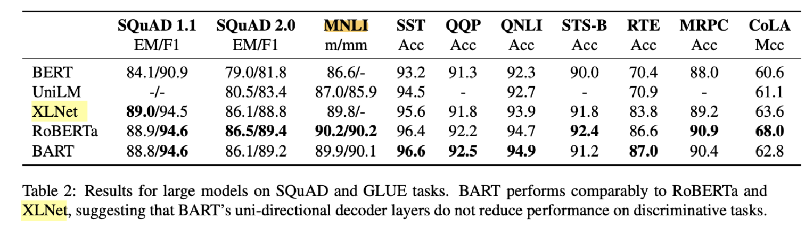


### V Conclusion and Future Work


### VI Reference 


https://wmathor.com/index.php/archives/1505/

https://www.programmersought.com/article/10034704699/


### bert 

### transformaer 

### Accuracy, Precision, Recall & F1 Score: Interpretation of Performance Measures

how to evaluate the performance of a model via Accuracy, Precision, Recall & F1 Score metrics for classification model and provides a brief explanation of the “Confusion Metrics”. 

In this experiment, Author have used ==== Algorithm and their goal is to predict the survival of the passengers on the Titanic.

Once they have built their model, the most important question that arises is how good is the model? So, evaluating the model is the most important task in the data science project which delineates how good your predictions are. 

SOTA State-of-the-Art (SoTA) in AIq


Evaluation results for classification model


dig deep into all the parameters shown in the figure above.	


The first thing you will see here is ROC curve and we can determine whether our ROC curve is good or not by looking at AUC (Area Under the Curve) and other parameters which are also called as Confusion Metrics. A confusion matrix is a table that is often used to describe the performance of a classification model on a set of test data for which the true values are known. All the measures except AUC can be calculated by using left most four parameters. So, let’s talk about those four parameters first.

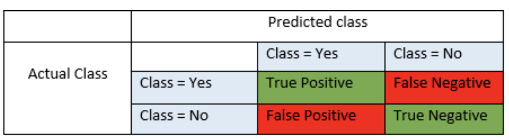

True positive and true negatives are the observations that are correctly predicted and therefore shown in green. We want to minimize false positives and false negatives so they are shown in red color. These terms are a bit confusing. So let’s take each term one by one and understand it fully.

**True Positives (TP)** - These are the correctly predicted positive values which means that the value of actual class is yes and the value of predicted class is also yes. E.g. if actual class value indicates that this passenger survived and predicted class tells you the same thing.

**True Negatives (TN)** - These are the correctly predicted negative values which means that the value of actual class is no and value of predicted class is also no. E.g. if actual class says this passenger did not survive and predicted class tells you the same thing.

False positives and false negatives, these values occur when your actual class contradicts with the predicted class.

**False Positives (FP)** – When actual class is no and predicted class is yes. E.g. if actual class says this passenger did not survive but predicted class tells you that this passenger will survive.

**False Negatives (FN)** – When actual class is yes but predicted class in no. E.g. if actual class value indicates that this passenger survived and predicted class tells you that passenger will die.

Once you understand these four parameters then we can calculate Accuracy, Precision, Recall and F1 score.

**Accuracy** - Accuracy is the most intuitive performance measure and it is simply a ratio of correctly predicted observation to the total observations. One may think that, if we have high accuracy then our model is best. Yes, accuracy is a great measure but only when you have symmetric datasets where values of false positive and false negatives are almost same. Therefore, you have to look at other parameters to evaluate the performance of your model. For our model, we have got 0.803 which means our model is approx. 80% accurate.

Accuracy = TP+TN/TP+FP+FN+TN

**Precision** - Precision is the ratio of correctly predicted positive observations to the total predicted positive observations. The question that this metric answer is of all passengers that labeled as survived, how many actually survived? High precision relates to the low false positive rate. We have got 0.788 precision which is pretty good.

Precision = TP/TP+FP

**Recall** (Sensitivity) - Recall is the ratio of correctly predicted positive observations to the all observations in actual class - yes. The question recall answers is: Of all the passengers that truly survived, how many did we label? We have got recall of 0.631 which is good for this model as it’s above 0.5.

Recall = TP/TP+FN

**F1 score** - F1 Score is the weighted average of Precision and Recall. Therefore, this score takes both false positives and false negatives into account. Intuitively it is not as easy to understand as accuracy, but F1 is usually more useful than accuracy, especially if you have an uneven class distribution. Accuracy works best if false positives and false negatives have similar cost. If the cost of false positives and false negatives are very different, it’s better to look at both Precision and Recall. In our case, F1 score is 0.701.

F1 Score = 2*(Recall * Precision) / (Recall + Precision)

So, whenever you build a model, this article should help you to figure out what these parameters mean and how good your model has performed.

I hope you found this blog useful. Please leave comments or send me an email if you think I missed any important details or if you have any other questions or feedback about this topic.

**Please Note that the above results and analysis of numbers is based on the Titanic model. Your numbers and results may vary upon which model you work on and your specific business use case.


 BERT (Bidirectional Encoder Representations from Transformers) is a Natural Language Processing Model proposed by researchers at Google Research in 2018. When it was proposed it achieve state-of-the-art accuracy on many NLP and NLU tasks such as:

- General Language Understanding Evaluation
- Stanford Q/A dataset SQuAD v1.1 and v2.0
- Situation With **Adversarial** Generations


###### Denoising?

Methods used in the Paper

https://paperswithcode.com/paper/bart-denoising-sequence-to-sequence-pre 


The Pre-training Language Model is mainly divided into three aspects:
\begin{itemize}
\item[*] Autoregressive Pre-training Language Models represented by unidirectional features, collectively referred to as unidirectional models(RNNs): ELMO/ULMFiT/SiATL/GPT1.0/GPT2.0;
\item[*] The Auto-encoding Pre-training Language model of bidirectional feature representation is collectively referred to as the BERT series model: (\textbf{BERT} / MASS /UNILM /ERNIE1.0 /ERNIE(THU) /MTDNN /ERNIE2.0 /SpanBERT /\textbf{RoBERTa} )
\item[*] Autoregressive Pre-training Language Model with bidirectional feature representation: \textbf{XLNet}
\end{itemize}


\begin{figure}[H]
\centering%居中
	%	\includegraphics[width=0.8\linewidth]{roc}
\includegraphics[width=0.3\linewidth]{bitree}
\includegraphics[width=0.3\linewidth]{bitreemodel}
\includegraphics[width=0.3\linewidth]{bitrees}
\caption{Recursive Binary Partitions, the first panel shows a partition of a two-dimensional predictor space based on recursive binary splitting. The second panel shows the tree corresponding to the partition in the first one. The third panel shows the decision trees structure. Every node of the tree corresponding to split decision and leaves contain a subset of data that satisfy certain conditions, such as region R1 $= I(x_1\leq t_1)I(x_2\leq t_2)$ where I($\cdot$) is the identity function. $x_i$ stands for the ith predictor the and $t_i$ stands for the corresponding cutoff value\cite{friedman2001elements}}.
%%\caption{}%这个标题已经取消
\label{treerr}
\end{figure}
%\subsubsection{Regression Tree}
%For regression tree, the response is continuous variable. And predicted response for an observation is given by the mean response of the training observations which belong to the same terminal node. To simplify the algorithm, we focus on recursive binary partitions and use recursive binary splitting to grow a large tree based on the training data by stopping when each terminal node has fewer than some minimum number of observations.\\ 
%Now we discuss the process of building the regression tree. There are two step of growing a tree shown as follows:\\
%1, We divide the predictor space \{$X_1, X_2, ..., X_p$\} into J's distinct and nonoverlapping regions \{$R_1,R_2,...,R_J$\}.\\
%2, For each observation which falls into the region $R_j$ , we make the same prediction which is simply the mean of the response for the training observations in region $R_j$.\\
%The next problem is how to construct the regions $R_1,R_2,...,R_J$. Our goal is to find boxes $R_1,R_2,...,R_J$ which can minimize the RSS. 
%\begin{center}
%	RSS = $\sum_{j=1}^J\sum_{i \in R_j} (y_i - \hat {y}_{R_j})^2 +$
%\end{center}
%In other word, For each step, when we perform recursive binary splitting, first we need to select the predictor $X_j$ and the cutpoint s in order to split the predictor space into the two regions $R_1(j,s) = $\{X $\| X_j < s $ \} and  $R_2(j,s ) = $\{X $\| X_j \geq s $\}. We consider all the predictors $X_1$, . . . , $X_p$, and all possible values of the cutpoint s for each predictor, and then choose the predictor and cutpoint to ensure the resulting tree has the lowest RSS, which means we need to find the value of j and s to minimize the equation as follows:
%\begin{center}
%	$\sum_{i:x_i \in R_1(j,s)} (y_i - \hat {y}_{R_1})^2 + \sum_{i:x_i \in R_2(j,s)} (y_i - \hat {y}_{R_2})^2$
%\end{center}
%where $\hat {y}_{R_1}$ is the mean response of training observations in region R1 \\
 % \ \ \ \ \ \ \ \ \ \ \ $\hat {y}_{R_2}$ is the mean response of training observations in  region R2\\
\subsubsection{Classification Tree} 
%The classification tree is very similar to a regression tree, except that it is used to predict a qualitative response rather than a quantitative one. Now we turn the question to how to grow a Classification tree. 
For a classification tree, we predict each observation belongs to the most commonly occurring class of training observations in the particular region of the predictor space. This paper focuses on recursive binary trees. Recursion is appropriate and useful when we have a structure that has a similar repeated structural form. A binary tree is a tree data structure where each node has at most two children, which are referred to as the left child and the right child. The binary tree consists of multiple subtrees which have a similar structure to a binary tree (Figure~\ref{rbs}).\\
\begin{figure}[H]
\centering%居中
	%	\includegraphics{roc}
	\includegraphics[width=0.4\linewidth]{brtree}\\
\caption{Recursive Binary Classification Tree}
%%\caption{}%这个标题已经取消
\label{rbs}
\end{figure}
A binary tree splits each node into two branches to grow a single classification tree. Instead of using a residual sum of squares (RSS) in regression trees, classification trees use misclassification error rate as a criterion to do binary splits. Since we plan to predict an observation in a given region to the most commonly occurring class of training observations in that region, the classification error rate (E) is a straightforward fraction of the training observations in that region which do not belong to the most common class. Suppose that we have a partition into M regions $R_1, R_2, ... , R_M$. We define $T_0$ is an original tree and T $\subset T_0$ is subtree which is any tree that can be obtained by pruning $T_0$, which means collapsing any number of its internal, not terminal nodes. If there is no pruning, $T_0 = T$. We index terminal nodes by m, and node m corresponding to region $R_m$ with $N_m$ observations, where $N_m$ is number of observations in region $R_m$ i.e., in node m. $y_i$ stands for the classification variables. . Let $\hat{p}_{mk} = \dfrac{1}{N_m}  \sum_{x_i\in R_m}  I (y_i = k)$, $\hat{p}_{mk} $ is the proportion of class k observations in node m. We classify the observations in node m to class k(m) = $arg \ max_k \ \hat{p}_{mk}$, the majority class in the node m. \\
The measure of $E_m(T)$ of node impurity is defined by\\%get k(m) 取值范围
\begin{equation}
	E_m(T) = 1 - max_k \ { \hat{p}_{mk}} 
\end{equation}
The Gini index $G_m(T)$ is defined by 
\begin{equation}
	G_m(T) = \sum_{k=1}^{K}  \hat{p}_{mk} (1-\hat{p}_{mk}) = 1 - \sum_{k}{\hat{p}_{mk}}^2
\end{equation}% 为什么如此定义这个函数方程，RSS 变形？
Another method to measure impurity degree is using cross-entropy or deviance $D_m(T)$ which is given by
\begin{equation}
	D = - \sum_{k=1}^{K}  \hat{p}_{mk} \  log \ \hat{p}_{mk}
\end{equation}
Both Gini index and cross-entropy are considered a measure of node purity. A small value of the Gini index indicates that a node contains the marjory of observations from a single class. The Gini index is also a measure of inequality of distribution and it ranges from zero to one, where Gini index reaches a maximum value if all classes in the node have equal probability. For cross-entropy node purity measure, we know that $0\leq \hat{p}_{mk} \leq 1  $, then $ 0 \leq -\hat{p}_{mk} log \hat{p}_{mk}$ , which means when the value of cross-entropy is close to zero, the values of $\hat{p}_{mk}$’s are all near zero or near one. Therefore, similar to the Gini index, the cross-entropy will have the small value if node m is pure. The Gini index and the cross-entropy are quite similar numerically.

Classification error is not sufficiently sensitive for tree-growing. Hence, we primarily consider another two measures to growing the tree: Gini index and cross-entropy. They are better measures of the purity of a region. For example, we have two-class classification problem. We use (400,400) representing there are 400 points in class one and 400 points in class 2. Suppose using classification error, we split the node to two child nodes (300,100) and (100, 300) with classification error equal to 0.25, while another created nodes are (200, 400) and (200,0) with same classification error (0.25). Obviously, we prefer the second split because it seems purer in the child node. For the second splitting, Gini index and cross-entropy have a lower value than misclassification error. (See the figure~\ref{ginicompare})\cite{friedman2001elements}. % 此处需添加, 原因 （Why）
\begin{figure}[H]
\centering%居中
	%	\includegraphics{roc}
	\includegraphics[width=0.6\linewidth]{ginie}
\caption{Node impurity measures for two-class classification, where p stands for the proportion of class 2 observations in node m and y-axis stands for the value of node impurity. When value of node impurity goes to zero, it means the node m becomes more and purer, and node impurity equal to zero represents the node m just contain class 2 point\cite{friedman2001elements}.}
%%\caption{}%这个标题已经取消
\label{ginicompare}
\end{figure}
Any of these three approaches might be used to build the tree. However, based on cost complexity, researchers usually use classification error rate to calculate prediction accuracy. Therefore, they use the Gini index or cross-entropy for growing the tree and using the misclassification rate to prune the tree. Because when we grow the tree, we want to make each node more pure. But when we prune the tree, we care about this tree prediction accuracy. In the R package, "RandomForest" Gini index is used as default parameter. %get
% \subsubsection{tree size}
% \subsubsection{cross-validation}
\subsection{Bagging and Bootstrap Sample	}
The decision trees discussed in the previous section can suffer from the high variance. That means if we split the training data into two parts at random, and then fit a decision tree to both parts, the results could be quite different. In contrast, a method with lower variance will lead to similar results over totally different datasets. Bagging is an ensemble method for improving unstable estimation or classification schemes. Breiman motivated bagging as a variance reduction method for a given base procedure, such as decision trees or methods that make a variable selection and fitting in a linear model\cite{breiman1996bagging}. The basic idea of bagging is averaging a set of observations which will reduce variance. Bagging is the method to generate B training datasets. Each set of training data picks a sample of observations with replacement (bootstrap sample) from the original dataset. By sampling with replacement, some observations may be repeated over training data. The decision tree $T_B$ is fit using the Bth bootstrap samples, and then we combine the results by averaging the outputs for regression trees and taking majority voting for classification trees. 

To easily understand the procedure of bagging, we introduce bagging based on regression trees first. Suppose we fit the model on a sample with a set of n independent observations, i.e., Z $= \{ (x_1,y_1), \ (x_2,y_2), ..., (x_N,y_N)\}$, and define prediction function by $\hat{f}(x)$ with input data x. Bagging averages these predictions over bootstrap samples to reduce the variance. Since each tree generated in bagging is identically distributed (i.d.), each sample has variance equal to $\sigma^2$.  Thus, Suppose we generate B different bootstrapped training datasets, the variance of average is equal to $\sigma^2/B$. For each bootstrap sample $Z^{*b},\ b=1,2,...,B$, we train our model on the bth bootstrapped training dataset to get prediction $\hat{f}^{*b}(x) $ and average all the predictions to get:
\begin{equation}
	\hat{f}_{bag}(x) = \frac{1}{B} \sum^B_{b=1} \hat{f}^{*b}(x) 
\end{equation} 
% $\hat{f}_{avg}(x) = \frac{1}{B} \sum_{b=1}^B \hat{f}^b(x) $  where $\hat{f}_{avg}^1(x), \hat{f}_{avg}^2(x), ..., \hat{f}_{avg}^B(x)$ are calculated from the B different training datasets. 
Each bootstraped tree will usually contain different predictors than the original and might have a different result. The bagged estimate is the average prediction from these B trees\cite{friedman2001elements}.

 Similar to regression trees, we consider the categorical response setting. Suppose a classification tree produces a classifier $\hat{G}(x)$ for a K-class response. That means applying input data x on classifier, we will get a response ranging form 1 to K.  We define a indicator-vector function $\hat{f}(x)$ with value a single one and $K - 1$ zeroes. The kth element being 1 means we classify this observation to class k and $\hat{G}(x) = arg \ max_k \hat{f}(x)$. The bagged estimate $\hat{f}_{bag}(x)$ is defined by the a K-vector [$p_1(x), p_2(x), ..., p_K(x)$], where $p_k(x)$ is the proportion of trees predicting class k, i.e., $p_k(x) = \dfrac{\#\  of \ trees' \ response \ is \ class \ k \ in\  bootstrap\  samples\ B}{B}$, where $\sum_{k=1}^{K} (p_k(x))= 1$. The bagged classifier selects the class with the most “votes” from bootstrap samples B, $\hat{G}_{bag}(x) = arg \ max_k \hat{f}_{bag}(x)$\cite{friedman2001elements}.

\subsection{Random Forest}
\subsubsection{Introduction}
Random Forests (RF) are a modification of bagging which utilizes a bunch of decorrelated trees and then averages them to get a prediction\cite{breiman2001random}. For each tree grown on a bootstrap sample, the error rate for observations left out of the bootstrap sample is monitored. This is called the “out-of-bag” error rate. In this section, we want to study how random forests improve on bagging by reducing the correlation between the sampled trees. For bagging, we build decision trees on bootstrapped training samples. However, for a random forest, when we build these decision trees, we don't use all the predictors. We randomly select m variables from the full set of p predictors in original data and use them as split candidates to grow a tree, where m is less than p. 

\subsubsection{RF Algorithm}
The underlying goal in random forest algorithm is to improve the variance reduction of bagging by reducing the correlation between the trees, without increasing the variance too much. Therefore, our RF algorithm is as follows:
%and the basic idea for bagging is to average many noise but approximately unbiased models. 
%\begin{itemize}
\begin{algorithm}[H]
\caption{Random Forest for Classification}
  \label{alg1}
 \begin{enumerate}
\item For b=1 to B, where B is the number of bootstrapped training samples.
\indent\indent\indent 
\begin{itemize}
 	\item[a] Draw a bootstrap sample of size N from the training data, where N is the sample size of the training data.
	\item[b] Grow a random-forest tree, $T_b$, to the bootstrapped data, by recursively repeating the following steps for each terminal node of the tree, until the minimum node size $n_{min}$ is reached
	% or oob error stabilizes.
	\begin{itemize}
	\item[i] Select m variables at random from the p variables, default value for m is $\sqrt{p}$.
	\item[ii] Pick the best variable/split-point among the m.
	\item[iii] Split the node into two daughter nodes.
	\end{itemize}
\end{itemize}
\item Output the ensemble of trees $\{ T_b\}_1^B$ 
\end{enumerate}
To make a prediction at a new point x:\\
%Regression: $\hat{f}^B_{rf}(x) = \frac{1}{B} \sum_{b=1}^B T_b(X) $ 
Classification: Let $\hat{G}_b(x)$ be the class prediction of the bth random-forest tree. Then $\hat{G}^B_{rf}(x)$ = majority vote $ \{ \hat{G}_b(x) \}^B_1 $\\

\end{algorithm}
\vspace{-1cm}
\small Description and text based on the book "The Elements of Statistical Learning" \cite{friedman2001elements}


Because the bootstrap samples may involve overlap trees. We need to consider the correlation $\rho$ between pairwise of trees, where $\rho = \frac{Cov (T_i, T_j)}{\sqrt{Var(T_i)Var(T_j)}}, i,j \in 1...B$. Thus, the variance of average B random-forest trees is as follows:

\begin{alignat}{3}
Var (\frac{1}{B}\sum_{i=1}^B(T_i)) & = \frac{1}{B^2} \sum_{i=1}^B\sum_{j=1}^BCov(T_i,T_j) \notag\\
	 &=  \frac{1}{B^2} \sum_{i=1}^B(\sum_{j\neq i}^BCov(T_i,T_j) + Var (T_i)) \notag\\
	 &= \frac{1}{B^2} \sum_{i=1}^B ((B-1)\sigma^2*\rho + \sigma^2)\notag\\
	 &= \frac{B(B-1)\rho\sigma^2+B\sigma^2}{B^2}\notag\\
	 &= \rho\sigma^2 + \frac{1-\rho}{B}\sigma^2, \ where \ \sigma^2 = var(T_i)
\end{alignat}

When B increases to infinite, the second item, $\frac{1-\rho}{B}\sigma^2$, decrease to zero remaining first term. If B is large enough, the variance of average will depend on the first term. When $\rho$ decreases, the first term decreases, i.e., the number of variables fitted each random-forest tree (m $<$ p) is decreasing. Because $\sigma^2$ is fixed and now $\rho$ depends on $Cov(T_i,T_j)$. Intuitively, reducing m will reduce $Cov(T_i,T_j)$ and further to reduce the correlation between any pair of trees in the ensemble, and hence reduce the variance of the average. That means the size of the correlation of pairs of bagged trees limits the benefits of averaging. We prefer to reduce the variance of average by reducing the correlation between the trees, without increasing the variance too much.

\subsubsection{Out-of-Bag Error Estimation}
Out-of-bag (OOB) error is a method of measuring the prediction error of random forests, boosted decision trees, and other machine learning models which utilize bootstrap aggregating to sub-sample training data. OOB is the mean prediction error on each training observation $X$, using only the trees that did not have $X$ in their bootstrap sample. Hence, OOB is an easy way to estimate the test error of a random forest model. Without performing cross-validation, each tree is constructed using a different bootstrap sample from the original data. About one-third of the observations are left out of the bootstrap sample and not used in the construction of the kth tree\cite{friedman2001elements}. Because the random forest is repeatedly fit to bootstrapped sample subsets of the observations, based on bagging algorithm. Each bagged tree makes use of around two-thirds of the observations. And the remaining one-third of the observations are not used to fit the given bagged tree which is considered as the out-of-bag (OOB) observations. The out-of-bag (OOB) error is the average error for each observation which is not in the bag and calculated using predictions from the trees that do not contain the previous data in their respective bootstrap sample. OOB is also the stop criteria for a random forest. Once the OOB error stabilizes, the training can be terminated.

\subsubsection{Variable Importance(VI) and Proximity}
%it is critical to understand the interaction of variables that is providing the predictive accuracy. A start on this problem is made by using internal out-of-bag estimates, and verification by reruns using only selected variables.
%Suppose there are M input variables. After each tree is constructed, the values of the mth variable in the out-of-bag examples are randomly permuted and the out-of-bag data is run down the corresponding tree. The classification given for each xn that is out of bag is saved. This is repeated for m=1,2, ... , M. At the end of the run, the plurality of out-of-bag class votes for xn with the mth variable noised up is compared with the true class label of xn to give a misclassification rate.
%Variable importance table provides list of all the variables used and not used in the tree building process. A score is attached to each variable, and is based on the improvement each variable makes a sasurrogate to the primary splitting variable. Variable importance measure gives due recognition to the variables whose significance is masked or hidden by other variables in the tree building process.
%Boosting ignores some variables completely, while the random forest does not. The candidate split-variable selection increases the chance that any single variable gets included in a random forest, while no such selection occurs with boosting.
%The most advanced variable importance measure available in random forests is the "permutation accuracy importance" measure. Its rationale is the following: By randomly permuting the predictor variable Xj, its original association with the response Y is broken. When the permuted variable Xj, together with the remaining unpermuted predictor variables, is used to predict the response, the prediction accuracy (i.e. the number of observations classified correctly) decreases substantially, if the original variable Xj was associated with the response. Thus, a reasonable measure for variable importance is the difference in prediction accuracy before and after permuting Xj.
Variable importance measures for random forests are more and more popular. Since it is beneficial to make the variable selection in lots of classification problems in bioinformatics and its related scientific fields. For instance, we can use the variable importance to select a subset of genetic markers relevant for the prediction of a specific disease\cite{strobl2007bias}. 

The importance variable score measures a variable's ability to perform in a specific tree of a specific size as a splitter. In other words, the scores reflect the contribution each variable makes in classifying or predicting the target variable. The improvement in the split-criterion is the importance measure attributed to the splitting variable and is accumulated over all the trees in the forest separately for each variable. Random forests use the OOB samples to construct a different variable importance measure. The variable importance plot provides a list of the most significant variables in descending order by a mean decrease in the Gini index. The top variables contribute more to the model than the bottom ones and also have high predictive power in classifying. We used the R package "RandomForest" to construct a variable importance plot.

  Now, the question is how to calculate the variable importance. The variable importance VI(X) of variable X is expressed regarding a normalized quantity relative to the variable having the most largest measure of importance. It ranges from 0 to 100, with the variable having the largest measure of importance scored as 100. Generally, gini index values are used to measure variable importance based on the change of value of gini index when a split is found at a node. The change is
  \begin{equation}
  	\bigtriangleup_t = gini\_index_t - \sum_i p(t,i) \ gini\_index_i^{t}
  \end{equation}
  where t denote the node; i denote the index of a child that this node has; $gini\_index_t$ is the value of gini index if the node is treated as a leaf; $gini\_index_i^{t}$ is the value of gini index of the node after it has been split. p(t,i) denotes a proportion of the sample change between parent node and child nodes, $p (t,i ) = \frac{n_i}{n_t} $, where $n_i$ is is the number of observation in sub-node i and $n_t$  the number of observations in node t. 

  That means for variable $X_m$, the variable importance of $X_m$ is calculated by \cite{louppe2013understanding},
   \begin{equation}
  VI(X) = \frac{1}{B} \sum_B \sum_{t\in B: v(st) = X_m}\bigtriangleup_t
  =\frac{1}{B} \sum_B \sum_{t\in B: v(st) = X_m} (gini\_index_t - \sum_i p(t,i) \ gini\_index_i^{t})
    \end{equation}
    %and p(t) is the proportion $N_t/N$ of samples reaching node t 
where VI(X) is the importance of a variable $X_m$ for predicting. Notation t stands for the node t and $v(s_t)$ is the variable used in split $s_t$. $\bigtriangleup_t$ is impurity decreases for node t where $X_m$ is used, and $\sum_{t\in B: v(st) = X_m}\bigtriangleup_t$ is the impurity decreases for all nodes in a tree where $X_m$ used. Hence, if we use the Gini index as impurity function, this measure is known as the Mean Decrease Gini. Variables having large values for this score are ranked as more important because if building a current model without original values of a variable gives a worse prediction, which means the variable is important\cite{friedman2001greedy}.

There is another method to evaluate the importance of a variable $X_m$ by measuring the Mean Decrease Accuracy of the random forest when the variable $X_m$ is randomly permuted in the out-of-bag samples. That is also known as the permutation importance\cite{louppe2013understanding}.  The main idea of this variable importance is if you exclude a variable and accuracy of this tree doesn't change much, then the variable isn't very importance. Variable importance is calculated by sum of the decrease in error when split by a variable. Then the relative importance is the variable importance divided by the highest variable importance value so that values are bounded between 0 and 1. The variable importance are calculated from the training set.
Random forests also define a proximity measure between two observations as follows:
\begin{itemize}
\item[1] initialize proximities to zero.
\item[2] For any given tree, apply the tree to all observations.
\item[3] If case i and case j both end up in the same node, increasing proximity prox(ij) between i and j by one. 
\item[4] Accumulate over all trees in RF  and normalize by twice the number of trees in RF.
\end{itemize}
This creates a proximity matrix which is a square matrix with 1 on the diagonal and values between 0 and 1 in the off-diagonal positions. Observations that are alike will have proximities close to 1 and more dissimilar cases will have proximity close to 0. Generally, proximity matrix is used for missing data imputation or outlier detection.
%
\subsubsection{Tuning Parameters}
Parameters for a random forest either increase the predictive power of the model or make it easier to train the model. Following are the main parameters we will be talking about in more detail\cite{huang2016parameter}:
 \begin{enumerate}
 	\item \textbf{Number of predictor used per node (mtry)}
 The primary tuning parameter in a random forest is the number of variables to search for each node (mtry). Specifically, when growing a tree on a bootstrapped dataset, before each split, we select mtry $\leq$ p of the input variables at random as candidates for splitting. That means at each tree, mtry variables are selected at random out of the p, and the best split on these m is used to split the node. The value of mtry is held constant during the forest growing.  This parameter controls the bias-variance trade-off. So, it has the greatest impact on the OOB error. %and the smaller mtry, the higher the risk of overfitting. 
	\item \textbf{Number of Trees to Grow (ntree)}
Another critical parameter is the number of trees in RF. This parameter will be dependent on the data and pertains to convergence speed. In consideration of computational cost, we prefer to grow few trees where OOB Error converges rapidly rather than a huge forest. In other words, we choose the optimal number of the tree by the number of grown trees with OOB error stabilized. We know that more trees will reduce overfitting but takes longer to run. We will try to grow the large trees first, like 2000 and gradually narrow down.
 \end{enumerate}

The optimal values for these parameters will depend on the specific data, and they are considered as tuning parameters. However, in this study, we will stick to tuning these two parameters, namely the mtry and the ntree parameters. Because they have the primary effect on our random forest model. There are many other parameters, like node size, but these two parameters are perhaps the most likely to have the most significant effect on the prediction accuracy.

The main idea of choosing tuning parameters was the minimization of the OOB error which is the indication of model quality for the random forest. Variable Importance Scores is the useful measurement to interpret RF results. Based on the final model parameter we chose,  we consider several top variables as the most important variables.

Now, the first question is how many trees should grow? In principle, the more, the merrier. However, the information gain after a certain number is not worth the additional computational cost\cite{rfntree}. The computational complexity of a random forest depends on its parameter ntree, mtry and others. For the RF procedure, we start with the default parameters that ntree = 2000, mtry = $\sqrt{p}$ and minimum node size is one\cite{friedman2001elements}.

\subsection{Confusion Matrix}
A confusion matrix is a table that is used to describe the performance of a classification model or classifier based on test data for which the true values are known. The confusion matrix is a two-by-two table listing values for the number of True Negatives (TN), False Negatives (FN), True Positives (TP), and False Positives (FP) resulting from a classification rule. As shown below, all of the standard evaluation measures are algebraic combinations of the four values in the Confusion Matrix\cite{grossman7grossman}. 
\begin{figure}[H]
\centering%居中
	%	\includegraphics[width=0.8\linewidth]{roc}
	\includegraphics[width=0.4\linewidth]{confusionmx}
\caption{Confusion matrix, where P is the label of class 1 and N is the label of a second class or the label of all classes that are not class 1 in a multi-class setting.}
%%\caption{}%这个标题已经取消
\label{tree}
\end{figure}
Formulas for metrics computed from the confusion matrix is as follows:\\
Accuracy = (TP + TN) / (TP + TN + FP + FN)\\
Error = 1 - Accuracy = (FP + FN) / (TP + TN + FP + FN)\\
False Positive Rate = FP / (FP+TN)\\
False Negative Rate = 1 - True Positive Rate = FN / (FN+TP)\\
Sensitivity(True Positive Rate) = TP / (TP+FN)\\
Specificity(True Negative Rate) = TN / (TN + FP)
%The grid search was performed on 70\% of the total sample. I used the remaining 30\% as a test sample to compute the confusion matrix and make summary. \cite{davis2006relationship}. 

\subsection{Hardy-Weinberg Equilibrium and Linkage Disequilibrium}
Testing genetic markers for Hardy-Weinberg equilibrium (HWE) is an important tool for detecting genotyping errors in large-scale genotyping studies. If an SNP does not satisfy Hardy-Weinberg Equilibrium (HWE), it can be an indicator of problematic data, such as an SNP that cannot be accurately genotyped. Therefore, we use plink\cite{plink} to generate a list of genotype counts and Hardy-Weinberg test statistics for each SNP. The hypothesis of HWE is as follows:

$H_o$ : HWE holds in the population, i.e., P(AA)=$p^2$, P(Aa)=$2p(1-p)$, P(aa) = $(1-p)^2$, where $p$=P(A) and A,a stands for genotype.

	$H_1$ : HWE does not holds in the population, i.e., some equality does not hold.\\
	Because of the multiple comparison issues, the test of HWE is performed with $\alpha =\frac{0.05}{N}$ based on Bonferroni correction, where N is the number of SNPs considered. If the p-value is less than $\alpha$, we have to reject the null hypothesis which means we conclude that HWE does not hold. These SNPs are dropped from subsequent analysis\cite{stram2014design}.
  %SNPs with P-values at most 0.05 divided by the total number of SNPs. This corrected P-value threshold is also known as the Bonferroni correction (21) for multiple hypothesis and is a common cutoff in genome-wide association studies (22,23). SNPs with P-values within the Bonferroni correction (0.05 divided by total number of SNPs m) 
  %\subsubsection{Analysis Strategy}
%\subsubsection{Package used}

Linkage disequilibrium (LD), the nonrandom associations of alleles. There are multiple reasons that LD varying between populations, such as random drift in allele frequencies in isolated populations, population migration, admixture, and population expansion\cite{stram2014design}. Assuming independent assortment between the two alleles, LD coefficient measures deviations from the relationship between these two SNPs, shown in table~\ref{ld}: $D=p_{AB}-p_{A}p_{B}$
\clearpage
\begin{table}[ht]
\centering
\caption{Population allele frequencies between two loci under linkage equilibrium}
\begin{tabular}{rrrrr}
  \hline
  &   & B Locus\\
 A Locus &  B  & b & Total \\ 
  \hline
A &   pAB=pApB &   pAb=pApb & pA \\ 
a & paB=papB &   pab=papb &   pa \\ 
Column Total &pB&pb\\
   \hline
\end{tabular}
    \label{ld}
\end{table}
To account for different ranges of �� for different allele frequencies, this is usually standardized as $��′$.
\begin{equation}
D'=
\begin{cases}
\frac{D}{D_{max}} & for \ D>0 \\0 &  for \ D=0 \\ \frac{D}{D_{min}} & \ for D<0
 \end{cases}
\end{equation}

where $D_{min} = -min (p_Ap_B, p_ap_b)$ and $D_{max} = min (p_Ap_b, p_ap_b)$

This leads to $D' \in [0,1]$. While ��′ provides a measures of association, it does not correspond well to the ability to predict one SNPs genotype from another SNPs genotype. For this purpose, the correlation coefficient is more useful. Using allele counts at the two SNPs at the two variables:
\begin{equation}
R^2 = (\frac{p_{AB}-p_{A}p_{B}}{\sqrt{p_Ap_Bp_ap_b}})^2= (\frac{D}{\sqrt{p_Ap_Bp_ap_b}})^2= \frac{D^2}{p_Ap_Bp_ap_b}
\end{equation}
$R^2$ will be 0 if there is linkage equilibrium and when $R^2$ close to 1 means there is linkage disequilibrium between two SNPs\cite{laird2010fundamentals}. 
%and will only be 1 if a pair of diagonal cells equals 0. What does this mean?
\subsection{Overfitting}
%The randomForest package is trained using bootstrap aggregation, where each tree is fit from a bootstrap sample of the training observation $z_i = (x_i, y_i)$. The out-of-bag (OOB) error is the average error for each $z_i$ calculated using predictions from the trees that do not contain $z_i$ in their respective bootstrap sample[1].\\
It is true that more trees will result in better accuracy. However, more trees also mean more computational cost and after a certain number of trees, the improvement is negligible\cite{oshiro2012many}. Regarding the tree depth, standard random forest algorithm grows the potential decision trees without pruning. A decision tree needs pruning to overcome overfitting. However, in a random forest, this issue is eliminated by random selecting the variables through using a set of OOB.
%Overfitting
%Learning the shortest tree consistent with the data is one way to help avoid overfitting, but it may not be sufficient when the outcome labels are noisy (have errors). The lower we are in the tree, the less data we’re using to make the decision (since we have filtered out all the examples that do not match the tests in the splits above) and the more likely we are to be trying to model noise. One simple and practical way to control data sparsity is to limit the maximum depth or maximum number of leaves. Another, more refined method, is decide for each split whether it is justified by the data. There are several methods for doing this, often called pruning methods, with chi-squared independence test being the most popular. Nilsson’s chapter talks about several pruning methods, but we will not discuss these in detail.
%https://alliance.seas.upenn.edu/~cis520/wiki/index.php?n=Lectures.DecisionTrees
%Why 
\section{Results} 
\subsection{Vitiligo Data and Dataset Clean}
The random forest method is applied to a vitiligo dataset\cite{jin2016genome}. Through replication study and quality control, there are 290 SNPs remaining. Hence, the dataset consists of genotypes for 4008 individuals for 290 SNPs with 2181 controls and 1827 cases. All cases were the population with vitiligo disease. All controls were the population without vitiligo disease. The purpose of this paper is to construct a predictor of disease status based on the 290 SNPs. We first conduct HWE test on the 290 SNPs. The significance value, $\alpha$, is equal to 0.000172 if we use a Bonferroni adjustment for multiple comparisons. There are 4 SNPs with a p-value less than this significant level. Therefore, we will use 286 SNPs in the random forest analysis described in this paper. We randomly split the set of individuals into a training set and a test set in the ratio of $70\% \ to \ 30\%$. 

Here we apply random forests to the pre-filter vitiligo data, using the randomForest package in R. We are interested in measuring the number of causal variants and associated regions identified by top SNPs in a given ranking.
% separate this dataset from training data and test data as proportion of 6:4.
% \subsubsection{LD-Based SNPs Pruning}
%\subsection{Build the Model}
%\subsubsection{Default Random Forest}
%For the classification, the default value for mtry is $\sqrt{p}$ and minimum node size is one. At the beginning, there are 2000 decision trees built using the Random Forest algorithm. We plot the error rate across decision trees. The plot seems to indicate that after 800 decision trees, there is not a significant reduction in error rate.\\
%For case study, the best values for these parameters will depend on the specific problem, and they should be treated as tuning parameters.
%The optimal values of most of these tuning parameters are dataset dependent. By understanding how these tuning parameters contribute to bias and variance, it is possible to a priori speculate as to the optimal value, however they ultimately need to be empirically determined. The OOB-ER provides an unbiased estimate of the generalized error. Minimizing this error allows one to select the optimal tuning parameters to generate the best predictive model. However, when one begins augmenting the dataset (e.g. removing unimportant variables) the OOB-ER is no longer an unbiased estimate of the generalized error, though its minimization can still be used for tuning parameter selection [Svetnik et al. 2004].
\subsection{Tuning Parameters} 
% v.s. Default RF 
% What should be the optimal parameters for Random Forest classifier?
% Parameter Tuning: Mainly, there are three parameters in the random forest algorithm which you should look at (for tuning):
%ntree - As the name suggests, the number of trees to grow. Larger the tree, it will be more computationally expensive to build models.
%mtry - It refers to how many variables we should select at a node split. Also as mentioned above, the default value is p/3 for regression and sqrt(p) for classification. We should always try to avoid using smaller values of mtry to avoid overfitting.
%nodesize - It refers to how many observations we want in the terminal nodes. This parameter is directly related to tree depth. Higher the number, lower the tree depth. With lower tree depth, the tree might even fail to recognize useful signals from the data.
%\textbf{Number of predictor using per node (mtry)}\\%per node 什么意思
	%The primary tuning parameter in Random Forest is the number of variables to search for each node (mtry). We can also interpret mtry as the maximum number of predictors that Random Forest allowed running in each tree. This parameter controls the bias-variance trade-off. So, it has the greatest impact on the OOB error and the smaller mtry, the higher the risk of overfitting. \\ 
%why impact OOB
% This parameter controls the bias-variance trade-off. Searching over fewer variables per node will produce less correlated trees, reducing the overall variance of the prediction. However, this will also decrease the accuracy of each individual tree, increasing the bias. The mtry can also be viewed as controlling the complexity of the model, with a smaller value leading to a more complex, less sparse solution (see below). Breiman originally suggested choosing the int(log 2 p + 1) of the number of predictors per node. In the R implementation, the default value is the square root of the number of predictors.
%\textbf{Number of Trees to Grow (ntree)}\\
%Another critical parameter is about how many trees we need to grow in RF. This parameter will be dependent on data factor, which means this is the stronger predictors according to convergence speed. While, in consideration of computational cost, we prefer to grow few trees with OOB Error converge rapidly rather than a huge forest. In other words, we choose the optimal number of the tree by the number of grown trees with OOB error stabilized. We know that more trees will reduce overfitting but takes longer to run. We will try to grow the large trees first, like 2000 and gradually narrow down.\\
%While, more trees will also lead to model improvement and stability in Variable Importance.The main trade-off with growing a larger number of trees is the computation cost required. In the current study, trees were grown until the OOB-ER stabilized. Additional trees were then grown to ensure stability.
%\textbf{Grid Search by OOB error}\\
Figure~\ref{oob} provides information on the convergence speed of error across different values of mtry and ntree. The values of mtry above $2\sqrt{p}$ clearly have OOB error decreasing more rapidly than lower values of mtry. Also, for mtry= 1 and mtry = $\sqrt{p}$, the OOB error is not stable at the tail. The value of mtry equal to 25 seems to minimize OOB error, although convergence is slower compared to a larger value of mtry. We consider convergences occur around 1500 trees for most the mtrys. Based on Figure~\ref{oob}, the optimal parameter is around mtry=25 and ntree=1500. We will manually search pairs of parameter around (mtry=25, ntree=1500) to see which combination will have a minimum error. We try different tuning parameter combinations until one finds the most precision result. 
\begin{figure}[H]
\centering%居中
\includegraphics[width=0.8\linewidth]{conv}
\caption{Convergence of OOB Across Different mtry values, the curves represents the out-of-bag error for combinations of mtry and ntree.}
% % when mtry = 1 and mtry =17, curves are not converge stable at the tail. After mtry above 20, the curves of oob are table at the tail and with the mtry increasing, the speed of convergence quickly but not improve too much.  }
%%\caption{}%这个标题已经取消
\label{oob}
\end{figure}
%latex中实现Appendix与正文figures图片编号不连续
%renewcommand{thefigure}{Aarabic{figure}}
%setcounter{figure}{0}
%begin{appendix}
%We know that the random forest algorithm implementation in the randomForest package provides the tuneRF() function that searches for optimal mtry values given known data. So, we use tuneRF() to further mine effective information.
%From the figure below, we can see the when mtry= 45, the oob error reaches the minimum value for arbitrarily ntree and when ntree= 500, we get minimum oob for all the options. That's hard to make a decision. Hence, in the next step, we need to test these parameter combinations by model accuracy further to find which is the best.\\
%\begin{center}
% \includegraphics[width=0.8\linewidth]{ntree}
%\end{center}
We plan to use accuracy to determine the optimal combination of tuning parameters by a grid search. Based on the previous result, we decided to use mtry = 20, 25, 30, 35 and forests of size 500, 1000 and 1500 trees to build the model. It is clear that the OOB error stabilized when the number of trees is around 1500. A grid search involves running a model many times with combinations of various hyper-parameters. The main idea of a grid search is to identify which tuning parameters are likely to work best. From table~\ref{gridsch}, we can see the most accurate combination of a parameter was mtry equal to 25 with 1500 ntree, and its OOB error was 0.3515. We then refit the RF with the training set, using the tuning parameter values at the optimal point from the grid search.
% latex table generated in R 3.2.3 by xtable 1.8-2 package
% Wed Nov  1 03:49:32 2017
\begin{table}[ht]
\centering
\caption{Grid Search to choose optimal tuning parameter}
\begin{tabular}{rrrrr}
  \hline
   &  &  & accuracy\\
 & mtry & ntree.500 & ntree.1000 & ntree.1500 \\ 
  \hline
1 & 20 & 0.6428 & 0.6374 & 0.6439 \\ 
  2 & 25 & 0.6314 & 0.6403 & \textbf{0.6545} \\ 
  3 & 30 & 0.6371 & 0.6449 & 0.6499 \\ 
  4 & 35 & 0.6449 & 0.6414 & 0.6488 \\ 
   \hline
\end{tabular}
   \label{gridsch}
\end{table}

% Performance
\subsection{RF Classifier Performance} 
%Evaluate the properties of the fitted classifier on the test set.
% \subsubsection{Sensitivity to mtry and ntree }
% \subsubsection{Variables selection strategies}
% \subsubsection{Selection power}
\subsubsection{Variable Importance}
There are two types of importance measures shown in Figure~\ref{VI}. The left plot shows the sum of accuracy decreasing  based on all the trees excluding a certain variable. Therefore, a high decrease in accuracy would be expected for very predictive variables. The decreasing in the Gini index is on the right. A high Gini index means the variable is important for classification. MeanDecreaeAccuracy table represents how much removing each variable reduces the accuracy of the model. We use the best parameters from the grid search and plot the variable importance in Figure~\ref{top25}. Comparing two plots in figure~\ref{VI}, we can see the top 5 SNPs in the MeanDecreaseGini are also in the top list of MeanDecreaseAccuracy.
\begin{figure}[H]
\centering%居中
	\includegraphics[width=0.5\linewidth]{VII}
\caption{The left panel gives the mean decrease in accuracy plot which represents the how much removing each variable reduces the accuracy of the model. The right panel is the Mean Decrease Gini index which is the measure of variable importance based on the Gini impurity index for the calculation of splits in trees.}
%%\caption{}%这个标题已经取消
\label{VI}
\end{figure}
The higher decreasing accuracy or decrease in Gini index, the more important the variable is in the model. In the plot shown above, SNP rs1126809 is the most important variable based on MeanDecreaseGini. As mentioned before, our random forest classifier uses 286 SNPs predictors. Therefore, it is interesting to check which SNPs are important in the classifier, and how much impact important features have compared to the other SNPs. We plot the top 25 importance variables. Fgure~\ref{top25} shows that first five variables are much more important than the remaining SNPs. They are rs1126809, rs60131261, rs4713270, rs4268748, rs4785587 corresponding to gene TYR, HLA-A, HLA-A, MC1R, and MC1R, separately\cite{jin2016genome}.
%\includegraphics{top251}
\begin{figure}[H]
\centering%居中
	\includegraphics[width=0.6\linewidth]{topp25}
\caption{Variables Importance for top 25 predictors, where top five variables are much higher than others.}
%%\caption{}%这个标题已经取消
\label{top25}
\end{figure}
%\subsubsection{Confusion Matrix} % Selection accuracy 
% latex table generated in R 3.2.3 by xtable 1.8-2 package
% Sun Oct  8 02:33:38 2017
Now we will analyze the model performance by calculating confusion matrix on the test dataset (see table~\ref{cm}). There are two possible predicted classes: "case" and "control" corresponding to an individual with or without vitiligo disease. From this matrix, we can estimate some of the standard quantities that are used to evaluate the performance of a classifier, accuracy is equal to  0.665 and misclassification rate is equal to 0.3358. These two values estimate the probability of the classifier being correct or incorrect. Sensitivity is estimated to be 0.8058, which is a probability of predicting disease among cases. Specificity is estimated to be 0.4954, which there is the probability of predicting no disease among controls. The specificity and sensitivity range from 0 to 1. Here, the value of specificity is less than 0.5, and model accuracy is not very high. This may be caused by noisy variables. The value of false positive rate is equal to 0.318, and false negative rate is equal to 0.345.  Our dataset has some predictors, not all of which may be correlated with disease. 
\begin{table}[ht]
\centering
\caption{Confusion Matrix with case-control study, where phenotype =1 means control and phenotype=2 means case }
%, class 1 stand for an individual with vitiligo disease and class 2 stands for an individual without vitiligo disease. Therefore, we consider top 5 variables as the contribute element for vitiligo disease.
\begin{tabular}{rrrr}
  \hline
 &  predicted class\\
  & & control  & case \\ 
  \hline
observed class& control &   527 &   277 \\ 
   & case &   127 &   272 \\ 
   \hline
\end{tabular}
    \label{cm}
\end{table}

\subsubsection{Variable selection}
The quantification of the variable importance is a crucial issue not only for ranking the variables before a stepwise estimation model but also to interpret data and understand the underlying phenomenon in many applied problems. Unimportant variables used in the RF will have a negative effect on model prediction. Hence, we need to do a variable selection. There are two rules for the variable elimination:

1. find important variables highly related to the response variable for interpretation purpose;

2. find a small number of variables sufficient to a good prediction of the response variable. 

We can see the accuracy of the previous model is not very high (accuracy =0.6642). We guess there is some noisy data or that we are missing some important SNPs. We fit an RF on top 5 most importance variables. After growing the trees by these SNPs, we can see the accuracy is equal to 0.6503 which is not much different compared to the original RF model. We can consider these five SNPs can explain most information about the vitiligo disease.

\subsection{Disease Risk Variants Prediction}
RF was originally developed as a prediction tool. Traditionally, genetic studies have not been concerned with risk prediction. However, as more disease susceptibility loci have been identified for many diseases, interest has shifted to predicting genetic risk. At this time much of that work has centered on summing marginal effects to derive an overall risk score. As more disease studies shift from a paradigm of SNP detection to risk prediction, RF provides a valuable tool for such analyses. For this case study, we use the following five SNPs to interpret the results as table~\ref{chr} shown.

\begin{table}[ht]
\centering
\caption{SNPs and its Chromosome location}
\begin{tabular}{rrrrr}
  \hline
 Chr & SNPs  & Position (bp) (Build 37) & Locus  & EA/OA \\ 
  \hline
11 & rs1126809 & 89,017,961 & TYR & A/G\\ 
6 & rs60131261 & 29,937,335 & HLA-A & -/TTTA \\ 
6&  rs4713270 & 29966920 & HLA-A & A/G
 \\ 
16& rs4268748 & 90,026,512 & MC1R & C/T  \\ 
16& rs4785587 & 89772619  & MC1R & A/G\\ 
   \hline
\end{tabular}
   \label{chr}
\end{table}
%rs1126809, rs60131261, rs4713270, rs4268748, rs4785587 
We can see from Table~\ref{chr} pair of SNPs rs60131261 and rs4713270, rs4268748 and rs4785587 are in the same chromosome. The SNPs in the different chromosome are independent obviously. However, They may have correlations in the same chromosome. The linkage disequilibrium coefficient (LD coefficient) can measures deviations from this relationship. The SNPs of rs60131261 and rs4713270 are in high LD because of $R^2$=0.9773  and  $D'$ = 0.9989. That means there is correlation between these two SNPs. And rs376067900(-) allele is correlated with rs4713270(A) allele. The rs376067900(TTTA) allele is correlated with rs4713270(G) allele. Another pair of SNPs is rs4268748 and rs4785587 are not in high LD because of $R^2$=0.0001  and  $D'$ = 0.0087. That means rs4268748 and rs4785587 are in linkage equilibrium. LD information is provided at https://analysistools.nci.nih.gov/LDlink/.

\section{Conclusion}
Our results demonstrate how to build the random forest, calculate importance measures, and how to get optimal tuning parameters without too much computational cost. The RF method was applied to a vitiligo dataset of SNPs to check the performance of prediction of disease status. The results for classification have shown which SNPs are associated with vitiligo disease. There are five most important SNPs corresponding to gene TYR, HLA-A, and MC1R. We consider they are associated with the disease. Two of them are on the chromosome 6, and two of them are on the chromosome 16 and rest one is on the chromosome 11. The accuracy of RF is 0.6642, which is not very good. In the top 5 SNPs, rs60131261 and rs4713270 exist higher linkage disequilibrium, where rs376067900(-) allele is correlated with rs4713270(A) allele, and rs376067900(TTTA) allele is correlated with rs4713270(G) allele. That means these two SNPs are highly correlated and the correlation between a true risk SNP and SNPs in LD may lead to reducing variable importance for the true risk SNP\cite{meng2009performance}. That means if our random forest model exists LD SNPs, it even may hinder the discovery of strong effects shared by several SNPs. The easy method to solve this issue is pre-selecting only SNPs not in LD before building the forest\cite{goldstein2010application}. In future, when we build the random forest, we need to prevent two SNPs in LD appearing in the same tree and adapted variable importance measure. Another approach is to use haplotypes instead of SNPs to build RF models. \cite{botta2014exploiting}.

Another reason for lower accuracy may be that we don't have enough SNP data because our dataset is a small set of Genome-Wide Association data. Some significant SNPs may not be included in our original dataset. The environment also plays a major role in vitiligo development\cite{english2003environmental}.

Future work could include exploring the association of SNPs within Random Forest on the GWAS data as well as performing a biological validation of these candidates. Another interesting methodological improvement would be the use of logistic regression method to predict probabilities of an individual with disease based on the selected most important variables. The performance of random forests is very similar to boosting, where the boosting algorithm is another refinement method of the bagged trees method\cite{freund1996experiments}. In the future, it's better to compare the performance of these similar algorithms, such as boosting, support vector machines (SVMs), neural network and so on to see which method is most suitable for the specific type of data\cite{burges1997improving}. 


BART 

Machine learning methods, e.g., Random Forests (RF) have been used to predict disease and select a set of single nucleotide polymorphisms (SNPs) associated with the disease from Genome-Wide Association Study (GWAS)\cite{nguyen2015genome, araujo2013random}. In this study, we use data from a set of SNPs in an RF, for predicting and ranking SNPs by importance measures. We use a random forest with a grid search to find genes that might be associated with Vitiligo. Therefore, it is possible to extract a small number of SNPs making the application of RF feasible.


\cite{lewis2019bart}

liu1907roberta


http://zhaoxuhui.top/blog/2019/09/04/latex-overleaf-note.html#5%E6%B7%BB%E5%8A%A0%E5%9B%BE%E7%89%87

https://www.overleaf.com/learn/latex/Inserting_Images


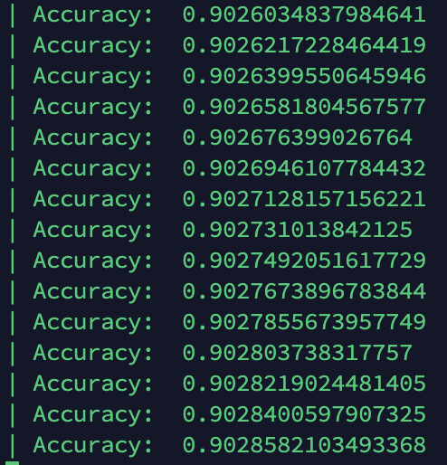

```
./examples/roberta/preprocess_GLUE_tasks.sh glue_data <MNLI>
```