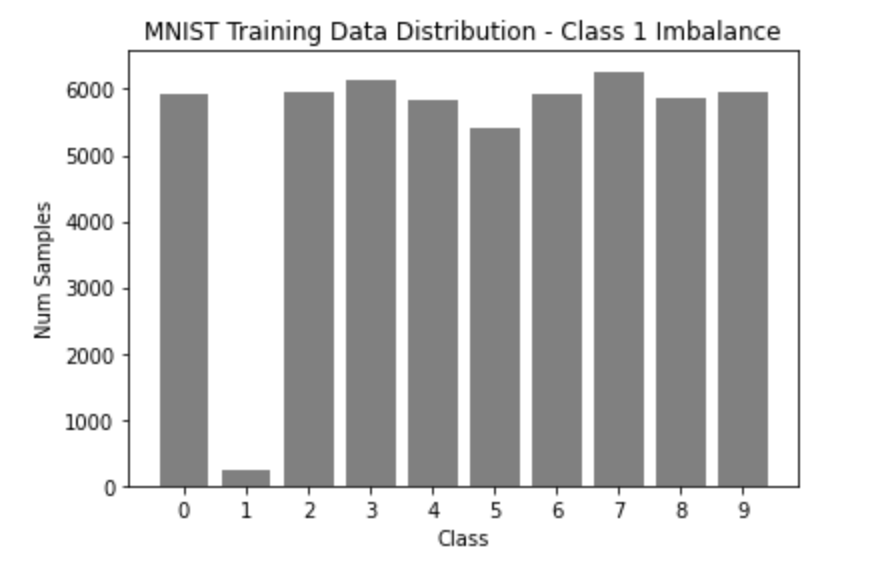

# Assignment - 1 Part B

This assignment has two sections:

a) Study of hyperparameter impact - after you complete the program, you should add one page discussion and conclusion regarding hyperparameter impact to your notebook.
b) Study of data bias impact - after you complete the program, you should add one page discussion and conclusion regarding data bias impact to your notebook.

##### The Original MNIST Data

 

##### Change of Number of Layers

We use learning rate = 0.003 for the new model. After incresing 1 more layers from original mode, we found that the accuracy is increasing 0.0007, which means these two models accuracy are very similar. For the training time, there is a very slight increase for the three hidden layer model than two hidden layer model. The training time for the model with two hidden layers is 1.613 minutes and 1.647 minutes for the model with three hidden layers. We consider the increase of the running time as the cost of adding a hidden layer to the model.

The number of layers used in the model have effect on model performance, like accuracy and running time as mentioned before. And now question is does adding more layers always result in more accuracy in convolutional neural networks? This is depend on the size of the dataset, a CNN architecture can be implemented. Unnecessarily adding layers to any CNN will only increase the number of parameters for smaller data sets. For some reasons, adding more hidden layers can indeed improve accuracy. For larger datasets, this is correct, because layers with more stride factors will extract more features for your input data. Increasing Unnecessary parameters will only overfit your network.

##### Data Bias Due to Class Imbalance

We can see below the MINST Training set data distribution is balanced. We want to design the unbalanced the training dataset. So, we removed most training data for number 1 from the MNIST data set. That means we train the model with pictures of all numbers between 0 and 9 except number 1. But the test dataset still include the pictures of number 1. Thus, when we predict the number 1, there is a bias in the dataset which affect the accuracy of predction of number1 and even affect overall model accuracy performance.

First we run the 10 Epoch, we can see below the model accuracy is very low (0.1813) and then we increasing Epoch to 20, the accuracy also increase to 0.295.

Therefore, the effect of class imbalanced on classification performance is detrimental. And oversampling can be the method to eliminatenate the imbalance, but the optimal understanding ratio depends on the extent of I'mbalance. the higher a fraction of minority classes in the imbalanced trainning set, the more imbalance ratio should be reduced.