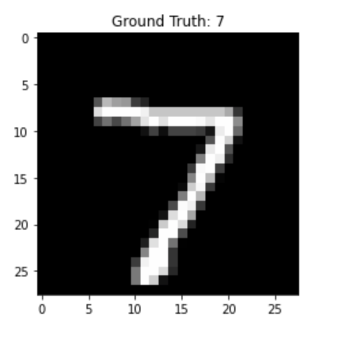
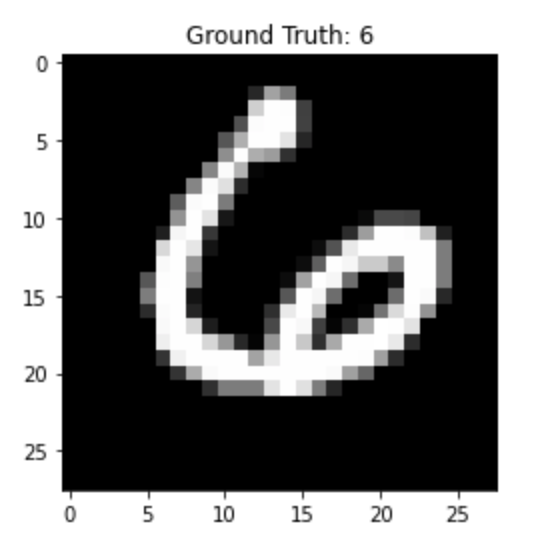

### Assignment 2 Report 

The task for assignment 2 was 

- Visualize the activation maps of each convolution layers and extract the embeddings of the second fully connected layer.

- Study the inter and intra class distances of embeddings extracted from two samples of numbers 6 and 7.

Here is the Visualizization of number 7 : 

IN this model, we have Total number of parameters: 232650; shape of kernels_conv1 is (32, 1, 3, 3). And after maxPool, The shape is change to ( 32, 13, 13 ) and after running conv2_activations, the shape is (64, 11, 11) . Finally doing pooling, our shape reduced to  (64, 5, 5)

- 

- Therefore, we can consider the kernels for Conv1 layer in the pre- trained CNN model has 32 kernels each has a size of 3 × 3. Basically, in each layer, the number of parameters depends on the shape of each filter and the number of filters in that layer adding to that one bias term for each filter. Each layer will output activations, and these activations act as input for the next layers and so on. We consider these 32 activation maps as filters.

- And then,  we forward pass the first convolution layer Conv1 from the original MNIST testing data an image representing number seven(i=0). And the two figure7 in the middle are the activation maps of Conv1 after the filters. And then, we apply a max-pooling operation to the Conv1 activation to reduce the shape of the activations. We can visualize this Conv2 layer shown on the last column. 

- The following pictures shown the two different number 6 and 7, separately 

By running the code, we can extract numbers 6 and 7 as two variables and get the embeddings (fc2 layer) from the CNN model for these four numbers (two each from 6 and 7). Now we have two embeddings for 6 and two for 7. We want to study the inter and intra class distance of these embeddings. By using the mean squared error MSE to calculate distances.

The inter loss between the embeddings of number six’s images is equal to 110.5971, which means there is a difference in the images. For the images of number seven MSE loss equal to 225.5673. We can see for the number 6 MSE is less than number 7. Obviously, the handwritten for number 6 is similar to recognizer than number 7. 

Now, we calculate the loss between the first image of number six and number seven, the loss is equal to 1619.8328, which means inter-class loss between the embeddings of the two images is much larger than the previous intra class losses because here the difference is between two different classes. And these two class number six and number seven are significant different.