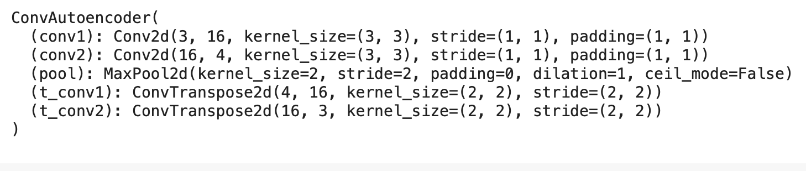
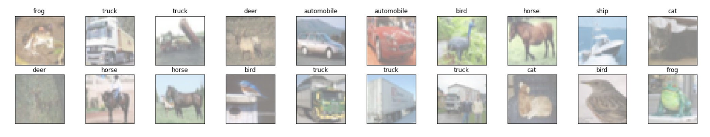
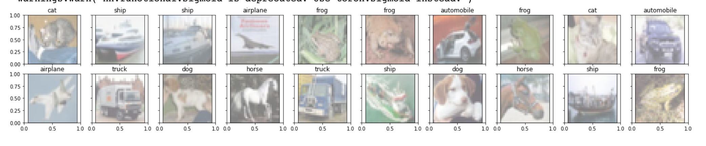
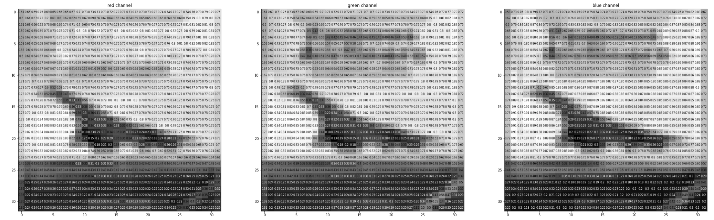
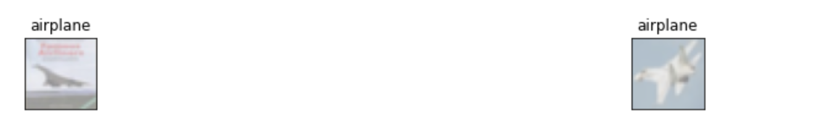
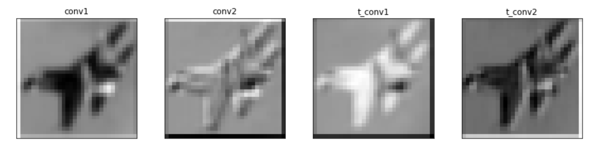

### Assignment 4 

The goal for this assignment is to create an autoencoder architecture that learns to encode input representations. To achieve this goal, We will create a convolutional neural network structure for encoding and decoding connected to each other. The training process will be completed by inputting the same input data and output data, which will force the kernel to create a concentrated activation map. We will also visualize each activation maps for each layer i.e.,  the encoder and decoder, for a sample input (airplane). 

##### Convolutional Autoencoder

Using the CIFAR10 dataset, we planed to improve our autoencoder's performance using convolutional layers by building a convolutional autoencoder to compress the MNIST dataset.

> The encoder portion will be made of convolutional and pooling layers and the decoder will be made of **transpose convolutional layers** that learn to "upsample" a compressed representation.

A compressed representation can be great for saving and sharing any kind of data in a way that is more efficient than storing raw data. In practice, the compressed representation often holds key information about an input image and we can use it for denoising images or oher kinds of reconstruction and transformation!

##### Encoder

The encoder part of the network will be a typical convolutional pyramid. Each convolutional layer will be followed by a max-pooling layer to reduce the dimensions of the layers.

##### Decoder

The decoder though might be something new to you. The decoder needs to convert from a narrow representation to a wide, reconstructed image. For example, the representation could be a 7x7x4 max-pool layer. This is the output of the encoder, but also the input to the decoder. We want to get a 32x32x3 image out from the decoder so we need to work our way back up from the compressed representation.

##### Training

Because we're comparing pixel values in input and output images, it will be best to use a loss that is meant for a regression task. Regression is all about comparing quantities rather than probabilistic values. So, in this case, We can use `BCELoss`. And compare output images and input images as follows:

```
loss = criterion(outputs, images)
```


##### Method

Autoencoder consist of convolutional neural network and deconvolutional neural network. 

The model architecture is shoen as below:



The encoding part has two convolutional layers, using RELU function and a max-pooling. This network will take the 32x32 images as input. The first layer will take in 3 channels and output 16 channels, the second layer will take in 16 channels and output 4 channels. The convolutional layers use 3x3 kernels. The output from the second convolutional layer (after RELU and max-pooling) will be the compressed (encoded) images. 

The second part of the model is the decoder, which fed the encoded image and tries to restore it to its original state. The decoder consists of 2 convolutional transposed layers. The first is the RELU function, and the second is the sigmoid function. 

##### Experiment 

The original trainning images shown as below:



then train the model and plot the first ten input images and then reconstructed images shown as below



visualizing the activation maps for each later (decoder and encoder) for airplane input as following:




And only show the images that have an airplane in the test dataset





##### Conclusion

We can see from picture above. It obviously recognize these plots as airplan. Therefore, Autoencoder successfully reconstructs the images.