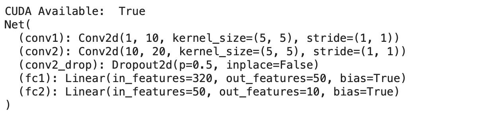
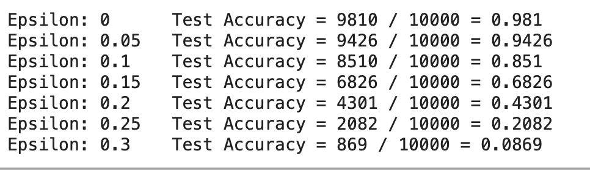
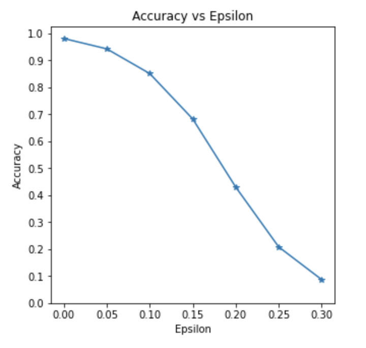
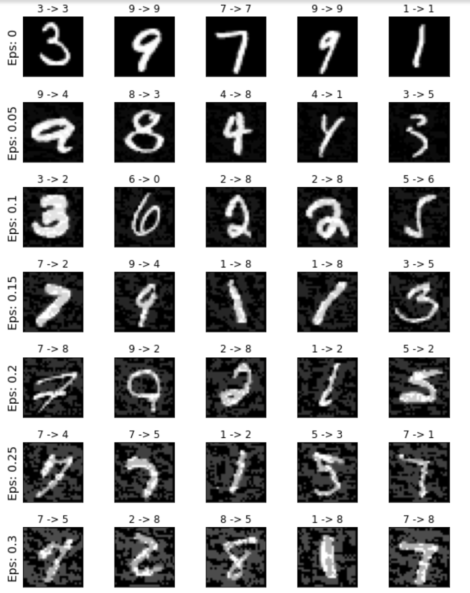

### Assignment 5

Goal for this assignment is to compare the attack noise for each data sample and test whether is the attack for all data samples the same (universal) after generating sample attacks. And after we trained the VGG training and using CIFAR model, build FGSM attack for some of the sample test data and compare the new attacks with the previous attacks  

##### Method 

Fast Gradient Sign Attack (FGSM) is the most popular adversarial attacks, which is designed to attack neural networks by leveraging the way they learn, gradients. The attack adjusts the input data to maximize the loss based on the same backpropagated gradients instead of minimize the loss by adjusting the weights based on the backpropagated gradients.  In other words, the attack uses the gradient of the loss w.r.t the input data, then adjusts the input data to maximize the loss.

Here are our traininig models:

We used Lenet pre-trained model, which include 2 convolution layers and two fully connected layers. And using 0.5 Dropout which means the neurons are dropped out before applied to conv2. This process can prevent the model overfitting. 

- Conv1 has 1 input channel and 10 output kernel size = 5 with stride =1
- Conv2 has 10 input channel and 20 output channels, kernel size = 5 with stride =1
- Fc1 has 320 input layers and 50 output layers 
- Fc2 has 50 input layers and 10 output layers 

##### Experiment

After running the FGSM attack, we can see the plot between the accuracy and epsilon as below.

When the epsilon increasing, the Accuracy is decreasing. That means the large epsilon will take the larger step in the direction to maximize the loss. 

$perturbed\_image = image + epsilon*sign(data\_grad) = x + \epsilon * sign(\nabla_{x} J(\mathbf{\theta}, \mathbf{x}, y))$

When epsilon increases the test accuracy decreases but the perturbations become more easily perceptible. This is a tradeoff between accuracy degredation and perceptibility that an attacker must consider.

We plot the several examples of adversarial samples at each epsilon. We see from columns of this plot, when epsilon(attach noise) is increasing, the accuracy decreases. And from the line of the plot, only the first line correctly predict the number and when the eps greater than 0 which means adding attack noise, the accuracy is very very low. However we can still can detected the numbers by human eye. 

From previous research, we know that the universal attack only create a universal perturbation for the whole dataset. This perturbation can be applied to all clean input data. Universal perturbations make it easier to deploy adversary examples in the real world. From experiment,  the universal perturbations can be generated by using a small part of data sample instead of the entire dataset. And we can see from our example when we added the attack noise, the universial adversarial example fools the neural network on images which means all the perturbed images with the wrong label. Hence, we consider the attack is univarsal accross data samples.

