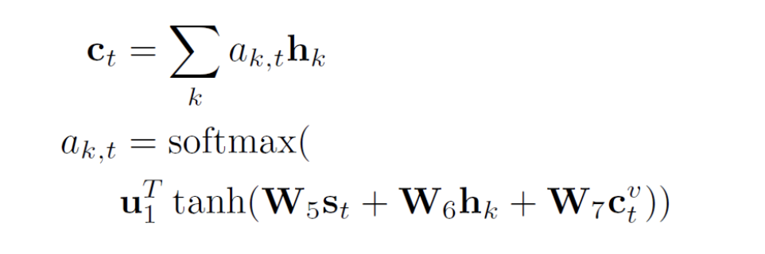
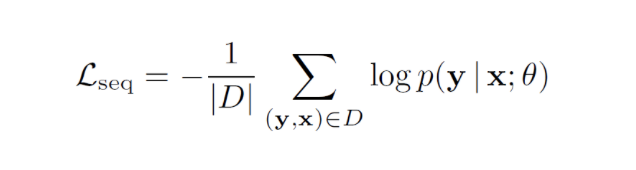

### **Knowledge Graph-Augmented Abstractive Summarization with Semantic-Driven Cloze Reward**

https://www.linkresearcher.com/theses/3f48ec17-6094-4d3c-9d26-b7262cb43e57

国际计算语言学协会年会 ACL 2020 按照原定时间已经于 7 月 5 日至 10 日召开，受到疫情影响，本次会议全部改为线上会议。ACL 2020 共收到了 3429 篇论文，收录其中 779 篇论文，包括 571 篇长论文和 208 篇短论文，论文的总接收率为 22.7%。ACL 2020 收录文章数量前五位的主题分别是：机器学习（Machine Learning for NLP）、对话和交互技术（Dialog and Interactive Technologies）、机器翻译（Machine Translation）、信息提取（Information Extraction）和 NLP 应用（NLP Application）。

目前，ACL 2020 收录的文章大部分已经在网上公开。从论文的题目、主题等关键词可以看出，主要的研究方向包括人机对话，多模态、多语言和多领域，图神经网络，以及经典的信息提取类问题，包括实体抽取（NER）、事件抽取以及关系抽取等。研究手段则仍集中于各类机器学习的方法，包括：神经网络、预训练、注意力、知识图谱等。还有一些文章特别关注了低资源、少样本等实际应用中经常会遇到的问题。

##### 本文是知识图谱在摘要生成任务中的应用。

本文重点关注知识图谱在摘要生成任务中的应用，提出了一种引入图谱增强和语义驱动 Reward 的摘要生成框架（Abstractive Summarization with Graph Augmentation and semantic-driven RewarD，ASGARD）。

使用双编码器（dual encoders）：顺序文档编码器和图形结构编码器，来提取知识图谱中实体的全局上下文特征和局部特征。进一步，设计了一个**基于多项选择完形填空测试**（a reward based on a multiple choice cloze test）的奖励，以驱动模型更好地捕捉**实体间的交互信息**。

摘要生成（Abstractive Summarization）目的是产生简洁、信息丰富的摘要，从而促进有效的信息消费和知识获取。

针对单文档摘要生成任务，基于序列对序列的神经网络模型取得了很好的效果。

然而，由于模型结构和基于词预测的学习目标的局限性，这些模型往往产生不真实的内容和过于精练的摘要。这些情况表明，现有的模型缺乏对输入的语义解释，而对语义的正确理解对于摘要生成任务来说是至关重要的。

本文作者认为，摘要的信息性和简洁性的生成需要结构化的表示，以便于实现相关主题之间的联系，并保持有全局上下文信息，如实体交互和主题流。以图 1 为示例，与同一实体相关的复杂事件可能跨越多个句子，这使得现有的序列模型难以捕捉这些信息。相反**，图**表示能够产生一个结构化的摘要，并突出了相关概念的近似性。

Figure 1: Sample knowledge graph constructed from an article snippet. The graph localizes relevant information for entities (color coded, e.g. “*John M. Fabrizi*”) or events (underlined) and provides global context.

根据文章片段构造的示例知识图谱，知识图谱将实体或事件的相关信息局部化，并提供全局上下文信息。

本文提出了一个基于图谱增强和语义驱动的抽象摘要框架（Abstractive Summarization with Graph-Augmentation and semantic-driven RewarD，ASGARD）。在编解码框架（encoder-decoder framework）下，利用开放信息抽取（OpenIE）系统的输出，用单独的图结构编码器增强常规文档编码器，以保持实体的全局上下文信息和局部特征。

此外，本文还提出了一种新的多选完形填空（multi-choice cloze）奖励来驱动模型获得对输入文档的语义理解。具体地说，在设计完型填空问题时，移除与谓词相关的成对实体或在人类生成的摘要句中同时出现的实体。而以往的研究中，一般只考虑使用单个实体来构造问题。与知识图谱编码相结合，引入完形填空奖励进一步通过强化学习获得全局实体的交互信息。

### Method

为了从输入文档构建知识图谱，利用 Stanford CoreNLP [4]首先从共指消解（coreference resolution）和开放信息抽取（open information extraction，OpenIE）模型中获得输出 [5]。接下来，利用 OpenIE 提取的 < subject，predicate，object > 三元组，去掉论点（主语或宾语）超过 10 个单词的任何三元组。如果两个三元组只相差一个参数，并且论点重叠，则保留较长的三元组。

将主客体视为由有向边连接的节点，谓词作为属性。进一步，将同一实体的共同提及考虑为一个节点。通过这一点，可以定位与每个实体相关的显著内容，以及通过图路径连接展开的实体。ASGARD 框架如图 2 所示。

图 2. ASGARD 框架。通过同时关注图谱和输入文档生成摘要。

模型以一个文档作为输入，表示为一系列的符号 x={x_k}，以及一个由节点 {v_i} 组成的知识图谱 G。首先将 x 输入 RoBERTa[6]，将最后一层的输出作为嵌入。将嵌入输入双向 LSTM（Bi-LSTM），生成 k 时刻的编码隐状态 h_k。利用上文生成的知识图谱，为谓词创建节点。增加从主语到谓语以及从谓语到宾语的有向、无标记的边。进一步，添加反向边和自循环来增强信息流，从而形成知识图谱 G。

**节点初始化（Node Initialization）**。每个节点通常包含一个实体的多个引用。因此，通过使用其符号的平均嵌入来初始化节点表示 v_i。本文利用文档编码器的隐藏状态 h_k 作为符号的上下文表示。文档中提到的节点次数作为一个额外的编码添加到 v_i 中，以增强实体的显著性。

**上下文节点编码（Contextualized Node Encoding）**。图编码器改进了图注意力网络（Graph Attention Networks，GATs）[7]，增加了层间的剩余连接。每个节点 vi 由其相邻节点的加权平均值表示：

其中，|| 表示 n 头连接，每个都生成一个与 v_i 同等维度的向量。上述图编码器通过捕获上述文档的全局关系图和编码图对文档级的文档进行编码，称为 DOCGRAGH。

进一步的，捕获主题移位信息以得到 SEGGRAGH。通过对主题转换和重现进行建模可以识别出文档中的显著内容，从而有利于生成摘要。由于段落自然地将一个文档分成不同的主题段，因此可以直接扩展 DocGragh。首先使用相同的图编码器将每个段落编码为子图 G_p（对于第 p 个段落），然后用 BiLSTM 连接所有子图。首先从最终 GAT 层的输出对子图 G_p 中的所有节点进行最大池化处理。然后将池化的结果用作为 BiLSTM 的输入，以产生 G_p 的最终子图表示(h_p)^g。

**摘要解码器**

摘要解码器在步骤 t 使用一个单层单向 LSTM 生成隐藏状态 s_t，它通过共同关注输入文档和图来循环生成摘要符号。

**注意力图表（Attending the Graph）**。在每个解码步骤 t，计算一个带有注意机制的图上下文向量 (c_t)^v：

**注意力文件（Attending the Document）**。类似地，通过考虑图上下文向量(c_t)^v，在输入符号上计算文档上下文 c_t：

**符号预测 (Token Prediction)**。图和文档上下文向量被视为从两个来源总结得到的文档显著内容，与解码器隐藏状态 s_t 连接以生成词汇分布 P_vocab：

通过使用输入嵌入矩阵和矩阵 W_out 之间的权重共享，以允许复用语言知识。进一步，添加了一个复制机制，计算复制概率为：

类似于上文针对 SegGraph 的处理，引入分级注意机制。使用标量乘法和重整化对输入中的所有节点进行处理，从而将子图中节点的注意(a_t)^g 与先前计算得到的注意(a_t)^v 相结合。

**训练**

首先考虑一个最大似然（ML）训练目标，最小化下述损失函数：

其中 x 是文档，y 是取自训练集 D 的已知文档，而θ是模型参数。该目标函数的作用是使得生成的文档 x 最大限度的与已知训练集中的已知确定文档保持一致，从而实现对知识图谱中节点所表征的文档的局部特征进行准确描述。

除了对节点的局部特征进行建模外，本文还增加了一个目标函数来标记节点的显著性，即节点显著性标记（Node Salience Labeling）。例如，节点中的实体是否在作为参考的摘要中出现过？在每个节点被传递到图编码器之前，在每个节点中引入一个软掩码层（Soft Mask Layer），用以表征该节点的显著性。该层的作用类似于一个「信息通道（information gate）」。针对每个节点 v_i 预测得到一个实数 m_i（m_i 大小满足[0，1]），使用 m_i 乘以 v_i 得到掩码。对于节点 v_i，掩码计算为：

其中，u_2 为训练参数。在训练期间，如果在参考引用的摘要中包含该节点的至少一个内容词，则该节点的标准掩码 m_i 设置为 1，否则为 0。对数据库 D 中的全部节点都增加下面的目标函数：

##### **完形填空强化学习**

在使用 L_ml 进行极大似然训练后，作者在第二阶段强化学习（RL）中进一步设计了一个多项选择完形填空奖励，使得模型能够生成更真实、信息更丰富的摘要。

对于 RL，本文引入一种自判别策略梯度算法（a self-critical policy gradient algorithm）[8]。在训练过程中，会生成两个摘要：第一，摘要 y^s，在每个解码步骤基于概率分布 p（y^s | x；θ）抽样符号；第二，基线摘要 y^，在每个步骤中贪婪选择概率最高的符号。定义目标函数如下：

本文奖励函数使用 ROUGE 和下面介绍的多项选择完形填空得分的组合：R(y) = R_rouge(y) +γ_clozeR_cloze。ROUGE(Recall-Oriented Understudy for Gisting Evaluation)，是一种常用的机器翻译和文章摘要评价指标[9]，其表征的意义是系统算法生成的摘要与参考摘要相同的 N-gram 数 / 参考摘要中的 N-gram 总数。本文提出了一种新的多选完形填空奖励，用以引导摘要模型提高实体互动的意识。将系统生成的摘要视为上下文（context）。另外，提供了一组由人手工编写的对应于参考摘要自动生成的问题（questions）。分别训练了一个问答（QA）模型，通过阅读上下文来解决问题。如果系统摘要与参考文献共享了显著信息，问答模型将能够以较高的概率给出正确答案。本文使用正确答案的平均概率作为完形填空的奖励。本文对 RoBERTa 进行微调，以构建 QA 模型。

#### **实验分析**

https://tech.sina.com.cn/roll/2020-07-20/doc-iivhuipn4046329.shtml

##### 2020年，知识图谱都有哪些研究风向	？

https://cloud.tencent.com/developer/article/1667421

本文实验采用两个包含多个句子的摘要数据集：纽约时报注释语料库（NYT）和 CNN / 每日邮报数据集（CNN/DM）。本文提出的方法与不同基线方法的实验对比结果分别见表 1（NYT 库）和表 2（CNN/DM 库）。对于本文所提出的方法，除了使用 ML 目标训练的 ASGARD-DOC 和 ASGARDSEG 外，表 1 和表 2 的实验中还给出了用 ROUGE 作为奖励（R_rouge）和使用一个额外的完形填空奖励（R_cloze）训练的结果。最后，还给出了一个消除图编码器的变体方法 NOGRAPH 的实验结果。

表 2. CNN/DM 数据库中 ROUGE 自动评价结果，最优结果以粗体表示，本文模型最好的结果以斜体表示

2.3 文章小结

本文提出了一种知识图谱增强摘要生成框架，并提出了一种用于强化学习的多项选择完形填空奖励。该模型能够从输入文本中捕捉实体的局部特征和全局交互信息，从而生成高质量的摘要。与图表示相结合，本文引入的多项选择完形填空奖励进一步改进了摘要内容。

知识图谱（Knowledge Graph）是一种多关系图，其中，节点表示实体，边表示实体之间的关系。知识图谱存储来自不同来源的关于人、地方和世界的事实。这些事实以三元组形式保存（头实体、关系实体、尾部实体），并表示为(h, r, t) 。知识图谱在很多 NLP 领域中应用获得了很好的效果，例如推荐系统、问答系统，文本生成任务等。不过，知识图谱需要定期更新事实，为此，人们提出了许多知识图谱嵌入方法来完成知识图谱的链接预测（Link Prediction）。

本文重点关注的就是知识图谱中的链接预测问题。1-to-N、N-to-1 和 N-to-N 的链接预测是目前知识图谱链接预测中的主要难点。以图 1 中所示为例，关系「profession」展示了一个 N-to-N 的例子，该示例中重点关注的边被突出显示为绿色。假设三元组（SergeiRachmaninoff, Profession, Pianist）是未知的。链接预测模型以「SergeiRachmaninoff」和关系「Profession」为基础，对知识图谱中的所有实体进行排序，对 「Pianist」（「钢琴家」）进行预测。实体「SergeiRachmaninoff」通过关系「profession」连接到多个作为头实体的实体，而作为尾部实体的「Pianist」也通过关系 「profession」到达多个实体。从单个实体 - 关系对出发，会出现映射到多个不同的实体的情况，这使得 N-to-N 预测变得非常困难。同样的问题也发生在 1-to-N 和 N-to-1 的预测中。

图 1. FB15k-237 中的知识图谱快照，其中，实体用金色块表示

