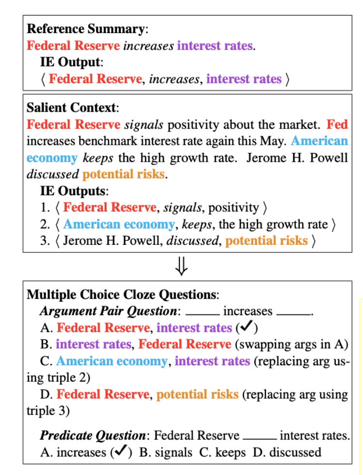
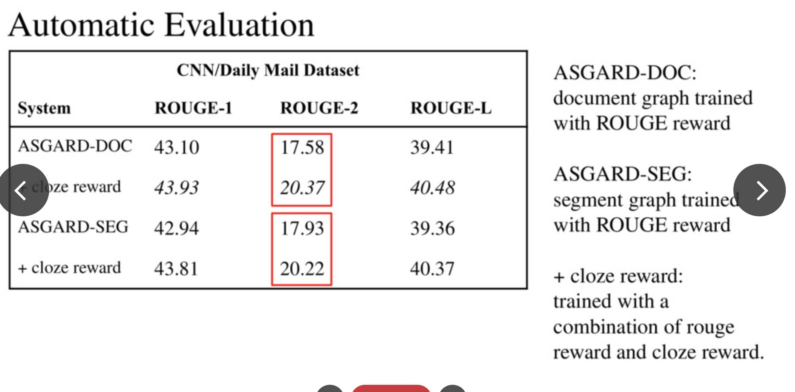
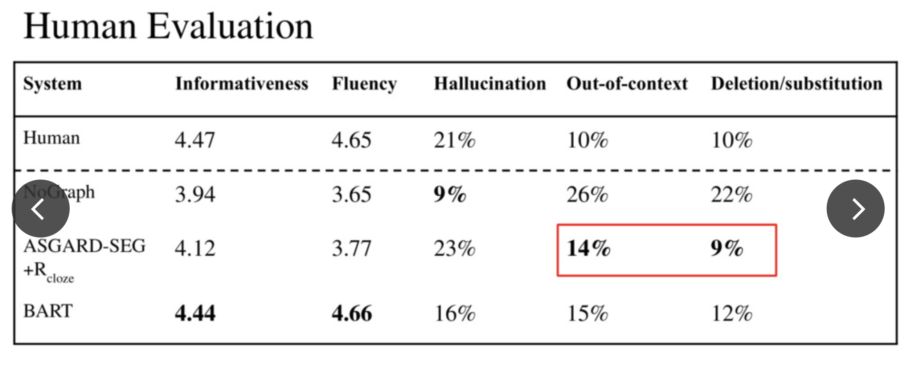

https://www.linkresearcher.com/theses/3f48ec17-6094-4d3c-9d26-b7262cb43e57

### ==Page 2==

缺点： Seq-to-seq models for abstractive summarization have been studied extensively,

​	These observations suggest that existing models lack semantic interpretation over the input, which is critical for summarization.

However, due to the limitations of **recent model structure** and word prediction-based learning objectives, these models often produce untrue content and overly refined abstracts. These conditions show that the existing model lacks semantic interpretation of input, and a correct understanding of semantics is essential for summary generation tasks.

We argue that, to address these issues, the summarizer should acquire se-mantic interpretation over input, e.g., via structured representation, to allow the generation of more informative summaries.

模型解决： This paper focuses on the application of knowledge graph in summary generation tasks, and proposes a summary generation framework that introduces Graph-augmented |au| with semantic-driven Cloze Reward 

### ==Page3==

**For example for lack: Complex events** related with the same entity may span multiple sentences, making it challenging for existing sequential models to capture. However, A graph representation can produces a structured summary and highlights the proximity of relevant concepts.

### ==Page4==

==ASGARD==,

Under the encoder-decoder framework, they enhance the regular document encoder with a separate graph-structured encoder to maintain the global context and local characteristics of entities by using the outputs from an open information extraction (OpenIE) system.

This paper proposes an Abstractive Summarization with Graph-Augmentation and Semantic-driven RewarD (ASGARD). 

Under the encoder-decoder framework, 

the output of the Open Information Extraction (OpenIE) system is used to enhance the conventional document encoder with a separate graph structure encoder 

to maintain the entity's global context information and local features.

### ==Page5==

==They begin constructing the graph by treating subjects and objects as nodes connected by directed edges, with predicates as attributes. They further collapse coreferential mentions of the same entity into one node. With this, they can localize significant content related to each entity as well as make connections of spread-out entities through graph paths.==

Figure 1: Sample knowledge graph constructed from an article snippet. The graph localizes relevant information for entities (color coded, e.g. “John M. Fabrizi”) or events (underlined) and provides global context.

### ==Page6 and 7==

In addition, this paper also **proposes** a new multi-choice cloze reward to drive the model to gain a semantic understanding of the input document. Specifically, when designing the cloze problem, remove the paired entities related to the predicate or the entities that appear at the same time in the human-generated abstract sentence. In previous studies, generally only a single entity was used to construct problems. Combined with knowledge graph coding, cloze rewards are introduced to further obtain interactive information of global entities through reinforcement learning.

### ==Page8==

In order to construct a knowledge graph from the input documents, ==as mentioned before== Stanford CoreNLP [4] is used to first obtain the output from the consensus resolution and open information extraction (OpenIE) models [5]. Next, use the <subject, predicate, object> triples extracted by OpenIE to remove any triples whose argument (subject or object) exceeds 10 words. If two triples differ by only one parameter, and the arguments overlap, the longer triple is retained.

Consider subject and object as nodes connected by directed edges, and predicates as attributes. Further, the common mention of the same entity is considered as a node. Through this, we can locate the salient content related to each entity, as well as the entities that are connected through the graph path. as The ASGARD framework

### ==page9==

- The model takes a document as input, expressed as a series of symbols x={x_k}, and a knowledge graph G composed of nodes {v_i}. First input x into RoBERTa[6], and use the output of the last layer as embedding. 

- The embedding is input into a bidirectional LSTM (Bi-LSTM) to generate the coded hidden state h_k at time k. 

- Use the knowledge graph generated above to create nodes for the predicates. Add directed, unmarked edges from subject to predicate and from predicate to object.
-  Further, add reverse edges and self-loops to enhance the information flow, thereby forming a knowledge graph G.

### ==Page10==

- The summary decoder uses a single-layer one-way LSTM to generate the hidden state , which generates summary symbols in a loop by paying attention to the input document and graph together.

### ==Page11==

- This experiment uses two summary data sets containing multiple sentences: New York Times Annotated Corpus (NYT) and CNN/Daily Mail Data Set (CNN/DM). 

- The experimental comparison results of the method proposed in this paper and different baseline methods are shown in Table 1 (NYT library) and Table 2 (CNN/DM library). 
- For the method proposed in this article, in addition to the ASGARD-DOC and ASGARDSEG trained with ML targets, 
- the experiments in Tables 1 and 2 also show the use of ROUGE as a reward (R_rouge) and the use of an additional cloze reward (R_cloze). ) 
- Results of training. Finally, the experimental results of NOGRAPH, a variant method of eliminating graph encoders, are given.

### ==page13==

