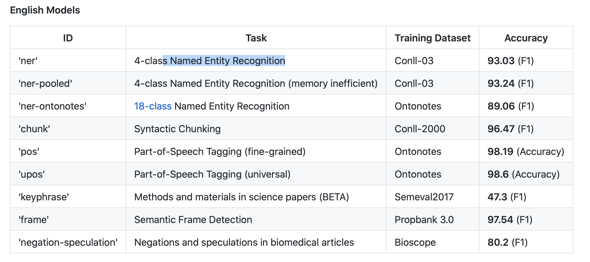

##### Few-Shot and Zero-Shot Classification with TARS

##### NER Corpora

##### Weibo NER dataset support ([#1944](https://github.com/flairNLP/flair/pull/1944))

Added dataset about NER for Chinese Social Media (thanks to [@87302380](https://github.com/87302380)).

```
# load Weibo NER data
corpus = WEIBO_NER()
print(corpus)
print(corpus.make_tag_dictionary('ner'))
```


[Scispacy](https://allenai.github.io/scispacy/)

##### [Comparison](https://github.com/flairNLP/flair) with State-of-the-Art

https://github.com/flairNLP/flair/blob/master/resources/docs/EXPERIMENTS.md


```python
# training NER models
CUDA_VISIBLE_DEVICES=2 python download_and_prepare_corpus.py
CUDA_VISIBLE_DEVICES=2 python model_prediction.py 

# load a corpus
	# base types 
  # word embeddings
  # flair embeddings 

```

We train our own biomedical named entity recognition models using state-of-the-art word embeddings. Our biomedical NER model trained over COR corpus, using word embeddings and flair embeddings based on biomedical abstracts from PubMed and full-texts from PMC. The `Corpus` represents a dataset that you use to train a model. It consists of a list of `train` sentences, a list of `dev` sentences, and a list of `test` sentences, which correspond to the training, **validation** and testing split during model training.

```python
# Helper functions
import flair.datasets
corpus = flair.datasets.UD_ENGLISH()
# downsample the corpus, simply like this:
import flair.datasets
downsampled_corpus = flair.datasets.UD_ENGLISH().downsample(0.1) #downsampled to 10% of the data.

print("--- 1 Original ---")
print(corpus)

print("--- 2 Downsampled ---")
print(downsampled_corpus)

#downstream task???
# create tag dictionary for an NER task
corpus = flair.datasets.CONLL_03_DUTCH()
print(corpus.make_label_dictionary('ner'))
```


##### Reading Your Own Sequence Labeling Dataset

In cases you want to **train** over a sequence labeling dataset that is not in the above list, you can load them with the **ColumnCorpus** object. Most sequence labeling datasets in NLP use some sort of column format in which each line is a word and each column is one level of linguistic annotation. See for instance this sentence:

```
George N B-PER
Washington N I-PER
went V O
to P O
Washington N B-LOC

Sam N B-PER
Houston N I-PER
stayed V O
home N O
```

## Tutorial 7: Training a Model

### Base Types

#### Tokenization

Using a different tokenizer： You can also **pass** custom tokenizers to the initialization method. For instance, if you want to tokenize a Japanese sentence you can use the 'janome' tokenizer instead, like this:

```python
from flair.data import Sentence
from flair.tokenization import JapaneseTokenizer

# init japanese tokenizer
tokenizer = JapaneseTokenizer("janome")

# make sentence (and tokenize)
japanese_sentence = Sentence("私はベルリンが好き", use_tokenizer=tokenizer)

# output tokenized sentence
print(japanese_sentence)
```

==You can write your own tokenization routine. Check the code of `flair.data.Tokenizer` and its implementations (e.g. `flair.tokenization.SegtokTokenizer` or `flair.tokenization.SpacyTokenizer`) to get an idea of how to add your own tokenization method.==


#### Adding labels to sentences

You can also add a `Label` to a whole `Sentence`. For instance, the example below shows how we add the label 'sports' to a sentence, thereby labeling it as belonging to the sports "topic".

```python
sentence = Sentence('France is the current world cup winner.')

# add a label to a sentence
sentence.add_label('topic', 'sports')

print(sentence)

# Alternatively, you can also create a sentence with label in one line
sentence = Sentence('France is the current world cup winner.').add_label('topic', 'sports')

print(sentence)
```

#### Accessing a sentence's labels

```python
for label in sentence.labels:
    print(label)
```

Remember that each label is a `Label` ==object==, so you can also access the label's `value` and `score` fields directly:

```python
print(sentence.to_plain_string())
for label in sentence.labels:
    print(f' - classified as "{label.value}" with score {label.score}')
    
```

If you are interested only in the labels of one layer of annotation, you can access them like this: This function will Giving you only the "topic" labels.

```python
for label in sentence.get_labels('topic'):
    print(label)
```


Now, we following will show how to use the pre-trained models to tag our text.

Let's use a pre-trained model for named entity recognition (NER). This model was trained over the English CDR task and can recognize Chemical and disease.

```python
from flair.models import SequenceTagger

tagger = SequenceTagger.load('ner')
```

All you need to do is use the `predict()` method of the tagger on a sentence. This will add ==predicted tags== to the tokens in the sentence. Lets use a sentence with two named entities:

```python
sentence = Sentence('George Washington went to Washington .')

# predict NER tags
tagger.predict(sentence)

# print sentence with predicted tags
print(sentence.to_tagged_string())
```

#### Getting Annotated Spans

Many sequence labeling methods annotate spans that consist of ==multiple words==, such as "George Washington" in our example sentence. You can directly get such spans in a tagged sentence like this:

```python
for entity in sentence.get_spans('ner'):
    print(entity)
```

#### Multi-Tagging

Sometimes you want to predict several types of annotation at once, for instance ==NER and part-of-speech (POS) tags==. For this, you can use our new `MultiTagger` object, like this:

The sentence now has two types of annotation: POS and NER.

```python
from flair.models import MultiTagger

# load tagger for POS and NER 
tagger = MultiTagger.load(['pos', 'ner'])

# make example sentence
sentence = Sentence("George Washington went to Washington.")

# predict with both models
tagger.predict(sentence)

print(sentence)
```

#### List of Pre-Trained Sequence Tagger Models

You choose which ==pre-trained model== you load by passing the appropriate string to the `load()` method of the `SequenceTagger` class. Currently, the following pre-trained models are provided:



```python
# load model
tagger = SequenceTagger.load('ner')
# make German sentence
sentence = Sentence('George Washington ging nach Washington .')
# predict NER tags
tagger.predict(sentence)
# print sentence with predicted tags
print(sentence.to_tagged_string())
```

#### Experimental: Semantic Frame Detection

#### Tagging a List of Sentences

Often, you may want to tag an entire text corpus. In this case, you need to split the corpus into sentences and pass a list of `Sentence`objects to the `.predict()` method.

For instance, you can use the sentence splitter of segtok to split your text:

Using the `mini_batch_size` parameter of the `.predict()` method, you can set the size of mini batches passed to the tagger. Depending on your resources, you might want to==play around== with this parameter to optimize speed.

```python
from flair.models import SequenceTagger
from flair.tokenization import SegtokSentenceSplitter

# example text with many sentences
text = "This is a sentence. This is another sentence. I love Berlin."

# initialize sentence splitter
splitter = SegtokSentenceSplitter()

# use splitter to split text into list of sentences
sentences = splitter.split(text)

# predict tags for sentences
tagger = SequenceTagger.load('ner')
tagger.predict(sentences)

# iterate through sentences and print predicted labels
for sentence in sentences:
    print(sentence.to_tagged_string())
```


### [Word Embeddings](https://github.com/flairNLP/flair/blob/master/resources/docs/embeddings/CLASSIC_WORD_EMBEDDINGS.md)/TokenEmbeddings

```python
from flair.embeddings import WordEmbeddings
from flair.data import Sentence

# init embedding
glove_embedding = WordEmbeddings('glove')

# create sentence.
sentence = Sentence('The grass is green .')

# embed a sentence using glove.
glove_embedding.embed(sentence)

# now check out the embedded tokens.
for token in sentence:
    print(token)
    print(token.embedding)
```

Now, create an example sentence and call the embedding's `embed()` method. You can also pass a list of sentences to this method since some embedding types make use of ==batching to increase speed==.  GloVe embeddings are PyTorch vectors of dimensionality 100.

You choose which pre-trained embeddings you load by passing the appropriate id string to the constructor of the `WordEmbeddings` class. Typically, you use the **two-letter language code** to init an embedding, so 'en' for English and 'de' for German and so on. 

##### [Tutorial 4](https://github.com/flairNLP/flair/blob/master/resources/docs/TUTORIAL_4_ELMO_BERT_FLAIR_EMBEDDING.md): List of All Word Embeddings

==Combining BERT and Flair==

You can very easily **mix and match Flair, ELMo, BERT and classic word embeddings**. All you need to do is instantiate each embedding you wish to combine and use them in a `StackedEmbedding`.


### [Flair Embeddings](https://github.com/flairNLP/flair/blob/master/resources/docs/embeddings/FLAIR_EMBEDDINGS.md)

Contextual string embeddings are [powerful embeddings](https://www.aclweb.org/anthology/C18-1139/) that capture **latent** syntactic-semantic information that goes beyond standard word embeddings. Key differences are: (1) they are trained without any explicit notion of words and thus fundamentally model words as sequences of characters. And (2) they are **contextualized** by their surrounding text, meaning that the *same word will have different embeddings depending on its contextual use*.

```python
from flair.embeddings import FlairEmbeddings

# init embedding
flair_embedding_forward = FlairEmbeddings('news-forward')

# create a sentence
sentence = Sentence('The grass is green .')

# embed words in sentence
flair_embedding_forward.embed(sentence)

# init forward embedding for German
flair_embedding_forward = FlairEmbeddings('de-forward')
flair_embedding_backward = FlairEmbeddings('de-backward')
```


#### Stacked Embeddings

Stacked embeddings are one of the most important concepts of this library. You can use them to **combine** different embeddings together, for instance if you want to use both **traditional** embeddings together with **contextual** string embeddings. Stacked embeddings allow you to **mix and match**. We find that a **combination of embeddings** often gives best results.

All you need to do is use the `StackedEmbeddings` class and instantiate it by passing a list of embeddings that you wish to combine. For instance, lets combine classic GloVe embeddings with forward and backward Flair embeddings. This is a combination that we generally recommend to most users, especially for sequence labeling.

First, instantiate the two embeddings you wish to combine:

Words are now embedded using a ==concatenation== of three different embeddings. This means that the resulting embedding vector is still a single PyTorch vector.

```python
from flair.embeddings import WordEmbeddings, FlairEmbeddings

# init standard GloVe embedding
glove_embedding = WordEmbeddings('glove')

# init Flair forward and backwards embeddings
flair_embedding_forward = FlairEmbeddings('news-forward')
flair_embedding_backward = FlairEmbeddings('news-backward')

from flair.embeddings import StackedEmbeddings

# create a StackedEmbedding object that combines glove and forward/backward flair embeddings
stacked_embeddings = StackedEmbeddings([
                                        glove_embedding,
                                        flair_embedding_forward,
                                        flair_embedding_backward,
                                       ])

sentence = Sentence('The grass is green .')

# just embed a sentence using the StackedEmbedding as you would with any single embedding.
stacked_embeddings.embed(sentence)

# now check out the embedded tokens.
for token in sentence:
    print(token)
    print(token.embedding)
```


#### [Document](https://github.com/flairNLP/flair/blob/master/resources/docs/TUTORIAL_5_DOCUMENT_EMBEDDINGS.md) Embeddings ==???==

There are four main document embeddings in Flair:

1. `DocumentPoolEmbeddings` that simply do an average over all word embeddings in the sentence,
2. `DocumentRNNEmbeddings` that train an RNN over all word embeddings in a sentence
3. `TransformerDocumentEmbeddings` that use pre-trained transformers and are **recommended** for most text classification tasks
4. `SentenceTransformerDocumentEmbeddings` that use pre-trained transformers and are *recommended* if you need a good vector representation of a sentence

Initialize one of these four options and call `embed()` to embed your sentence.

We give details on all four document embeddings in the following:

#### Prediction

Once the model is trained you can use it to predict tags for new sentences. Just call the `predict` method of the model.

#### Training a Text Classification Model with Transformer

The best results in text classification use fine-tuned transformers. Use `TransformerDocumentEmbeddings` for this and set `fine_tune=True`. Then, use the following code:

```python
from torch.optim.adam import Adam

from flair.data import Corpus
from flair.datasets import TREC_6
from flair.embeddings import TransformerDocumentEmbeddings
from flair.models import TextClassifier
from flair.trainers import ModelTrainer


# 1. get the corpus
corpus: Corpus = TREC_6()

# 2. create the label dictionary
label_dict = corpus.make_label_dictionary()

# 3. initialize transformer document embeddings (many models are available)
document_embeddings = TransformerDocumentEmbeddings('distilbert-base-uncased', fine_tune=True)

# 4. create the text classifier
classifier = TextClassifier(document_embeddings, label_dictionary=label_dict)

# 5. initialize the text classifier trainer with Adam optimizer
trainer = ModelTrainer(classifier, corpus, optimizer=Adam)

# 6. start the training
trainer.train('resources/taggers/trec',
              learning_rate=3e-5, # use very small learning rate
              mini_batch_size=16,
              mini_batch_chunk_size=4, # optionally set this if transformer is too much for your machine
              max_epochs=5, # terminate after 5 epochs
              )
```


#### Plotting Training Curves and Weights

Flair includes a helper method to plot training curves and weights in the neural network. The `ModelTrainer` automatically generates a `loss.tsv` in the result folder. If you set `write_weights=True` during training, it will also generate a `weights.txt` file.

After training, simple point the plotter to these files:

This generates PNG plots in the result folder.

```python
# set write_weights to True to write weights
trainer.train('resources/taggers/example-universal-pos',
               ...                
               write_weights=True,
               ...
              )

# visualize
from flair.visual.training_curves import Plotter
plotter = Plotter()
plotter.plot_training_curves('loss.tsv')
plotter.plot_weights('weights.txt')
```

#### Resuming Training/==checkpoint==

If you want to stop the training at some point and resume it at a later point, you should train with the parameter `checkpoint` set to `True`. This will save the model plus training parameters after every **epoch**. Thus, you can load the model plus trainer at any later point and continue the training exactly there where you have left.

The example code below shows how to train, stop, and continue training of a `SequenceTagger`. The same can be done for `TextClassifier`.

```python
from flair.data import Corpus
from flair.datasets import WNUT_17
from flair.embeddings import TokenEmbeddings, WordEmbeddings, StackedEmbeddings
from typing import List

# 1. get the corpus
corpus: Corpus = WNUT_17().downsample(0.1)

# 2. what tag do we want to predict?
tag_type = 'ner'

# 3. make the tag dictionary from the corpus
tag_dictionary = corpus.make_tag_dictionary(tag_type=tag_type)

# 4. initialize embeddings
embedding_types: List[TokenEmbeddings] = [
    WordEmbeddings('glove')
]

embeddings: StackedEmbeddings = StackedEmbeddings(embeddings=embedding_types)

# 5. initialize sequence tagger
from flair.models import SequenceTagger

tagger: SequenceTagger = SequenceTagger(hidden_size=256,
                                        embeddings=embeddings,
                                        tag_dictionary=tag_dictionary,
                                        tag_type=tag_type,
                                        use_crf=True)

# 6. initialize trainer
from flair.trainers import ModelTrainer
from flair.training_utils import EvaluationMetric

trainer: ModelTrainer = ModelTrainer(tagger, corpus)

# 7. start training
trainer.train('resources/taggers/example-ner',
              learning_rate=0.1,
              mini_batch_size=32,
              max_epochs=150,
              checkpoint=True)

# 8. stop training at any point


```

```python
# 9. continue trainer at later point
from pathlib import Path

checkpoint = 'resources/taggers/example-ner/checkpoint.pt'
trainer = ModelTrainer.load_checkpoint(checkpoint, corpus)
trainer.train('resources/taggers/example-ner',
              learning_rate=0.1,
              mini_batch_size=32,
              max_epochs=150,
              checkpoint=True)
```

## [Tutorial 9](https://github.com/flairNLP/flair/blob/master/resources/docs/TUTORIAL_9_TRAINING_LM_EMBEDDINGS.md): Training your own Flair Embeddings

Flair Embeddings are the **secret sauce** in Flair, allowing us to achieve state-of-the-art accuracies across a range of NLP tasks. This tutorial shows you how to **train your own Flair embeddings**, which may come in handy if you want to apply Flair to new languages or domains.

## 

### Tutorial 10: Few-Shot and [Zero-Shot](https://github.com/flairNLP/flair/blob/master/resources/docs/TUTORIAL_10_TRAINING_ZERO_SHOT_MODEL.md) Classification (TARS)

##### Use Case #1: Classify Text Without Training Data (Zero-Shot)

##### Use Case #2: Classify Text With Very Little Training Data (Few-Shot)

##### Use Case #3: Train Your Own Base TARS Model


## ==HunFlair==

*HunFlair* is a state-of-the-art **NER** tagger (pre-trainned model) for biomedical texts. It comes with models for genes/proteins, chemicals, diseases, species and cell lines. *HunFlair* builds on pretrained domain-specific language models and outperforms other biomedical NER tools on unseen corpora. Furthermore, it contains harmonized versions of [31 biomedical NER data sets](https://github.com/flairNLP/flair/blob/master/resources/docs/HUNFLAIR_CORPORA.md) and comes with a **Flair language model ("pubmed-X") and FastText embeddings ("pubmed")** that were trained on roughly 3 million full texts and about 25 million abstracts from the biomedical domain.

#### [HunFlair Tutorial 2](https://github.com/flairNLP/flair/blob/master/resources/docs/HUNFLAIR_TUTORIAL_2_TRAINING.md): Training NER models